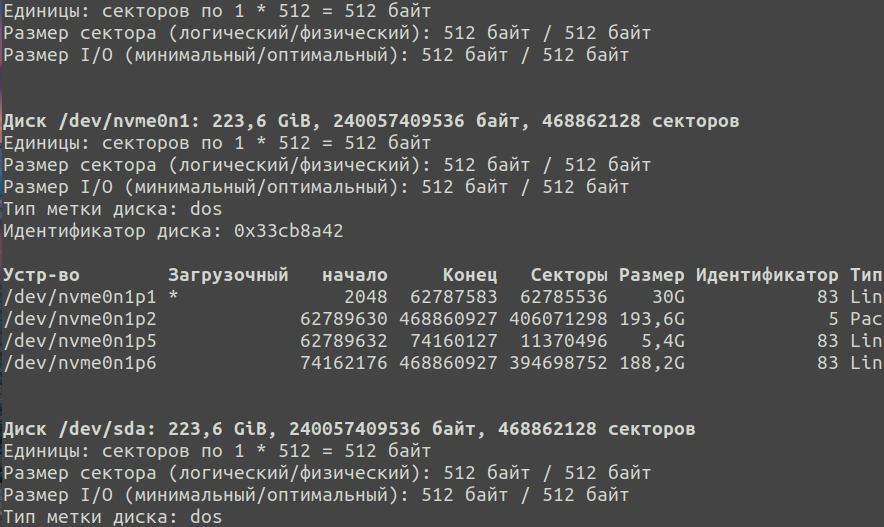
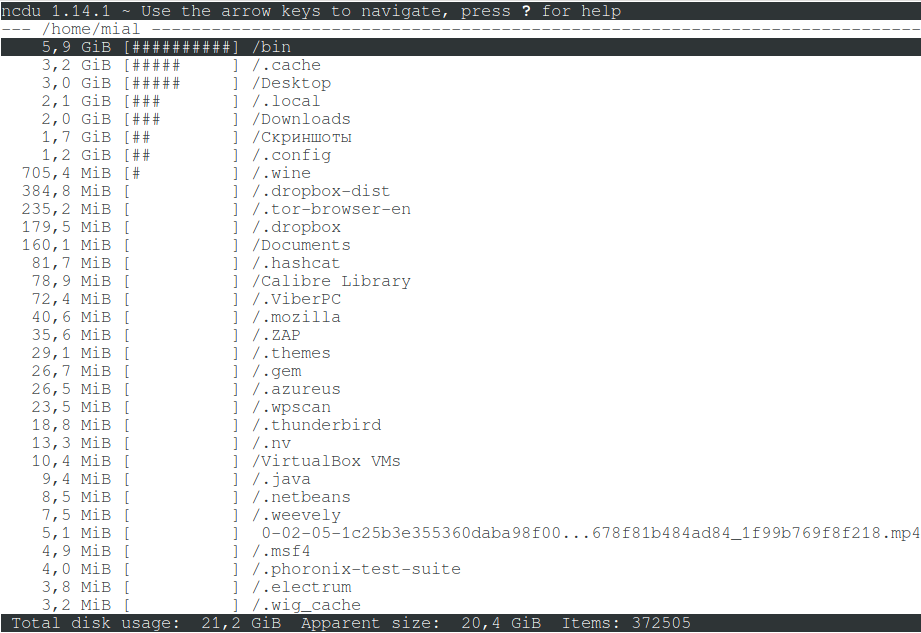
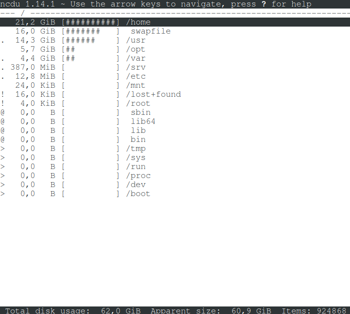
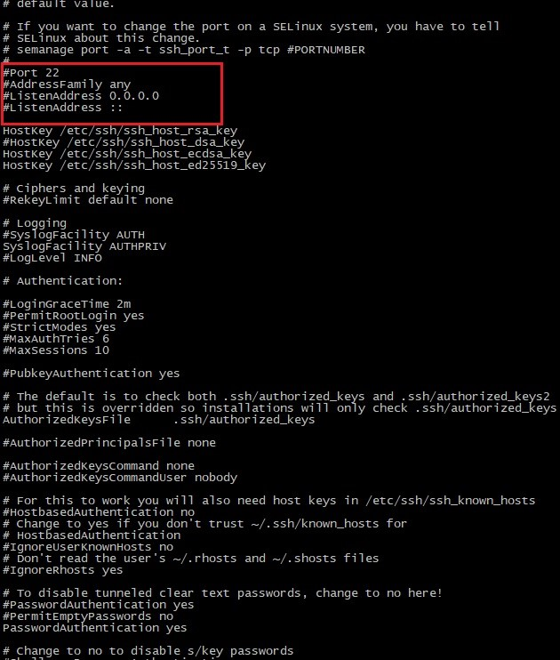
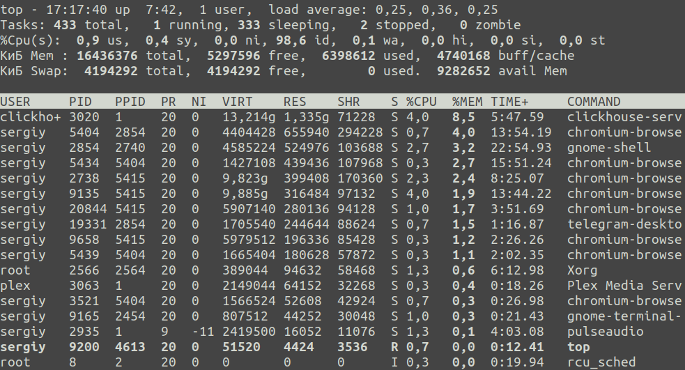

# Материалы S21 DO1_Linux

## Содержание

+ [Список тем](#список-тем)
+ [Использование планировщика заданий **CRON**](#использование-планировщика-заданий-cron)
+ [Использование утилиты **df**](#использование-утилиты-df)
+ [Использование утилиты **du**](#использование-утилиты-du)
+ [Использование утилиты **fdisk**](#использование-утилиты-fdisk)
+ [Работа с системными журналами](#работа-с-системными-журналами)
+ [Установка и использование утилиты **ncdu**](#установка-и-использование-утилиты-ncdu)
+ [Network interfaces](#network-interfaces)
+ [DHCP](#dhcp)
+ [Установка и базовая настройка сервиса **SSHD**](#установка-и-базовая-настройка-сервиса-sshd)
+ [Установка и настройка службы времени](#установка-и-настройка-службы-времени)
+ [Команда top](#команда-top)
+ [Команда htop](#команда-htop)

[Оглавление](/README.md)

Привет, участник Школы21!😉

Чтобы тебе было проще, мы подготовили список тем, на которые следует обратить особое внимание при выполнении данного проекта:

## Список тем

- работа с командной строкой;
- настройка ОС Линукс;
- права суперпользователя;
- установка приложений с помощью `apt`;
- использование утилит (top/htop/df/du/ncdu).

Теперь, когда известен список тем, знание которых потребуется в проекте, можешь приступать к изучению.😇

[Содержание](#содержание)

## Использование планировщика заданий **CRON**

CRON - это программа-демон. Её основная задача выполнять указанные пользователем процессы в указанное пользователем время, например с определённой периодичностью.

Давайте рассмотрим синтаксис настройки одной задачи cron: \
`минута час день месяц день_недели /путь/к/исполняемому/файлу`

Нужно сказать, что обязательно нужно писать полный путь к команде, потому что для команд, запускаемых от имени cron, переменная среды PATH будет отличаться. Дата и время указываются с помощью цифр или символа '*'. Этот символ означает, что процесс нужно выполнять каждый раз.

Примеры настройки cron:
- Сначала можно посмотреть задачи cron для суперпользователя, для этого можно воспользоваться командой `crontab -l`: \
  
- Вы можете удалить все существующие задачи командой -r
- Самый простой пример -- запускать какой-нибудь процесс каждую минуту командой `* * * * * /usr/local/bin/serve`: \
  
- Вы можете выбрать любую минуту, час и день недели, например, 15.30 во вторник: `30 15 * * 2 /usr/local/bin/serve`
- Кроме того, для некоторых часто используемых наборов были придуманы специальные переменные, вот они:
    - @reboot -- при загрузке, только один раз
    - @yearly, @annually -- раз год
    - @monthly -- раз в месяц
    - @weekly -- раз в неделю
    - @daily, @midnight -- каждый день
    - @hourly -- каждый час

    - Например, запуск скрипта раз в час командой `@hourly /usr/local/bin/serve`: \
      

[Содержание](#содержание)

## Использование утилиты **df**
df - это команда для получения подробного отчета об использовании дискового пространства системы.

Вот несколько примеров работы с командой df:
- Простой вызов команды df: \
  
- Теперь давайте попросим утилиту выводить данные в более читаемом формате с помощью ключа -h: \
  
- Если задать опцию -a, вы можете получить информацию обо всех файловых системах известных ядру, которые были смонтированы: \
  
- -H -- ключ вывода всех размеров в гигабайтах
- -P -- ключ использования формата вывода POSIX
- -x -- ключ вывода информации обо всех размерах, кроме указанных файловых систем

[Содержание](#содержание)

## Использование утилиты **du**
du - это команда для получения приблизительного объема дискового пространства, используемого указанными при вызове команды файлами или каталогами.

Вот несколько примеров работы с командой du:
- Чтобы просто вывести список папок в определённом каталоге и занимаемое ими место, например, в /var выполните: \
  
- По умолчанию размер выводится в байтах. Для того, чтобы размер выводился в более читабельном виде используйте опцию -h: \
  
- Если надо выводить размер не только папок, но и файлов, которые там находятся, используйте опцию -a: \
  
- -c -- ключ вывода в конце общего размера всех папок
- -d -- максимальная глубина вложенности директорий
- -s -- ключ вывода только общего размера

[Содержание](#содержание)

## Использование утилиты **fdisk**

Поскольку жесткие диски имеют большой объем, их пространство обычно разбивают на несколько частей — разделов диска, и работать с ними можно, как будто это независимые диски в системе. \
fdisk - это команда для управления разделами жёсткого диска, а также получения информации о них.

Вот несколько примеров работы с командой fdisk:
- Чтобы посмотреть список доступных вам дисков и разделов на них, используйте опцию -l: \
  
- Большинство операций fdisk по разметке дисков выполняются в интерактивном режиме. Чтобы запустить fdisk в интерактивном режиме, передайте утилите блочное устройство которое надо разметить. В этом примере, это /dev/nvme0n1: \
  
- Чтобы посмотреть текущий тип таблицы разделов, а также доступные разделы на диске, используйте команду p: \
  
- m -- команда выключения или переключения режима отображения информации о памяти
- w -- команда записи новой таблицы разделов на диск (по сути -- сохранить изменения)
- q -- команда выхода без сохранения

[Содержание](#содержание)

## Работа с системными журналами

Системные журналы - это файлы, в которых хранятся все события и процессы, происходящие с файлами, работа оборудования и т.д. 
Системных журналов много и все они расположены в директории /var/log/.  
Чтобы посмотреть логи, удобно использовать несколько утилит командной строки Linux. Вот команды, которые чаще всего используются для этих целей:
+ `less`
+ `more`
+ `cat`
+ `head`
+ `grep`
+ `tail`
+ `zcat`
+ `zgrep`
+ `zmore`
+ `vi`
+ `nano`

Рассмотрим некоторые из них на примере лога /var/log/dmesg:
+ `less` -- просмотр логов с возможностью прокрутки: \
  
+ `tail` -- просмотр логов в реальном времени
+ `cat` -- открытие лог файла
+ `head` -- просмотр первых строки лога
+ `grep` -i error -- вывод только ошибок из лога: \
  

[Содержание](#содержание)

## Установка и использование утилиты **ncdu**

`ncdu` - это команда, имеющая то же назначение, что и du, но обладающая приятным и удобным интерфейсом.

Вот несколько примеров работы с командой ncdu:
- Использование программы элементарное. Для сканирования и обзора текущей директории, в которой вы находитесь, просто запустите программу ncdu: \
  
- Чтобы просканировать всю файловую систему, нужно указать путь. Для корня это слэш. Также пригодится опция -x — не выходить за пределы текущей файловой системы. Дело в том, что к корневой файловой системе могут быть смонтированы другие диски — и без этой опции они также будут посчитаны. Выполнение команды `ncdu -x /`:\
  
- Для перехода в выбранную директорию используйте одну из следующих кнопок:
    - курсор вправо
    - `ENTER`
    - `l`
- Для возврата в родительскую директорию используйте одну из следующих кнопок:
    - курсор влево
    - `<`
    - `h`
- Для сортировки директорий и файлов используются следующие кнопки (нажмите ещё раз для обратного порядка):
    - `n` — по имени файла
    - `s` — по размеру файла
    - `C` — по количеству элементов
    - `M` — по времени модификации последнего дочернего элемента

[Содержание](#содержание)

## Network interfaces

Сетевые интерфейсы предназначены для передачи данных между программами через компьютерную сеть. \
В Linux любые данные, которые компьютер отправляет в сеть или получает из сети, проходят через сетевой интерфейс. \
Сетевые интерфейсы могут быть как физическими, так и виртуальными. \
Вот примеры типов сетевых интерфейсов:
- `eth` -- Сетевой интерфейс к карте Ethernet или картам WaveLan (Radio Ethernet).
- `ax` -- Сетевой интерфейс к устройствам любительского радио AX.25.
- `arc0e`, arc0s -- Сетевой интерфейс к карте ArcNet. Используется инкапсуляция пакетов в формате Ethernet или RFC 1051.
- `wlan` -- Сетевой интерфейс wi-fi адаптеров.

[Содержание](#содержание)

## DHCP
Для работы по сети любому устройству требуется IP-адрес. В протоколе IPv4 это числовой идентификатор, состоящий из 4 разрядов, каждый из которых отделяется точкой, без него устройство не может быть определено в сетевой инфраструктуре. \
Прикладной протокол DHCP выполняет всю работу по подбору сетевых настроек автоматически, без необходимости присваивать вручную каждому устройству свой IP-адрес. Это очень упрощает работу системного администратора в случае расширения сети.

[Содержание](#содержание)

## Установка и базовая настройка сервиса **SSHD**

`SSH` или `Secure Shell` - это сетевой протокол безопасного доступа из одного компьютера к другому по сети. \

`SSHd` — это служба, принимающая запросы на соединения от клиентов, т.е. других компьютеров. \

Настройка сервера SSH производится путём настройки программы-демона SSHd. \

Программа-демон - это программа, запускаемая самой системой и работающая в фоновом режиме.

Теперь разберёмся, зачем и что обычно настраивают в службе SSH. \
Режим работы SSH-сервера с настройками по-умолчанию хоть и является вполне работоспособным для небольших частных сетей, всё же нуждается в задании некоторых важных параметров для использования на высоконадёжных публичных серверах. \
Настройки демона хранятся в файле /etc/ssh/sshd_config.

В первую очередь следует обратить внимание на следующие параметры: `Port`, `AddressFamily`, `ListenAddress`. \
Первый глобально задаёт номер порта, через который будет работать соединение, и если оставить его стандартным, т.е. 22, то велика вероятность, что он будет слишком часто сканироваться роботами.

 \
*Примечание:* для задания активации параметра необходимо раскомментировать соответствующую строку — убрать символ «#» в её начале.

Второй параметр задаёт семейство используемых IP-адресов — IPv4 и IPv6.
Если, к примеру, используются только адреса IPv4 или только IPv6, то, для оптимизации работы, очень рекомендуется установить особое значение для параметра AddressFamily.

Параметр ListenAddress позволяет задавать порты для отдельных сетевых интерфейсов. \
Поскольку реализация openSSH позволяет работать с протоколами SSH1 и SSH2, то разумно отключить использование SSH1, т. к. эта версия является устаревшей. \
Очень полезным является параметр, позволяющий проводить авторизацию и шифрование трафика с помощью специальных SSH-ключей. \
Иногда, когда следует задавать мультисерверную конфигурацию, очень удобно использовать алиасы (Aliases), что позволяет настроить сразу несколько режимов доступа (с разными хостами, портами и т.д.) и использовать их, указывая при этом конкретный алиас.

Для применения сделанных настроек необходим перезапуск SSH-сервера.

И ещё немного про то, как, собственно, пользоваться SSH. Для подключения к серверу используется команда: \
`ssh user_name@host_name`, \
где user_name – имя пользователя в системе, host_name – имя узла, к которому производится подключение.

При этом утилита ssh запросит (в зависимости от настроек сервера) логин, пароль или парольную фразу для разблокировки приватного ключа пользователя.

Утилита ssh позволяет сразу выполнить нужную команду без открытия терминала удаленной машины. Например, команда: \
`ssh user@host ls` \
выполнит команду ls на удаленном сервере и вернет ее вывод в текущий терминал.

Кроме выполнения команд, можно копировать файлы по `ssh`. Для этого используется утилита `scp`. Просто укажите файл, который нужно передать, удаленный сервер и папку на сервере, например: \
`scp ~/test.txt user@host:documents`

[Содержание](#содержание)

## Установка и настройка службы времени

Во многих дистрибутивах Unix-подобных операционных систем за синхронизацию даты и времени отвечает специальная утилита. Она находится в активном состоянии по умолчанию, поэтому у пользователей нет необходимости как-то ее настраивать или изменять. Однако иногда такая надобность все же появляется из-за разных причин, например, случайных сбоев. \
Компьютеры во всем мире используют NTP (сетевой протокол времени) для синхронизации своего времени со стандартными эталонными часами через интернет с помощью иерархии серверов NTP. \
Настройка автоматической синхронизации времени может потребоваться, например, при переходе с утилиты timesyncd, отвечающей за синхронизацию времени по умолчанию, на более надежный протокол NTPD. Для это следует:
- Отключить стандартную утилиту
- Рекомендуется убедиться, что система обновлена до последней версии
- Установить NTP, который будет активирован автоматически, поэтому никаких дополнительных команд вводить не нужно.

[Содержание](#содержание)

## Команда top

Команда `top` показывает запущенные в Linux процессы программ и служб, данные о потреблении системных ресурсов и позволяет искать, останавливать процессы и управлять ими.

Вот несколько примеров работы с командой top:
- Окно можно условно разделить на две части. В верхней части находится информация о системе, общем использовании ресурсов процессора и памяти, раздела подкачки, и так далее. В нижней части окна расположен список запущенных процессов с информацией, отсортированных по определённому полю. \
  
- Если вы хотите отображать только те процессы, которые используют ресурсы процессора, используйте команду i: \
  
- Чтобы выделить поле, по которому сейчас выполняется сортировка, нажмите клавишу x. После этого вся колонка будет выделена жирным: \
  
- `m` -- команда выключения или переключения режима отображения информации о памяти
- `F` -- команда настройки полей с информацией о процессах
- `L` -- команда поиска по слову

[Содержание](#содержание)

## Команда htop
Команда htop выполняет примерно ту же задачу, что и **top**, но имеет определённые преимущества и недостатки: более удобные поиск и фильтрация, но менее гибкая настройка отображения процессов.

Вот несколько примеров работы с командой htop:
- Открыв htop, сразу виден список запущенных процессов. Конечно, здесь отображены не все процессы Linux. По умолчанию выводятся процессы, запущенные от имени вашего пользователя: \
  
- К отображению можно добавить и дополнительные параметры с помощью меню Setup. Там все очень просто, читайте подсказки и следуйте указаниям. Например, добавлен параметр PPID: \
  
- Также есть интересная возможность разместить процессы в виде дерева. Вы сможете увидеть, каким процессом был запущен тот или иной процесс. Для отображения дерева нажмите кнопку F5: \
  

[Содержание](#содержание)