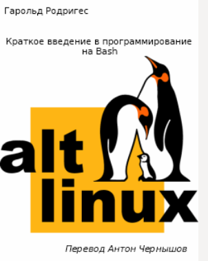

# Краткое введение в программирование на Bash

## Содержание

+ [Введение](#введение)
+ [Так все-таки программирование (programming) или написание скриптов (scripting)?](#так-все-таки-программирование-programming-или-написание-скриптов-scripting)
+ [Что нужно знать для написания своих скриптов?](#что-нужно-знать-для-написания-своих-скриптов)
+ [Ваша первая программа на Bash](#ваша-первая-программа-на-bash)
+ [Команды, команды и команды](#команды-команды-и-команды)
+ [Другие полезные программы](#другие-полезные-программы)
+ [Комментарии](#комментарии)
+ [Переменные](#переменные)
+ [Управляющие операторы](#управляющие-операторы)
  + [if … else … elif … fi](#if--else--elif--fi)
  + [while … do … done](#while--do--done)
  + [until … do … done](#until--do--done)
  + [case … in … esac](#case--in--esac)
+ [Арифметика и bash](#арифметика-и-bash)
+ [Чтение ввода пользователя](#чтение-ввода-пользователя)
+ [Функции](#функции)
+ [Перехват сигналов](#перехват-сигналов)
+ [Логические И и ИЛИ](#логические-и-и-или)
+ [Использование аргументов](#использование-аргументов)
+ [Работа с временными файлами](#работа-с-временными-файлами)
+ [Коды завершения программ](#коды-завершения-программ)
+ [Переносимость ваших скриптов на bash](#переносимость-ваших-скриптов-на-bash)
+ [Заключение](#заключение)

[Источник](../../Lib/Краткое_введение_в_программирование_на_Bash.fb2)

Предлагаем вам познакомиться со статьей Гарольда Родригеса (Harold Rodriguez) Краткое введение в программирование на Bash

«Данное введение в программирование на `bash` прельстило меня своей краткостью и содержательностью. В то же время я изменил несколько примеров, потому что они делали слегка не то, что ожидается новичками. Начинающим текст будет полезен как отправная точка для начала написания скриптов. Опытным — как справочник. Удачного чтения!» Антон Чернышов, переводчик.

В второй статье Гарольд продолжает свое первоклассное введение в программирование на bash. На этот раз он объясняет, как выполнять арифметические операции и определять функции в bash-скриптах. Завершается статья введением в такие понятия как чтение пользовательского ввода, обработка скриптом аргументов, перехватывание сигналов и обработка кодов завершения программ.

Безусловно, результаты прочтения превзойдут все ожидания! После этой статьи вас уже нельзя будет назвать новичком. Ведь вы на пути к тому, чтоб называться мастером программирования на bash!



Тема программирования на `bash` из разряда тех, которые могут быть рассмотрены и в пару, и в сотни страниц. Гарольд Родригес (Harold Rodriguez) объясняет эту тему в приведенном ниже руководстве из двух частей. Его прекрасный и яркий стиль позволил ему охватить все существенные черты программирования на `bash` буквально на нескольких страницах.

Если вы никогда не программировали на `bash` ранее — сейчас самое время начать. Даже если у вас мало знаний о том, что такое `bash`, вы вполне можете посмотреть на множество интересных скриптов, разбираемых Гарольдом.

---
[Содержание](#содержание)

## Введение

Подобно остальным оболочкам, доступным в Linux, Bourne Again shell (`bash`) является не только, собственно, командной оболочкой, но и языком для написания сценариев (скриптов) *[слова «сценарий» и «скрипт» обычно являются синонимами (прим. перев).]*.

Скрипты позволяют в полной мере использовать возможности оболочки и автоматизировать множество задач, которые иначе потребуют для своего выполнения ввода множества команд.

**Многие программы, работающие внутри вашего компьютера с Linux — это скрипты.**

Если вы захотите узнать, как они работают, или изменить их, важно понимать их синтаксис и семантику. Кроме того, понимая язык `bash`, вы сможете писать свои собственные программы, чтобы выполнять разные задачи теми способами, которые выберете сами.

---
[Содержание](#содержание)

## Так все-таки программирование (programming) или написание скриптов (scripting)?

Новичков в программировании, как правило, озадачивает разница между, собственно, программированием и языками скриптов.

Программы, написанные на каких-то языках программирования, обычно гораздо более мощные по возможностям и работают намного быстрее, чем программы, написанные на языках сценариев.

Примеры языков программирования — C, C ++ и Java.

Создание программы на каком-либо языке программирования обычно начинается с написания исходного кода (текстовый файл, содержащий инструкции о том, как будет работать окончательная программа), затем его необходимо скомпилировать (собрать) в исполняемый файл.

Этот исполняемый файл не так легко переносить между различными операционными системами.<br>
Например, если вы напишете на программу на C для Linux, вы не сможете запустить ее в Windows. Чтобы сделать это, вам придется перекомпилировать исходный код под Windows.

Написание скрипта также начинается с написания исходного кода, который не компилируется в исполняемый файл. Вместо этого интерпретатор оболочки последовательно читает инструкции в файле исходного кода и выполняет их. К сожалению, поскольку интерпретатор должен читать каждую инструкцию, скорость исполнения скрипта обычно медленнее[2], чем у скомпилированной программы.

Основным преимуществом скриптов является то, что вы можете легко переносить исходный файл в любую операционную систему и просто запускать их[3].

**Bash** — это язык сценариев. Он отлично подходит для написания небольших программ, но если вы планируете делать какие-то мощные приложения, выбор для этого какого-либо языка программирования предпочтительнее для вас. Другие примеры скриптовых языков Perl, Lisp, и Tcl.

---
[Содержание](#содержание)

## Что нужно знать для написания своих скриптов?

+ Для этого необходимо знание основных команд Linux.<br>
Например, вы должны знать, как копировать, перемещать и создавать новые файлы.
+ Обязательно умение использовать какой-либо текстовый редактор.<br>
Существуют три основных текстовых редактора в Linux: `vi`, `emacs` и pico. Если вы не знакомы с vi или emacs, используйте pico или другой простой в использовании текстовый редактор.

**Внимание!!!**

Не следует учиться программировать на bash из-под пользователя root!<br>
В противном случае — может случиться все что угодно!

Я не буду нести никакой ответственности, если вы случайно допустите ошибку и испортите вашу систему. Вы предупреждены! Используйте учетную запись обычного пользователя без каких-либо привилегий. Вы можете даже создать нового пользователя только для обучения написанию сценариев. Таким образом, худшее, что произойдет в данном случае — это исчезновение данных в каталоге этого пользователя.

---
[Содержание](#содержание)

## Ваша первая программа на Bash

Нашей первой программой будет классическая «Hello World». Конечно, если уже вы программировали раньше, вы должно быть устали от таких примеров. Однако это — традиция и кто я такой, чтобы менять ее? Программа «Hello World» просто выводит слова «Hello World» на экран. Запустите текстовый редактор и наберите в нем следующее:

```sh
#!/bin/bash

echo "Hello World"
```

Первая строка сообщает Linux использовать интерпретатор `bash` для запуска этого скрипта.<br>
В этом случае, bash находится в каталоге /bin.

Если у вас bash находится где-то еще, сделайте соответствующие изменения в данной строке.<br>
Явное указание интерпретатора очень важно, удостоверьтесь еще раз, что указали его, поскольку данная строка говорит Linux какой именно интерпретатор нужно использовать для выполнения инструкций в скрипте.

Следующее, что нужно сделать, это сохранить скрипт. Назовем его `hello.sh`. После этого вам нужно сделать скрипт исполняемым:

```sh
chmod u+x hello.sh
```

Если вы не понимаете, что делает эта команда, прочтите справочную страницу команды `chmod`:

```sh
man chmod
```

Как только это будет сделано, вы сможете запустить программу, просто набрав ее название:

```sh
./hello.sh

Hello World
```

Получилось! Это ваша первая программа! И хотя она скучная и не делает ничего полезного, она показывает как именно все работает. Просто запомните эту простую последовательность действий:

+ напишите код,
+ сохраните файл,
+ сделайте его исполняемым с помощью `chmod`,
+ запустите.

---
[Содержание](#содержание)

## Команды, команды и команды

Что именно делает ваша первая программа? - *Она печатает на экран слова «Hello World».*

Каким образом она это делает? - *Она использует команды.*

В нашей программе мы написали только одну команду: `echo «Hello World»`.

Что именно тут команда? - `echo`.

Эта программа принимает один аргумент и печатает его на экран.<br>
Аргументом является все, что следует после ввода названия программы:

+ В нашем случае `«Hello World»` это и есть аргумент, переданный команде `echo`.
+ При вводе команды `ls /home/`, аргументом команды `ls` является `/home`.

Ну и что это все означает?

А означает это то, что если у вас есть программа, которая принимает какой-то аргумент и выводит что-то на экран, вы можете использовать ее вместо `echo`. Предположим, что у нас есть программа под названием `foo`. Эта программа будет принимать один аргумент (строку из слов) и печатать их на экран. Тогда мы можем переписать нашу программу вот так:

```sh
#!/bin/bash

foo "Hello World"
```

Сохраните ее, сделайте исполняемой и перезапустите ее:

```sh
./hello

Hello World
```

Точно такой же результат.

+ Использовался ли тут какой-то уникальный код? Нет.
+ Написали ли мы какую-то программу? Нет, если только вы не являетесь автором программы echo.

Все, что вы сделали — просто встроили программу `echo` в наш скрипт и снабдили ее аргументом.<br>
Примером альтернативы использования команды `echo` в реальном программировании является команда `printf`, которая имеет больше возможностей, если вы знакомы с программированием на C.

Ну и на самом деле, точно такой же результат можно было бы получить и без написания скрипта:

```sh
echo "Hello World”

Hello World
```

Написание скриптов на `bash` предлагает широкий спектр возможностей и этому легко научиться.

Как вы только что могли видеть, вы используете другие команды Linux, чтобы писать ваши собственные скрипты. Ваша программа-оболочка представляет собой несколько других программ, собранных вместе для выполнения какой-либо задачи.

---
[Содержание](#содержание)

## Другие полезные программы

Сейчас мы напишем программу, которая переместит все файлы в каталог, удалит его вместе с содержимым, а затем создаст это каталог заново. Это может быть сделано с помощью следующих команд:

```sh
touch file1
mkdir trash
mv file1 trash
rm -rf trash
mkdir trash
```

Вместо того, чтобы вводить это все в интерактивном режиме, напишем скрипт, выполняющий эти команды:

```sh
#!/bin/bash

touch file1
mkdir trash
mv file1 trash
rm -rf trash
mkdir trash
echo "Файл удален!"
```

Сохраните его под именем `clean.sh` и теперь все, что нужно сделать — это запустить его. Он переместит все файлы в каталог, удалит его, создаст его заново каталог и даже напечатает сообщение об удалении файлов. Запомните, если вы обнаружите, что регулярно делаете нечто требующее набора одной и той же последовательности команд — это вполне можно автоматизировать написанием скрипта.

---
[Содержание](#содержание)

## Комментарии

Комментарии помогают сделать ваш код более читабельным. Они не влияют на то, что выводит программа. Они написаны специально для того, чтобы вы их прочли. Все комментарии в Bash начинаются с хэш-символа `#`, за исключением первой строки (`#!/bin/bash`), имеющей специальное назначение. Первая строка — не комментарий. Возьмем для примера следующий код:

```sh
#!/bin/bash

# Эта программа считает от 1 до 10:

for i in 1 2 3 4 5 6 7 8 9 10; do

echo $i

done
```

Даже если вы пока не понимаете скрипты на Bash, вы сразу же поймете, что делает приведенный выше пример, благодаря комментарию.

Комментирование кода — хорошая практика. Со временем вы поймете, что, если вам нужно будет поддерживать ваши скрипты, то при наличии комментированного кода — делать это станет легче.

---
[Содержание](#содержание)

## Переменные

Переменные это просто «контейнеры», которые содержат некоторые значения. Создавать их нужно по многим причинам. Вам нужно будет как-то сохранять вводимые пользователем данные, аргументы или числовые величины. Например:

```sh
#!/bin/bash

x=12

echo ”Значение переменной x - $x”
```

Здесь мы присвоили переменной `x` значение `12`. Строка `echo "Значение переменной х - $x"` напечатает текущее значение `x`. При определении переменной не допускается наличие каких-то пробелов между именем переменной и оператором присваивания: «=». Синтаксис следующий:

```sh
имя_переменной=ее_значение.
```

Обращение к переменным выполняется с помощью префикса «$» перед именем переменной. Именно таким образом мы получаем доступ к значению переменной х с помощью команды echo $x.

Есть два типа переменных — локальные и переменные окружения.

**Переменные окружения** устанавливаются системой и имеют специальной назначение. Обычно их значение может быть выведено с помощью команды echo. Например, если ввести:

```sh
echo $SHELL

/bin/bash
```

Вы получили имя оболочки, запущенной в данный момент. Переменные среды задаются в файле `/etc/profile` и в `~/.bash_profile`. Команда `echo` может применяться для проверки текущего значения переменной.

Примечание:задание переменных среды подробно описано в этой статье — «Как задавать переменные среды». В статье также описаны некоторые особенности оболочки Bash.

Если вы все еще возникают проблемы с пониманием того зачем нужно использовать переменные, приведем пример:

```sh
#!/bin/bash

echo "Значение х - 12".
echo "У меня есть 12 карандашей".
echo "Он сказал мне, что значение х равно 12".
echo "Мне 12 лет."
echo "Как получилось, что значение х равно 12?"
```

Хорошо, теперь предположим, что вы решите поменять значение х на 8 вместо 12. Что для этого нужно сделать? Вы должны изменить все строки кода, в которых говорится, что х равно 12. Но погодите… Есть другие строки кода, где упоминается это число, поэтому простую автозамену использовать не получится. Теперь приведем аналогичный пример, только с использованием переменных:

```sh
#!/bin/bash

x=12 # задаем переменной х значение 12
echo "Значение х = $х"
echo "У меня есть 12 карандашей"
echo "Он сказал мне, что значение х равно $х"
echo "Мне 12 лет"
echo "Как получилось, что значение х равно $x?"
```

Здесь мы видим, что `$x` выводит текущее значение переменной `х` равное `12`. Поэтому теперь, если вы хотите задать новое значение х равное 8, то все что вам нужно сделать, это изменить одну строчку с `х=12` на `х=8`, и в выводе все строки с упоминанием x также изменяться. Поэтому вам не нужно руками модифицировать остальные строки. Как вы увидите позже, переменные имеют и другие способы применения.

---
[Содержание](#содержание)

## Управляющие операторы

Управляющие операторы делают вашу программу компактнее и позволяют ей принимать решения. И, что еще более важно, они позволяют нам выполнять проверку на наличие ошибок. До сих пор все, что мы сделали, это писали скрипты, которые просто исполняют набор инструкций в файле. Например:

```sh
#!/bin/bash

cp /etc/foo .
echo ”Готово”
```

Это небольшой скрипт, назовем его `bar.sh`, копирует файл с именем `/etc/foo` в текущий каталог и выводит «Готово» на экране. Эта программа будет работать при одном условии — файл `/etc/foo` должен существовать. В противном случае вот что произойдет:

```sh
./bar.sh
cp: /etc/foo: No such file or directory
Готово
```

Таким образом, как вы видите, есть проблема. Не у каждого, кто будет запускать вашу программу, будет файл `/etc/foo`. Наверное, было бы лучше, если б ваша программа сначала проверяла наличие данного файла, а затем при положительном ответе — выполняла бы копирование, в противном случае — просто бы завершала работу. В псевдо-коде это выглядит так:

```sh
если /etc/foo существует, то
скопировать /etc/foo в текущую директорию
напечатать "Готово" на экране
в противном случае,
напечатать на экране "Этот файл не существует"
выход
```

Можно ли это сделать в Bash? Конечно!

Набор управляющих операторов Bash включает в себя:

+ `if`,
+ `while`,
+ `until`,
+ `for`,
+ `case`.

Каждый из этих операторов является парным, то есть начинается он одним тегом и заканчивается другим. Например, если условный оператор `if` начинается с `if` и заканчивается `fi`.

**Управляющие операторы** — это не отдельные программы в системе, они встроены в bash.

---
[Содержание](#содержание)

### if … else … elif … fi

Это один из наиболее распространенных операторов. Он позволяет программе принимать решения следующим образом — «если условие верно — делаем одно, если нет — делаем что-то другое».

Чтобы эффективно его использовать, сначала нужно научиться пользоваться командой `test`. Эта программа выполняет проверку условия (например, существует ли файл, есть ли необходимые права доступа). Вот переписанный вариант `bar.sh`:

```sh
#!/bin/bash

if test -f /etc/foo
then
# Файл существует, копируем его и печатаем сообщение на экране
cp /etc/foo .
echo "Готово".
else # Файл не существует, поэтому мы печатаем сообщение
# и завершаем работу
echo "Этот файл не существует."
exit
fi
```

Обратите внимание на отступы строки после `then` и `else`. Они не являются обязательными, но зато делают чтение кода гораздо более простым в том смысле, что делают логику программы более наглядной.

Теперь запустите программу. Если у вас есть файл `/etc/foo` — он будет скопирован, в противном случае будет напечатано сообщение об ошибке. Команда `test` проверяет существование файла. Ключ `-f` проверяет, является ли аргумент обычным файлом. Ниже приведен список опций test:

**Ключи команды test:**

+ `-d` проверяет наличие файла и то, что он является каталогом
+ `-e` проверяет существование файла
+ `-f` проверяет наличие файла и то, что это обычный файл
+ `-g` проверяет наличие у файла SGID-бита
+ `-r` проверяет наличие файла и то, что он доступен на чтение
+ `-s` проверяет наличие файла и то, что его размер больше нуля
+ `-u` проверяет наличие у файла SUID-бита
+ `-w` проверяет наличие файла и то, что он доступен на запись
+ `-x` проверяет наличие файла и наличие у него прав на запуск

Оператор `else` используется, когда вы хотите, чтобы ваша программа еще что-то делала, если первое условие не выполняется. Существует также оператор `elif`, который может использоваться вместо еще одного `if`. `elif` означает «else if». Он используется, когда первое условие не выполняется, и вы хотите проверить еще одно условие.

Если вам не нравится приведенная форма записи `if` и `test`, есть сокращенный вариант.

Например, код:

```sh
if test -f /etc/foo
then
```

Можно записать вот так:

```sh
if [ -f /etc/foo ]; then
```

**Квадратные скобки** — это еще один вариант записи `test`.

Если у вас есть опыт в программировании на C, этот синтаксис для вас может быть более удобным.

Обратите внимание на наличие пробелов до и после каждой из скобок `test`.

Точка с запятой: `;` говорит оболочке о завершении одного оператора и начале следующего. Все, что находится после этого символа будет работать так, как будто он находится на отдельной строке. Это делает код более удобным для чтения и, естественно, что такая запись необязательна. Если вы предпочитаете другой вариант записи — `then` можно сразу поместить в другой строке.

Если вы используете переменные — их нужно помещать в кавычки. Например:

```sh
if [ "$name" -eq 5 ]; then
```

оператор `-eq` будет объяснен далее в этой статье.

---
[Содержание](#содержание)

### while … do … done

Оператор `while` используется для организации циклов. Он работает так «пока (while) условие истинно, делать что-то». Рассмотрим это на примере:

```sh
#!/bin/bash
while true; do
echo "Нажмите CTRL-C для выхода."
done
```

`true` — это тоже программа.

Единственное, что она тут делает — это запускает тело цикла снова и снова. Использование `true` считается медленным, потому что ваш скрипт должен запускать ее раз за разом. Можно использовать альтернативный вариант:

```sh
#!/bin/bash

while :; do
echo "Нажмите CTRL-C для выхода."
done
```

Это позволяет добиться точно такого же эффекта, но быстрее, потому что «`:`» — это встроенная функция bash. Единственное отличие состоит в принесении в жертву читабельности кода. Используйте из приведенных вариантов тот, который вам нравится больше. Ниже приведен гораздо более полезный вариант использования переменных:

```sh
#!/bin/bash

x=0;
while [ "$x" -le 10 ] ; do
echo "Текущее значение х: $х"
# Увеличиваем значение х:
x=$(expr $x + 1)
sleep 1
done
```

Здесь мы используем для проверки состояния переменной `x` запись с квадратными скобками. Опция `-le` означает «меньше или равно (less or equal)». Говоря обычным языком приведенный код говорит: «пока (while) `х` меньше или равен `10`, выводить на экран текущее значение `х`, после чего добавлять к текущему значению х единицу». Оператор `sleep 1` приостанавливает выполнение программы на одну секунду.

Ниже приведен список возможных операций сравнения целых чисел:

+ `x` `-eq` `y` **x = y (equal)**
+ `x` `-ne` `y` **x не равен y (not equal)**
+ `x` `-gt` `y` **x больше, либо равен y (greater than)**
+ `x` `-lt` `y` **x меньше, либо равен y (lesser than)**

Операторы сравнения строк:

+ `x = y` **строка x идентична y**
+ `x != y` **строка х не совпадает y**
+ `-n` **x выражение истинно, если строка х ненулевой длины**
+ `-z` **x выражение истинно, если строка х имеет нулевую длину**

Скрипт, приведенный выше, нетрудно понять, за исключением, может быть, только этой строки:

```sh
x=$(expr $x + 1)
```

Комментарий приведенный выше он говорит нам, что он увеличивает `х` на 1. Но что означает запись `$ (...)?`

Это переменная? Нет.

На самом деле это способ сказать оболочке, что вы хотите запустить команду `expr $x + 1`, и присвоить результат ее выполнения — х. Любая команда, заключенная в $ (…) будет выполняться:

```sh
#!/bin/bash
me=$(whoami)
echo "Привет! Меня зовут $me"
```

Попробуйте сделать приведенный пример, и вы поймете, что я имею в виду. Приведенный выше код можно было бы сократить без каких-либо потерь вот так:

```sh
#!/bin/bash
echo "Привет! Меня зовут $(whoami)"
```

Вы сами можете выбрать, какая из записей вам ближе и понятнее. Существует и другой способ для выполнения команд или передачи результата их выполнения переменной. Как это сделать — будет объяснено позже. Пока используйте запись вида `$(…)`.

---
[Содержание](#содержание)

### until … do … done

Оператор `until` применяет способом аналогичным приведенному выше `while`. Разница лишь в том, что условие работает наоборот. Цикл `while` выполняет до тех пор пока условие истинно. Цикл `until` — до тех пор пока условие не станет истинным. Например:

```sh
#!/bin/bash

x=0
until [ "$x" -ge 10 ]; do
echo "Текущее значение х равно $ х"
x=$(expr $x + 1)
sleep 1
done
```

Эта часть кода выглядит знакомой. Попробуйте ее набрать и посмотреть, что он делает. Приведенный цикл будет работать, пока x не станет больше или равен 10. Когда величина x достигнет значения 10, цикл остановится. Таким образом, последнее значение напечатанное значение х будет 9.

---
[Содержание](#содержание)

### for … in … do … done

Цикл `for` используется, когда вам надо перебрать несколько значений переменной. Например, вы можете написать небольшую программу, которая печатает 10 точек:

```sh
#!/bin/bash

echo -n "Проверка системы на наличие ошибок"
for dots in 1 2 3 4 5 6 7 8 9 10; do
echo -n "."
done
echo "Ошибок не обнаружено"
```

Опция `-n` команды `echo` предотвращает автоматический перевод строки. Попробуйте один раз вариант с `-n` и вариант без этой опции, чтобы понять, что я имею в виду. Переменная dots последовательно принимает значения от 1 до 10 и одновременно скрипт печатает на экране точку.

Приведенный дальше пример показывает, что я имею в виду под выражением «переменная последовательно принимает несколько значений»:

```sh
#!/bin/bash

for x in paper pencil pen; do
echo "значение переменной х равно $х"
sleep 1
done
```

При запуске программы, вы видите, что `х` сначала имеет значение «pencil», а затем она принимает значение «pen». Когда у переменной заканчивается список возможных значений, цикл завершается.

Ниже приведен гораздо более полезный пример. Этот скрипт добавляет расширение `.html` для всех файлов в текущей директории:

```sh
#!/bin/bash

for file in *; do
echo "Добавляем расширение .html для файла $file ..."
mv $file $file.html
sleep 1
done
```

Символ `*` имеет специальное значение, которое в данном случае означает «все в текущем каталоге», т.е. — все файлы в каталоге. Переменная `file` последовательно принимает значения, соответствующие именам файлов в текущем каталоге. Затем используется программа mv для переименования файла в файл с расширением `.html`:

---
[Содержание](#содержание)

### case … in … esac

Оператор `case` очень похож на `if`. Он отлично подходит для тех случаев, когда нужно проверить несколько условий, и вы не хотите для этого использовать несколько вложенных операторов `if`. Поясним на примере:

```sh
#!/bin/bash

x=5 # инициализируем х значением 5
# проверяем значение х:
case $x in
0) echo "значение х равно 0"
;;
5) echo "значение х равно 5"
;;
9) echo "значение х равно 9"
;;
*) echo "значение неизвестно"
;;
esac
```

Оператор `case` проверяет переменную `х` на равенство трем значениям.

В приведенном примере, он сначала проверит, равен ли х нулю 0, затем равен ли он 5, затем равен ли он 9. И, если все проверки завершились неудачно, скрипт выведет сообщение, что значение x определить не получилось. Помните, что «`*`» означает «все», и в этом случае, «любое другое значение, помимо указанных явно». Если х имеет любое другое значение, отличное от 0, 5 или 9, то это значение попадает во категорию «`*`». При использовании `сase` каждое условие должно заканчиваться двумя точками с запятой.

Зачем нужно использовать `case`, когда вы можно использовать `if`? Ниже приведен пример эквивалентного скрипта, написанного с использованием `if`. Решение о том, что быстрее написать и легче прочесть, предлагается принять самостоятельно:

```sh
#!/bin/bash

x=5 # инициализируем х значением 5
if [ "$x" -eq 0 ]; then
echo "Значение х равно 0"
elif [ "$x" -eq 5 ]; then
echo "значение х равно 5"
elif [ "$x" -eq 9 ]; then
echo "значение х равно 9"
else
echo "Значение х определить не удалось"
fi
```

---
[Содержание](#содержание)

## Использование кавычек

Кавычки играют важную роль в написании скриптов оболочки.

Существует три типа кавычек.

+ Это двойные кавычки: `"`,
+ одинарные `'` (апостроф) и
+ обратные \`.

Имеет ли каждый из приведенных видов какое-то особое значение? Да.

Двойные кавычки используются главным образом для объединения нескольких слов в строку и сохранения в ней пробелов.

Например, "Эта строка содержит пробелы".

Строка, заключенная в двойные кавычки рассматривается как единое целое.

Например:

```sh
$ mkdir hello world
$ ls -F
hello/ world/
```

Здесь мы создали две директории. Команда `mkdir` принимает два слова `hello` и `world`, как два отдельных аргумента, и поэтому создает два каталога. Теперь посмотрим, а что произойдет, если написать код таким образом:

```sh
$ mkdir “hello world”

$ ls -F
hello/ hello world/ world/
```

Команда создала каталог с именем из двух слов. Кавычки объединили два слова в один аргумент.

Одинарные кавычки в основном используются для работы с переменными. Если переменная находится в двойных кавычках, то к ней можно обратиться через `$имя_переменной`. Если переменная находится в одинарных кавычках — это не возможно. Чтобы пояснить это приведем пример:

```sh
#!/bin/bash

x=5 # задаем х равным 5
# используем двойные кавычки
echo "Используем двойные кавычки, значение х равно $х"
# используем одинарные кавычки
echo 'Используем одинарные кавычки, значение х равно $х'
```

Почувствовали разницу? Вы можете использовать двойные кавычки, если вы не планируете использовать переменные для строки, которая в них находится. И да, если вам интересно, прямые кавычки также можно использовать для сохранения пробелов в строке тем же способом, что и двойные кавычки

```sh
mkdir 'hello world'
ls -F

hello world/
```

Обратные кавычки сильно отличаются от двойных и одинарных. Они не могут использоваться для сохранения пробелов. Если вы помните, выше мы использовали такую строку:

```sh
x=$(expr $x + 1)
```

Как вы уже знаете, результатом работы этой команды будет то, что выражение `$х + 1` присваивается переменной x. Того же результата можно достичь и с использованием обратных кавычек:

```sh
x=`expr $x + 1`
```

Какой тип кавычек лучше использовать? Тот, что вам больше нравится. Изучая скрипты вы найдете, что обратные кавычки используются чаще, чем запись `$(…)` .

Тем не менее, я считаю, `$ (…)` легче читать, особенно если у вас код наподобие этого:

```sh
#!/bin/bash

echo “I am 'whoami'”
```

Это только начало. Вы узнаете еще много чего интересного в заключительной части этой статьи. А пока вы ее ждете - удачного вам написания скриптов...

Для тех, кому невтерпеж, и кто считает, что справится с большим пособием: [Advanced Bash-Scripting Guide (на русском)](https://www.opennet.ru/docs/RUS/bash_scripting_guide/)

---
[Содержание](#содержание)

## Арифметика и bash

Скриптовой язык **bash** позволяет выполнять арифметические операции. Как вы уже видели в предыдущей статье, арифметика выполняется с помощью команды `expr`. Однако, подобно команде `true`, этот вариант считается медленным. Причина кроется в том, что для использования `true` и `expr` оболочка должна предварительно запустить их. Лучше всего использовать встроенную в **bash** функцию, которая работает быстрее.<br>
Аналогично тому, что альтернативой `true` является команда "`:`", альтернатива `expr` — заключение арифметического выражения в конструкцию вида `$((...))`.<br>
Будьте внимательны, она отличается от `$(...)`.

Отличие тут в количестве скобок. Так давайте же испробуем это:

```sh
#!/bin/bash

x=8 # присваиваем x значение 8
y=4 # присваиваем y значение 4
# результат сложения x и y сохраняем в z:
z=$(($x + $y))
echo "Сумма $x и $y равна $z"
```

Как обычно, выбор используемого метода вычислений за вами. Если использование `expr` для вас более комфортно и привычнее, чем `$((...))`, используйте его.

Скриптовой язык **bash** умеет выполнять сложение, вычитание, умножение, целочисленное деление и получение остатка от деления. Каждое арифметическое действие имеет соответствующий ему оператор:

Действие | Оператор
--- | ---
Сложение  | `+`
Вычитание | `-`
Умножение | `*`
Целочисленное деление | `/`
Остаток от деления | `%`

Большинство из вас должно быть знакомо с первыми четырьмя операциями. Если вы не знаете, что такое деление по модулю, то это просто число равное остатку от деления одного целого числа на другое. Ниже приведен пример выполнения арифметических операций в bash:

```sh
#!/bin/bash

x=5 # устанавливаем x равным 5
y=3 # устанавливаем y равным 3
# сохраняем сумму x и y в переменную add
add=$(($x + $y))
# сохраняем разность x и y в переменную sub
sub=$(($x – $y))
# умножаем x на y и сохраняем результат в переменную mul
mul=$(($x * $y))
# в переменную div сохраняем результат деления x на y
div=$(($x / $y))
# получаем остаток от деления x на y и сохраняем его в переменную mod
mod=$(($x % $y))
# печатаем ответы
echo "Сумма равна: $add"
echo "Разность равна $sub"
echo "Произведение равно $mul"
echo "Результат деления $div"
echo "Остаток от деления $mod"
```

Код, приведенный выше, можно было бы написать с использованием `expr`. Например, вместо `add=$(($x + $y))` мы могли бы использовать `add=$(expr $x + $y)` или add=\`expr $x + $y\`.

---
[Содержание](#содержание)

## Чтение ввода пользователя

А теперь — самое интересное. Мы напишем свой скрипт так, что он будет взаимодействовать с пользователем, а пользователь с ним. Команда для получения данных от пользователя `—read`. Это встроенная в bash команда, сохраняющая ввод пользователя в указанной переменной:

```sh
#!/bin/bash

# спросить у пользователя его имя и поздороваться с ним
echo -n "Введите свое имя: "
read user_name
echo "Привет $user_name!"
```

Переменная здесь — это `user_name`. Конечно, мы могли бы назвать ее как угодно. Оператор `read` прервет выполнение скрипта и будет ждать, пока пользователь введет что-нибудь и нажмет клавишу `ENTER`. Если клавиша `ENTER` была нажата без ввода чего-либо, `read` запустит следующую строку кода.

Попробуйте это сделать. Ниже приведен тот же пример, только на этот раз мы проверяем, вводит ли пользователь что-либо:

```sh
#!/bin/bash

# спрашиваем имя пользователя и выводим приветствие
echo -n "Введите имя: "
read user_name
# проверка ввода пользователя
if [ -z "$user_name" ]; then
echo "Вы не сказали мне свое имя!"
exit
fi
echo "Привет $user_name!"
```

В приведенном примере, если пользователь нажал `ENTER` и не ввел при этом ничего, наша программа напишет об этом и завершит свою работу. В противном случае она напечатает приветствие. Получение пользовательского ввода полезно для интерактивных программ, которые требуют от пользователя ввести какие-то данные.

---
[Содержание](#содержание)

## Функции

Использование функций делает сопровождение своих скриптов проще. Проще говоря, это хороший способ разделить программу на более мелкие куски. Функция выполняет определенное действие и может возвращать то значение, какое вы пожелаете. Прежде чем продолжать, я приведу пример скрипта, написанного с использованием функции:

```sh
#!/bin/bash

# функция hello() печатает сообщение
hello(){
echo "Вы находитесь в функции hello()"
}
echo "Вызываем функцию hello()…"
hello
```

Попробуйте запустить код из примера выше. Функция `hello()` в нем имеет только одно предназначение — просто напечатать сообщение. Но, конечно же, они могут решать и более сложные задачи. Выше мы вызвали функцию `hello()`, используя строку:

```sh
hello
```

Когда запускается эта строка, `bash` ищет скрипт для строки `hello()`. Он находит его в начале файла и выполняет его содержимое.<br>
Функции всегда вызываются по своему имени, что мы и видели выше. При написании функции вы можете объявить ее, просто указав `имя_функции ()`, как это сделано выше, или если вы хотите сделать ее объявление более явным, можете объявить ее так: `function имя_функции()`. Ниже представлен альтернативный способ написания функции `hello()`

```sh
function hello() {
echo "Вы находитесь в функции hello()"
}
```

После имени функции должны следовать пустые открывающая и закрывающая скобки: "`()`", за ними следует пара фигурных скобок: «`{…}`», содержащих тело функции. Другими словами, весь код функции заключен в эти фигурные скобки. Функции всегда должны быть предварительно объявлены до своего вызова. Давайте попробуем в приведенном выше примере вызвать функцию до ее объявления:

```sh
#!/bin/bash

echo "Вызов функции hello() …"
hello
echo "Вы вне функции hello()"
# функция hello() просто выводит сообщение
hello(){
echo "Вы находитесь в функции hello()"
}
```

Вот что мы получим, когда попытаемся запустить этот скрипт:

```sh
./hello.sh
Вызов функции hello() ...
./hello.sh: hello: command not found
Вы вне функции hello()
```

Как видите, мы получили сообщение об ошибке. Поэтому стоит всегда размещать ваши функции в начале кода или, по крайней мере, непосредственно перед вызовом функции.

Еще один пример использования функции:

```sh
#!/bin/bash

# admin.sh – инструмент для администратора
# функция new_user () создает новую учетную запись пользователя
new_user(){
echo "Подготовка к созданию новых пользователей ..."
sleep 2
# запускаем программу adduser adduser
}
echo "1. Добавить пользователя"
echo "2. Выход"
echo "Укажите, что вы хотите сделать:"
read choice
case $choice in
1) new_user # вызов функции new_user()
;;
*) exit
;;
esac
```

Для того чтобы приведенный скрипт работал правильно, вам необходимо запустить его из-под пользователя `root`, т. к. иначе программа `adduser` не сможет создать новых пользователей. Надеюсь, этот пример (хоть он и краток) показывает положительный эффект от использования функций.

---
[Содержание](#содержание)

## Перехват сигналов

Вы можете использовать встроенную в **bash** программу `trap` для перехвата сигналов в своих программах. Это хороший способ изящно завершать работу программы. Например, если пользователь, когда ваша программа работает, нажмет `CTRL-C` — программе будет отправлен сигнал `interrupt(SIGINT)`, который завершит ее.<br>
Функция `trap` позволит вам перехватить этот сигнал, что даст возможность либо продолжить выполнение программы, либо сообщить пользователю, что программа завершает работу.

Синтаксис этой команды такой:

```sh
trap action signal
```

Здесь:

+ `action` — то, что вы хотите делать, когда сигнал получен;
+ `signal` — сигнал, на который стоит реагировать.

Список сигналов можно посмотреть с помощью команды `trap -l`.

При указании сигналов в своих скриптах можно опустить первые три буквы названия сигнала, т. е. `SIG`. Например, сигнал прерывания это — `SIGINT`. В вашем скрипте, в качестве его имени, можно указать просто `INT`. Вы также можете использовать номер сигнала, указанный рядом с его именем. Например, числовое значение сигнала `SIGINT` — `2`.

Попробуйте написать и запустить приведенный ниже пример:

```sh
#!/bin/bash

# использование команды trap
# перехватываем нажатие CTRL-C и запускаем функцию sorry()
trap sorry INT
# функция sorry() печатает сообщение
sorry(){
echo "Извини меня, Дэйв. Я не могу этого сделать"
sleep 3
}
# обратный отсчет от 10 до 1:
echo "Подготовка к уничтожению системы"
for i in 10 9 8 7 6 5 4 3 2 1; do
echo "Осталось $i секунд до уничтожения..."
sleep 1
done
echo "Запуск программы уничтожения!"
```

Наберите и запустите приведенный пример. Когда программа будет работать и вести обратный отсчет, нажмите `CTRL-C`.<br>
Это действие отправит программе сигнал прерывания — `SIGINT`.<br>
Тем не менее сигнал будет перехвачен командой `trap`, которая, в свою очередь, выполнит функцию `sorry()`. Вы можете заставить `trap` игнорировать сигнал, указав символ кавычек вместо указания действия. Также вы можете отключить ловушку с помощью тире: "`-`". Например:

```sh
# запускать функцию sorry(), если получен сигнал SIGINT
trap sorry INT
# отключение ловушки
trap - INT
# ничего не делать при получении сигнала
SIGINT trap " INT
```

Если вы отключаете ловушку, программа работает как обычно — при получении сигнала прерывается ее исполнение и она завершает работу. Когда вы говорите `trap` ничего не делать при получении сигнала — она делает именно это. Ничего.

Программа будет продолжать работать, игнорируя сигнал.

---
[Содержание](#содержание)

## Логические И и ИЛИ

Вы уже видели, что такое управляющие структуры и как их использовать. Для решения тех же задач есть еще два способа. Это:

+ **логическое И** — `&&` и
+ **логическое ИЛИ** — `||`.

**Логическое И используется следующим образом:**

```sh
выражение_1&&выражение_2
```

+ Сначала выполняется выражение, стоящее слева, если оно истинно, выполняется выражение, стоящее справа.
+ Если `выражение_1` возвращает `ЛОЖЬ`, то `выражение_2` не будет выполнено.
+ Если оба выражения возвращают `ИСТИНУ`, выполняется следующий набор команд.
+ Если какое-либо из выражений не истинно, приведенное выражение считает ложным в целом. Другими словами, все работает так:

>если выражение_1 истинно И выражение_2 истинно, тогда выполнять…

Пример использования:

```sh
#!/bin/bash

x=5
y=10
if [ "$x" -eq 5 ] && [ "$y" -eq 10 ]; then
echo "Оба условия верны"
else
echo "Условия не верны"
fi
```

Здесь мы находим, что переменные `х` и `у` содержат именно те значения, которые мы проверяем, поэтому проверяемые условия верны. Если вы измените значение с `х = 5` на `х = 12`, а затем снова запустите программу, она выдаст фразу «Условия не верны».

Логическое ИЛИ используется аналогичным образом. Разница лишь в том, что оно проверяет ошибочность выражения слева. Если это так — оно начинает выполнять следующий оператор:

```sh
выражение_1||выражение_2
```

Данное выражение в псевдокоде выглядит так:

>если выражение_1 истинно ИЛИ выражение_2 истинно, выполняем …

Таким образом, любой последующий код будет выполняться, если хотя бы одно из выражений истинно:

```sh
#!/bin/bash

x=3
y=2
if [ "$x" -eq 5 ] || [ "$y" -eq 2 ]; then
echo "Одно из условий истинно"
else
echo "Ни одно из условий не является истинным"
fi
```

Здесь вы видите, что только одно из выражений истинно. Попробуйте изменить значение у и повторно запустите программу. Вы увидите сообщение, что ни одно из выражений не является истинным.

Аналогичная реализация условия с помощью оператора `if` будет большего размера, чем вариант с использованием логического И и ИЛИ, поскольку потребует дополнительного вложенного `if`. Ниже приведен код, реализующий тот же функционал, но с использованием оператора `if`:

```sh
#!/bin/bash

x=5
y=10
if [ "$x" -eq 5 ]; then
if [ "$y" -eq 10 ]; then
echo "Оба условия верны"
else
echo "Оба условия неверны"
fi
fi
```

Приведенный код менее нагляден для чтения и требует для своего написания больших усилий. Но у вас остается возможность для избавления себя от всех этих трудностей путем использования операторов логических И и ИЛИ.

---
[Содержание](#содержание)

## Использование аргументов

Возможно, вы уже заметили, что большинство программ в Linux не интерактивны.

Вы должны указать им какие-то параметры, в противном случае вы получите сообщение со списком возможных аргументов.

Возьмем, к примеру, команду `more`. Если вы не укажете имя файла, она выдаст краткую справку по использованию программы.

Ну и конечно же возможно сделать так, чтобы ваши скрипты также могли принимать аргументы.

Для этого вам нужно знать что такое переменная вида `$#`. В ней содержится общее количество аргументов, переданных программе. Например, если вы запустите программу `foo` следующим образом:

```sh
foo параметр
```

то значение переменной `$#` будет равно единице, потому что программе передан только один аргумент.<br>
Для двух аргументов ее значение будет равно двум и так далее.<br>
Также стоит знать о том, что каждый параметр командной строки (включая даже имя скрипта!!!) может также сохраняться в соответствующие переменные:

+ Так, имя нашей программы `foo` будет сохранено в переменной `$0`.
+ Аргумент программы параметр сохранится в переменной $1.

Вы можете использовать до `9` переменных, начиная с `$0` (обозначающего имя скрипта), а затем `$1-$9`, обозначающие аргументы программы. Давайте посмотрим, как это работает:

```sh
#!/bin/bash

# скрипт, печатающий свои аргументы
# проверяем, переданы ли скрипту аргументы:
if [ "$#" -ne 1 ]; then
echo "корректный запуск программы: $0 <параметр>"
fi
echo "Переданный параметр - $1"
```

Приведенный скрипт ожидает один и только один аргумент для своего запуска.

Если вы не укажете ему аргументов — будет выводиться справочная информация. В противном случае, если при запуске указан какой-то аргумент — он передается в наш скрипт, который выведет его на экран.<br>
Напоминаю, что `$0` это имя скрипта. Именно поэтому эта переменная используется в справочном сообщении. Последняя строка выводит переданный программе параметр — `$1`.

---
[Содержание](#содержание)

## Работа с временными файлами

Довольно часто вам будет необходимо создавать временные файлы. Обычно это файл, в котором хранятся какие-то используемые скриптом данные либо что-то еще. Как только работа скрипта будет завершена, этот файл нужно удалить.

При создании такого файла вы должны задать его имя. Проблема тут кроется в том, что файл, создаваемый вами, не должен случайно переписать уже существующий в той же директории, если их имена совпадут. Для того чтобы создать временный файл с гарантированно уникальным именем, вам нужно использовать символ «`$$`» символ, либо как префикс, либо как суффикс к имени создаваемого файла.

Предположим, вы хотите создать временный файл с именем `hello`. Возможно, что у пользователя, который работает с нашим скриптом, уже есть файл с таким именем. Создавая файл с именем `hello.$$` или `$$hello`, вы создадите файл с уникальным именем. Например:

```sh
$ touch hello
$ ls
hello
$ touch hello.$$
$ ls
hello hello.689
```

Примерно так и будет выглядеть имя вашего временного файла.

---
[Содержание](#содержание)

## Коды завершения программ

Большинство программ возвращают в операционную систему какое-то число, показывающее, насколько удачно программа завершила свою работу.

Например, man-страница `grep` говорит, что `grep` вернет 0, если заданный шаблон найден, и 1, если совпадений не найдено.

Почему нас так волнуют эти коды завершения? По разным причинам. Допустим, мы хотим проверить — есть ли пользователь с данным именем в системе? Один из способов сделать — использовать команду вида: `grep имя_пользователя/etc/passwd`. Допустим, имя пользователя — `vasya`:

```sh
grep vasya /etc/passwd
```

Ничего не вывелось.

Это означает, что `grep` не обнаружила заданного пользователя. Но для нас было бы значительно лучше получить сообщение об этом. Это как раз тот случай, когда нужно использовать код завершения программы. Он сохраняется в переменной с именем `$?`. Посмотрим на следующий фрагмент кода:

```sh
#!/bin/bash

# ищем пользователя vasya в /etc/passwd,
# весь вывод перенаправляем в /dev/null
grep vasya /etc/passwd > /dev/null 2>&1
# смотрим код завершения и действуем по обстоятельствам:
if [ $? -eq 0 ]; then
echo "Пользователь vasya найден"
exit
else
echo "Пользователь vasya не найден"
fi
```

Теперь, когда вы запустите скрипт, он будет перехватывать и анализировать код завершения `grep`.

+ Если он равен `0`, значит пользователь найден и мы выводим соответствующее сообщение об ошибке.
+ В противном случае скрипт напечатает, что пользователя найти не получилось.

Это очень простой способ использования получаемого кода завершения программы. По мере практики вы сами будете понимать, для решения какой задачи вам нужно использовать эти коды завершения.

Если вас озадачивает конструкция вида `2>&1`, тут все довольно просто.

В Linux этими числами обозначаются дескрипторы файлов:

+ 0 — стандартный ввод (по умолчанию, клавиатура),
+ 1 стандартный вывод (по умолчанию, монитор) и
+ 2 — стандартный вывод ошибок (по умолчанию, монитор).

Весь вывод команды идет в файл с дескриптором `1`, любые ошибки отправляются в файл с дескриптором `2`. Если вы не хотите, чтобы сообщения об ошибках появлялись на экране, просто перенаправьте его в `/dev/null`.

Но это не прекратит вывод на экран обычной информации. Например, если у вас нет разрешения на чтение домашнего каталога другого пользователя, вы не сможете просмотреть список его содержимого:

```sh
ls /root
ls: /root: Permission denied
ls /root 2> /dev/null

```

Как видите, во второй раз информация об ошибке не была напечатана. Все то же самое относится к другим программам и дескриптору `1`.

Если вы не хотите видеть нормальный выход из программы, то есть хотите, чтобы она работала молча, вы можете перенаправить в `/dev/null` и его.

Теперь, если вы не хотите видеть вообще никакого вывода программы — добавьте в нее следующее:

```sh
ls /root > /dev/null 2>&1
```

Это означает, что программа будет отправлять свой вывод и ошибки, которые возникают в `/dev/null`, т. е. будет работать молча, что нам и нужно.

А что если вы хотите, чтобы ваш скрипт тоже возвращал какой-нибудь код завершения при выходе?

Команда `exit` может принимать один аргумент — тот самый код завершения.

Обычно число `0` используется для обозначения успешного завершения работы.

Число, отличное от нуля означает, что произошла какая-то ошибка. Какое число возвращать — решает сам программист.

Посмотрим приведенный пример:

```sh
#!/bin/bash

if [ -f "/etc/passwd" ]; then
echo «Файл passwd существует»
exit 0
else
echo «Нет такого файла»
exit 1
fi
```

Задавая значение кода завершения, вы делаете возможным для других скриптов, использующих ваш скрипт, анализировать результаты его работы.

---
[Содержание](#содержание)

## Переносимость ваших скриптов на bash

При написании ваших собственных скриптов важно делать это так, чтобы они оставались переносимыми. Термин «переносимость» означает, что если ваш скрипт работает под Linux, то он должен работать в другой Unix-системе с малыми изменениями или вообще без них.

Чтобы добиться этого, вы должны быть осторожны при вызове внешних программ. Разработчик должен при этом ответить на вопрос: "Будет ли эта программа доступна на другом варианте Unix?".

Допустим, вы используете программу `foo`, которая на Linux работает аналогично `echo`, поэтому вместо `echo` вы используете ее. Но если ваш скрипт будет работать на других системах, где нет программы `foo`, он начнет выдавать сообщения об ошибках. Кроме того, имейте в виду, что разные версии `bash` могут иметь разные методы для одних и тех же операций.

Например, конструкция `VAR = $(ps)` делает то же самое, что и VAR = \`ps\`, но на самом деле старые версии оболочек, например Bourne shell (sh), признают только последний синтаксис.

Если вы собираетесь распространять свои скрипты, обязательно включайте текстовый файл README, который будет предупреждать пользователя о любых сюрпризах, в том числе и о том, что скрипт проверялся на такой-то версии bash. Желательно также указать, какие программы и библиотеки (и каких версий) будут нужны скрипту.

---
[Содержание](#содержание)

## Заключение

Пришла пора завершить это краткое введение в написание скриптов на bash. Однако ваше обучение этому умению еще не завершено. В тоже время, написанного вполне достаточно, чтобы вы могли модифицировать имеющиеся скрипты и писать собственные.

Если вы действительно хотите стать мастером написания скриптов на bash, я рекомендую приобрести книгу «Learning the bash shell» (Изучение оболочки bash), 2-е издание издательства O’Reilly & Associates, Inc.

Скрипты на bash идеально подходят для повседневной работы по администрированию. Но если вы планируете что-то более серьезное, следует использовать гораздо более мощный язык, такой как C или Perl.

---
[Содержание](#содержание)
