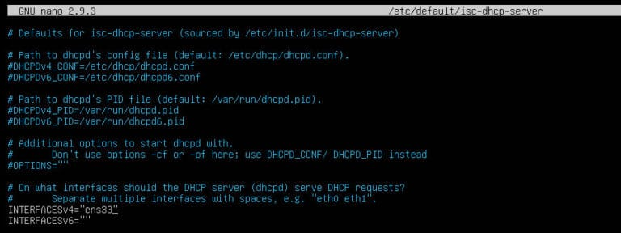
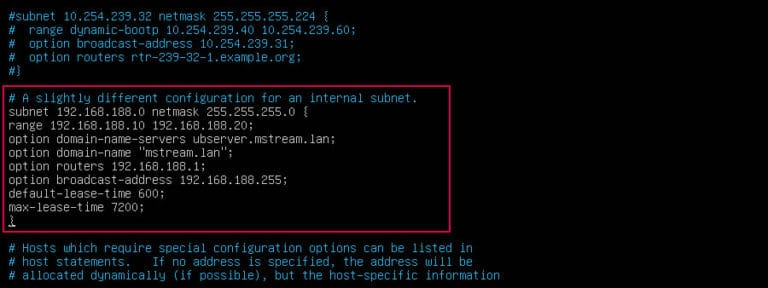
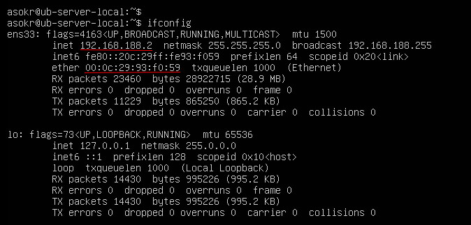
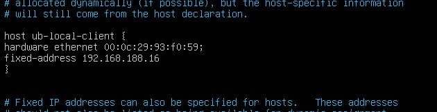
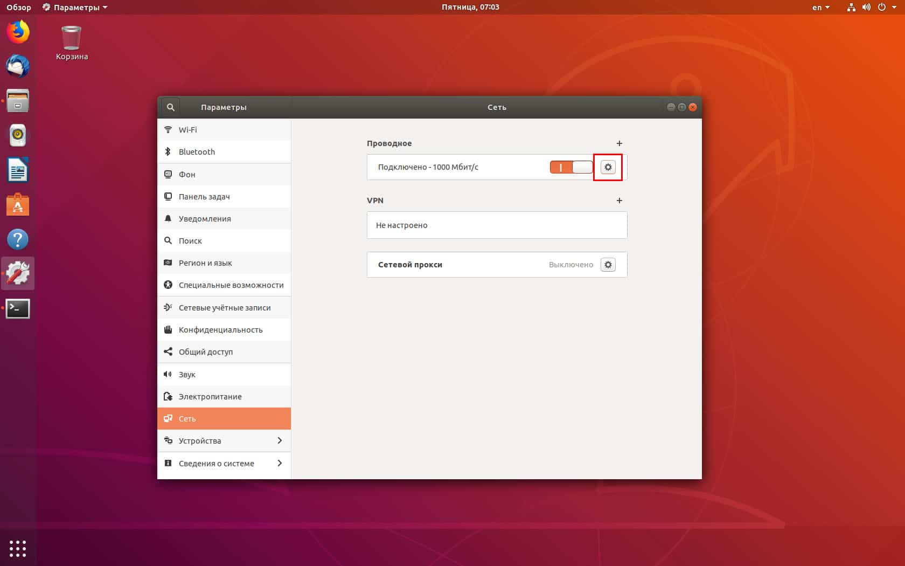
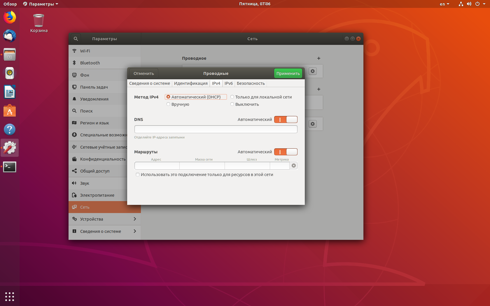

# Настройка DHCP сервера на Linux

**Dynamic Host Configuration Protocol (DHCP)** — автоматический предоставляет IP адреса и прочие настройки сети (маску сети, шлюз и т.п) компьютерам и различным устройствам в сети.

Клиент настроенный на получение адреса по протоколу DHCP посылает запрос к серверу, и тот в свою очередь предоставляет свободный IP адрес клиенту во временное пользование — так сказать в аренду (в дальнейшем я буду это так и называть). Срок аренды IP адреса настраивается на сервере. DHCP позволяет значительно уменьшить затраченное время на настройку сети, так же позволяет подключать клиента из одной сети в другую без изменения сетевых параметров. Для провайдеров услуг — DHCP позволяет сэкономить на пуле IP адресов, и присвоить статический IP любому оборудованию.

## Назначение DHCP

1. **Запрос на аренду:**<br>
Клиент передает запрос на сервер DHCP с адресом источника `0.0.0.0` и адресом назначения `255.255.255.255`. Запрос включает MAC-адрес, который используется для направления ответа от сервера.
2. **Предложение аренды IP-адреса:** сервер DHCP отвечает с IP-адресом, маской подсети, сетевым шлюзом, именем домена, серверами имен, продолжительностью аренды и IP-адресом сервера DHCP.
3. **Выбор аренды:** Когда клиент получил предложение — он передаёт всем серверам в сети, что он настроен, и больше настройки ему не нужны.
4. Затем сервер DHCP отправляет клиенту подтверждение. Клиент настроен на использование TCP/IP.
5. **Продление срока аренды:** Когда остаётся половина срока аренды, клиент запрашивает у DHCP сервера продление аренды IP-адреса.

## Мы ставим DHCP сервер

Система – Ubuntu 18.04 LTS 64 bit<br>
IP адрес – 192.168.188.0/24<br>
Хост – mstream.lan

Откройте терминал и выполните следующую команду для установки сервера:

```sh
sudo apt-get install isc-dhcp-server
```


DHCP сервер установлен. Теперь давайте настроем его под наши нужды.

## Настройка

Файл первичной конфигурации находится по адресу `/etc/default/isc-dhcp-server`. В нём нужно указать лишь наш сетевой интерфейс.

Если на вашем сервере больше одной сетевой карты, вы должны явно указать с какого интерфейса DHCP сервер должен принимать DHCP запросы.

Так как у меня на сервере только одна сетевая карта, под именем «ens33» — то я пропишу в конфигурационный файл именно её.

Давайте отредактируем конфиг `/etc/default/isc-dhcp-server`:

```sh
sudo nano /etc/default/isc-dhcp-server
```

Определим сетевой интерфейс

```sh

[...]

INTERFACESv4="ens33"
 
[...]
```



сли вы хотите использовать больше одного сетевого интерфейса — просто напишите их через пробел: «eth0 eth1».

Сохраните и закройте файл.

Теперь нам нужно отредактировать dhcpd.conf:

```sh

sudo nano /etc/dhcp/dhcpd.conf
```

Редактируем его, как написано ниже. Замените домены на свои.

```sh
[...]

# option definitions common to all supported networks...
 option domain-name "mstream.lan";
 option domain-name-servers ubserver.mstream.lan;
 
[...]
```

Чтобы клиенты в нашей сети смогли получать ip адреса от нашего сервера, нужно расскоментировать следующую строку:

```sh
[...]

authoritative;
 
[...]
```

Немного прокрутите вниз, и определите маску сети, диапазон IP адресов, домен и NS сервера:

```sh
[...]

# A slightly different configuration for an internal subnet.
subnet 192.168.188.0 netmask 255.255.255.0 {
range 192.168.188.10 192.168.188.20;
option domain-name-servers ubserver.mstream.lan;
option domain-name "mstream.lan";
option routers 192.168.188.1;
option subnet-mask 255.255.255.0;
option broadcast-address 192.168.188.255;
default-lease-time 600;
max-lease-time 7200;
}
 
[...]
```



Как вы видите выше, я выбрал диапазон IP адресов с `192.168.188.10` по `192.168.188.20`, клиенты **dhcp** получат адреса именно с из этого диапазона.

А что, если мы хотим предоставить клиенту определённый **ip**? В принципе сделать это не так трудно. Вы можете предоставить определённый IP клиенту по его MAC адресу. Давайте разберём это далее в статье.

## Предоставление определённого IP адреса клиенту dhcp сервера

Для примера, давайте присвоим IP адрес `192.168.188.16` клиенту с MAC-адресом `00:0c:29:93:f0:59`. Для определение MAC адреса используйте команду `ifconfig`

```sh
ifconfig
```

Вывод будет примерно следующим:



Обратите внимание на подчёркнутые слова — это IP адрес и MAC адрес.

Теперь присвоим нужный нам IP клиенту с MAC адресом, который мы узнали выше.

```sh
[...]

host ub-local-client {
 hardware ethernet 00:0c:29:93:f0:59;
 fixed-address 192.168.188.16;
 }
 
[...]
```



Как только вы добавили все нужные вам настройки в конфиг, сохраняем и закрываем файл.

## Запускаем DHCP сервер с новыми настройками

Теперь нам нужно перезапустить сервер:

```sh
sudo systemctl restart isc-dhcp-server
```

Посмотрите не оставили-ли вы ненужных записей в конфигурационном файле `dhcpd.conf`.

Если, всё таки, вы оставили какие-то записи — просто закамментируйте их, в противном случае DHCP сервер не загрузится.

Чтобы проверить, работает наш DHCP сервер или нет, используйте команду:

```sh
sudo systemctl status isc-dhcp-server
```

Если сервер настроен верно, то статус сервера будет **«active»**.

Чтобы запустить, или остановить DHCP сервер, используйте следующие команды:

```sh
sudo systemctl start isc-dhcp-server
```

```sh
sudo systemctl stop isc-dhcp-server
```

Теперь у нас полностью рабочий DHCP сервер. Далее нам предстоит настройка клиента нашего сервера.

## Настройка DHCP клиента

Для этой статьи на клиентской стороне я буду использовать Ubuntu Desktop 18.04 (64-bit).

**Клиент:**

Система – Ubuntu Desktop 18.04<br>
IP адрес – DHCP включен

Открываем `Настройки` -> `Сеть`. Выбераем сетевое соединение, и нажимаем кнопку настройка сетевого подключения



переходим на вкладку настроек IPv4, и выбираем метод «Автоматический (DHCP)«. Нажимаем Сохранить.



Давайте перезагрузим систему, после этого нам нужно будет проверить — получил ли наш клиент IP адрес от нашего сервера.

```sh
ifconfig
```

Если всё настроено верно — то клиент получил выделенный ему IP адрес. Задача решена.

Поздравляю! Наш DHCP сервер работает!!!
