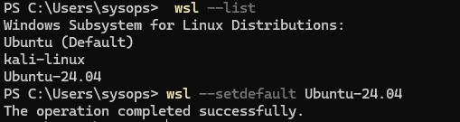
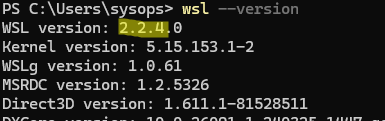
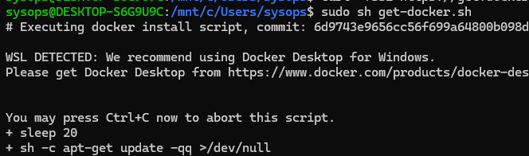
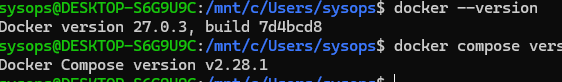
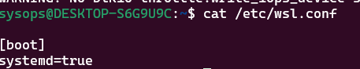
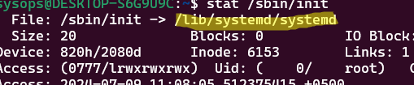
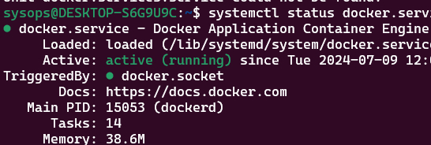
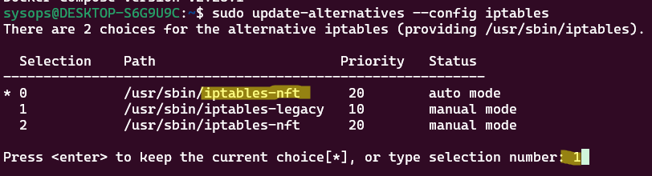
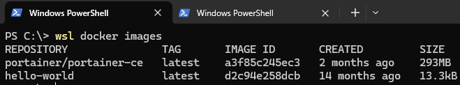

# Установка и настройка Docker на Windows Subsystem Linux (WSL2)

[Источник](https://winitpro.ru/index.php/2024/07/11/ustanovit-docker-windows-subsystem-linux-wsl2/)

Есть два варианта установки платформы контейнеризации Docker на Windows 10 и 11: в виде нативного win приложения **Docker Desktop for Windows** (используется встроенные компоненты Hyper-V + контейнеры Windows), или в виде полноценной установки **Docker Engine** в дистрибутив Linux в подсистеме Windows Subsystem for Linux (WSL2). В этой статье мы рассмотрим процесс установки и базовой настройки Docker в среде WSL без использования Docker Desktop.

**Преимущества от запуска Docker внутри WSL:**

+ Docker Desktop требует Pro или Enterprise редакции Windows 10 (11). Docker Engine в WSL будет работать на домашних (Home) редакциях Windows
+ Docker Desktop для Windows потребляет довольно много RAM и места для хранения отдельных виртуальных машин Hyper-V (в случае использования Windows контейнеров)
+ Лицензионные ограничения позволяют бесплатно использовать Docker Desktop для персональных проектов, или в небольших организациях (до 250 сотрудников). В других случаях нужно приобрести лицензию.

Итак, предполагаем что у вас есть компьютер с Windows 10 и 11, на котором вы [установили среду Windows Subsystem for Linux (WSL2)](https://winitpro.ru/index.php/2020/07/13/zapusk-linux-v-windows-wsl-2/) и скачали один из доступных Linux образов (Ubuntu 24.04 в этом примере). Выведите список доступны дистрибутивов WSL:

```sh
wsl --list
```

Чтобы задать образ WSL, который будет использоваться по-умолчанию, выполните команду:

```sh
wsl --setdefault Ubuntu-24.04
```



Убедитесь, что используется версия WSL2:

```sh
wsl --version
```



Если нет, выполните команду:

```sh
wsl --set-default-version 2
```

Чтобы подключиться к вашему дистрибутиву Linux в среде WSL, выполните:

```sh
wsl.exe
```

Обновите пакеты в дистрибутиве Linux (Ubuntu в этом случае):

```sh
sudo apt-get update && sudo apt-get upgrade -y
```

Затем выполните установку **Docker Engine** в Linux с помощью универсального официального скрипта:

```sh
curl -fsSL https://get.docker.com -o get-docker.sh
sudo sh get-docker.sh
```

Игнорируйте появившееся предупреждение об установке Docker в среде WSL.



Добавьте вашего пользователя в группу `docker` чтобы получить возможность запускать команды docker без повышения привилегий и ввода пароля через `sudo`:

```sh
sudo usermod -aG docker $USER
```

Проверьте, что **Docker desktop** и **compose** установлены успешно:

```sh
docker --version
docker compose version
```



Теперь нужно настроить автоматически запуск docker в WSL. В современных дистрибутивах Linux для WSL2 добавлена полноценная поддержка systemd. Проверьте, что он включен:

```sh
cat /etc/wsl.conf
```

```sh
[boot]
systemd=true
```



Затем проверьте, что systemd используется в качестве системы инициализации Linux:

```sh
stat /sbin/init
```

В данном используется `systemd`, т.к. процесс `/sbin/init` это символьная ссылка на `/lib/systemd/systemd`.



Запустите сервис docker engine и включите автоматический запуск:

```sh
sudo systemctl enable --now docker.service
systemctl status docker.service
```



Если systemd не используется по той или иной причине, можно добавить его в автозагрузку WSL:

```sh
nano /etc/wsl.conf
```

```sh
[boot]
command = "/usr/sbin/service docker start"
```

WSL2 по-умолчанию может использовать следующие ресурсы компьютера:

+ 50% оперативной памяти
+ 25% файла подкачки (swap)
+ 100% ресурсов процессора

Если вы хотите ограничить использование ресурсов хоста подсистемой WSL2, создайте в профиле текущего пользователя текстовый файл `%UserProfile%\.wslconfig` . В этом файле можно задать глобальные ограничения для всех дистрибутивов в WSL. Например:

```sh
[wsl2]
memory=8GB
processors=4
swap=2GB
```

Перезапустите образ WSL из командой строки Windows:

```sh
wsl --shutdown
```

Попробуйте запустить тестовый docker образ в WSL:

```sh
docker run hello-world
```

**Docker Engine** скачает и запустит демонстрационный контейнер hello-world из Docker Hub.

Для обеспечения максимального производительности WSL2, храните все файлы контейнеров внутри WSL (а не в директориях, которые пробрасываются с Windows, таких как /mnt/c).

В современных версиях Linux (Ubuntu 22.04, Debian 10+) для управления встроенным файрволом используется `nftables`, а не `iptables`. Для нативной поддержки `nftables` в WSL требуется ядро Linux 5.8 или выше. В старых версиях ядра для корректной работы сети придется включать совместимость с `iptables`:

```sh
sudo update-alternatives --config iptables
```



Нажмите 1 для выбора режима iptables-legacy.

Теперь вы можете выполнять команды к docker в WSL из командной строки Windows. Перед командами docker нужно указывать wsl. Например, вывести список доступных образов в Docker:

```sh
wsl docker images
```



Теперь вы можете разрабатывать и запускать Docker контейнеры непосредственно на своем Windows компьютере.
