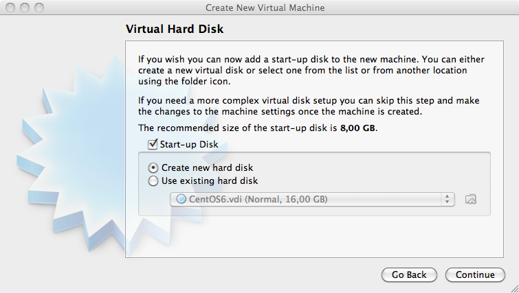
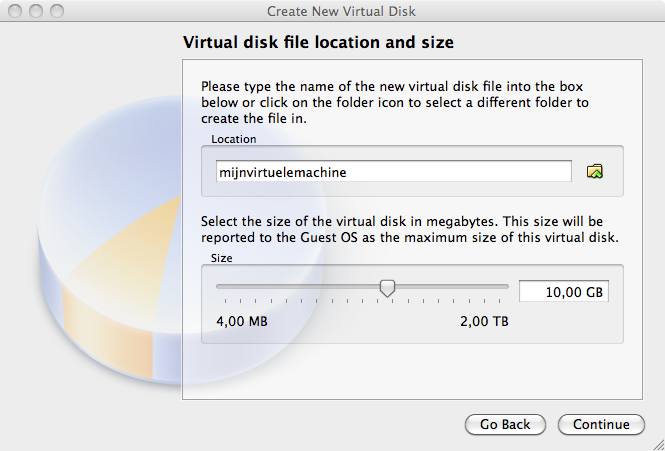
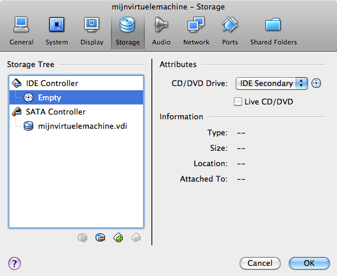
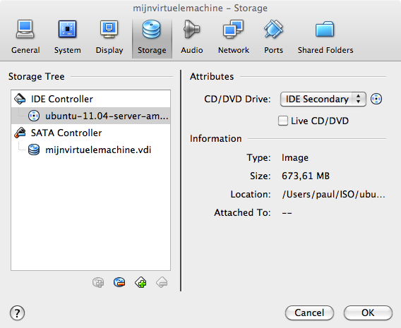

# 1. Вводная информация о Linux

## Содержание

+ [1.1 История Linux](#11-история-linux)
+ [1.2 Дистрибутивы](#12-дистрибутивы)
+ [1.3 Лицензирование](#13-лицензирование)
+ [1.4 Установка Linux в домашних условиях](#14-установка-linux-в-домашних-условиях)

[Оглавление](./README.md)

## 1.1 История Linux

Оригинал: [Linux Fundamentals](http://linux-training.be/linuxfun.pdf) 
Автор: Paul Cobbaut 
Дата публикации: 16 октября 2014 г. 
Перевод: А.Панин 
Дата перевода: 11 декабря 2014 г. 

**Глава 1. История Linux** 
В данной главе кратко описана история, а также область применения ОС Linux.

Если вам не терпится начать работу с Linux без длительных дискуссий об истории этой ОС, дистрибутивах и условиях их использования, вы можете перейти непосредственно к Части II, а точнее к Главе 6. "Работа с директориями" **(модуль 2, урок 2 в рамках данного курса)**.

### История Linux

Все современные операционные системы уходят своими корнями в 1969 год, в котором Dennis Ritchie и Ken Thompson из AT&T Bell Labs разработали язык программирования C и операционную систему Unix. Они поделились своими наработками в форме исходного кода (да, приложения с открытым исходным кодом появились еще в семидесятых годах прошлого века) со всем миром, включая хиппи из калифорнийского Университета Беркли. К 1975 году, в котором компания AT&T начала распространение ОС UNIX на коммерческой основе, практически половина ее исходного кода была создана сторонними разработчиками. Хиппи не были довольны тем, что коммерческая компания продавала программное обеспечение, в разработке которого они принимали непосредственное участие; баталии (юридического плана) привели к появлению в семидесятых годах двух версий Unix: официальной версии Unix от компании AT&T, а также бесплатной версии BSD Unix.

В восьмидесятых годах многие компании начали разработку своих собственных вариантов ОС Unix: компания IBM создала AIX, компания Sun создала SunOS (которая позднее стала называться Solaris), компания HP создала HP-UX и многие другие компании поступили аналогичным образом. В результате появилось огромное количество разновидностей ОС Unix с множеством вариантов выполнения одного и того же действия. И именно это время можно считать реальным временем зарождения ОС Linux, так как именно тогда Richard Stallman решил приблизить конец эры раздробленности в мире Unix, в которой каждая компания заново изобретает колесо, создав проект GNU (GNU is Not Unix - GNU не Unix). Цель данного проекта заключалась в создании операционной системы, которая была бы доступна для каждого человека и над развитием которой могли бы работать все желающие (так же, как это было в семидесятых годах). Многие инструменты с интерфейсом командной строки, которые вы можете использовать сегодня при работе с ОС Linux или Solaris, являются инструментами, созданными в рамках проекта GNU.

Начало девяностых годов ознаменовалось покупкой говорящим по-шведски финским студентом Linus Torvalds компьютера архитектуры i386 и разработкой им же нового, совместимого со стандартом POSIX ядра операционной системы. Он опубликовал исходный код созданного ядра в сети и заявил, что это ядро никогда не будет поддерживать какое-либо аппаратное обеспечение, кроме уже поддерживаемого аппаратного обеспечения архитектуры i386. Многие люди высоко оценили комбинацию из этого ядра ОС и инструментов, созданных в рамках проекта GNU, а остальное, как говорится, уже стало историей.

На сегодняшний день более 90 процентов суперкомпьютеров (включая 10 наиболее мощных из них), более половины всех смартфонов, миллионы настольных компьютеров, около 70 процентов веб-серверов, большое количество планшетных компьютеров и некоторая бытовая техника (DVD-проигрыватели, стиральные машины, DSL-модемы, маршрутизаторы, ...) работают под управлением ОС Linux. В текущий момент это наиболее часто используемая операционная система в мире.

Версия 3.2 ядра Linux была выпущена в январе 2012 года. Объем исходного кода данной версии ядра ОС вырос практически на двести тысяч строк (по сравнению с объемом исходного кода версии 3.1) благодаря наработкам более 4000 разработчиков, труд которых оплачивался более чем 200 коммерческими компаниями, включая Red Hat, Intel, Broadcom, Texas Instruments, IBM, Novell, Qualcomm, Samsung, Nokia, Oracle, Google и даже Microsoft.

Источники дополнительной информации:

[Dennis Ritchie](http://en.wikipedia.org/wiki/Dennis_Ritchie) 
[Richard Stallman](http://en.wikipedia.org/wiki/Richard_Stallman) 
[Linus Torvalds](http://en.wikipedia.org/wiki/Linus_Torvalds) 
[The Linux Kernel Archives](http://kernel.org) 
[Some numbers from the 3.2 development cycle](http://lwn.net/Articles/472852/) 
[linuxfoundation](http://www.linuxfoundation.org/) 
[Linux](http://en.wikipedia.org/wiki/Linux) 
[Unix History](http://www.levenez.com/unix/) (большой постер, посвященный истории ОС Unix)

---
[Содержание](#содержание)

## 1.2 Дистрибутивы

### Глава 2. Дистрибутивы

В данной главе представлен краткий обзор наиболее актуальных на данный момент дистрибутивов.

Дистрибутив Linux является коллекцией программного обеспечения (обычно с открытым исходным кодом), работающего под управлением ядра Linux. Дистрибутив (в английском языке для обозначения дистрибутива используется как термин distribution, так и сокращенная версия термина distro) может содержать серверное программное обеспечение, инструменты для управления системой, документацию и множество приложений для работы в окружении рабочего стола, причем эти программные компоненты содержатся в безопасном централизованном репозитории программного обеспечения. Разработчики дистрибутива обычно пытаются максимально унифицировать внешний вид и функции приложений из состава дистрибутива, предоставить инструментарий для простого управления пакетами программного обеспечения и чаще всего формируют набор программного обеспечения для выполнения конкретных задач.

Давайте рассмотрим некоторые популярные дистрибутивы.

### RedHat

RedHat является тесно связанной с Linux коммерческой компанией с бюджетом, исчисляющимся миллиардами долларов, работники которой прикладывают огромные усилия к разработке Linux. В данной компании трудоустроены сотни специалистов в области Linux, поэтому компания оказывает превосходную техническую поддержку своим клиентам. Продукты компании (Red Hat Enterprise Linux и Fedora) распространяются бесплатно. В отличие от дистрибутива Red Hat Enterprise Linux, который тщательно тестируется перед выпуском и поддерживается в течение периода длительностью до семи лет, Fedora является дистрибутивом с более частыми обновлениями, но без платной технической поддержки.

### Ubuntu

Компания Canonical начала работу с распространения по почте бесплатных компакт-дисков с дистрибутивом Ubuntu Linux в 2004 году, в течение короткого периода обеспечив популярность своего дистрибутива среди домашних пользователей (многие пользователи перешли к использованию дистрибутива, отказавшись от Microsoft Windows). Целью компании Canonical является разработка в рамках дистрибутива Ubuntu простого в использовании графического окружения рабочего стола, работающего под управлением ядра Linux, которое позволит обойтись без командной строки. Конечно же, целью компании также является извлечение прибыли путем продажи услуг технической поддержки дистрибутива Ubuntu.

### Debian

За дистрибутивом Debian не стоит никаких компаний. Вместо персонала компании развитие дистрибутива осуществляется тысячами хорошо организованных разработчиков, которые избирают лидера проекта Debian через каждые два года. Debian зарекомендовал себя как один из самых стабильных дистрибутивов Linux. Также данный дистрибутив является основой каждого из релизов дистрибутива Ubuntu. Существуют три версии дистрибутива Debian: stable (стабильная ветвь), testing (тестовая ветвь) и unstable (нестабильная ветвь). Каждый из выпусков дистрибутива Debian носит имя персонажа фильма "История игрушек" ("Toy Story").

### Другие дистрибутивы

Такие дистрибутивы, как CentOS, Oracle Enterprise Linux и Scientific Linux базируются на дистрибутиве Red Hat Enterprise Linux и используют множество аналогичных принципов, директорий и техник администрирования системы. Дистрибутивы Linux Mint, Edubuntu и многие другие дистрибутивы с именами *buntu базируются на дистрибутиве Ubuntu и, таким образом, очень похожи на дистрибутив Debian. Существуют также сотни других дистрибутивов Linux.

### Какой дистрибутив следует выбрать?

Если вы не работали с Linux до 2014 года, вам следует установить последнюю версию дистрибутива Ubuntu или Fedora. Если же вы просто хотите поработать с командной оболочкой Linux, вы можете установить дистрибутив Ubuntu server и/или дистрибутив CentOS (без графического интерфейса).

Ссылки на сайты дистрибутивов: 
redhat.com 
ubuntu.com 
debian.org 
centos.org 
distrowatch.com

---
[Содержание](#содержание)

## 1.3 Лицензирование

### Глава 3. Лицензирование

В данной главе приводятся краткие пояснения относительно условий различных лицензий, в соответствии с которыми распространяется программное обеспечение из состава дистрибутивов операционных систем.

Хотелось бы выразить огромную признательность Ywein Van den Brande за написание большей части текста данной главы.

Ywein является юристом, соавтором книги The International FOSS Law Book, а также автором книги Praktijkboek Informaticarecht (на голландском языке).

[Intellectual property on the Internet](http://ifosslawbook.org)
[Crealaw advocatenkantoor Brussel](http://www.crealaw.eu)

### О лицензировании программного обеспечения

Существуют две преобладающих парадигмы лицензирования программного обеспечения: парадигма свободного программного обеспечения и программного обеспечения с открытым исходным кодом (FOSS), а также парадигма собственнического (пропиетарного) программного обеспечения. Критерий различия двух упомянутых парадигм базируется на контроле за распространением и использованием программного обеспечения. В случае собственнического программного обеспечения функции контроля за его распространением и использованием по большей части осуществляется поставщиком программного обеспечения, в то время, как в случае свободного программного обеспечения и программного обеспечения с открытым исходным кодом аналогичные функции контроля в большей степени возлагаются на конечного пользователя. Но, несмотря на то, что описанные парадигмы лицензирования отличаются друг от друга, они используют одни и те же законы об авторском праве для претворения в жизнь и обеспечения соблюдения поставленных условий. С точки зрения закона свободное программное обеспечение и программное обеспечение с открытым исходным кодом может рассматриваться как программное обеспечение, пользователи которого в общем случае получают больше прав, чем при использовании собственнического программного обеспечения благодаря соответствующей лицензии при условии использования одних и тех же основополагающих механизмов лицензирования.

В соответствии с теорией права, автор свободного программного обеспечения или программного обеспечения с открытым исходным кодом, в отличие от автора программного обеспечения, распространяемого как публичное достояние (public domain), никоим образом не отказывается от своих прав на свое произведение. Парадигма свободного программного обеспечения и программного обеспечения с открытым исходным кодом основывается на правах автора произведения (авторском праве) для придания силы условиям лицензий свободного программного обеспечения и программного обеспечения с открытым исходным кодом. Условия лицензий данного типа должны выполняться пользователем программного обеспечения точно так же, как и условия лицензий собственнического программного обеспечения. Вам следует всегда тщательно знакомиться с лицензионными соглашениями перед использованием любого стороннего программного обеспечения.

Примерами собственнического программного обеспечения являются операционная система AIX от компании IBM, операционная система HP-UX от компании HP и система управления базами данных Oracle Database 11g. Вы не имеете права устанавливать или использовать данное программное обеспечение, не осуществив лицензионных отчислений. Также вы не имеете права распространять копии данного программного обеспечения и модифицировать его, к тому же исходный код данного программного обеспечения не доступен для широкой публики.

Программное обеспечение, распространяемое как общественное достояние, а также бесплатное программное обеспечение
Оригинальное программное обеспечение, являющееся плодом интеллектуального творчества автора, защищается законом об авторском праве. Не оригинальное программное обеспечение не подпадает под защиту закона об авторском праве и может, в принципе, использоваться бесплатно.

Программное обеспечение, распространяемое как общественное достояние, обычно рассматривается как программное обеспечение, автор которого отказался от всех прав на него, но при этом никто не может предъявить какие-либо права на это программное обеспечение. Оно может использоваться, распространяться или применяться для различных целей абсолютно свободно без получения согласия от автора или осуществления лицензионных отчислений. Программное обеспечение, распространяемое как общественное достояние, в определенных случаях может даже представляться третьими лицами как их собственное произведение, а модифицируя оригинальные версии этого программного обеспечения, третьи лица могут создавать новые версии, которые будут распространяться на условиях, отличных от условий распространения оригинальных версий.

Бесплатное программное обеспечение не является ни программным обеспечением, распространяющимся как общественное достояние, ни свободными программным обеспечением или программным обеспечением с открытым исходным кодом. Это собственническое программное обеспечение, которое вы можете использовать без уплаты лицензионных отчислений. Однако, в случае использования данного программного обеспечения должны соблюдаться обычно строгие условия лицензионных соглашений.

Примерами бесплатного программного обеспечения являются приложение для чтения документов формата PDF Adobe Reader, приложение для работы с IP-телефонией Skype, а также игра Command and Conquer: Tiberian Sun (данная игра распространялась на платной основе как собственническое программное обеспечение с 1999 года, но в 2011 году была переведена в категорию бесплатного программного обеспечения).

Свободное программное обеспечение и программное обеспечение с открытым исходным кодом
И движение свободного программного обеспечения (называемого Free Software по-английски, vrije software по-голландски и Logiciel Libre по-французски), и движение программного обеспечения с открытым исходным кодом, преследуют аналогичные цели и поддерживают аналогичные лицензии. Но исторически сложилось так, что эти движения по-разному рассматривают основополагающие понятия ввиду различий в расстановке акцентов. В то время, как движение свободного программного обеспечения фокусирует внимание на правах (а именно, четырех свободах), которые программное обеспечение предоставляет пользователям, движение программного обеспечения с открытым исходным кодом ссылается на свое определение открытого исходного кода и акцентирует внимание на преимуществах процесса совместной разработки программного обеспечения.

В последнее время термины "свободное программное обеспечение" и "программное обеспечение с открытым исходным кодом" или FOSS стали практически равнозначными. Реже используемый вариант обозначения свободного программного обеспечения free/libre/open source software (FLOSS) предполагает использование слова libre для уточнения того, что свободное программное обеспечение должно предоставлять определенную свободу, но не обязательно должно распространяется бесплатно.

Примерами свободного программного обеспечения являются коллекция компиляторов gcc, система управления базами данных MySQL, а также редактор растровой графики gimp.

Подробная информация об упомянутых четырех свободах изложена на следующей странице:

[Что такое свободная программа?](http://www.gnu.org/philosophy/free-sw.html)

Упомянутое определение программного обеспечения с открытым исходным кодом приведено на следующей странице:

[The Open Source Definition – Open Source Initiative](http://www.opensource.org/docs/osd)

Данное определение базируется на Критериях Debian по определению Свободного ПО, доступных на странице:

[Общественный договор Debian](http://www.debian.org/social_contract#guidelines)

Универсальная общественная лицензия проекта GNU
Все больший и больший объем программного обеспечения распространяется в соответствии с условиями лицензии GNU GPL (в 2006 году для нового выпуска Java была использована лицензия GPL). Данная лицензия (а именно, ее версии 2 и 3) является основной лицензией, одобренной Фондом свободного программного обеспечения. Ее главной характеристикой является принцип копилефта (copyleft). Идея этого принципа заключается в том, что каждый из последующих пользователей программного обеспечения в обмен на получение права использования данного программного обеспечения, должен распространять внесенные им улучшения, а также основанные на данном программном обеспечении работы, в соответствии с условиями лицензии оригинального программного обеспечения среди всех других пользователей в том случае, если он примет решение о распространении этих улучшений и производных работ. Другими словами, программное обеспечение, содержащее программные компоненты, которые распространяются в соответствии с условиями лицензии GNU GPL, в свою очередь, должно распространяться в соответствии с условиями лицензии GNU GPL (или совместимой лицензии, о чем будет сказано ниже). При этом невозможно включать программные компоненты, защищенные авторским правом и распространяемые в соответствии с условиями лицензии GNU GPL, в состав собственнической работы. Кроме того, возможность использования лицензии GPL была подтверждена в ходе одного из судебных разбирательств.

Использование программного обеспечения, распространяемого в соответствии с условиями версии 3 лицензии GPL
Вы можете использовать программное обеспечение, распространяемое в соответствии с условиями версии 3 лицензии GPL, практически без выполнения каких-либо условий. В том случае, если вы исключительно используете такое программное обеспечение по его прямому назначению, вам даже не придется принимать условия лицензии GPL версии 3. Однако, в том случае, если вы используете данное программное обеспечение для других целей, таких, как модификация или повторное распространение, вы автоматически принимаете условия этой лицензии.

В том случае, если вы используете программное обеспечение исключительно для собственных целей (включая работу с программным обеспечением с задействованием функции передачи данных по сети), вы можете свободно модифицировать его и не обязаны распространять модифицированную вами версию. Вы также можете нанять сторонних разработчиков с целью доработки программного обеспечения для решения именно ваших задач под вашим руководством и контролем. Но в том случае, если вы модифицируете программное обеспечение и используете его не только внутри вашей организации, считается, что вы распространяете это программное обеспечение. В этом случае вы должны распространять ваши модификации в соответствии с условиями лицензии GPL версии 3 (в соответствии с принципом копилефта). При распространении программного обеспечения в соответствии с условиями лицензии GPL версии 3, вы должны выполнять и некоторые другие обязательства. Ввиду этого вам следует тщательно ознакомиться с текстом лицензии GPL версии 3.

С помощью программного обеспечения, распространяемого в соответствии с условиями лицензии GPL версии 3, могут создаваться различные работы: условия лицензии GPL версии 3 не будут автоматически распространяться на эти работы.

### Лицензия BSD

Существует несколько версий оригинальной лицензии с описанием условий распространения программного обеспечения, созданной в Университете Беркли. Наиболее часто используемым вариантом лицензии является лицензия из 3 пунктов ("Новая лицензия BSD" или "Модифицированная лицензия BSD").

Это разрешающая лицензия, описывающая условия распространения свободного программного обеспечения. Данная лицензия налагает минимальные ограничения на процесс распространения программного обеспечения. Именно этим она и отличается от таких описанных выше использующих механизм копилефт лицензий, как лицензия GPL версии 3.

Упомянутое отличие не является существенным в том случае, если вы просто используете программное обеспечение по прямому назначению, но приобретает важность в том случае, если вы начинаете повторное распространение копий программного обеспечения в неизменном виде или ваших собственных модифицированных версий.

### Другие лицензии

Существует множество типов лицензий, описывающих условия распространения как свободного, так и несвободного программного обеспечения. Вам следует читать их и разбираться в установленных условиях распространения программного обеспечения перед его использованием.

### Комбинирование лицензий программного обеспечения

В том случае, если вы используете несколько источников программных компонентов или желаете распространять ваше программное обеспечение в соответствии с условиями отличной лицензии, вам придется удостовериться в том, что все используемые лицензии являются совместимыми. Некоторые лицензии, используемые для объявления условий распространения свободного программного обеспечения (такие, как лицензия BSD) совместимы с собственническими лицензиями, но большинство других подобных лицензий не является совместимым. В том случае, если вы столкнулись с несовместимостью лицензий, вам следует связаться с автором программного компонента с несовместимой лицензией для согласования различных условий использования лицензий или отказаться от использования программных компонентов с несовместимыми лицензиями.

---
[Содержание](#содержание)

## 1.4 Установка Linux в домашних условиях

### Глава 4. Установка Linux в домашних условиях

При написании данной книги предполагалось, что вы имеете доступ к работающему под управлением ОС Linux компьютеру. В большинстве компаний имеется один или несколько серверов на базе ОС Linux и в том случае, если вы имеете доступ к командной оболочке такого сервера, ваше рабочее окружение уже готово (вы можете пропустить данную главу и перейти к чтению следующей главы).

Другой вариант подготовки рабочего окружения заключается во вставке компакт диска с файлами дистрибутива Ubuntu Linux в привод компьютера, на котором уже установлена (или не установлена) ОС Microsoft Windows и следовании инструкциям установщика. Установщик дистрибутива Ubuntu позволяет изменить размер разделов жесткого диска (или создать на нем новые разделы), а также настроить меню загрузчика операционных систем для выбора операционной системы Windows или Linux в процессе загрузки компьютера.

В том случае, если у вас в текущее время нет доступа к компьютеру под управлением ОС Linux и вы не имеете возможности, либо не уверены в возможности установки ОС Linux на ваш компьютер, специально для вас в данной главе описан третий вариант: установка ОС Linux с использованием виртуальной машины.

Установка операционной системы с использованием виртуальной машины (созданной с помощью программных компонентов из пакета Virtualbox) является простой и безопасной операцией. Даже в том случае, если вы допустите ошибки и выведете из строя работающую в виртуальной машине систему на основе ядра Linux, это никак не повлияет на работу реальной системы, под управлением которой работает компьютер.

В данной главе приведены описания простых операций со снимками экрана, которые необходимо выполнить для развертывания рабочего сервера на базе Ubuntu на виртуальной машине, созданной средствами Virtualbox. Эти операции очень похожи на операции, необходимые для установки дистрибутива Fedora, CentOS или даже Debian, кроме того, при желании, вы также можете использовать пакет VMWare вместо Virtualbox для создания виртуальной машины.

### Загрузка образа установочного диска ОС Linux

Подготовку рабочего окружения следует начинать с загрузки образа установочного диска ОС Linux (файла с расширением .ISO) с сайта выбранного вами дистрибутива из сети Интернет. Уделите особое внимание выбору корректного образа диска, соответствующего архитектуре центрального процессора вашего компьютера; выбирайте образ диска для архитектуры i386 в том случае, если вы не уверены. В случае выбора образа диска, не соответствующего архитектуре используемого центрального процессора (например, образа диска для архитектуры x86_64 при работе со старым процессором Pentium), вы столкнетесь с неустранимыми ошибками практически стразу же после начала загрузки системы.

### Загрузка пакета Virtualbox

Второй этап подготовки рабочего окружения (который должен выполняться после окончания загрузки файла образа установочного диска с расширением .ISO) заключается в загрузке пакета Virtualbox. В том случае, если вы в данный момент работаете с ОС Microsoft Windows, вам следует скачать и установить пакет Virtualbox для Windows!

### Создание виртуальной машины

Теперь можно запустить приложение Virtualbox. В отличие от приведенного ниже снимка экрана, левая панель окна вашего приложения должна быть пуста.

Нажмите на кнопку "New" панели инструментов для того, чтобы создать новую виртуальную машину. Постараемся разобраться вместе с данным мастером подготовки виртуальной машины к работе. Снимки окон приложения были сделаны при работе с ОС Mac OS X; они могут незначительно отличаться от окон запущенного вами приложения в том случае, если вы работаете с ОС Microsoft Windows.

Присвойте имя вашей виртуальной машине (также, если нужно, выберите 32-битную или 64-битную архитектуру операционной системы).

Выделите оперативную память для виртуальной машины (установите значение 512MB в том случае, если ваш компьютер имеет 2GB или больший объем оперативной памяти, в противном случае установите значение 256MB).

Выберите вариант создания нового диска (помните о том, что в результате будет создан виртуальный диск).

Если вам будет задан представленный ниже вопрос, выберите вариант vdi.

Выберите вариант динамического резервирования объема жесткого диска (dynamically allocated) для размещения данных виртуального диска (вариант fixed size предназначен для резервирования всего установленного объема жесткого диска для размещения данных виртуального диска и полезен исключительно при промышленной эксплуатации виртуальной машины или при работе с очень старым, медленным аппаратным обеспечением).

Установите объем виртуального диска, выбрав значение из диапазона от 10GB до 16GB.

Нажмите кнопку "create" для создания виртуального диска.

Нажмите кнопку "create" для создания виртуальной машины.

### Присоединение установочного диска ОС

Перед запуском виртуального компьютера следует ознакомиться с некоторыми настройками (нажмите кнопку "Settings" на панели инструментов).

Не следует беспокоиться в том случае, если окно настроек вашего приложения выглядит по-другому, вам нужно всего лишь отыскать кнопку с надписью "Storage" на панели инструментов.

Помните о файле образа установочного диска ОС с расширением .ISO, который вы загрузили в самом начале процесса подготовки рабочего окружения? Для соединения этого файла образа установочного диска ОС с расширением .ISO с настраиваемой виртуальной машиной нажмите на иконку компакт-диска, расположенную рядом с названием элемента списка "Empty".

Теперь нажмите на другую иконку компакт-диска и соедините ваш файл образа установочного диска ОС с расширением .ISO с виртуальным приводом для чтения компакт-дисков настраиваемой виртуальной машины.

Убедитесь в том, что загруженный вами образ установочного диска ОС принят приложением для настройки виртуальных машин. В том случае, если приложение Virtualbox сообщает об ошибке на данном этапе настройки, вероятнее всего вы не завершили загрузку данных образа установочного диска ОС (попытайтесь загрузить образ установочного диска ОС снова).

Также может оказаться полезной настройка сетевого адаптера, заключающаяся в переводе последнего в режим моста вместо NAT. При работе виртуального сетевого адаптера режиме моста ваш виртуальный компьютер сможет без лишних сложностей подключиться к сети Интернет.

### Установка Linux

На данном этапе виртуальная машина полностью готова к работе. В процессе загрузки виртуальной машины следует выбрать пункт установки системы и следовать инструкциям, выводимым на экран. По завершении процесса установки вы сможете осуществить вход в систему и начать работать с Linux!

---
[Содержание](#содержание)
