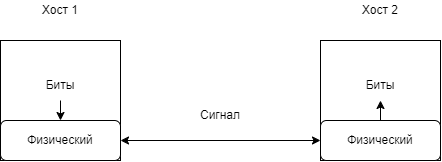

# 1. Введение

## Содержание

+ [1.1 Коммутация каналов и пакетная коммутация](#11-коммутация-каналов-и-пакетная-коммутация)
+ [1.2 Каналы передачи данных](#12-каналы-передачи-данных)
+ [1.3 Модель ISO/OSI](#13-модель-isoosi)
+ [1.4 Сетевые стандарты](#14-сетевые-стандарты)

[Оглавление](README.MD)

## 1.1 Коммутация каналов и пакетная коммутация

В компьютерной сети все данные передаются небольшими порциями, называемыми пакетами. Такой способ передачи данных придумал Леонард Клейнрок в 1961 году и назвал его пакетная коммутация.
Есть два способа организации передачи информации:

+ коммутация каналов
+ пакетная коммутация

Коммутация каналов применяется обычно в телефонии. Перед тем, как передать данные от одного абонента к другому, необходимо предварительно установить соединение (т.е. позвонить). Как только соединение будет успешно установлено, можете начинать передавать данные (говорить в трубку).

Этот способ хорошо зарекомендовал себя в телефонных сетях, где конечными точками сети являются люди. Однако, если конечными узлами сети будут компьютеры, то канальная коммутация имеет несколько явных недостатков:

1. **Невозможность общаться сразу с несколькими абонентами.** Установив канал связи с одним абонентом вы можете обмениваться данными только с ним. Если нужно отправить или получить данные от другого абонента, нужно разорвать все имеющиеся каналы и установить новый.
2. **Простой ресурсов в случае молчания в сети.** Когда абоненты установили канал связи и не передают данные, то ресурсы сети просто простаивают. В то же время, никакой другой абонент не может им передать свои данные.
3. **Время на установку соединения.** Каждый раз, когда один абонент хочет передать данные другому абоненту, необходимо установить соединение. Что требует определенного времени и ресурсов сети.

В пакетной коммутации считается, что все каналы связи уже установлены и данные просто передаются от одного узла к другому. Перед отправкой, данные разбиваются на отдельные фрагменты, называемые пакетами. Каждый пакет состоит из двух частей:

+ заголовок
+ данные

Заголовок пакета всегда содержит в себе информацию о получателе и другую информацию, необходимую для успешной доставки пакета конечному адресату.

Хорошей аналогией сетевого пакета является обыкновенное письмо в конверте. Само письмо - это данные. А информации на конверте - это заголовок. Информации на конверте должно быть достаточно, чтобы доставить письмо адресату и чтобы адресат знал, от кого оно пришло.

Сравнение сетей с коммутацией каналов и пакетов ([Коммутация каналов и пакетов в сетях передачи данных](https://evileg.com/ru/post/37/))

*Таблица. 1. Сравнение сетей с коммутацией каналов и пакетов.*

Коммутация каналов | Коммутация пакетов
-- | --
Необходимо предварительно устанавливать соединение | Отсутствует этап установления соединения
Адрес требуется только на этапе установления соединения | Адрес и другая служебная информация передаются с каждым пакетом
Сеть может отказать абоненту в установлении соединения | Сеть всегда готова принять данные от абонента
Гарантированная пропускная способность (полоса пропускания) для взаимодействующих абонентов | Пропускная способность сети для абонентов неизвестна, задержки передачи носят случайный характер
Трафик реального времени передается без задержек | Ресурсы сети используются эффективно при передаче пульсирующего трафика
Высокая надежность передачи данных | Возможные потери данных из-за переполнения буферов
Нерациональное использование пропускной способности каналов, снижающее общую эффективность сети | Автоматическое динамическое распределение пропускной способности физического канала между абонентами

Чтобы убедиться в том, что данные в компьютерной сети действительно передаются отдельными порциями, называемые пакетами, предлагаю убедиться в этом самостоятельно. Для этого установите на свой компьютер (ноутбук) [сниффер Wireshark](https://www.wireshark.org/download.html)

Сниффер - это специальная программа, которая позволяет видеть все отправляемые и получаемые пакеты на вашем компьютере. После того как вы установите и запустите Wireshark, необходимо будет выбрать сетевой интерфейс (она же сетевая карта), которую вы хотите прослушать. У меня она одна и называется “Беспроводная сеть”.

После выбора сетевого интерфейса сниффер немедленно начнет отображать все получаемые и отправляемые пакеты в режиме реального времени. Нажмите кнопку “Стоп” в левом верхнем углу, чтобы остановить работу сниффера. Как видно, в компьютерной сети данные передаются отдельными пакетами.

На этом курсе мы часто будем пользоваться сниффером, чтобы подробней разобраться в работе компьютерной сети.

---
[Содержание](#содержание)

## 1.2 Каналы передачи данных

По способу передачи данных каналы делятся на три типа:

+ **Симплексный канал (Simplex)** - позволяет передавать данные только в одном направлении. Примером такого канала может служить теле и радиовещание, GPS и ГЛОНАСС.

+ **Полудуплекс (Half duplex)** - канал, который позволяет передавать данные в обе стороны, но только в одном направлении в один момент времени. Другими словами, вы не можете одновременно передавать и получать данные в этом канале. Примером использования такого канала является обычная рация.

+ **Полный дуплекс (Full-duplex)** - позволяет передавать данные в обе стороны и одновременно.

---
[Содержание](#содержание)

## 1.3 Модель ISO/OSI

Передача данных в компьютерной сети довольно сложная задача. И как при решении сложных задач, она была разбита на простые независимые подзадачи. В конце 70-х годов была предложена модель OSI (Open Systems Interconnection), которая предлагала разбить передачу данных в компьютерной сети на 7 уровней. В начале 80-х годов эта модель стала основной в рабочей группе ISO (International Organization for Standardization, Международная организация по стандартизации).

С тех пор эта модель называется ISO/OSI (но в простой речи говорят только OSI) и в основном она используется для объяснения работы сети.

Модель OSI разбивает процесс передачи данных в компьютерной сети на 7 независимых уровней. Обычно эти уровни располагаются снизу вверх, как показано на рисунке 5.

Каждый уровень в модели OSI является независимым, т.е. он ничего не знает о работе других уровней. Например, сетевой уровень ничего не знает о работе канального и транспортного уровня.

Данные в этой модели могут двигаться строго вниз или строго вверх. Т.е. во время отправки данные с транспортного уровня передаются сетевому, а затем канальному. А во время получения данные с канального уровня передаются сетевому, затем транспортному и так далее. Данные не гуляют между уровнями в хаотическом порядке.

Список уровней OSI проще запомнить, если использовать англоязычную мнемонику (нумерация уровней снизу вверх, а в мнемонике они перечислены сверху вниз):

“All People Seem To Need Data Processing” ("Кажется, всем необходима обработка данных").

+ Layer 1: **P**hysical layer - **Физический** уровень;
+ Layer 2: **D**ata link layer - **Канальный** уровень (в ГОСТ Р ИСО/МЭК 7498-1-99 "уровень звена данных");
+ Layer 3: **N**etwork layer - **Сетевой** уровень;
+ Layer 4: **T**ransport layer - **Транспортный** уровень;
+ Layer 5: **S**ession layer - **Сеансовый** уровень;​​​​​​​
+ Layer 6: **P**resentation layer - Уровень **представления** данных;
+ Layer 7: **A**pplication layer - **Прикладной** уровень.

На русском мнемоника может выглядеть следующим образом (в порядке нумерации уровней): "**Ф**изики **к**олеблют **с**етевых **т**ехнологов, **с**оздавая **п**остоянные **п**роблемы" (powered by ChatGPT).

Или:

**Ф**азан **К**упил **С**осиску, **Т**еперь **С**осет **П**и**П**иску

### Физический уровень

Физический уровень отвечает за способы передачи или приема бит. На этом уровне описываются способы подключения (проводное соединение, беспроводное соединение), параметры сигналов, такие как амплитуда, частота, фаза, используемая модуляция. Решаются вопросы, связанные с синхронизацией, избавлением от помех, скоростью передачи данных и так далее.

### Канальный уровень

Канальный уровень отвечает за доставку кадров (frame) между устройствами, подключенными к одному сетевому сегменту. Заголовок кадра содержит аппаратные адреса отправителя и получателя, что позволяет определить, какое устройство отправило кадр и какое устройство должно получить и обработать его.

По сути, канальный уровень позволяет создать сегмент сети с несколькими хостами и обмениваться между ними кадрами.

>Хост - это любой компьютер (ПК, ноутбук, телефон, планшет) подключенный к сети. Т.е. это конечные устройства, которые используют сеть для передачи и получения данных.

### Сетевой уровень

Сетевой уровень отвечает за доставку данных между хостами, находящимися в разных сетевых сегментах. Другими словами - есть несколько сетевых сегментов, которые соединены между собой. Сетевой уровень занимается тем, что доставляет пакет от одного хоста к другому, даже если они в разных сегментах.

### Транспортный уровень

Транспортный уровень занимается доставкой данных от одного приложения до другого. Как известно, на хостах помимо ОС (операционной системы) работают различные приложения. Когда пакет пришел на хост, транспортный уровень доставляет его нужному приложению.

Например, вы запустили Skype и смотрите видео на YouTube. Когда на ваш хост приходит очередной пакет именно транспортный уровень определяет, какому приложению необходимо передать полученные данные.

Помимо доставки данных от одного приложения до другого, транспортный уровень заботится о скорости и надежности доставки данных.

### Сеансовый уровень

Сеансовый уровень отвечает за поддержание сеанса связи, позволяя приложениям взаимодействовать между собой длительное время.

### Уровень представления

Уровень представления отвечает за представление данных. Например, если данные должны быть сжаты или закодированы перед отправкой или переданы в определенной кодировке. Это касается и обработки полученных данных.

### Уровень приложения

Уровень приложения обеспечивает взаимодействие сети и пользовательских приложений. Именно на этом уровне располагаются популярные Интернет службы: HTTP (веб), SMTP (электронная почта) и многие другие. Когда вы, как программист, будете писать сетевое приложение, это как раз и будет реализация 7-го уровня модели ISO/OSI.

### Сетевой юмор

Сетевые инженеры вовсе не скучные люди и так же как и все любят повеселиться. Поэтому, помимо 7-и уровней в модели ISO/OSI есть еще несколько уровней:

+ политический
+ религиозный
+ финансовый
+ и другие

Подробней об этом можно почитать в Wiki - [Layer 8](https://en.wikipedia.org/wiki/Layer_8)

---
[Содержание](#содержание)

## 1.4 Сетевые стандарты

Есть два вида стандарта, которые содержат информацию о работе компьютерной сети:

+ IEEE 802.*
+ RFC

### Стандарты IEEE 802.*

IEEE (Институт инженеров электротехники и электроники) -  некоммерческая инженерная ассоциация из США, разрабатывающая широко применяемые в мире стандарты по радиоэлектронике, электротехнике и аппаратному обеспечению вычислительных систем и сетей.

В частности, стандарты IEEE 802.* касаются локальных вычислительных сетей (LAN) и сетей мегаполисов (MAN).

Давайте познакомимся с несколькими из них. Например, стандарт IEEE 802.11 - это целый набор стандартов связи для коммуникации в беспроводной локальной сетевой зоне. В жизни это называется Wi-Fi. Если вы посмотрите на любой Wi-Fi роутер или Wi-Fi сетевой адаптер в интернет магазине, то вы сразу увидите упоминания этих стандартов прямо в названии. На рисунке 11 видно упоминание двух стандартов IEEE 802.11n и IEEE 802.11ac.

IEEE 802.11n - осуществляет передачу данных по частотам 2.4 ГГц и 5 ГГц при скорости для одного канала до 150 МБит/сек. А IEEE 802.11ac предполагает передачу данных на частоте 5 ГГц при скорости до 867 Мбит/сек для одного канала.  [mcsindex](https://mcsindex.com/).

Это очень удобно, если вы собираетесь сделать компьютерную сеть дома или, скажем,  на работе. При покупке оборудования вы сможете сразу убедиться, что оно совместимо друг с другом.

На сегодняшний день только стандартов Wi-Fi (IEEE 802.11) существует несколько десятков [IEEE 802.11](https://ru.wikipedia.org/wiki/IEEE_802.11) и они продолжают постоянно добавляться.

А вот, например, семейство стандартов IEEE 802.3 описывает проводную технологию передачи данных CSMA/CD. В простонародье Ethernet. Этот стандарт вы скорее всего  (более 90%) можете встретить у себя дома. К вам в квартиру от провайдера приходит кабель (витая пара или оптоволокно), который вы включаете в ваш роутер.

Существует более 50 различных стандартов в семействе 802.3 [802.3](https://ru.wikipedia.org/wiki/IEEE_802.3).

Не нужно пугаться большому количеству стандартов 802.11 и 802.3, многие из них считаются устаревшими, а некоторые уже даже и не встретишь в живой природе.

Все стандарты IEEE 802.* описывают технологии канального уровня. Как видно на рисунке 13, технология полностью описывает работу физического и канального уровней. Английскую часть рисунка я взял прямо из стандарта 802.3-2012.

На физическом уровне технология описывает способы соединения конечных устройств, модуляцию сигнала и другие характеристики. А на канальном уровне описывается формат аппаратных адресов, максимальный и минимальный размер передаваемого пакета, интерпретацию определенных полей в заголовке.

### RFC

**RFC (Request For Comments)** - нумерованные документы, которые содержат программные технические спецификации сетевых протоколов широко применяемых в сети Интернет.

Сетевой протокол - это некоторый свод правил/соглашений, который позволяет всем участникам взаимодействия понимать друг друга.

В RFC описаны все популярные открытые сетевые протоколы: TCP ([9293](https://datatracker.ietf.org/doc/html/rfc9293)), IP ([791](https://datatracker.ietf.org/doc/html/rfc791)), SMTP (протокол доставки электронной почты, [5321](https://datatracker.ietf.org/doc/html/rfc5321)), HTTP (веб, [2616](https://datatracker.ietf.org/doc/html/rfc2616)) и многие другие.

Если вам понадобится разобраться в тонкостях работы того или иного протокола, рекомендую почитать его RFC.

---
[Содержание](#содержание)
