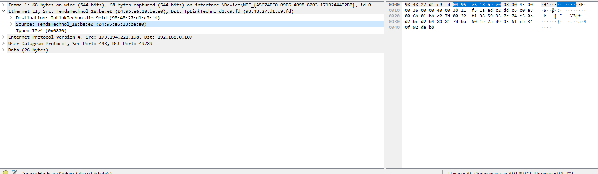
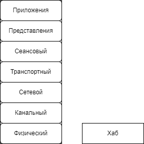

# ## 2. Ethernet (CSMA/CD)

## Содержание

+ [2.1 Ethernet (CSMA/CD)](#21-ethernet-csmacd)
+ [2.2 Смотрим Ethernet кадр в Wireshark](#22-смотрим-ethernet-кадр-в-wireshark)
+ [2.3 Топологии](#23-топологии)
+ [2.4 Концентратор (репитор, хаб)](#24-концентратор-репитор-хаб)
+ [2.5 Коммутатор (свитч)](#25-коммутатор-свитч)
+ [2.6 Масштабируемость технологии канального уровня](#26-масштабируемость-технологии-канального-уровня)

[Оглавление](README.MD)

## 2.1 Ethernet (CSMA/CD)

И так, предположим, мы хотим собрать свою первую сеть состоящую из 3-х хостов. Как это сделать? С помощью чего мы их соединим, как будет работать сетевая карта, каким способом мы будем кодировать биты, каким разъемом подключать, как мы определим, кому из 3-х хостов мы отправили данные и так далее?

Чтобы объединить 3 хоста в одну сеть, нужно определиться с технологией канального уровня. В стандартах IEEE 802.* можно найти описание различных технологий. Мы выберем Ethernet, как наиболее распространенный. Есть два основных стандарта по Ethernet:

+ 802.3 - проводной Ethernet
+ 802.11 - беспроводной Ethernet, мы его еще называем Wi-Fi.

Ethernet был [придуман](https://ethernethistory.typepad.com/papers/ethernetbobmemo.pdf) в 1973 году инженером Робертом Меткалфом. В то время Роберт работал в компании Xerox.

*Еще больше истории про создание Ethernet и о самом создателе можно почитать в [статье](https://habr.com/ru/companies/edison/articles/277827/) на Хабре "Роберт Меткалф: папа EtherNet, отличный инженер и фиговый предсказатель (но за слова ответил)".*

### Физический уровень Ethernet

В 1983 году технология Ethernet была описана в стандартах IEEE 802.3. Рабочее название Ethernet известно как CSMA/CD (Carrier Sense Multiple Access with Collision Detection — множественный доступ с прослушиванием несущей и обнаружением коллизий). В этой аббревиатуре скрывается идея работы технологии. Для понятности, давайте разберем эту аббревиатуру в неправильном порядке:

**MA (Multiple Access)** - множественный доступ означает, что любой хост в сети Ethernet может отправить данные в сеть когда захочет. Помните, в начале курса мы говорили о пакетной коммутации. Она предполагает, что все каналы передачи данных уже установлены. Вот MA как раз и есть реализация этой идеи.

**CS (Carrier Sense)** - прослушиванием несущей, означает не отправлять данные в сеть, если кто-то другой уже передает что-то.

**CD (Collision Detection)** - определение коллизий. Если все-таки два и более хоста начали одновременно передавать данные в сеть, это называется коллизия. В этом случае полученные во время коллизии данные отбрасываются и хосты начинают передачу последнего пакета снова. Стоит отметить, что коллизия может случиться только в том случае, если используется полудуплексное соединение (half-duplex). Если у вас полнодуплексное соединение (full-duplex), то коллизия не произойдет, так как для отправки и приема данных используются разные каналы.

Итого, алгоритм работы сети Ethernet следующий:

1. Каждый хост в сети Ethernet может передавать данные в любой момент времени.
2. Перед передачей данных сетевая карта проверяет несущую. Если никто в настоящий момент не передает данные, сетевая карта начинает передавать данные.
3. Если во время передачи данных сетевая карта определяет, что еще кто-то вместе с ней передает данные в сеть, то генерируется специальный JAM сигнал, сообщающий всем участникам сети, что произошла коллизия и текущий кадр с данными считать недействительным.
4. Возврат на второй пункт.

Первая версия Ethernet стандарта IEEE 802.3 появилась в 1983 году и он предполагал передачу данных на скорости всего 10 Мбит/сек (примерно 1,25 Мбайт в секунду) с помощью коаксиального кабеля. А современные стандарты предполагают передачу данных на скорости 50 Гбит/сек.

### Канальный уровень Ethernet

На рисунке 15 вы можете видеть Ethernet пакет на канальном уровне. Картинка прямо из стандарта IEEE, поэтому все поля подписаны на английском. 1 октет = 8 битам = 1 байт.

### Преамбула и SFD

Преамбула (Preamble) и SFD (Start Frame Delimiter) вместе занимают 8 байт (7 + 1) и необходимы сетевой карте, чтобы подготовиться к получению Ethernet кадра (frame).

### MAC адреса

Сразу за SFD начинается Ethernet кадр. Кадр состоит из двух частей:

+ Заголовок.
+ Данные.

Заголовок Ethernet кадра состоит из:

+ Адрес назначения (Destination Address).
+ Адрес источника (Source Address).
+ Поля Длина/Тип (Length/Type).

По 6 байт (48 бит) выделяется на аппаратный адрес назначения и отправителя. Обычно этот аппаратный адрес называется MAC  адрес (или адрес сетевой карты или физический адрес) и записывается в виде байт в шестнадцатеричном формате разделенных двоеточием. Например D0:0D:56:77:33:C4. MAC - это аббревиатура от Media Access Control.

Этот адрес есть у каждой сетевой карты. Вы можете самостоятельно посмотреть его у себя. Если у вас Windows, то откройте консоль (cmd.exe) и выполните команду “ipconfig /all” В результате работы команды будут перечислены все ваши локальные сетевые устройства и их параметры. Нужный вам параметр называется “Физический адрес”.

Если у вас MacOS или Linux, то в командной строке выполните команду ifconfig, как изображено на рисунке 17.

>В современных Linux дистрибутивах команда ifconfig считается устаревшей и часто её уже нет в стандартной поставке Linux. Вместо неё принято использовать ip address из пакета iproute2.

Каждый раз, когда ваша сетевая карта получает Ethernet пакет, она проверяет MAC адрес назначения. И если он совпадает с ее, то этот пакет дальше обрабатывается. Если нет, пакет отбрасывается.

MAC адреса делятся на 3 типа:

+ **Unicast** - персональный MAC адрес. Такой адрес есть у каждой сетевой карты. Он либо прошивается прямо на заводе или устанавливается вместе с драйверами.
+ **Multicast** - групповой MAC адрес, начинается на 01:00:5E. Этот специальный адрес сетевая карта может себе присвоить в случае, когда ожидается рассылка пакетов сразу группе хостов.
+ **Broadcast** - широковещательный MAC адрес, записывается как все биты установленные 1 или в шестнадцатеричном формате FF:FF:FF:FF:FF:FF. Такой адрес в поле получателя означает, что пакет должен быть обработан всеми хостами, которые получили данный пакет.

Чтобы MAC адреса случайно не пересекались, за каждым производителем сетевого оборудования закреплен определенный диапазон MAC адресов, которыми он может использоваться. Все эти диапазоны можно найти в специальном OUI файле, который публично доступен по адресу [Диапазон MAC адресов](https://standards-oui.ieee.org/).

### Длина/Тип

Поле Длина/Тип (Length/Type) имеет две взаимоисключающих трактовки:

+ Если значение поля менее или равно 1500 (0x05DC), то значение трактуется как размер данных в Ethernet кадре
+ Если значение поля более или равно 1536 (0x0600), то значение трактуется как идентификатор вложенного протокола. К примеру, если внутри Ethernet кадра будет лежать IP пакет, то значение поля будет 0x0800, а если ARP пакет, то значение 0x0806.

### Данные Ethernet пакета

После Ethernet заголовка следуют сами данные (MAC client data). Размер этих данных от 46 до 1500 байт. Т.е. Ethernet кадр без учета FCS не может быть больше 1514 байт (1500 байт данных + 14 байт Ethernet заголовок).

Минимальный размер данных в Ethernet кадре составляет 46 байт. Это ограничение сделано для того, чтобы в момент определения коллизии можно было однозначно понять, какой именно пакет вызвал коллизию.

В компьютерных сетях иногда встречаются jumbo frame. Это Ethernet кадр, в котором можно передавать до 9000 байтов данных. Они поддерживаются не всем оборудованием, поэтому их используют только в локальной сети (ЦОД, вычислительный кластер и пр). Такие фреймы позволяют увеличить эффективность сети с [94.9% (при стандартном размере данных в Ethernet фрейме в 1500 байт) до 99.1%](https://en.wikipedia.org/wiki/Jumbo_frame). Под эффективностью сети понимается доля полезной нагрузки (данных) по отношению к общему размеру фрейма.

### Почему бы не сделать пакеты побольше?

Зачем это ограничение в 1500 байт? Максимальный размер в 1500 байт полезной нагрузки в пакете обеспечивает хорошую скорость для передачи данных реального времени и не слишком сильно нагружает сеть заголовками.

Чем больше максимальный размер пакета, тем больше будет задержка при отправке второго пакета.

Предположим, у вас на компьютере работает два приложения. Одно скачивает файл из сети, а по второму вы разговариваете по видео-связи с друзьями. Если максимальный размер пакета сделать очень большими, как на рисунке 19, то пока ваша сетевая карта будет принимать пакет с данными скачиваемого файла, пакет с видео и звуковой дорожкой от ваших друзей будет ожидать где-то в буфере на прием. Вы это заметите, так как видео и звук будет замораживаться на время и разговор превратится в мучение, а не в радость.

Если пакет сделать очень маленьким, то возрастет нагрузка на передаваемые данные. Предположим, скорость передачи данных у нас 10 Мбит/сек. Т.е. мы можем передать 10 000 000 бит в секунду. Вспомним формат Ethernet пакета на рисунке ниже

+ 7 байт преамбула
+ 1 байт SFD
+ 14 байт заголовок Ethernet кадра
+ 1500 байт данных
+ 4 байта FCS

Итого получается 1526 байт = 26 байт служебной информации + 1500 байт данных.

Добавим к этому расстояние между передаваемыми пакетами. В Ethernet вы не можете передать два пакета строго друг за другом, между ними должно быть расстояние. Это расстояние называется interpacket gap (рисунок 20).

Для 10 Мбит/сек размер Interpacket gap равен примерно 47 битам (почти 6 байт) [Interpacket gap](https://en.wikipedia.org/wiki/Interpacket_gap).

Получается, что для передачи 1500 байт данных, мы дополнительно передаем 26 служебных байт + 6 байт Interpacket gap. Итого получается 1532 байта (1500 байт данных + 26 байт служебной информации + 6 байт  Interpacket gap).

1532 байта данных это 12 256 бит (1532 * 8). При скорости 10 Мбит/сек, за одну секунду мы успеем передать 815 пакетов. В каждом пакете 1500 байт данных, получается, что за секунду мы передадим 1 222 500 байт полезных данных. Предположим, мы уменьшим максимальный размер пакета до 1000 байт. Что получится?

1000 байт данных + 26 байт служебной информации + 6 байт Interpacket gap = 1032 байта или 8 256 бит. При 10 Мбит/сек за одну секунду мы успеем передать 1211 пакетов. В каждом 1000 байт данных, получается, что за секунду мы передадим 1 211 240 байт полезной нагрузки, что на 12 649 байт меньше (это примерно 1%).

Вроде немного, при этом разница в количестве пакетов около 50%, 815 против 1211. А это означает - на 50% больше прерываний на сетевом интерфейсе при обработке и отправке пакетов, на 50% больше раз обрабатывать заголовок, и так далее.

### Frame Check Sequence

Заканчивается Ethernet пакет полем Frame Check Sequence  (FCS). Это поле содержит CRC32. CRC (Cyclic redundancy check) - алгоритм нахождения контрольной суммы, предназначенный для проверки целостности данных.

При отправке каждого Ethernet кадра сетевая карта считает его CRC32 и записывает в FCS. Во время получения Ethernet пакета, сетевая карта пересчитывает CRC32 и сверяет со значением в поле FCS. В случае, если эти значения не совпадают, пакет отбрасывается.

Это такой способ удостовериться, что принятый пакет не был случайно искажен во время передачи. И данные пришли именно те, которые были отправлены.

---
[Содержание](#содержание)

## 2.2 Смотрим Ethernet кадр в Wireshark

Давайте на практике посмотрим на Ethernet кадр. Wireshark и другие снифферы могут показать только Ethernet кадр. Посмотреть Ethernet пакет (вместе с полями Преамбула, SFD и FCS) не получится. Так как эти поля предназначаются только для сетевой карты.

1. Запустите Wireshark.
2. Выберите (дважды кликните) нужный интерфейс для захвата пакетов. У меня это “Беспроводная сеть”.
3. Wireshark начнет захватывать и отображать пакеты в реальном времени.
4. Нажмите стоп в левом верхнем углу.

У вас должен получиться экран похожий на мой (рисунок 21).

Вся рабочая область Wireshark разбита на 3 части.

Верхняя часть отображает список захваченных пакетов и короткую информацию о них (время захвата, IP адреса и другую информацию). Вы можете выбирать (кликнув мышкой) пакеты. В левой нижней части экрана отображается структура выбранного вами пакета.

Раскройте пункт, который называется Ethernet II. В раскрытом пункте вы увидите поля:

+ Destination
+ Source
+ Type

Это как раз и есть те самые: Адрес назначения (Destination Address), Адрес источника (Source Address), Поля Длина/Тип (Length/Type). Какой бы пакет вы ни выбрали, в начале у вас всегда будет Ethernet заголовок и первым полем будет Destination.

В правой нижней панели отображается шестнадцатеричное представление пакета. Так называемый hex dump. Когда вы выделяете поле на левой нижней панели, то нужные байты, которые соответствуют этому полю, подсвечиваются на правой панели.

На рисунке 22 я выбрал поле Source (Адрес источника), его размер 6 байт и Wireshark мне подсветил эти 6 байт в правой панели.

---
[Содержание](#содержание)

## 2.3 Топологии

### Полносвязная (ячеистая)

Если мы попробуем собрать компьютерную сеть из 3, 4 хостов вооружившись только сетевой картой и проводом, то все, что мы сможем:

+ построить полносвязную сеть (рисунок 23)
+ или общую шину.

Если мы будем использовать полнодуплексное соединение (full-duplex), то в такой сети у нас не будет коллизий и скорость передачи данных для всех хостов будет постоянной.

Проблема полносвязной сети заключается в количестве сетевых карт, необходимых для подключения. Для каждого хоста нам потребуется N-1 сетевая карта. Если у вас всего 3 хоста, то вставить в один компьютер 2 сетевые карты не очень сложно. Но если ваша сеть будет насчитывать 10 хостов, то вставить 9 сетевых карт уже проблематично.

### Общая шина

Использование топологии общая шина более практичное, чем полносвязная сеть. Организации сети на базе технологии Ethernet по топологии общая шина описано в стандартах IEEE 802.3 (самый первый стандарт, он же 10BASE5) и IEEE 802.3a (он же 10BASE2). Передача данных осуществляется  по полудуплексному каналу (half-duplex).

Большим недостатком такой топологии является ее ненадежность. На рисунке 25 показан стандартный BNC T-коннектор. С одной стороны (слева) подключается Хост 1, с другой стороны (справа) подключается Хост 3, а ваш (например, Хост 2) подключается по центру. И таким образом сеть может организовываться дальше. И проблема тут как раз в этих подключениях. Довольно часто, по неаккуратности (пинали ногами или шваброй, во время уборки) коннекторы разъединялись, что приводило к отключению части сети.

Предположим, у нас есть сеть как на рисунке 24. Владелец хоста 3 неаккуратно пнул ногой кабель, что привело к отсоединению коннектора. Теперь хост 1 и хост 2 не могут общаться с хостом 4 или хостом 5.

### Звезда

Для решения проблемы, когда один пользователь может намеренно или случайно сломать часть сети, придумали топологию звезда (рисунок 26).

Для организации такой топологии одних сетевых карт и проводов будет недостаточно. Потребуется сетевое оборудование - концентратор (он же репитер или хаб).

На сегодняшний день это самая распространенная топология. Выход из строя одной рабочей станции не отражается на работе всей сети в целом. В отличие от общей шины, в топологии звезда более лёгкий поиск неисправностей и обрывов в сети.

Другими достоинствами такой топологии являются:

+ высокая производительность сети (при условии правильного проектирования);
+ гибкие возможности администрирования;
+ низкая стоимость;

Простота установки и масштабируемость сделали топологию звезды единственной общей топологией.

Хороший пример такой топологии - домашняя Wi-Fi сеть. Обычно домой устанавливается Wi-Fi роутер, к которому подключаются все устройства - ноутбуки, телевизор, телефоны и так далее.

### Практика в Miminet

Далеко не у всех есть возможность дома или на работе собирать произвольные сети. Поэтому, для образовательных целей мы сделали веб-эмулятор [Miminet](https://miminet.ru/).

Веб-эмулятор позволяет вам нарисовать компьютерную сеть, задать ей настройки и посмотреть, как она будет работать.

В рамках этого курса я буду часто приводить различные примеры работы сети с ссылкой на Miminet.

---
[Содержание](#содержание)

## 2.4 Концентратор (репитор, хаб)

Чтобы организовать компьютерную сеть с топологией звезда, нам нужно сетевое оборудование. Простейшим сетевым оборудованием является хаб.

Хаб работает на физическом уровне модели ISO/OSI и представляет собой небольшую коробку с портами для подключения (рисунок 27, справа).

Получив сигнал на любой порт из подключенных, хаб передает его во все остальные подключенные порты. Таким образом, если мы построим сеть их 3-х хостов, как изображено на рисунке 28 и отправим пакет от хост 1 к хосту 2, то хост 3 также получит этот пакет. Так как хаб, получив пакет от хоста 1 отправит его во все свои остальные активные порты.

[Подробнее](https://miminet.ru/web_network?guid=c4627fb9-a1da-4919-b97e-adce598a3464)

*На сервисе miminet.ru вы можете самостоятельно воссоздать такую сеть и убедиться, что она работает так, как и описано. Или можете просто открыть сеть по ссылке и запустить анимацию. Здесь и далее на рисунках сети вы будете видеть рядом с хостами  подпись вида 10.0.0.2/24. Это так записаны IP адрес/маска хоста. Что это такое мы разберем чуть ниже. А пока это можно интерпретировать как уникальный идентификатор хоста.*

Давайте попробуем усложнить схему. Соберем сеть из нескольких хабов и узлов. Как показано на рисунке 29. С помощью команды ping отправим пакет от хоста 1 к хосту 2 и посмотрим что произойдет.

[Подробнее](https://miminet.ru/web_network?guid=f23fbe16-031b-46ea-8de5-41d5550cc7bc)

Запустив такую сеть мы увидим, что все пакеты, которыми будут обмениваться хост 1 (host_1) и хост 2 (host_2) будут доставлены и на хост 3 и на хост 4. Так как хаб работает на физическом уровне и все что он делает - пересылает полученные пакеты во все свои активные порты.

Основная проблема такой сети заключается в том, что скорость передачи данных в сети падает с ростом количества узлов.

Допустим, у нас есть сеть из 3-х хостов, как на рисунке 28 и скорость передачи данных 10 Мбит/сек. В такой сети, для 3-х хостов, средняя скорость передачи данных для каждого узла будет около 3 Мбит/сек.

Если хост 3 захочет отправить данные в сети, он должен будет убедиться, что хост 1 и хост 2 ничего не отправляют. Если в сети будет 10 хостов, то вероятность, что все 9 хостов на текущий момент ничего не отправляют сеть еще ниже. А значит, ниже вероятность того, что наш хост сможет отправить пакет сейчас.

На моей практике, сеть из 40-50 хостов на хабах работает ощутимо медленно.

Помимо проблемы со скоростью и коллизий, сеть на хабах небезопасна, так как позволяет прослушивать чужие пакеты.

### Домен коллизий

Напомню, что коллизия - это столкновение сигналов (пакетов) в сети. Происходит, когда два и более хоста одновременно отправляют данные в сеть.

Происходить коллизия может только в том случае, если в сети используется полудуплексное (half-duplex) подключение. Т.е. для приема и передачи пакета используется один и тот же физический канал.

Домен коллизий - это такой сегмент сети, в котором может произойти коллизия.

---
[Содержание](#содержание)

## 2.5 Коммутатор (свитч)

Для решения проблемы с масштабируемостью и производительностью сети был предложен свитч.

Свитч (он же коммутатор) - активное сетевое оборудование, которое работает на втором уровне модели ISO/OSI (рисунок 30). Т.е он уже может работать с Ethernet кадрами. Выглядит свитч так же как и хаб, небольшая коробка с портами.

### Свитч - это поумневший хаб

Он пытается отправлять Ethernet пакеты в тот порт, куда подключен хост назначения.

Для примера снова будем использовать сеть из трех хостов, только сеть будет построена через свитч, как на рисунке 31. Также, допустим, что хост 1 (host_1) подключен в порт 1 на свитче, хост 2 в порт 2, а хост 3 в порт 3.

[Подробнее](https://miminet.ru/web_network?guid=6cfb1dc5-9c80-4083-a87b-ff96a51ad0bd)

На канальном уровне все хосты используют MAC адрес (он же физический адрес). И он должен быть уникальный в рамках одного сегмента сети. Если вдруг в сети будет два хоста с одинаковым MAC адресом, то мы не можем однозначно сказать, какому хосту предназначаются данные. Допустим, в нашей сети хосты имеют следующие MAC адреса:

+ host_1 -> 00:00:00:00:00:01
+ host_2 -> 00:00:00:00:00:02
+ host_3 -> 00:00:00:00:00:03

Во время работы, свитч запоминает MAC адреса отправителей в специальной таблице под названием таблица коммутации (таблица 2). Обратите внимание, свитч не запоминает MAC адреса получателя, только отправителя.

#### Таб. 2. Таблица коммутации

MAC адрес отправителя | Порт свитча
-- | --
  |  

Таблица коммутации состоит из двух колонок:

+ MAC адрес
+ Номер порта, к которому подключен хост с данным MAC адресом.

### Алгоритм работы свитча

Пусть в нашем случае, хост 1 отправит пакет хосту 2. Алгоритм работы свитча следующий:

+ Изначально, как только свитч включают, его таблица коммутации пустая.
+ Когда на свитч приходит пакет, он записывает в таблицу MAC адрес отправителя и номер порта, на который этот пакет пришел. Т.е в нашем случае на порт 1 приходит Ethernet пакет с MAC адресом отправителя 00:00:00:00:00:01 и в таблицу коммутации добавляется запись:

#### Таб. 3. Таблица коммутации с одной записью

MAC адрес отправителя | Порт свитча
-- | --
00:00:00:00:00:01 | 1

+ Дальше свитч пытается отправить пакет в тот порт, куда подключен получатель. Для этого он достает из Ethernet пакета MAC адрес получателя (00:00:00:00:00:02) и ищет его в своей таблице коммутации. В нашем случае, такого адреса в таблице коммутации нет. В этом случае свитч работает как хаб, отправляет пакет во все остальные подключенные порты. Т.е. в порт 2 и 3.

А теперь, пусть хост 2 отправит пакет хосту 1:

+ Когда на свитч придет пакет от хоста 2, он добавит запись в свою таблицу коммутации:

#### Таб. 4. Таблица коммутации с двумя записями

MAC адрес отправителя | Порт свитча
-- | --
00:00:00:00:00:01 | 1
00:00:00:00:00:02 | 2

+ Свитч снова пытается отправить пакет в тот порт, куда подключен получатель. В нашем случае, MAC адрес получателя будет 00:00:00:00:00:01. Свитч ищет его в таблице коммутации и находит. Запись гласит, что хост с MAC адресом 00:00:00:00:00:01 подключен к первому порту. Именно туда свитч и отправит пакет.

Как не сложно догадаться, если хост 1 отправит пакет хосту 3, то свитч отправит этот пакет в порт 2 и 3. Так как информации про MAC адрес 00:00:00:00:00:03 в таблице коммутации нет.

### Часто задаваемые вопросы

**Вопрос 1:** Может ли в таблице коммутации на одном порте быть несколько MAC адресов?

**Ответ:** Да, конечно. Например, если в порт свитча мы подключили другой свитч или хаб с несколькими хостами, как показано на рисунке 32. В этом случае, на порте свитча, куда подключен хаб, может быть записаны MAC адреса хоста 2 и хоста 3.

[Подробнее](https://miminet.ru/web_network?guid=d5eb566d-402e-442f-a98a-d5341568a5c9)

**Вопрос 2:** Допустим наша текущая таблица коммутации как показано в таблице 5. И свитч получает на порт 2 пакет, где MAC адрес отправителя такой же - 00:00:00:00:00:01. Как поведет себя свитч в данной ситуации?

#### Таб. 5. Таблица коммутации с одной записью

MAC адрес отправителя | Порт свитча
-- | --
00:00:00:00:00:01 | 1

**Ответ:** Как мы говорили раннее, в одном сегменте сети MAC адреса должны быть уникальными. С этой позиции исходит и свитч. Если он получает пакет на порт и выясняется, что MAC адрес отправителя этого пакета уже есть в таблице коммутации, но на другом порте, то такая запись удаляется. А вместо нее свитч добавляет новую, с текущим портом. Т.е. таблица коммутации будет выглядеть как в таблице 6.

#### Таб. 6. Таблица коммутации с одной записью

MAC адрес отправителя | Порт свитча
-- | --
00:00:00:00:00:01 | 2

**Вопрос 3:** Если какой-нибудь хост в сети будет отправлять пакеты с таким MAC адресом получателя, которого нет в сети, то свитч всегда будет его отправлять по всем портам, как хаб?

**Ответ:** Да, это так. И администраторы сети не любят таких пользователей.

**Вопрос 4:** Что произойдет, если в сети будет 2 хоста с одинаковыми MAC адресами?

**Ответ:** В этом случае, по мере того, как хосты с одинаковыми MAC адресами будут отправлять пакеты в сети, свитч будет переписывать MAC адрес то для одного, то для другого порта. Это приведет к тому, что часть пакетов, которые будет предназначаться для этого MAC адреса будет приходить для одного хоста. А другая часть пакетов придет второму хосту.

**Вопрос 5:** Что будет, если свитчи или хабы замкнуть в кольцо?

**Ответ:** Ethernet не любит кольца. Если сеть будет из хабов, то каждый новый пакет будет бесконечно передаваться от одного хаба к другому, как показано на рисунке 33. И очень быстро все каналы передачи данных будут полностью загружены, что приведет к невозможности отправлять новые пакеты в сеть. Даже если будут использованы свитчи.

[Подробнее](https://miminet.ru/web_network?guid=c81180f8-1c01-484e-bed0-05ea09da3f90)

### Домен коллизии у свитча

Как мы поняли, свитч работает на втором уровне модели OSI и может обрабатывать не просто голый сигнал, а целый Ethernet пакет. Для обработки этот пакет необходимо хранить во внутренней памяти свитча.

Обладая оперативной памятью свитч имеет буферы для отправки пакетов. Если на два разных порта, например на порт 1 и 2 одновременно поступят пакеты. То это не вызовет коллизию, как в случае с хабом. Свитч положит эти пакеты к себе в оперативную память, потом решит, в какой порт их необходимо отправить и разместит их в буфере на отправку.

Свитч ограничивает домен коллизий до хоста и порта, к которому тот подключен. На рисунке 34 изображены 3 домена коллизий.

[Подробнее](https://miminet.ru/web_network?guid=d5eb566d-402e-442f-a98a-d5341568a5c9)

Если соединения от хоста 1 и хоста 4 полнодуплексные (full-duplex), то там доменов коллизий и вовсе нет. Как мы помним, коллизии могут существовать только в полудуплексных (half-duplex) соединениях.

### Свитч у вас дома

У многих из вас дома или на работе установлен Wi-Fi роутер, похожий на тот, что изображен на рисунке 35. Посмотрите на него внимательно. Порты для подключения по проводу работают как у свитча.

### Широковещательный домен

Широковещательный домен - это группа доменов коллизий, соединенных с помощью устройств второго уровня (свитча). Иными словами, это участок компьютерной сети, в котором все узлы могут передавать данные друг другу с помощью широковещательного пакета (когда MAC адрес назначения равен FF:FF:FF:FF:FF:FF) на канальном уровне сетевой модели OSI.

---
[Содержание](#содержание)

## 2.6 Масштабируемость технологии канального уровня

Свитч действительно решил ряд проблем с масштабированием в Ethernet - избавился  от коллизий и оптимизировал передачу пакетов. Насколько большую сеть можно построить теперь?

В начале 2000-х годов в России были популярны домашние сети. Когда группа энтузиастов устанавливала где-то в квартире сетевое оборудование и объединяли свои компьютеры в сеть. А затем уже предлагали жителям дома подключиться к их домашней сети.Таким образом, появлялись домашние сети.

Как показала практика, даже использование свитчей не позволяло строить слишком большие сегменты сети. Примерно 100 хостов. Главной проблемой становились широковещательные пакеты. Время от времени, по разным причинам хост отправляет в сеть широковещательные пакеты, которые должны быть доставлены всем хостам в сети. Когда у вас 30-40 хостов, это терпимо. Но, когда хостов становится 100+, производительность сети начинает страдать.

С другой стороны, мир не ограничен технологией проводного Ethernet. Есть разные стандарты проводного Ethernet ([IEEE 802.3](https://ru.wikipedia.org/wiki/IEEE_802.3)), беспроводной Ethernet (802.11), подключение по телефонной линии с использованием модема, а еще есть 3G, LTE и многие другие способы организации обмена данными между хостами. Как быть в этом случае?

Оказывается, вместо того, чтобы стремиться создавать один большой сегмент сети, намного проще создавать небольшие сегменты сети и объединять их. Хороший пример - это ваша домашняя сеть. С одной стороны домашние устройства, подключенные по Wi-Fi, с другой, со стороны провайдера - провод. Это два разных сегмента сети.

---
[Содержание](#содержание)
