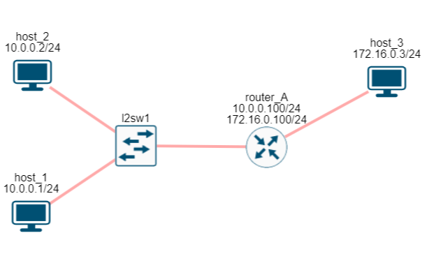

# 3. Сетевой уровень (глобальная сеть)

## Содержание

+ [3.1 Сетевой уровень](#31-сетевой-уровень)
+ [3.2 IP адреса](#32-ip-адреса)
+ [3.3 ARP](#33-arp)
+ [3.4 Отправка пакета в другой сегмент сети](#34-отправка-пакета-в-другой-сегмент-сети)
+ [3.5 IP сети](#35-ip-сети)
+ [3.6 Маршрутизация](#36-маршрутизация)
+ [3.7 IP протокол](#37-ip-протокол)
+ [3.8 NAT (Network Address Translation)](#38-nat-network-address-translation)
+ [3.9 Групповые адреса (Multicast)](#39-групповые-адреса-multicast)
+ [3.10 IPv6](#310-ipv6)

## 3.1 Сетевой уровень

Теперь вы можете понять, что такое Интернет - это множество различных сетей, объединенных между собой.

Технологии канального уровня позволяют нам создать сегмент сети и обмениваться в нем данными между хостами. Для идентификации хостов используются MAC адреса. Для объединения сегментов сетей используется сетевой уровень модели OSI.

Напомню, что сетевой уровень отвечает за доставку данных между хостами. При этом не важно, находятся эти хосты в одном сетевом сегменте, в соседних или между ними 10 000 км.

Если вы вдруг попытаетесь решить эту задачу на канальном уровне, то у вас возникнут большие проблемы. В частности, на какой адрес отправлять пакет? В Ethernet сетях MAC адрес размером в 6 байт (48 бит), а в других технологиях канального уровня он может быть меньше или больше.

Поэтому, для решения проблемы объединения сетей необходимо подняться выше канального уровня, т.е. на сетевой.

Сетевой уровень - это первый полностью программный уровень в модели OSI. Другими словами, он полностью не зависит от оборудования. Один и тот же сетевой уровень может успешно работать на проводном Ethernet, на Wi-FI, в 3G сетях и так далее.

---
[Содержание](#содержание)

## 3.2 IP адреса

В глобальной сети Интернет на сетевом уровне работает протокол IP (Internet Protocol), который описан в RFC 791. А для адресации хостов используются IP адреса.

IP адрес представляет собой поле в 4 байта (32 бита) и обычно записывается как 4 десятичных числа разделенных точкой. Например:

+ 192.168.1.1
+ 172.2.5.66
+ 12.153.45.3
+ и так далее.

Каждое число соответствует 8 битам поля адреса, как показано на рисунке 39.

Поэтому, ни одно число в IP адресе не может быть более 255.

Если ваш компьютер  или ноутбук подключен к сети, то вы можете посмотреть ваш IP адрес. В ОС Windows  в командной  строке выполните команду ipconfig или ipconfig /all. В появившемся результате найдите свое сетевое подключение (у меня это Беспроводная сеть) и найдите строку “IPv4 адрес”. У меня это 192.168.0.107, как показано на рисунке 40.

Если у вас MacOS или Linux, в консоли выполните команду ifconfig. На рисунке 41 представлен вывод команды ifconfig под MacOS. К сожалению, поиск нужного интерфейса может занять время, у меня он называется en0. А сам IP адрес указан в поле inet.

IP адрес - это уникальный глобальный идентификатор в рамках всей сети Интернет. Когда ваш хост хочет отправить пакет для какого-нибудь хоста, он отправляет его определенный IP адрес.

Давайте разберем на примере, как это происходит. Сделаем небольшую сеть, как показано на рисунке 42, из 2-х хостов и 1 свитча. И назначим IP адреса:

+ хост 1 - 10.0.0.1
+ хост 2 - 10.0.0.2

[Подробнее](https://miminet.ru/web_network?guid=d9012b77-fd52-48b0-b618-a3c3f55caf15)

Для отправки IP пакета воспользуемся утилитой ping. Эта утилита отправляет на указанный IP адрес специальный ICMP запрос, получив который хост должен отправить ICMP ответ. Если мы попробуем отправить пакет от хоста 1 на хост 2, то у хоста 1 возникнут проблемы с MAC адресом получателя.

На сетевом уровне протоколом IP будет установлен:

+ IP адрес отправителя (это наш IP адрес, мы его знаем)
+ IP адрес получателя, его мы указали аргументом для команды ping - это 10.0.0.2.

Далее пакет спускается на канальный уровень, где необходимо заполнить MAC адреса:

+ MAC адрес отправителя мы знаем - это наш MAC
+ А вот какой ставить MAC адрес получателя?

Мы не можем оставить это поле пустым, иначе, как хост поймет, что на канальном уровне пакет пришел для него, а не для кого-то другого. Необходимо решить задачу сопоставления MAC адреса по IP адресу.

---
[Содержание](#содержание)

## 3.3 ARP

Протокол ARP решает задачу сопоставления MAC адреса по IP адресу. ARP (Address Resolution Protocol) описан в [RFC 826](https://datatracker.ietf.org/doc/html/rfc826), в его задачу входит разрешение (т.е. узнать) MAC адрес по определенному IP адресу.

В иерархии протоколов, ARP протокол инкапсулируется в Ethernet. Сам ARP работает в формате запрос-ответ, как изображено на рисунке 44. В ARP-запросе указывается искомый IP адрес, чей MAC адрес требуется найти. В ARP-ответе должен прийти искомый MAC адрес.

ARP имеет следующий формат (рис. 45). Из множества полей наибольший интерес представляет:

+ **Sender hardware address (SHA)** - MAC адрес отправителя.
+ **SPA** - IP адрес отправителя
+ **THA** - MAC адрес назначения
+ **TPA** - IP адрес назначения

В нашем [примере](https://miminet.ru/web_network?guid=d9012b77-fd52-48b0-b618-a3c3f55caf15):

+ поле SHA будет установлено в 00:00:00:00:00:01
+ поле SPA - 10.0.0.1
+ поле THA - 00:00:00:00:00:00 (т.е. пустое, так как именно MAC адрес мы и не знаем)
+ поле TPA - 10.0.0.2

Так как хост отправителя не знает какому MAC адресу нужно отправить запрос, то на канальном уровне ARP-запрос имеет широковещательный адрес, т.е. в поле MAC адрес назначения устанавливается FF:FF:FF:FF:FF:FF. Таким образом, ARP-запрос обрабатывается всеми хостами, которые его получат.

Получив ARP-запрос хост сравнивает IP адрес назначения (TPA) со своим. Если у него нет такого IP адреса, то запрос игнорируется. Если у хоста оказался IP адрес назначения, он отправляет ARP-ответ, в котором указывает свой MAC адрес. В нашем примере ARP ответ будет выглядеть вот так:

+ поле SHA будет установлено в 00:00:00:00:00:02
+ поле SPA - 10.0.0.2
+ поле THA - 00:00:00:00:00:01
+ поле TPA - 10.0.0.1

Обратите внимание, что поля источника содержат информацию об отправителе. Если это ARP запрос, то в полях SHA и SPA будет отправитель ARP-запроса (00:00:00:00:00:01 и 10.0.0.1 соответственно). А если это ARP-ответ, то в полях SHA и SPA будет информация об отправителе ARP-ответа (00:00:00:00:00:02 и 10.0.0.2 соответственно).

Так как в ARP-запросе есть информация про MAC адрес отправителя, ARP-ответ уже не широковещательный, а отправляется на конкретный MAC адрес.

Запустим сеть по [адресу](https://miminet.ru/web_network?guid=d9012b77-fd52-48b0-b618-a3c3f55caf15) и посмотрим за ее работой.

Первым делом мы видим, что хост 1 отправляет ARP-запрос (ARP-request), после получает ARP-ответ (ARP-response) и только потом уже отправляет ICMP пакеты.

[Пример](https://miminet.ru/web_network?guid=d9012b77-fd52-48b0-b618-a3c3f55caf15)

Таким образом ARP решает проблему связки сетевого и канального уровня. Вы, может, обратили внимание, что мы не изобразили место ARP в модели ISO/OSI. Это все потому, что непонятно, к какому уровню его отнести. С одной стороны он работает с IP адресами, т.е. знает про сетевой уровень. С другой стороны он работает с MAC адресами. Чтобы не вести бесконечные споры, ARP протокол по модели ISO/OSI называют протокол уровня 2,5.

### ARP кэш

Отправлять ARP-запросы каждый раз, когда хост хочет отправить пакет в сеть не эффективно. Поэтому, у хостов есть специальная область памяти, куда они сохраняют ARP-ответы. Эта область памяти называется ARP кэш.

ARP кэш представляет собой таблицу из 3-х колонок, как на рисунке 47:

+ IP адрес
+ MAC адрес
+ Тип записи

Вы можете посмотреть свой ARP-кэш при помощи команды `arp -a`. Она одинаково работает под Windows, Linux и MacOS.

*В современных дистрибутивах ОС Linux утилита arp может отсутствовать и рекомендуется использовать ip neighbour.*

Каждому IP адресу соответствует определенный MAC адрес. Как только хост через ARP протокол определил MAC адрес другого хоста, он заносит эту информацию к себе в ARP-кэш. Таким образом, при отправке последующих пакетов он сможет их отправлять сразу, без предварительного разрешения MAC адреса.

Третье поле в ARP-кэше, тип записи, бывает двух типов:

+ динамический
+ статический

Динамический тип означает, что запись была добавлена через работу ARP протокола и она должна быть удалена через определенное время. У каждой ОС есть свои временные промежутки, через которые запись в ARP-кэше динамическим типом будет удалена. Например, у ОС Windows это 30-45 секунд, при условии, что хост не будет пользоваться конкретной записью из ARP-кэша [(подробнее)](https://learn.microsoft.com/en-us/troubleshoot/windows-server/networking/address-resolution-protocol-arp-caching-behavior).

Статический тип означает, что запись была добавлена не через ARP протокол и должна быть в ARP-кэше до выключения ОС.

Каждый раз, когда ОС отправляет пакет в сеть, для правильного заполнения поля MAC адрес назначения, она:

1. Ищет нужный IP-адрес в ARP-кэш
2. Если нужного IP-адреса нет в ARP-кэш, отправляет ARP-запрос

Для примера создайте в miminet сеть как на рисунке 48:

+ 2 хоста соединим друг с другом
+ на хосте 1 установим IP адрес в 192.168.1.1 и маску в 24
+ на хосте 2 установим IP адрес в 192.168.1.2 и маску в 24
+ на хосте 1 выполните команду ping (1 пакет) и в качестве IP адреса назначения укажите 192.168.1.2
+ запустите эмуляцию
+ когда эмуляция закончится, запустите анимацию и посмотрите на пакеты. Первым делом вы увидите ARP-запрос и ARP-ответ, чтобы хост 1 мог узнать MAC адрес назначения.

[Подробнее](https://miminet.ru/web_network?guid=519a0153-a32a-4fb0-858e-b21d6ba3cca1)

А теперь:

+ добавьте на хосте 1 команду “Добавить запись в ARP-кэш”, как указано на рисунке 48а. В качестве IP адреса укажите 192.168.1.2, а MAC адрес поставьте 00:11:22:33:44:55 (или любой другой, только не FF:FF:FF:FF:FF:FF, так как это широковещательный адрес и не 00:00:00:00:00:02, так как адрес хоста 2).
+ запустите эмуляцию
+ запустите анимацию и посмотрите, больше нет никаких ARP-запросов. Вместо этого хост 1 сразу отправляет ICMP пакет, так как MAC адрес для IP адреса 192.168.1.2 уже есть в ARP-кэш. Но, так как MAC адрес неверный, то хост 2 получив такой пакет отбрасывает его и никакого ICMP-ответа не генерируется, как это было до этого.

[Подробнее](https://miminet.ru/web_network?guid=1260c13a-0c6e-4859-9800-919ce1be576f)

### Беспричинный ARP-запрос

Когда ОС назначает себе IP адрес, она хочет убедиться, что такого же IP адреса нет в ее сети. Ведь IP адреса должны быть уникальными. Для этого она отправляет ARP-запрос в сеть, в котором указывает в качестве IP адреса назначения свой IP адрес.

Если в сети уже есть хост с таким же IP адресом, то наш хост получит ARP-ответ. Таким образом он поймет, что в сети уже существует хост с таким IP и назначать его себе нельзя. Если у вас Windows, то вы увидите подобное сообщение, как на рисунке 49.

[Подробнее](https://windows-school.ru/blog/obnaruzhila_konflikt_ip_adresov/2021-12-14-826)

### Часто задаваемые вопросы по ARP

**Вопрос 1:** Что будет, если на ARP-запрос никто не ответит?

**Ответ:** Отправив ARP-запрос, хост ожидает некоторый таймаут (примерно 1-3 секунды). Если за время таймаута хост не получил ARP-ответ, то он снова отправляет ARP-запрос. И так он делает 3 раза. После 3-й попытки хост сообщает протоколам более верхнего уровня о невозможности отправить пакет в сеть.

**Вопрос 2:** Что будет, если хост получит 2 ARP-ответа сразу?

**Ответ:** Обычно такое поведение зависит от реализации ARP-протокола. Некоторые ОС принимают только первый ARP-ответ, другие ОС могут принять ARP-ответ второй и даже в случае, когда хост не отправлял ARP-запрос.

**Вопрос 3:** Если находясь в сети мой хост будет отправлять ARP-ответы в ответ на беспричинный ARP-запрос, тогда никто больше кроме меня не сможет назначить себе IP адрес?

**Ответ:** Да, такое поведение сложно отследить и администраторы очень не любят таких людей.

**Вопрос 4:** Если мой хост подделает ARP-ответ на ARP-запрос другого хоста и мой ARP-ответ придет первым на хост отправителя, это означает, что пакет, который предназначается для другого хоста придет ко мне?

**Ответ:** Да, это называется атака ARP-spoofing.

---
[Содержание](#содержание)

## 3.4 Отправка пакета в другой сегмент сети

А теперь давайте рассмотрим ситуацию, как показано на рисунке 50. У нас есть сеть из 3-х хостов, два из которых находятся в одном сегменте сети, а третий хост в другом. Оба сегмента сети соединяет роутер.

[Подробнее](https://miminet.ru/web_network?guid=8682ffde-135e-4e16-acd5-030d24dc4d59)

*Примечание: маршрутизатор и роутер (router) - это синонимы для одного устройства.*

Если хост 1 c IP адресом 10.0.0.1 захочет отправить пакет хосту 2 с IP адресом 10.0.0.2, то:

+ хост 1 проверит, есть ли хост 2 в ARP-кэше
+ если нет, то отправит в сеть ARP-запрос
+ дождется ARP-ответ от хоста 2
+ отправит желаемый пакет хосту 2

Это мы уже знаем. А еще мы говорили, что сетевой уровень и IP протокол в частности должен уметь доставлять пакеты от одного хоста к другому, даже если хост назначения находится в другой сети. Если хост 1 захочет отправить пакет хосту 3 с IP адресом 172.16.0.3, что он должен сделать?

Глядя на схему не сложно догадаться, что хост 1 должен отправить пакет на роутер А, а тот в свою очередь отправит пакет на хост 3. Но хост 1 не видит этой схемы, у него нет информации о топологии сети и настройках всех хостов. Как он должен догадаться, что в этом случае он должен отправлять пакет на роутер А?

Для решения этой проблемы давайте заведем на хостах еще одну таблицу и назовем ее “Таблица маршрутизации”. Эта таблица будет состоять из 2-х полей:

+ IP адрес назначения
+ IP адрес маршрутизатора

Если IP адрес назначения находится в нашем сегменте сети, то в качестве IP адреса маршрутизатора будем выступать мы сами. А если IP адрес назначения будет находиться в другой сети, то IP адрес маршрутизатора будет IP адрес роутера.

Обновим нашу схему, как показано на рисунке 51. Добавим 2 IP адреса для роутера А. Один для связи с одним сегментом сети, второй для связи со вторым сегментом сети. Т.е. IP 10.0.0.100 для связи с хостом 1 и хостом 2, а 172.16.0.100 для связи с хостом 3.

[Подробнее](https://miminet.ru/web_network?guid=f536f79f-e533-4905-abcc-1846a8a407fb)

Тогда таблица маршрутизации для хоста 1 будет выглядеть как на таблице 7.

*Таб. 7. Таблица маршрутизации для хоста 1.*

IP адрес назначения | IP адрес маршрутизатора
-- | --
10.0.0.2 | 10.0.0.1
172.16.0.3 | 10.0.0.100
10.0.0.100 | 10.0.0.1

Каждый раз, когда хост 1 будет отправлять пакет, он будет заглядывать в таблицу маршрутизации.

Если хост 1 захочет отправить пакет хосту 2 (чей IP 10.0.0.2), то:

+ хост 1 ищет в таблице маршрутизации IP адрес 10.0.0.2. Этому адресу соответствует IP адрес маршрутизатора 10.0.0.1
+ так как IP адрес маршрутизатора совпадает с IP адресом самого хоста, значит он сам знает как доставить пакет по адресу 10.0.0.2 и передает этот пакет на канальный уровень
+ а дальше мы уже знаем: смотрим ARP-кэш, ARP-запрос, ARP-ответ и отправка пакета.

А если хост 1 хочет отправить пакет на хост 3 (IP-адрес назначения172.16.0.3), то:

+ хост 1 ищет в таблице маршрутизации IP адрес 172.16.0.3. Этому адресу соответствует IP адрес маршрутизатора 10.0.0.100
+ IP адрес маршрутизатора не совпадает с IP адресом хоста, значит, нужно отправить пакет на маршрутизатор (IP-адрес 10.0.0.100) и пусть он дальше доставляет пакет.
+ передаем пакет на канальный уровень с указанием, что MAC адрес назначения будет MAC адрес хоста с IP адресом 10.0.0.100 (это маршрутизатор). Очень важный момент, хоть IP адрес назначения в данном случае 172.16.0.3, но на канальном уровне мы доставляем пакет на маршрутизатор, как показано на рисунке 52.

+ и теперь начинается знакомый нам процесс, хост 1 смотрит в ARP-кэш в поисках MAC адреса для IP 10.0.0.100 (router_A).
+ если его там нет, то отправляет ARP-запрос, после получения ARP-ответа отправляет пакет в сеть
+ маршрутизатор А получив пакет смотрит уже в свою таблицу маршрутизации и так же, как и хост 1 пытается понять куда дальше отправлять пакет.

Таким образом, используя таблицу маршрутизации хост может понять, как отправлять пакет - самому или на маршрутизатор.

Важно запомнить, что таблица маршрутизации находится на каждом хосте, который подключен к сети Интернет. А не только на маршрутизаторе. Без таблицы маршрутизации хост не поймет, когда он может сам доставить пакет, а когда нужно передать его на маршрутизатор.

---
[Содержание](#содержание)

## 3.5 IP сети

Давайте добавим в наш пример еще несколько хостов, как на рисунке 53.

[Подробнее](https://miminet.ru/web_network?guid=7714de3c-1b74-4e3e-a33e-665662d71713)

Получается, что для такой сети таблица маршрутизации на хосте 1 должна стать как в таблице 8.

*Таб. 8. Таблица маршрутизации для хоста 1.*

IP адрес назначения | IP адрес маршрутизатора
-- | --
10.0.0.2 | 10.0.0.1
10.0.0.5 | 10.0.0.1
10.0.0.100 | 10.0.0.1
172.16.0.3 | 10.0.0.100
172.16.0.4 | 10.0.0.100

Т.е. мы добавили в сеть два хоста и теперь хост 1 должен о них как-то узнать и добавить их в свою таблицу маршрутизации. А если мы добавим еще 100 хостов, что тогда? Владельцы всех хостов должны как-то обмениваться информацией о том, кто и куда подключен и своим IP адресом?!

Описанный выше способ доставки пакетов из одной сети в другую хоть и рабочий, но не эффективный. Большую сеть так не построить. Для решения этой проблемы предлагается ввести понятие IP сеть. IP сеть - это множество IP адресов. Очень важно обратить внимание, что множество IP адресов, а не хостов.

### Классовая адресация сетей

Исторически, весь диапазон IP адресов (т.е все 4 байта) разбили на 5 классов сетей (A, B, C, D, E). Это означало, что одна часть IP адреса теперь указывает на класс сети, а остальная часть идентифицирует хост.

**Сети класса А** лежат в диапазоне от 0.0.0.0 до 127.255.255.255. Для идентификатора сети используется 1 байт, а остальные 3 байта для идентификации хоста (см. рисунок 54).

В одной сети класса А может находиться до 16 777 215 (256 \* 256 \* 256) хостов. Правда, таких сетей не много, всего 128. Вот пример некоторых сетей класса А:

+ 8.0.0.0    - 8.255.255.255
+ 10.0.0.0 - 10.255.255.255
+ 104.0.0.0 - 104.255.255.255

**Сети класса B** лежат в диапазоне от 128.0.0.0 до 191.255.255.255. Для идентификатора сети используется первые два байта, а остальные 2 байта для идентификации хоста (см. рисунок 55).

В одной сети класса B может находиться до 65 535 (256 * 256) хостов. Вот пример некоторых сетей класса B:

+ 169.254.0.0 - 169.254.255.255
+ 172.16.0.0 - 172.16.255.255
+ 190.56.0.0 - 190.56.255.255

**Сети класса C** лежат в диапазоне от 192.0.0.0 до 223.255.255.255. Для идентификатора сети используется первые 3 байта, а оставшийся байт для идентификации хоста (см. рисунок 56).

В одной сети класса C может находиться всего 255 хостов. Вот пример некоторых сетей класса С:

+ 192.168.1.0 - 192.168.1.255
+ 204.16.6.0 - 204.16.6.255
+ 220.215.65.0 - 220.215.65.255

**Сеть класса D** от 224.0.0.0 до 239.255.255.255. Класс D - это одна сеть и ее адреса используется для групповых адресов. Часто, IP адреса из этого класса назначают себе принтеры, сканеры, маршрутизаторы и другие устройства работающие по сети. Дальше по курсу мы подробно об этом поговорим. А пока просто запомним, что это групповые адреса.

**Сеть класса E** от 240.0.0.0 до 255.255.255.255. Класс E - это тоже одна сеть и ее адреса используется для служебных целей.

Благодаря классовой адресации любой хост теперь мог четко ответить на вопрос, IP адрес, на который я хочу отправить пакет находится в моей сети или нет?

Вернемся к нашей сети (она была на рисунке 53, но для удобства я ее повторил на рисунке 57).

---
[Содержание](#содержание)

## 3.6 Маршрутизация

---
[Содержание](#содержание)

## 3.7 IP протокол

---
[Содержание](#содержание)

## 3.8 NAT (Network Address Translation)

---
[Содержание](#содержание)

## 3.9 Групповые адреса (Multicast)

---
[Содержание](#содержание)

## 3.10 IPv6

---
[Содержание](#содержание)
