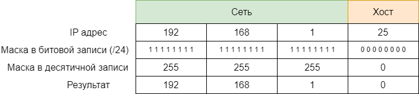
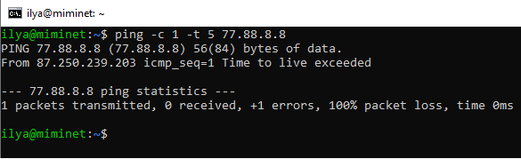

# 3. Сетевой уровень (глобальная сеть)

## Содержание

+ [3.1 Сетевой уровень](#31-сетевой-уровень)
+ [3.2 IP адреса](#32-ip-адреса)
+ [3.3 ARP](#33-arp)
+ [3.4 Отправка пакета в другой сегмент сети](#34-отправка-пакета-в-другой-сегмент-сети)
+ [3.5 IP сети](#35-ip-сети)
+ [3.6 Маршрутизация](#36-маршрутизация)
+ [3.7 IP протокол](#37-ip-протокол)
+ [3.8 NAT (Network Address Translation)](#38-nat-network-address-translation)
+ [3.9 Групповые адреса (Multicast)](#39-групповые-адреса-multicast)
+ [3.10 IPv6](#310-ipv6)

## 3.1 Сетевой уровень

Теперь вы можете понять, что такое Интернет - это множество различных сетей, объединенных между собой.

Технологии канального уровня позволяют нам создать сегмент сети и обмениваться в нем данными между хостами. Для идентификации хостов используются MAC адреса. Для объединения сегментов сетей используется сетевой уровень модели OSI.

Напомню, что сетевой уровень отвечает за доставку данных между хостами. При этом не важно, находятся эти хосты в одном сетевом сегменте, в соседних или между ними 10 000 км.

Если вы вдруг попытаетесь решить эту задачу на канальном уровне, то у вас возникнут большие проблемы. В частности, на какой адрес отправлять пакет? В Ethernet сетях MAC адрес размером в 6 байт (48 бит), а в других технологиях канального уровня он может быть меньше или больше.

Поэтому, для решения проблемы объединения сетей необходимо подняться выше канального уровня, т.е. на сетевой.

Сетевой уровень - это первый полностью программный уровень в модели OSI. Другими словами, он полностью не зависит от оборудования. Один и тот же сетевой уровень может успешно работать на проводном Ethernet, на Wi-FI, в 3G сетях и так далее.

---
[Содержание](#содержание)

## 3.2 IP адреса

В глобальной сети Интернет на сетевом уровне работает протокол IP (Internet Protocol), который описан в RFC 791. А для адресации хостов используются IP адреса.

IP адрес представляет собой поле в 4 байта (32 бита) и обычно записывается как 4 десятичных числа разделенных точкой. Например:

+ 192.168.1.1
+ 172.2.5.66
+ 12.153.45.3
+ и так далее.

Каждое число соответствует 8 битам поля адреса, как показано на рисунке 39.

Поэтому, ни одно число в IP адресе не может быть более 255.

Если ваш компьютер  или ноутбук подключен к сети, то вы можете посмотреть ваш IP адрес. В ОС Windows  в командной  строке выполните команду ipconfig или ipconfig /all. В появившемся результате найдите свое сетевое подключение (у меня это Беспроводная сеть) и найдите строку “IPv4 адрес”. У меня это 192.168.0.107, как показано на рисунке 40.

Если у вас MacOS или Linux, в консоли выполните команду ifconfig. На рисунке 41 представлен вывод команды ifconfig под MacOS. К сожалению, поиск нужного интерфейса может занять время, у меня он называется en0. А сам IP адрес указан в поле inet.

IP адрес - это уникальный глобальный идентификатор в рамках всей сети Интернет. Когда ваш хост хочет отправить пакет для какого-нибудь хоста, он отправляет его определенный IP адрес.

Давайте разберем на примере, как это происходит. Сделаем небольшую сеть, как показано на рисунке 42, из 2-х хостов и 1 свитча. И назначим IP адреса:

+ хост 1 - 10.0.0.1
+ хост 2 - 10.0.0.2

[Подробнее](https://miminet.ru/web_network?guid=d9012b77-fd52-48b0-b618-a3c3f55caf15)

Для отправки IP пакета воспользуемся утилитой ping. Эта утилита отправляет на указанный IP адрес специальный ICMP запрос, получив который хост должен отправить ICMP ответ. Если мы попробуем отправить пакет от хоста 1 на хост 2, то у хоста 1 возникнут проблемы с MAC адресом получателя.

На сетевом уровне протоколом IP будет установлен:

+ IP адрес отправителя (это наш IP адрес, мы его знаем)
+ IP адрес получателя, его мы указали аргументом для команды ping - это 10.0.0.2.

Далее пакет спускается на канальный уровень, где необходимо заполнить MAC адреса:

+ MAC адрес отправителя мы знаем - это наш MAC
+ А вот какой ставить MAC адрес получателя?

Мы не можем оставить это поле пустым, иначе, как хост поймет, что на канальном уровне пакет пришел для него, а не для кого-то другого. Необходимо решить задачу сопоставления MAC адреса по IP адресу.

---
[Содержание](#содержание)

## 3.3 ARP

Протокол ARP решает задачу сопоставления MAC адреса по IP адресу. ARP (Address Resolution Protocol) описан в [RFC 826](https://datatracker.ietf.org/doc/html/rfc826), в его задачу входит разрешение (т.е. узнать) MAC адрес по определенному IP адресу.

В иерархии протоколов, ARP протокол инкапсулируется в Ethernet. Сам ARP работает в формате запрос-ответ, как изображено на рисунке 44. В ARP-запросе указывается искомый IP адрес, чей MAC адрес требуется найти. В ARP-ответе должен прийти искомый MAC адрес.

ARP имеет следующий формат (рис. 45). Из множества полей наибольший интерес представляет:

+ **Sender hardware address (SHA)** - MAC адрес отправителя.
+ **SPA** - IP адрес отправителя
+ **THA** - MAC адрес назначения
+ **TPA** - IP адрес назначения

В нашем [примере](https://miminet.ru/web_network?guid=d9012b77-fd52-48b0-b618-a3c3f55caf15):

+ поле SHA будет установлено в 00:00:00:00:00:01
+ поле SPA - 10.0.0.1
+ поле THA - 00:00:00:00:00:00 (т.е. пустое, так как именно MAC адрес мы и не знаем)
+ поле TPA - 10.0.0.2

Так как хост отправителя не знает какому MAC адресу нужно отправить запрос, то на канальном уровне ARP-запрос имеет широковещательный адрес, т.е. в поле MAC адрес назначения устанавливается FF:FF:FF:FF:FF:FF. Таким образом, ARP-запрос обрабатывается всеми хостами, которые его получат.

Получив ARP-запрос хост сравнивает IP адрес назначения (TPA) со своим. Если у него нет такого IP адреса, то запрос игнорируется. Если у хоста оказался IP адрес назначения, он отправляет ARP-ответ, в котором указывает свой MAC адрес. В нашем примере ARP ответ будет выглядеть вот так:

+ поле SHA будет установлено в 00:00:00:00:00:02
+ поле SPA - 10.0.0.2
+ поле THA - 00:00:00:00:00:01
+ поле TPA - 10.0.0.1

Обратите внимание, что поля источника содержат информацию об отправителе. Если это ARP запрос, то в полях SHA и SPA будет отправитель ARP-запроса (00:00:00:00:00:01 и 10.0.0.1 соответственно). А если это ARP-ответ, то в полях SHA и SPA будет информация об отправителе ARP-ответа (00:00:00:00:00:02 и 10.0.0.2 соответственно).

Так как в ARP-запросе есть информация про MAC адрес отправителя, ARP-ответ уже не широковещательный, а отправляется на конкретный MAC адрес.

Запустим сеть по [адресу](https://miminet.ru/web_network?guid=d9012b77-fd52-48b0-b618-a3c3f55caf15) и посмотрим за ее работой.

Первым делом мы видим, что хост 1 отправляет ARP-запрос (ARP-request), после получает ARP-ответ (ARP-response) и только потом уже отправляет ICMP пакеты.

[Пример](https://miminet.ru/web_network?guid=d9012b77-fd52-48b0-b618-a3c3f55caf15)

Таким образом ARP решает проблему связки сетевого и канального уровня. Вы, может, обратили внимание, что мы не изобразили место ARP в модели ISO/OSI. Это все потому, что непонятно, к какому уровню его отнести. С одной стороны он работает с IP адресами, т.е. знает про сетевой уровень. С другой стороны он работает с MAC адресами. Чтобы не вести бесконечные споры, ARP протокол по модели ISO/OSI называют протокол уровня 2,5.

### ARP кэш

Отправлять ARP-запросы каждый раз, когда хост хочет отправить пакет в сеть не эффективно. Поэтому, у хостов есть специальная область памяти, куда они сохраняют ARP-ответы. Эта область памяти называется ARP кэш.

ARP кэш представляет собой таблицу из 3-х колонок, как на рисунке 47:

+ IP адрес
+ MAC адрес
+ Тип записи

Вы можете посмотреть свой ARP-кэш при помощи команды `arp -a`. Она одинаково работает под Windows, Linux и MacOS.

*В современных дистрибутивах ОС Linux утилита arp может отсутствовать и рекомендуется использовать ip neighbour.*

Каждому IP адресу соответствует определенный MAC адрес. Как только хост через ARP протокол определил MAC адрес другого хоста, он заносит эту информацию к себе в ARP-кэш. Таким образом, при отправке последующих пакетов он сможет их отправлять сразу, без предварительного разрешения MAC адреса.

Третье поле в ARP-кэше, тип записи, бывает двух типов:

+ динамический
+ статический

Динамический тип означает, что запись была добавлена через работу ARP протокола и она должна быть удалена через определенное время. У каждой ОС есть свои временные промежутки, через которые запись в ARP-кэше динамическим типом будет удалена. Например, у ОС Windows это 30-45 секунд, при условии, что хост не будет пользоваться конкретной записью из ARP-кэша [(подробнее)](https://learn.microsoft.com/en-us/troubleshoot/windows-server/networking/address-resolution-protocol-arp-caching-behavior).

Статический тип означает, что запись была добавлена не через ARP протокол и должна быть в ARP-кэше до выключения ОС.

Каждый раз, когда ОС отправляет пакет в сеть, для правильного заполнения поля MAC адрес назначения, она:

1. Ищет нужный IP-адрес в ARP-кэш
2. Если нужного IP-адреса нет в ARP-кэш, отправляет ARP-запрос

Для примера создайте в miminet сеть как на рисунке 48:

+ 2 хоста соединим друг с другом
+ на хосте 1 установим IP адрес в 192.168.1.1 и маску в 24
+ на хосте 2 установим IP адрес в 192.168.1.2 и маску в 24
+ на хосте 1 выполните команду ping (1 пакет) и в качестве IP адреса назначения укажите 192.168.1.2
+ запустите эмуляцию
+ когда эмуляция закончится, запустите анимацию и посмотрите на пакеты. Первым делом вы увидите ARP-запрос и ARP-ответ, чтобы хост 1 мог узнать MAC адрес назначения.

[Подробнее](https://miminet.ru/web_network?guid=519a0153-a32a-4fb0-858e-b21d6ba3cca1)

А теперь:

+ добавьте на хосте 1 команду “Добавить запись в ARP-кэш”, как указано на рисунке 48а. В качестве IP адреса укажите 192.168.1.2, а MAC адрес поставьте 00:11:22:33:44:55 (или любой другой, только не FF:FF:FF:FF:FF:FF, так как это широковещательный адрес и не 00:00:00:00:00:02, так как адрес хоста 2).
+ запустите эмуляцию
+ запустите анимацию и посмотрите, больше нет никаких ARP-запросов. Вместо этого хост 1 сразу отправляет ICMP пакет, так как MAC адрес для IP адреса 192.168.1.2 уже есть в ARP-кэш. Но, так как MAC адрес неверный, то хост 2 получив такой пакет отбрасывает его и никакого ICMP-ответа не генерируется, как это было до этого.

[Подробнее](https://miminet.ru/web_network?guid=1260c13a-0c6e-4859-9800-919ce1be576f)

### Беспричинный ARP-запрос

Когда ОС назначает себе IP адрес, она хочет убедиться, что такого же IP адреса нет в ее сети. Ведь IP адреса должны быть уникальными. Для этого она отправляет ARP-запрос в сеть, в котором указывает в качестве IP адреса назначения свой IP адрес.

Если в сети уже есть хост с таким же IP адресом, то наш хост получит ARP-ответ. Таким образом он поймет, что в сети уже существует хост с таким IP и назначать его себе нельзя. Если у вас Windows, то вы увидите подобное сообщение, как на рисунке 49.

[Подробнее](https://windows-school.ru/blog/obnaruzhila_konflikt_ip_adresov/2021-12-14-826)

### Часто задаваемые вопросы по ARP

**Вопрос 1:** Что будет, если на ARP-запрос никто не ответит?

**Ответ:** Отправив ARP-запрос, хост ожидает некоторый таймаут (примерно 1-3 секунды). Если за время таймаута хост не получил ARP-ответ, то он снова отправляет ARP-запрос. И так он делает 3 раза. После 3-й попытки хост сообщает протоколам более верхнего уровня о невозможности отправить пакет в сеть.

**Вопрос 2:** Что будет, если хост получит 2 ARP-ответа сразу?

**Ответ:** Обычно такое поведение зависит от реализации ARP-протокола. Некоторые ОС принимают только первый ARP-ответ, другие ОС могут принять ARP-ответ второй и даже в случае, когда хост не отправлял ARP-запрос.

**Вопрос 3:** Если находясь в сети мой хост будет отправлять ARP-ответы в ответ на беспричинный ARP-запрос, тогда никто больше кроме меня не сможет назначить себе IP адрес?

**Ответ:** Да, такое поведение сложно отследить и администраторы очень не любят таких людей.

**Вопрос 4:** Если мой хост подделает ARP-ответ на ARP-запрос другого хоста и мой ARP-ответ придет первым на хост отправителя, это означает, что пакет, который предназначается для другого хоста придет ко мне?

**Ответ:** Да, это называется атака ARP-spoofing.

---
[Содержание](#содержание)

## 3.4 Отправка пакета в другой сегмент сети

А теперь давайте рассмотрим ситуацию, как показано на рисунке 50. У нас есть сеть из 3-х хостов, два из которых находятся в одном сегменте сети, а третий хост в другом. Оба сегмента сети соединяет роутер.

[Подробнее](https://miminet.ru/web_network?guid=8682ffde-135e-4e16-acd5-030d24dc4d59)

*Примечание: маршрутизатор и роутер (router) - это синонимы для одного устройства.*

Если хост 1 c IP адресом 10.0.0.1 захочет отправить пакет хосту 2 с IP адресом 10.0.0.2, то:

+ хост 1 проверит, есть ли хост 2 в ARP-кэше
+ если нет, то отправит в сеть ARP-запрос
+ дождется ARP-ответ от хоста 2
+ отправит желаемый пакет хосту 2

Это мы уже знаем. А еще мы говорили, что сетевой уровень и IP протокол в частности должен уметь доставлять пакеты от одного хоста к другому, даже если хост назначения находится в другой сети. Если хост 1 захочет отправить пакет хосту 3 с IP адресом 172.16.0.3, что он должен сделать?

Глядя на схему не сложно догадаться, что хост 1 должен отправить пакет на роутер А, а тот в свою очередь отправит пакет на хост 3. Но хост 1 не видит этой схемы, у него нет информации о топологии сети и настройках всех хостов. Как он должен догадаться, что в этом случае он должен отправлять пакет на роутер А?

Для решения этой проблемы давайте заведем на хостах еще одну таблицу и назовем ее “Таблица маршрутизации”. Эта таблица будет состоять из 2-х полей:

+ IP адрес назначения
+ IP адрес маршрутизатора

Если IP адрес назначения находится в нашем сегменте сети, то в качестве IP адреса маршрутизатора будем выступать мы сами. А если IP адрес назначения будет находиться в другой сети, то IP адрес маршрутизатора будет IP адрес роутера.

Обновим нашу схему, как показано на рисунке 51. Добавим 2 IP адреса для роутера А. Один для связи с одним сегментом сети, второй для связи со вторым сегментом сети. Т.е. IP 10.0.0.100 для связи с хостом 1 и хостом 2, а 172.16.0.100 для связи с хостом 3.

[Подробнее](https://miminet.ru/web_network?guid=f536f79f-e533-4905-abcc-1846a8a407fb)

Тогда таблица маршрутизации для хоста 1 будет выглядеть как на таблице 7.

*Таб. 7. Таблица маршрутизации для хоста 1.*

IP адрес назначения | IP адрес маршрутизатора
-- | --
10.0.0.2 | 10.0.0.1
172.16.0.3 | 10.0.0.100
10.0.0.100 | 10.0.0.1

Каждый раз, когда хост 1 будет отправлять пакет, он будет заглядывать в таблицу маршрутизации.

Если хост 1 захочет отправить пакет хосту 2 (чей IP 10.0.0.2), то:

+ хост 1 ищет в таблице маршрутизации IP адрес 10.0.0.2. Этому адресу соответствует IP адрес маршрутизатора 10.0.0.1
+ так как IP адрес маршрутизатора совпадает с IP адресом самого хоста, значит он сам знает как доставить пакет по адресу 10.0.0.2 и передает этот пакет на канальный уровень
+ а дальше мы уже знаем: смотрим ARP-кэш, ARP-запрос, ARP-ответ и отправка пакета.

А если хост 1 хочет отправить пакет на хост 3 (IP-адрес назначения172.16.0.3), то:

+ хост 1 ищет в таблице маршрутизации IP адрес 172.16.0.3. Этому адресу соответствует IP адрес маршрутизатора 10.0.0.100
+ IP адрес маршрутизатора не совпадает с IP адресом хоста, значит, нужно отправить пакет на маршрутизатор (IP-адрес 10.0.0.100) и пусть он дальше доставляет пакет.
+ передаем пакет на канальный уровень с указанием, что MAC адрес назначения будет MAC адрес хоста с IP адресом 10.0.0.100 (это маршрутизатор). Очень важный момент, хоть IP адрес назначения в данном случае 172.16.0.3, но на канальном уровне мы доставляем пакет на маршрутизатор, как показано на рисунке 52.

+ и теперь начинается знакомый нам процесс, хост 1 смотрит в ARP-кэш в поисках MAC адреса для IP 10.0.0.100 (router_A).
+ если его там нет, то отправляет ARP-запрос, после получения ARP-ответа отправляет пакет в сеть
+ маршрутизатор А получив пакет смотрит уже в свою таблицу маршрутизации и так же, как и хост 1 пытается понять куда дальше отправлять пакет.

Таким образом, используя таблицу маршрутизации хост может понять, как отправлять пакет - самому или на маршрутизатор.

Важно запомнить, что таблица маршрутизации находится на каждом хосте, который подключен к сети Интернет. А не только на маршрутизаторе. Без таблицы маршрутизации хост не поймет, когда он может сам доставить пакет, а когда нужно передать его на маршрутизатор.

---
[Содержание](#содержание)

## 3.5 IP сети

Давайте добавим в наш пример еще несколько хостов, как на рисунке 53.

[Подробнее](https://miminet.ru/web_network?guid=7714de3c-1b74-4e3e-a33e-665662d71713)

Получается, что для такой сети таблица маршрутизации на хосте 1 должна стать как в таблице 8.

*Таб. 8. Таблица маршрутизации для хоста 1.*

IP адрес назначения | IP адрес маршрутизатора
-- | --
10.0.0.2 | 10.0.0.1
10.0.0.5 | 10.0.0.1
10.0.0.100 | 10.0.0.1
172.16.0.3 | 10.0.0.100
172.16.0.4 | 10.0.0.100

Т.е. мы добавили в сеть два хоста и теперь хост 1 должен о них как-то узнать и добавить их в свою таблицу маршрутизации. А если мы добавим еще 100 хостов, что тогда? Владельцы всех хостов должны как-то обмениваться информацией о том, кто и куда подключен и своим IP адресом?!

Описанный выше способ доставки пакетов из одной сети в другую хоть и рабочий, но не эффективный. Большую сеть так не построить. Для решения этой проблемы предлагается ввести понятие IP сеть. IP сеть - это множество IP адресов. Очень важно обратить внимание, что множество IP адресов, а не хостов.

### Классовая адресация сетей

Исторически, весь диапазон IP адресов (т.е все 4 байта) разбили на 5 классов сетей (A, B, C, D, E). Это означало, что одна часть IP адреса теперь указывает на класс сети, а остальная часть идентифицирует хост.

**Сети класса А** лежат в диапазоне от 0.0.0.0 до 127.255.255.255. Для идентификатора сети используется 1 байт, а остальные 3 байта для идентификации хоста (см. рисунок 54).

В одной сети класса А может находиться до 16 777 215 (256 \* 256 \* 256) хостов. Правда, таких сетей не много, всего 128. Вот пример некоторых сетей класса А:

+ 8.0.0.0    - 8.255.255.255
+ 10.0.0.0 - 10.255.255.255
+ 104.0.0.0 - 104.255.255.255

**Сети класса B** лежат в диапазоне от 128.0.0.0 до 191.255.255.255. Для идентификатора сети используется первые два байта, а остальные 2 байта для идентификации хоста (см. рисунок 55).

В одной сети класса B может находиться до 65 535 (256 * 256) хостов. Вот пример некоторых сетей класса B:

+ 169.254.0.0 - 169.254.255.255
+ 172.16.0.0 - 172.16.255.255
+ 190.56.0.0 - 190.56.255.255

**Сети класса C** лежат в диапазоне от 192.0.0.0 до 223.255.255.255. Для идентификатора сети используется первые 3 байта, а оставшийся байт для идентификации хоста (см. рисунок 56).

В одной сети класса C может находиться всего 255 хостов. Вот пример некоторых сетей класса С:

+ 192.168.1.0 - 192.168.1.255
+ 204.16.6.0 - 204.16.6.255
+ 220.215.65.0 - 220.215.65.255

**Сеть класса D** от 224.0.0.0 до 239.255.255.255. Класс D - это одна сеть и ее адреса используется для групповых адресов. Часто, IP адреса из этого класса назначают себе принтеры, сканеры, маршрутизаторы и другие устройства работающие по сети. Дальше по курсу мы подробно об этом поговорим. А пока просто запомним, что это групповые адреса.

**Сеть класса E** от 240.0.0.0 до 255.255.255.255. Класс E - это тоже одна сеть и ее адреса используется для служебных целей.

Благодаря классовой адресации любой хост теперь мог четко ответить на вопрос, IP адрес, на который я хочу отправить пакет находится в моей сети или нет?

Вернемся к нашей сети (она была на рисунке 53, но для удобства я ее повторил на рисунке 57).

[Подробнее](https://miminet.ru/web_network?guid=7714de3c-1b74-4e3e-a33e-665662d71713)

Используя классовую адресацию наша таблица маршрутизации на хосте 1 будет выглядеть как в таблице 9.

IP адрес назначения | IP адрес маршрутизатора
-- | --
10.0.0.0 | 10.0.0.1
172.16.0.0 | 10.0.0.100

*Таб. 9. Таблица маршрутизации для хоста 1.*

Если адрес назначения находится в сети `10.0.0.0` (напомню, это класс A и адреса в этой сети лежат в диапазоне от `10.0.0.0` до `10.255.255.255`), то адрес маршрутизатора `10.0.0.1`, т.е. мы сами будем доставлять пакет на этот хост.

А если адрес назначения находится в сети `172.16.0.0` (это класс B и адреса для этой сети лежат в диапазоне от `172.16.0.0` до `172.16.255.255`), то адрес маршрутизатора `10.0.0.100`.

Таким образом, даже если завтра мы добавим 1000 новых хостов в обе сети, то для хоста 1 ничего менять не придется. Он так же успешно сможет доставлять пакеты как внутри своей IP сети, так и для сети `172.16.0.0`. И никаких новых записей в таблицу маршрутизации вводить не придется.

Проблема классовой адресации заключалась в ее негибкости. Если вам нужна сеть из 4000 IP адресов, что делать? Получать 16 сетей класса C или брать одну класса B? А если вам нужна сеть из 40 000 IP адресов? Хорошо, для 40 000 адресов возьмем одну сеть класса B. Как известно, сеть класса B содержит 65535 адресов, а нам нужно только 40 000. куда девать остальные 25 535, а это более 50% от того, что мы будем использовать?

Итог - классовая маршрутизация классная, решает возникшие проблемы, но не эффективная.

В профессиональном общении довольно часто можно услышать использование терминов из классовой адресации, что-то типа “Возьми себе сеть класса C и играйся там”. Теперь понятно, что под этим понимается.

### Бесклассовая адресация сетей

**Бесклассовая адресация**  (англ. Classless Inter-Domain Routing, англ. CIDR) - метод IP-адресации, позволяющий гибко управлять пространством IP-адресов. Бесклассовая адресация предлагает вместо жестко закрепленных правил адресации сети использовать маску подсети. Цель маски подсети сказать, какие биты в IP адресе указывают на идентификатор сети, а какие биты указывают на идентификатор хоста.

Для примера давайте рассмотрим уже знакомую нам IP сеть класса B `172.16.0.0`. В этой сети первые 2 байта IP адреса указывают на идентификатор сети, а следующие два байта указывают на идентификатор хоста.

А теперь давайте запишем точно такую же сеть в бесклассовой адресации. Помимо IP адреса нам понадобится еще маска подсети (маска, маска сети, маска подсети - это все одно и тоже). Адрес сети будет прежний, `172.16.0.0`, а маска подсети будет `255.255.0.0`.

Там, где бит у маски подсети установлен в 1, означает, что соответствующий бит в IP адресе указывает на идентификатор сети. А там, где бит у маски подсети  установлен в 0, означает, что соответствующий бит в IP адресе указывает на идентификатор хоста. Так как в нашей сети первые два байта (16 бит) указывают на идентификатор сети, то и первые 16 бит маски подсети должны быть установлены в 1. В десятичной записи 8 бит установленных в 1 дают число 255. Поэтому первые два байта нашей маски 255.255.

С идентификатором хоста делаем так же. В нашей сети для идентификации хоста выделены вторые 2 байта. Значит это место в маске мы заполняем 0.

Таким образом, сеть класса B `172.16.0.0` можно записать в бесклассовой адресации как `172.16.0.0`/`255.255.0.0`. Обычно маска подсети записывается через слеш (/) после IP адреса сети.

Как это работает?! Чтобы определить, попадает ли IP адрес в сеть `172.16.0.0` c маской `255.255.0.0` мы делаем следующее:

1. Берем IP адрес, например, `172.16.0.3`
2. Делаем операцию “побитовое И” с маской подсети
3. Полученный результат сравниваем с адресом сети
4. Если результат равен адресу сети, значит IP адрес принадлежит этой сети
5. Если нет, то и нет.

В нашем случае, IP адрес `172.16.0.3` принадлежит сети `172.16.0.0`/`255.255.0.0`, так как после применения маски подсети мы получили адрес сети `172.16.0.0`.

Если мы возьмем IP адрес `172.16.126.254` и тоже применим к нему маску `255.255.0.0`, то в результат получим `172.16.0.0`. Что будет указывать на то, что и этот IP адрес принадлежит сети `172.16.0.0`.

По сути, там где у маски подсети стоит бит в 1 означает, что соответствующий бит в IP адресе останется таким, каким и был. А там, где у маски подсети стоит бит 0 означает, что соответствующий бит в IP адресе обнулится. Был он 1 или 0, неважно, он станет 0.

А теперь давайте возьмем IP адрес `172.13.0.3` и применим маску `255.255.0.0`. В итоге получится `172.13.0.0`, что не равно `172.16.0.0`. Значит, IP адрес `172.13.0.3` не принадлежит сети `172.16.0.0`.

Таким образом, с помощью маски можно задавать IP сеть. Единственное ограничение, что количество IP-адресов в сети должно быть кратно степени 2: 2, 4, 8, 16 и так далее. Но на практике этого вполне достаточно.

### Способы записи IP сети

Обычно, маску подсети записывают через слеш от адреса сети. Например, `10.0.0.0`/`255.0.0.0` или `172.16.0.0`/`255.255.0.0`.

Когда только предложили использовать маску подсети для обозначения IP сети, то она могла быть любой. Даже вот такой `255.255.0.255`. Особенность такой маски в том, что она позволяет задать множество IP адресов с так называемыми дырками. Для примера, возьмем вот такую сеть `192.168.0.2`/`255.255.0.255`. В эту сеть будут входить следующие IP адреса:

+ 192.168.0.2
+ 192.168.1.2
+ 192.168.2.2
+ 192.168.3.2
+ …
+ 192.168.255.2

Хоть в теории это очень гибко, на практике сетевые администраторы использовали только маски, которые давали бы непрерывный диапазон. Например:

+ `192.168.2.0`/`255.255.255.0`
+ `169.254.143.128`/`255.255.255.128`.

Поэтому, со временем ввели правило, которое гласило, что маска подсети не может содержать подпоследовательность в битах 01. Т.е. уже не получится сделать маску `255.255.0.255`, так как после 0 последовали бы 1, а так делать нельзя.

А раз нельзя делать подпоследовательность 01, значит мы можем просто сказать количество единичных бит в маске и она будет однозначно понята всеми. Другими словами, маску `255.255.255.0` теперь можно записать как `24`, а маску `255.0.0.0` как 8. И получается, что сеть `192.168.1.0`/`255.255.255.0` теперь можно записать как `192.168.1.0/24`, а сеть `172.16.0.0`/`255.255.0.0` как `172.16.0.0/16`.

Теперь становится понятно, что означает `/24` на выше представленных примерах. На рисунке 60 хост 1 имеет IP `10.0.0.1` и маску `24` означает, что хост 1 имеет IP `10.0.0.1`, который принадлежит IP сети `10.0.0.0/24` (а это `10.0.0.0` - `10.0.0.255`)

[Подробнее](https://miminet.ru/web_network?guid=7714de3c-1b74-4e3e-a33e-665662d71713)

### Где посмотреть свой IP адрес и маску

Вы можете посмотреть ваш IP адрес на вашем же хосте. Если у вас Windows, в командной строке выполните команду `ipconfig` (или `ipconfig /all`) и в выводе команды найдите свое подключение. У меня это Беспроводная сеть, как на рисунке 61.

Мой IP адрес под Windows `192.168.0.107`/`255.255.255.0`.

А если у вас MacOS или Linux, выполните в консоле команду `ifconfig` и найдите в выводе свое подключение. У меня это `en0`, как показано на рисунке 62. Мой IP адрес `192.168.0.115`, а маска `255.255.255.0`. Обратите внимание, как MacOS пишет маску, в шестнадцатеричной системе.

### Широковещательный адрес в IP сети

В каждой IP сети есть два особых адреса, это самый первый и самый последний. Например, возьмем IP сеть `192.168.1.0/24`.

Самый первый адрес в этой сети это `192.168.1.0`, его называют адресом сети. Это тот самый адрес, который будет получаться, если взять любой адрес из этой сети и наложить на него маску (выполнить побитовое И). Например, возьмем `192.168.1.25/24`, как показано на рисунке 63, в результате мы получим `192.168.1.0`

Самый последний адрес в этой сети это `192.168.1.255`, он является широковещательным адресом для этой сети. Это означает, что все хосты в этой IP сети будут принимать и обрабатывать пакет, если такой IP адрес будет указан в качестве назначения. Другими словами, если хост хочет отправить пакет всем хостам в своей IP сети, он может отправить его на широковещательный адрес. Кстати говоря, самый последний адрес в сети это такой адрес, в котором биты отведенные под идентификацию хоста установлены в 1.
Устанавливать себе в качестве IP адреса широковещательный адрес сети не стоит. Может быть ОС и позволит вам это сделать, но тогда ваш хост не сможет ни с кем обмениваться данными. Протоколы реализуются таким образом, чтобы не генерировать ответы, если адрес отправителя широковещательный. Например, если вы отправите ARP или другой IP пакет в сеть, где IP адрес отправителя будет широковещательным, вам никто не ответит. Это такая защита от наводнения сети пакетами (flooding).

Давайте на минуту представим, если бы так происходило. Тогда, отправив на любой хост IP пакет с широковещательным IP адресом отправителя, этот хост должен будет ему ответить. Отвечать он будет на широковещательный адрес, т.е. на сетевом уровне будет стоять широковещательный адрес и на канальном уровне будет стоять широковещательный адрес (FF:FF:FF:FF:FF:FF). Такой пакет будет доставлен всем хостам в данной сети. Хотя очевидно, что никакого смысла в этом не будет.

А вот устанавливать себе адрес сети (первый адрес) можно. Хотя в сложившейся сетевой практике так не поступают.

[Подробнее](https://miminet.ru/web_network?guid=076f1ae4-1a6d-42fd-b8f5-9c09cdc4f930)

Для примера сделаем сеть из 3-х хостов и возьмем `IP сеть 192.168.1.0/24` как показано на рисунке 64:

+ Хосту 1 назначим первый IP адрес, т.е. адрес сети, `192.168.1.0/24`
+ Хосту 2 назначим обычный IP адрес, пусть это будет `192.168.1.50/24`
+ А хосту 3 назначим широковещательный IP адрес для этой сети, т.е. `192.168.1.255/24`

А теперь на хосте 1 выполним поочередно две команды:

1. Команду `ping` на широковещательный адрес - `ping -c 1 -b 192.168.1.255`. Команда ping отправляет специальный ICMP-запрос, получив который, хост должен отправить ICMP-ответ. Мы добавим в команду ping опцию -c 1 (отправить только 1 пакет) и -b (разрешить отправку на широковещательный адрес).
2. Команду ping на IP адрес 192.168.1.50, т.е. на хост 2.

Первым делом мы видим ICMP-запрос на широковещательный адрес. Оба хоста (2 и 3) получают этот пакет. На широковещательный запрос ICMP-ответ не отправляется. Однако, мы видим, что хост 3 пытается отправить ICMP-ответ, так как он интерпретирует этот адрес не как широковещательный, а как свой. Это проявляется в отправке ARP-запросов. На эти ARP-запросы никто не отвечает. Это связано с тем, что IP адрес отправителя широковещательный. Как мы говорили, на такие пакеты хосты не отвечают.

После этого мы видим, как хост 1 отправляет ARP-запрос, а после получения ARP-ответа от хоста 2, обменивается с ним ICMP-запросом и ICMP-ответом.

Итого, как я и сказал. Первый адрес сети является нормальным адресом и может быть использован в сети. Хотя, сложившаяся сетевая практика такова, что этот адрес стараются не использовать, для удобства администрирования. А вот последний адрес сети является широковещательным и его не нужно использовать в качестве адреса хоста.

### Специальная маска /32

Маска делит IP адрес на две части, одна часть - идентификатор сети, вторая часть - идентификатор хоста. Например, 192.168.1.0/24:

первые три байта: `192.168.1` - идентификатор сети
последний байт - идентификатор хоста
А если мы запишем `192.168.1.25/32` - получается, что все 4 байта это адрес сети?

Маска `/32` означает конкретный IP адрес.

### Бесполезная маска /31

Еще есть бесполезная маска `/31`. Как правило, она не встречается. Маска `/31` говорит, что для адресации хоста мы выделяем только последний бит. Для примера рассмотрим сеть `172.16.12.0/31`, как на рисунке 65.

Получается, что в этой сети всего два IP адреса:

+ 172.16.12.0
+ 172.16.12.1

Первый желательно не использовать, а второй широковещательный. Даже если мы будем использовать первый адрес (адрес сети), то второй все равно широковещательный. Получается IP сеть из 1 рабочего хоста. Смысла в этом никакого.

**Однако!**

>Маска сети `/31` — это особый тип подсети, который **используется исключительно для соединения "точка-точка" (point-to-point) между двумя устройствами**.
>
>+ **Обычные подсети** (например, `/30`) резервируют адреса под сеть и широковещательный адрес, но `/31` позволяет использовать оба адреса для устройств.
>+ **Маска:** `255.255.255.254` (31 бит фиксирован, последний бит — переменный).
>+ **[RFC 3021](https://datatracker.ietf.org/doc/html/rfc3021)** официально разрешает использование `/31` для `point-to-point` линков.
>
>В обычной сети (например, /30):
>
>+ **Доступные адреса:** 2 (один для первого устройства, второй для второго, сеть и бродкаст "съедают" два адреса).
>
>В /31:
>
>+ **Нет сети и широковещательного адреса** — оба адреса используются для устройств.
>+ Пример:
>
>   + Подсеть `192.168.1.0/31` включает:
>     + `192.168.1.0` — первый роутер.
>     + `192.168.1.1` — второй роутер.
>
>   + Нет `192.168.1.2` (это уже другая сеть).

### Обратная петля (Loopback)

Из всех IP сетей можно выделить особенную IP сеть под названием обратная петля (Loopback). Обратная петля, это IP сеть `127.0.0.0/8` для локального использования на каждом отдельном хосте. Каждый хост в сети Интернет создает себе специальный виртуальный сетевой интерфейс и назначает ему не просто IP адрес `127.0.0.1` с маской `255.0.0.0`, а целую сеть `127.0.0.0/8`

Все, что будет отправлено на обратную петлю вернется обратно, как показано на рисунке 66.

Обычно этот интерфейс используется для локальной разработки сетевых приложений. Представьте, у вас нет подключения по сети, т.е. ваш сетевой интерфейс не подключен и у вашего хоста нет IP адреса. Или даже у вас нет сетевой карты. А вам нужно разрабатывать сетевое приложение, т.е. запустить сервер, клиент и отлаживать их взаимодействие. На какой IP адрес тогда обращаться для доступа к серверу и на какой IP сервер должен будет отвечать клиенту? Или на вашем хосте имеются уже рабочие приложения, которые обмениваются друг с другом данными используя сетевое подключение.

Чтобы все работало без привязки к тому, есть ли у вас сетевое подключение или нет, обычно используют сетевой интерфейс обратная петля.

Если у вас Linux или MacOS, то наберите в консоли `ifconfig` (рисунок 66).

Под Windows он тоже есть, но не выводится командой ipconfig. Чтобы убедиться в его наличии, в консоли запустите команду `ping 127.0.0.1`. Вы должны увидеть вывод как на рисунке 67.

Вы можете вместо `127.0.0.1` написать `127.123.127.54` или любой другой IP адрес из IP сети `127.0.0.0/8`. Все будет работать, как под ОС Windows, так и под ОС Linux.

Пакета с IP адресом отправителя или получателя из IP сети `127.0.0.0/8` в физической сети быть не может.

---
[Содержание](#содержание)

## 3.6 Маршрутизация

### Маршрут по умолчанию

Давайте вернемся к нашей сети из 5 хостов и двух сетей, как на рисунке 68.

[Подробнее](https://miminet.ru/web_network?guid=7714de3c-1b74-4e3e-a33e-665662d71713)

Раньше, используя классовую адресацию, наша таблица маршрутизации на хосте 1 выглядела как в таблице 10.

IP сеть назначения | IP адрес маршрутизатора
-- | --
10.0.0.0 | 10.0.0.1
172.16.0.0 | 10.0.0.100

*Таб. 10. Таблица маршрутизации для хоста 1 используя классовую адресацию.*

Но теперь мы знаем про бесклассовую адресацию и давайте перепишем таблицу маршрутизации для хоста 1. Выглядеть она будет как в таблице 11.

IP сеть назначения | IP адрес маршрутизатора
-- | --
10.0.0.0/24 | 10.0.0.1
172.16.0.0/24 | 10.0.0.100

*Таб. 11. Таблица маршрутизации для хоста 1 используя маску подсети.*

А теперь давайте добавим еще один сегмент сети и новую IP сеть, как на рисунке 69.

[Подробнее](https://miminet.ru/web_network?guid=6547afac-26fc-474e-8e4e-9446992ab96c)

Теперь, чтобы хост 1 смог отправить пакет на хост 4 (в сеть `192.168.1.0/24`) ему нужно добавить еще одну запись в свою таблицу маршрутизации.

IP сеть назначения | IP адрес маршрутизатора
-- | --
10.0.0.0/24 | 10.0.0.1
172.16.0.0/24 | 10.0.0.100
192.168.1.0/24 | 10.0.0.100

*Таб. 12. Таблица маршрутизации для хоста 1 используя маску подсети.*

Получается, что каждый раз при появлении новой IP сети мы (хост 1) должны будем добавлять ее в свою таблицу маршрутизации. Это не очень удобно, так как будет тормозить масштабирование сети. Каждый раз при появлении новой сети нам нужно будет добавлять ее к себе в таблицу маршрутизации.

Если эти новые IP сети будут появляться за маршрутизатором 1, то для нас это будет означать, что при добавлении нового маршрута в свою таблицу, в качестве IP адреса маршрутизатора, мы всегда будем ставить `10.0.0.100`

Раз так, может быть мы тогда для всех неизвестных нам IP сетей сразу поставим маршрутизатор `10.0.0.100`? Ведь какая разница, добавится там `192.168.1.0/24` или какая-нибудь еще IP сеть, все равно адрес маршрутизатора `10.0.0.100`.

Получается, нам нужно добавить в таблицу маршрутизации такую запись, которая бы означала “для всех остальных IP сетей кроме моей идти на маршрутизатор”. В нашем случае это “для всех остальных IP сетей кроме `10.0.0.0/24` идти на `10.0.0.100`”.

Инженеры решили этот вопрос вот так:

Запись  “для всех остальных IP сетей кроме моей идти на маршрутизатор” выглядит как `0.0.0.0/0`. Т.е. нулевая сеть с маской 0. Получается, что в эту сеть попадает абсолютно любой IP адрес. Для любого IP адреса применив маску 0 получим 0.0.0.0.
Введем порядок просмотра записи в таблице маршрутизации. Она просматривается от большей маски к меньшей. Т.е. первой будет просматриваться запись с маской 32, потом с 31, потом с 30 и так далее до 0.

Получается, что теперь таблица маршрутизации для хост 1 будет выглядеть вот как в таблице 13.

IP сеть назначения | IP адрес маршрутизатора
-- | --
10.0.0.0/24 | 10.0.0.1
0.0.0.0/0 | 10.0.0.100

*Таб. 13. Таблица маршрутизации с маршрутом по умолчанию для хоста 1 используя маску подсети.*

Если хост 1 будет отправлять пакет на хост 2 (`10.0.0.2`), то его IP адрес попадет в первую запись (`10.0.0.0/24`). Так как маска 24 больше 0, то сначала мы будем смотреть ее.  А если IP адрес назначения будет из других сетей, например `172.16.0.0/24`, `192.168.1.0/24` и так далее, то он не попадет под запись `10.0.0.0/24`, но будет попадать во вторую запись. Таким образом, для всех не наших сетей мы будем отправлять пакет на маршрутизатор.

Вот такая запись (`0.0.0.0/0`) и называется маршрутом по умолчанию, а IP-адрес маршрутизатора в этом случае называется "Маршрутизатор по умолчанию" или "Default gateway".

### Таблица маршрутизации

У каждого хоста, который подключен к глобальной сети Интернет, должна быть своя таблица маршрутизации. Именно благодаря таблице маршрутизации хост может принимать решения, когда он сам может доставлять пакеты по сети, а когда ему нужно отправить пакет на маршрутизатор.

Вы можете посмотреть свою таблицу маршрутизации. Если у вас ОС Windows, то в командной строке наберите “route print”. Результатом работы команды будет вывод вашей текущей таблицы маршрутизации, подобно тому, как на рисунке 70.

Так как у меня стоит много разных виртуальных интерфейсов, то таблица маршрутизации состоит из более чем 2-х записей. Но все они уже должны быть вам понятны.

Самая первая запись - сетевой адрес `0.0.0.0`, маска подсети `0.0.0.0` и адрес шлюза `192.168.0.1`. Это и есть маршрут по умолчанию. Но мы уже знаем, что хоть эта запись стоит и первой, просматривается она в последнюю очередь.

IP адрес моего сетевого интерфейса `192.168.0.107`. И в таблице на 5 строке можно увидеть запись - сетевой адрес `192.168.0.0`, маска подсети `255.255.255.0` и адрес шлюза `192.168.0.107` (т.е. я сам). Это маршрут до хостов в моей сети.

Метрика в таблице маршрутизации нужна для приоритета. Если в таблице будет два одинаковых маршрута, то метрика позволит выбрать более приоритетный. Чем ниже метрика, тем более приоритетный маршрут. Например, для отказоустойчивости вы хотите сделать два маршрута по умолчанию. Чтобы всегда работал только один, а второй начал работать только при неработоспособности первого, можно воспользоваться метрикой.

А если у вас Linux или MacOS, наберите в терминале `netstat -nr`. Вот так выглядит таблица маршрутизации у моего Linux сервера.

>В современных дистрибутивах ОС Linux утилита netstat может отсутствовать по умолчанию. Для просмотра таблицы маршрутизации  в таких дистрибутивах используйте команду ip route.

Как и в случае с Windows, на первом месте стоит маршрут по умолчанию - сеть назначения (Destination) `0.0.0.0` с маской (Genmask) `0.0.0.0` и маршрутизатором `10.129.0.1`.

На рисунке 71 можно еще увидеть вывод команды `ifconfig`. Как видно, IP адрес у моего Linux сервера `10.129.0.21` с маской `255.255.255.0`, и в таблице маршрутизации второй записью мы видим - сеть назначения `10.129.0.0` с маской `255.255.255.0` использовать маршрутизатор `0.0.0.0`. Как можно сделать вывод, если в таблице маршрутизации Linux в поле маршрутизатор (Gateway) стоит `0.0.0.0`, значит хост сам знает как общаться с этой сетью.

### Default-Free Zone (DFZ)

Маршрут по умолчанию очень удобная запись, но на самом деле она не совсем решает проблему, а лишь перекладывает ее. Рано или поздно должен появиться маршрутизатор, который знает маршруты до всех сетей.

Default-free Zone (DFZ) - это такой набор маршрутизаторов, которые вместе содержат все маршруты до всех сетей. Давайте построим сеть, как показано на рисунке 72.

[Подробнее](https://miminet.ru/web_network?guid=bcbdb588-21a0-4c28-b84f-f03edf06ae29)

Нам понадобится 2 хоста и 3 маршрутизатора:

1. Хост 1 и маршрутизатор 1 в IP сети 10.0.0.0/24
2. Маршрутизатор 1 и маршрутизатор 2 в IP сети 192.168.1.0/24
3. Маршрутизатор 2 и маршрутизатор 3 в IP сети 172.16.12.0/24
4. Ну и маршрутизатор 3 и хост 2 в IP сети 169.254.1.0/24

И пропишем маршруты по умолчанию:

+ хост 1 на маршрутизатор 1
+ маршрутизатор 1 на маршрутизатор 2
+ хост 2 на маршрутизатор 3
+ маршрутизатор 3 на маршрутизатор 2

Это пример сети, когда мы не можем обойтись только маршрутами по умолчанию.  Если мы на маршрутизаторе 2 сделаем маршрут по умолчанию на маршрутизатор 3, то пакет от хоста 1 до хоста 2 сможет дойти. Но вот обратно нет, так как маршрутизатор 2 ничего не знает про сеть 10.0.0.0/24, а маршрут по умолчанию указывает на маршрутизатор 3.

А если мы на маршрутизаторе 2 сделаем маршрут по умолчанию на маршрутизатор 1, то картина будет обратной. От хоста 2 до хоста 1 пакеты будут доходить, а вот обратно нет.

[Подробнее](https://miminet.ru/web_network?guid=8de49b2d-563c-4519-9119-41be6939dd7b)

Чтобы такая сеть работала нам нужно:

1. либо на маршрутизаторе 2 добавить в таблицу маршрутизации информацию про обе IP сети: 10.0.0.0/24 и 169.254.1.0/24 (как и сделано на рисунке 72а)
2. либо на маршрутизаторе 2 добавить в таблицу маршрутизации маршрут по умолчанию и информацию про одну из двух IP сетей. Например, в качестве маршрута по умолчанию выбрать маршрутизатор 1 и добавить информацию про IP сеть 169.254.1.0/24.

В первом случае в DFZ будет только маршрутизатор 2, так как он сам будет знать про все маршруты. А его таблица маршрутизации будет как в таблице 14.

IP сеть назначения | IP адрес маршрутизатора
-- | --
192.168.1.0/24 | 192.168.1.102 (сам маршрутизатор 2)
172.16.12.0/24 | 172.16.12.102  (сам маршрутизатор 2)
10.0.0.0/24 | 192.168.1.101  (на маршрутизатор 1)
169.254.1.0/24 | 172.16.12.103  (на маршрутизатор 3)

*Таб. 14. Таблица маршрутизации маршрутизатора 2 (DFZ).*

Во втором случае в DFZ будет маршрутизатор 2 и 1. Так как вместе они будут иметь маршруты до всех сетей.

### Один сетевой сегмент и разные IP сети

Давайте рассмотрим еще один интересный пример. Сделаем сеть из 3-х хостов и 1 свитча. Два хоста будут находиться в одной IP сети, а третий в другой, как на рисунке 73.

[Подробнее](https://miminet.ru/web_network?guid=adfb3817-4161-4c82-9578-1934e70f8a41)

Итак, сделаем сеть из 3 хостов объединенных одним свитчем:

+ Хост 1 и хост 2 будут находиться в одной IP сети - 192.168.1.0/24
+ А хост 3 настроим для другой IP сети - 192.168.0.0/24
+ У хоста 1 будет IP адрес 192.168.1.1/24
+ У хоста 2 - 192.168.1.2/24
+ У хоста 3 - 192.168.0.3/24

Таблица маршрутизации для хоста 1 будет выглядеть как в таблице 15.

IP сеть назначения | IP адрес маршрутизатора
-- | --
192.168.1.0/24 | 192.168.1.1

*Таб. 15. Таблица маршрутизации для хоста 1 используя маску подсети.*

Эта запись добавляется автоматически, как только мы сконфигурировали IP настройки для этого хоста. Во время настройки IP адреса и маски хоста автоматически добавляется подобная запись в таблицу маршрутизации. Раз наш хост из этой сети, значит он сам может общаться со всеми хостами в этой сети.

Если мы отправим ICMP-запрос на хост 2, то мы получим от него ICMP-ответ. Так как мы с ним одной сети и соединены свитчем. ICMP-запрос можно отправить командой ping и указав в качестве аргумента IP адрес. В нашем случае `ping -c 1 192.168.1.2`.

А теперь посмотрите на хост 3. Он хоть и подключен к тому же свитчу, что и хост 2, но его IP адрес лежит в другой IP сети. И получается, что на физическом и на канальном уровне мы можем обмениваться пакетами. А на сетевом уровне эти хосты друг про друга ничего не знают.

Чтобы хост 1 и 3 смогли обмениваться данными им нужно добавить в свою таблицу маршрутизации маршрут. Для хоста 1 это маршрут до сети `192.168.0.0/24`, а для хоста 3 это маршрут до сети `192.168.1.0/24`.

После добавления таких маршрутов хост 1 и хост 3 смогут обмениваться данными.  

---
[Содержание](#содержание)

## 3.7 IP протокол

На сетевом уровне работает протокол IP (Internet protocol), который описан в [RFC 791](https://datatracker.ietf.org/doc/html/rfc791). IP протокол был придуман в далеком 1981 году, является частью стека протоколов TCP/IP и ответственный за доставку данных от одного хоста к другому. А IP адреса это только часть протокола. На рисунке 74 можно увидеть заголовок IP пакета. Source Address и Destination Address - это IP адреса.

[Подробнее](https://datatracker.ietf.org/doc/html/rfc791)

На рисунке цифры во второй строке означают биты, они помогают точно определять размер поля в заголовке.  Например, размер поля Version 4 бита, а размер поля Total Length 16 бит (2 байта). Получается, что размер одной строки на данном рисунке равен 4 байтам (32 бита).

Разберем некоторые поля из IP заголовка.

### Версия IP протокола

Самое первое поле в IP заголовке называется Version. Оно указывает на текущую версию протокола. Сейчас используется 4 версия протокола, поэтому иногда можно встретить вот такую запись IPv4.

Есть еще 6-я версия протокола (IPv6), но она все еще мало где применяется в связи со сложностью перехода. Основное отличие IPv4 от IPv6 - размер IP адреса. В IPv4 размер IP адреса 4 байта (32 бита), а в IPv6 целых 16 байт (128 бит).

Хоть это поле и указывает на версию IP протокола, на самом деле оно бесполезное. Когда внутри Ethernet пакета передается IPv4, то в поле тип/длина указывается 0x0800, как на рисунке 75.

А если бы мы передавали IPv6, то в поле тип/длина было бы 0x86DD. Таким образом, еще в заголовке Ethernet кадра мы можем понять, какой тип IP протокола лежит внутри и смотреть на поле Version в заголовке IP нет особого смысла.

### Время жизни пакета (Time To Live - TTL)

Поле Time To Live (TTL) определяет время жизни пакета в сети. Как видно из заголовка, это поле размером 1 байт (8 бит). Измеряется оно в хопах. Хоп - это переход пакета через маршрутизатор. Т.е. каждый раз, когда маршрутизатор пересылает пакет, он уменьшает это поле на 1. Если поле TTL становится 0, то маршрутизатор отбрасывает такой пакет и генерирует для отправителя этого пакета специальное ICMP сообщение “time to live exceeded in transit”. Таким образом, отправитель будет знать по какой причине и какой маршрутизатор отбросил этот пакет. Это защита от вечно зацикленного пакета.

Сделаем сеть как показано на рисунке 76.

[Подробнее](https://miminet.ru/web_network?guid=7509b963-d190-4aad-8d90-9be42f302bbb)

Нам понадобится 1 хост и 3 маршрутизатора:

+ Хост 1 и маршрутизатор будут в IP сети `10.0.0.0/24`. В качестве маршрутизатора по умолчанию для хоста 1 будем использовать маршрутизатор 1.
+ Маршрутизатор 1 и 2 будут в сети `172.16.12.0/24`. В качестве маршрутизатора по умолчанию для маршрутизатора 1 будет маршрутизатор 2.
+ Маршрутизатор 2 и 3 будут в сети `192.168.1.0/24`. В качестве маршрутизатора по умолчанию для маршрутизатора 2 будет маршрутизатор 3.
+ А сеть между маршрутизаторами 3 и 1 будет `169.254.1.0/24`. В качестве маршрутизатора по умолчанию для маршрутизатора 3 будет маршрутизатор 1.

По умолчанию маршрутизатор 1 будет отправлять пакет на маршрутизатор 2, тот на маршрутизатор 3, а тот в свою очередь на маршрутизатор 1. Т.е. пакет будет летать по кругу.

Теперь на хосте 1 выполним команду `ping -c 1 -t 5 12.34.45.67` и посмотрим за работой сети. Флаг -t для команды пинг означает установить поле TTL в IP пакете. В данном случае я установил это поле в 5. Это означает, что через 5 маршрутизаторов поле TTL станет 0 и пакет будет отброшен.

В качестве IP адреса получателя в команде ping я выбрал `12.34.45.67`, чтобы все маршрутизаторы отправляли этот пакет на маршрутизатор по умолчанию.

Запустив анимацию сети мы увидим, что пакет прошел по кругу и, когда он оказался второй раз на маршрутизаторе 2, он был отброшен. Вместо ICMP-запроса с маршрутизатора 2 вышел ICMP- time to live exceeded, который в итоге был доставлен хосту 1.

Таким образом, поле TTL в IP протоколе защищает сеть от вечно циркулирующих IP пакетов.

### Практика по TTL

Вы можете самостоятельно попробовать сгенерировать такую ситуацию. Если у вас Windows, в Командной строке выполните команду `ping -i 5 77.88.8.8`.

Под Windows TTL устанавливается опцией `-i`.

Если у вас Linux или MacOS, то в консоли выполните команду `ping -c 1 -t 5 77.88.8.8`. как показано на рисунке 78.

Играясь с опцией TTL можно выяснить, сколько маршрутизаторов между вами и конечным хостом.

### Фрагментация

В заголовке IP пакета есть поле Total Length (длина). Это поле сообщает длину IP пакета в байтах. Длина поля 2 байта (16 бит). Это означает, что максимальная длина одного IP пакета может быть 65 535 байт.

С другой стороны, есть ограничения физического уровня на передачу максимального размера кадра. В Ethernet это 1514 байт.

И как передать пакет длиной в 65535 байт, если максимальный размер передаваемого фрейма 1514 байт? Ответ - фрагментация пакета. Т.е. перед отправкой пакет разбивается на фрагменты, так, чтобы помещаться в пакет более низкого уровня и отправляются в сеть.

Чтобы принимающий хост смог все эти фрагменты правильно собрать используются следующие поля:

+ Identification (идентификатор)
+ Flags (флаги)
+ Fragment Offset (смещение фрагмента)

Фрагментация выглядит как на рисунке 79.

Алгоритм следующий:

1. Берем данные, которые нужно передать, и нарезаем их на порции, которые смогут поместиться в один пакет. Напомню, что в Ethernet мы можем передать до 1500 байт данных (1514 - 14 байт заголовок Etherhnet). Размер IP заголовка без опций - 20 байт, соответственно, 1500 - 20 = 1480, в одном пакете мы можем передать до 1480 байт данных.
2. Для каждой такой порции формируем IP пакет, в котором указываем:
    + Идентификатор пакета, например, 12. Он нам нужен для идентификации пакета. Представим ситуацию, на хост приходит два фрагмента IP пакета. Как понять, что это два фрагмента от одного IP пакета, а не от разных? Именно для этого и используется поле идентификатор. Значение этого поля будет одинаковым для всех фрагментов нашего пакета.
    + Флаг More Fragments (MF). Если это не последний фрагмент, то флаг выставляется в 1. Если это последний фрагмент, то флаг выставляется в 0. Этот флаг нужен, чтобы сообщить принимающему хосту, что все, фрагменты закончились, можешь обрабатывать пакет.
    + Offset (смещение). Указывает на смещение в байтах относительно начала данных. У первого фрагмента это будет 0.
3. Передаем в сеть.

Получив все эти фрагменты удаленный хост может собрать все обратно и отдать на дальнейшую обработку.

Всех этих данных достаточно, чтобы собрать пакет, даже если фрагменты придут в неправильном порядке.

>Если внимательно посмотреть на IP заголовок, то можно заметить, что поле Fragment Offset имеет размер 13 бит. Максимальное число, которое мы сможем записать с помощью 13 бит - это 8191. А максимальный размер IP пакет 65 536 байт. Как тогда с помощью Fragment Offset указать на смещение 12000 или 30000 байт? Все дело в том, что поле Fragment Offset указывает на количество 8 байтных слов (64 бита). Т.е. значение поля Fragment Offset в 1 указывает на смещение на 8 байт, а значение Fragment Offset в 100 будет указывать на смещение в 800 байт.

### IHL

IHL (Internet Header Length) - длина IP заголовка. Если посмотреть на формат IP заголовка, то можно увидеть в конце поле Options (опции). Они могут быть, а могут и не быть, от этого длина заголовка будет разной. Чтобы при обработке пакета понять, сколько байт занимает длина IP заголовка используется поле IHL. IP заголовок всегда должен быть кратен 4 байтам (32 бита), поэтому поле IHL указывает количество 32-битных слов в заголовке. Если опций нет, то поле IHL равно 5 (5 * 4 = 20 байт).

[Подробнее](https://datatracker.ietf.org/doc/html/rfc791)

### Type Of Service

Поле указывает на тип сервиса. Задумка была такой, чтобы пакеты с разным типом обслуживания обрабатывать с разным приоритетом. Например, если идет интерактивный трафик, то его лучше обрабатывать быстрей остальных. Но по факту, маршрутизаторы по большей части игнорируют это поле.

### Header Checksum

Контрольная сумма заголовка, считается как CRC32. Cyclic redundancy check (циклический избыточный код) - алгоритм нахождения контрольной суммы, предназначенный для проверки целостности данных. CRC является практическим приложением помехоустойчивого кодирования, основанным на определённых математических свойствах циклического кода.

---
[Содержание](#содержание)

## 3.8 NAT (Network Address Translation)

---
[Содержание](#содержание)

## 3.9 Групповые адреса (Multicast)

---
[Содержание](#содержание)

## 3.10 IPv6

---
[Содержание](#содержание)
