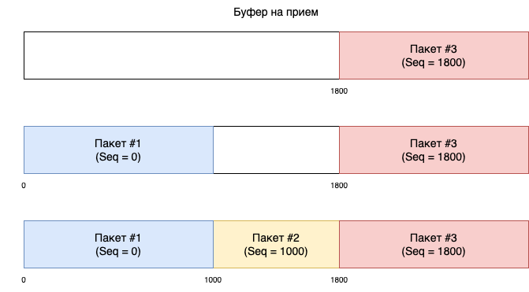
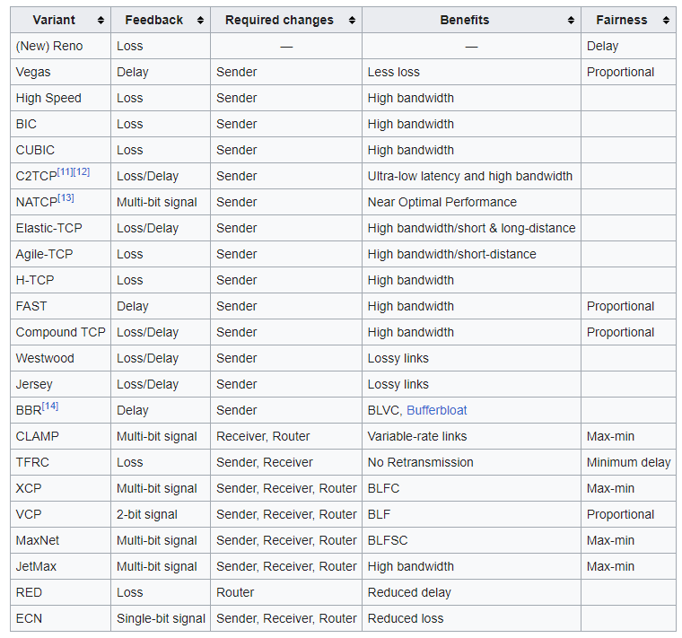
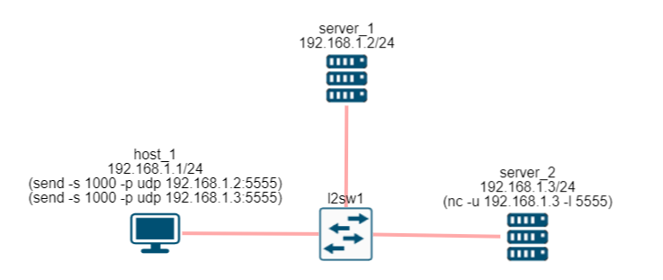

# 4. Транспортный уровень

## Содержание

+ [4.1 Транспортный уровень](#41-транспортный-уровень)
+ [4.2 UDP](#42-udp)
+ [4.3 TCP](#43-tcp)
+ [4.4 Тонкости работы TCP](#44-тонкости-работы-tcp)
+ [4.5 ICMP](#45-icmp)

[Оглавление](README.MD)

## 4.1 Транспортный уровень

Транспортный уровень обеспечивает доставку данных между приложениями на хостах.


Технологии канального уровня обеспечивают доставку данных от одного хоста к другому в рамках сетевого сегмента. Сетевой уровень обеспечивает доставку данных между хостами. И не важно, в одном или в разных сегментах сети находятся эти хосты. А транспортный уровень обеспечивает доставку данных между приложениями.

Сейчас на хостах одновременно работают десятки различных приложений. И вот на хост пришел пакет. Для какого приложения он предназначен? Этот и другие вопросы решает транспортный уровень.

В стеке TCP/IP на транспортном уровне работают два протокола TCP и UDP. Они оба выполняют одни функции, но по разному.

UDP - протокол без гарантии доставки данных. Если пакет с данными потеряется, то UDP ничего не будет с этим делать. Более того, UDP даже не гарантирует, что пакет будет отправлен с хоста.

TCP - протокол транспортного уровня с гарантией доставки данных. Это означает, что если во время обмена данными между хостами будет утерян один или более пакетов, то TCP обнаружит это и восстановит эти данные. Помимо надежности доставки данных TCP заботится о скорости передачи данных.

### Порты

Перед знакомством с TCP и UDP протоколами необходимо познакомиться с понятием порт. Это базовое понятие для транспортного уровня. Сейчас на ПК и ноутбуках одновременно работает несколько десятков приложений. IP протокол доставил данные на хост, какому приложению их передать?

Для идентификации приложения на хосте используются порты (ports). Порт - это поле размером 2 байта (16 бит). Соответственно, максимальный номер порта 65 535 (2 ^ 16).

Если приложение хочет принимать или отправлять данные по сети, оно обязано открыть порт. Т.е. оно как бы сообщает операционной системе - если придет пакет с данными на такой-то порт, то это ко мне.

Например, по умолчанию веб-сервер (http) открывает порт 80. И все данные, которые приходят на этот порт передаются веб-серверу. А для использования безопасного веб-подключения (https) используется 443 порт.

Порт уникально идентифицирует приложение на хосте. Один порт не может быть открыт разными приложениями. Но, одно приложение может открыть несколько портов. Если к этому добавить, что IP адрес уникально идентифицирует хост в сети Интернет, то получается, что пара IP:порт уникально идентифицируют приложение в глобальной сети Интернет.

Весь диапазон портов делится на две части:

+ Привилегированные порты - от 0 до 1023. Эти порты может открыть только администратор или суперпользователь.
+ Пользовательские порты - от 1024 до 65 535. Эти порты может открыть обычный пользователь.

На привилегированных портах, как правило, работают хорошо известные службы в Интернет, например веб (порт 80), почта (25), DNS (53), безопасный веб (443) и другие.

На сайте IANA можно найти список служб и портов, которые за ними закреплены - [IANA](https://www.iana.org/assignments/service-names-port-numbers/service-names-port-numbers.xhtml)

### Утилита netstat

Посмотреть открытые и активные порты на вашем хосте можно командой `netstat`. Если у вас Windows, то в командной строке (cmd.exe) наберите `netstat -an`. В результате вы должны увидеть вывод наподобие того, как на рисунке 94.


А если у вас ОС Linux, то посмотреть список активных портов можно командой `netstat - anltp`.


Для MacOS команда выглядит как `netstat -anl`. Вывод будет похож на то, как показано на рисунках 94 и 95.

Как видно, вывод команды `netstat` под разные ОС очень похож.

Колонка Proto указывает на протокол транспортного уровня:

+ tcp - означает протокол TCP.
+ udp - протокол UDP
+ tcp6 - означает протокол TCP, который в качестве сетевого уровня использует IPv6

Колонка **Local Address** указывает на локальный IP адрес и порт, которые использует приложение. Если в этом поле IP адрес равен 0.0.0.0, значит, приложение готово принимать данные, которые придут на любой IP адрес для этого хоста. Это полезно, когда на хосте сконфигурировано несколько IP адресов. Чтобы для каждого IP адреса не делать запись, в netstat добавляют одну 0.0.0.0.

**Foreign Address** - удаленный IP адрес и порт, другими словами, IP адрес и порт другого приложения, которое взаимодействует с локальным.

**State** - статус соединения. Только TCP протокол имеет статус соединения. У UDP протокола нет статусов.

**PID (Process ID)** - идентификатор процесса в системе. Если команду netstat выполнить от суперпользователя, то она также покажет PID и имя программы. Как на рисунке 96.


Например в 5-й строке вывода команды netstat можно видеть

```bash
Local Address 0.0.0.0:80
```

а в качестве PID указан nginx. Это веб-сервер NGINX открыл порт 80 и готов обслуживать запросы пользователей.

netstat удобная утилита, которая позволяет вам узнать состояния всех ваших портов, а также ответить на вопрос - какое приложение занимает конкретный порт.

В современных дистрибутивах ОС Linux помимо утилиты netstat можно использовать утилиту ss, например, `ss -tuap`

---
[Содержание](#содержание)

## 4.2 UDP

**UDP (User Datagram Protocol)** - протокол передачи пользовательских датаграмм, описан в [RFC 768](https://www.rfc-editor.org/rfc/rfc768). Это транспортный протокол и, соответственно располагается на транспортном уровне модели ISO/OSI.


UDP обеспечивает передачу данных между приложениями, при этом, он не заботится о надежности доставки данных. Во время передачи UDP пакет может потеряться или  прийти в другом порядке. Более того, UDP пакет может даже не отправиться с хоста, если буфер на отправку будет переполнен.

Может показаться, зачем тогда придумали UDP, раз он такой ненадежный? При всех этих недостатках UDP отлично решает задачи, для которых он был придуман:

+ передача трафика в реальном времени
+ передача данных там, где скорость важней надежности
+ передача группового трафика.

Если вы откроете RFC 768, то увидите, что весь протокол описан на 3-х страницах, а сам UDP заголовок занимает всего 8 байт:

+ порт источника (2 байта)
+ порт назначения (2 байта)
+ размер передаваемых в пакете данных (2 байта)
+ контрольная сумма (2 байта)


### Передача данных в реальном времени

UDP протокол отлично подходит для передачи данных в реальном времени. Например, когда идет видео-конференция или когда вы играете в многопользовательскую онлайн игру.

Представьте, вы играете в многопользовательскую онлайн-игру (CS, Dota2, StarCraft) и используете надежный протокол доставки данных, например, TCP. Если во время передачи данных потеряется пакет с данными о состоянии игры, то TCP попробует его восстановить, т.е. еще раз передать.

Мало того, что во время восстановления потерянного пакета у вас подвиснет игра, так еще и пришедшие данные будут уже неактуальны, ведь состояние сервера к этому моменту станет другим.

В тоже время, если вы будете использовать UDP протокол, то потеря одного пакета приведет только к легкому зависанию игры (или как говорят лаг). А последующие пришедшие пакеты будут содержать актуальное состояние игрового сервера.

Если мы это смоделируем на видеоконференцию, то по мере возникновения потерь и восстановлений пакетов, наблюдаемая видеоконференция будет отдаляться от реальной. Чем больше пакетов будет теряться и восстанавливаться, тем на большее время видеоконференция будет отставать от реальности.

### Скорость важней надежности

UDP протокол оказывается очень полезным, когда скорость передачи важней надежности.

Например, UDP протокол используется службой  DNS. Эта служба занимается сопоставлением доменного имени к IP адресу. Каждый раз, когда вы в браузере вбиваете название сайта, например miminet.ru, ваш хост обращается к DNS серверу, чтобы узнать IP адрес сервера. Эти DNS запросы в качестве транспорта используют UDP протокол. Почему так? Потому что так эффективней! Давайте посчитаем:

1. Например, хост делает 10 DNS запросов и получаете 10 DNS ответов, как итог, в сети будет 20 пакетов (10 запросов + 10 ответов).
2. Предположим, что каждый 10-й запрос теряется. Не получив ответа, DNS повторно пытается отправить запрос. Итого, будет 21 пакет (11 запросов и 10 ответов).
3. Если мы будем использовать TCP, только для одного DNS запроса в сети будет 9 пакетов. А 10 запросов приведет к появлению 90 пакетов (почему у TCP будет так много пакетов мы узнаем чуть позже, когда будем знакомиться с работой TCP, а пока просто поверьте).

Поэтому, в этом случае эффективней использовать UDP.

Другим примером является протокол NTP - это протокол синхронизации времени с сервером времени. NTP так устроен, что требуется подсчитать примерное время доставки пакета от хоста к серверу и в обратную сторону.  В случае потери пакетов с данными лучше это определить самостоятельно, повторно засечь время и сделать повторную попытку. Если в этом случае использовать TCP протокол, то потеря пакета и его восстановление сильно повлияет на расчеты.

### Передача группового трафика

UDP единственный протокол транспортного уровня в стеке TCP/IP, который может использоваться для передач группового трафика.

Например, у вас есть целый компьютерный класс или новый офис с 50 одинаковыми компьютерами. И на все компьютеры вам нужно установить одинаковую ОС и одинаковое ПО. Как правило, такая задача решается следующим путем:

1. На один из 50 компьютеров устанавливается все необходимое ПО
2. Затем, с помощью специальных утилит создается образ жесткого диска. Его размер может быть более десятков гигабайт.
3. В конце, этот образ жесткого диска по сети загружается на остальные компьютеры. Этот процесс обычно называют “разливка образа”.

Так вот, финальный этап как раз и решается через мультикаст. Загружать по несколько десятков гигабайт на 50 компьютеров слишком долго. Проще это сделать через групповую рассылку. И в качестве протокола транспортного уровня используется UDP.


[Подробнее](https://miminet.ru/web_network?guid=4fc0fafb-2a16-4244-a664-3f1e8f788a63)

### Выводы по UDP

Протокол UDP отлично подходит для передачи данных в реальном времени и для доставки данных при групповой рассылке.

---
[Содержание](#содержание)

## 4.3 TCP

TCP полная противоположность UDP протоколу, он гарантирует доставку данных и старается это сделать на оптимальной скорости. Сам TCP протокол впервые был описан в 1981 году в [RFC 793](https://datatracker.ietf.org/doc/html/rfc793). На рисунке 98 представлен TCP заголовок, как видно, он содержит намного больше полей чем UDP.


+ Source и Destination Port - это порт источника и порт получателя, с ними мы уже знакомы. Как и в UDP это поля размерами по 2 байта.
+ Sequence и Acknowledgment Number - это число последовательности и подтверждения. Они используются для определения потерь и восстановления потерянных данных.
+ Флаги (URG, ACK, PSH, RST, SYN, FIN) - указывает на тип передаваемого TCP пакета. Например, флаг ACK говорит о подтверждении операции, а флаг SYN о желании установить виртуальное соединение.
+ Window - по-русски окно, указывает на размер свободного буфера у отправителя. Используется для контроля скорости передачи данных.
+ Checksum - контрольная сумма пакета. Если данные будут повреждены во время передачи, контрольная сумма это выявит и такой пакет будет отброшен.
+ Options - различные опции.

Заголовок TCP без опций занимает 20 байт.

В отличие от UDP и IP, TCP — протокол с состояниями. На рисунке 99 представлена диаграмма состояний и переходов в TCP. Она довольно внушительная, по ходу дела мы разберемся с ней.


### Установка соединения

Любая передача данных в TCP начинается с установки виртуального соединения. TCP заботится о надежной доставке данных и, перед тем как начать передавать данные, он пытается установить соединение с удаленным приложением.

Возможность установить соединение означает, что на другом конце соединения действительно работает приложение и оно готово к обмену данными.

Если соединение установить невозможно, значит на другом конце приложение не готово принимать или отправлять данные, а значит,  нет смысла их отправлять или ожидать приема.

Можно провести параллель, установка соединение - это как звонок по телефону. Если пользователь поднимает трубку, значит можно начинать общение, а если нет, то нет никакого смысла что-то говорить в трубку.

Установка соединения в TCP это 3-х разовое рукопожатие (рисунок 100):

+ инициатор отправляет TCP пакет с флагом SYN
+ принимающая сторона на такой пакет отвечает TCP пакетом с уже двумя установленными флагами: SYN + ACK
+ в ответ на SYN + ACK инициатор отправляет TCP пакет с флагом ACK.


Таким образом, за 3 пакета TCP устанавливает соединение. После успешной установки соединения TCP может начать принимать и передавать данные.

Для примера, давайте сделаем небольшую сеть из двух хостов: клиент и сервер, как показано на рисунке 101.


[Подробнее](https://miminet.ru/web_network?guid=d35bcad2-b2be-4c2a-9902-26d4edd0bb1d)

На сервере мы запустим TCP сервер на порту 5555. А на клиенте мы запустим передачу данных с использованием протокола TCP на IP адрес сервера и на порт 5555. Передадим 1000 байт данных.

Запустим эмуляцию и посмотрим за пакетами в сети. После ARP запроса и ответа мы видим, как хост 1 отправляет на сервер SYN пакет, в ответ приходит SYN+ACK, и завершается установка соединения TCP пакетом с флагом ACK.

После установки соединения происходит передача данных и завершение соединения. Эту часть мы разберем чуть позже.

А теперь давайте посмотрим, как поведет себя TCP, если на сервере никто не будет ожидать подключения на порт 5555.

Опять, сделаем небольшую сеть, как на рисунке 102, она очень похожа на сеть из предыдущего примера. Только на этот раз на сервере не будем запускать TCP сервер на порту 5555. Т.е. теперь на сервере нет приложения, которое готово обмениваться данными на порту 5555.


[Подробнее](https://miminet.ru/web_network?guid=b768b8a6-322e-4520-8a7a-1da02b4cd008)

Запустим эмуляцию и посмотрим, как будет работать протокол TCP в этом случае.

В начале, как обычно, ARP-запрос и ARP-ответ, а после мы видим, как хост 1 отправляет SYN пакет, а в ответ приходит TCP пакет с флагом RST.

Если на хосте нет приложения, которое готово обмениваться данными, то в ответ на SYN пакет TCP отправляет пакет с флагом RST (Reset, от английского сброс). Как изображено на рисунке 103.


Такой способ позволяет программисту очень быстро понять, что удаленная сторона не готова обмениваться данными и обработать эту ситуацию.

И напоследок, рассмотрим еще одну ситуацию, когда удаленная сторона не отвечает на SYN пакет. Такое может произойти либо если сервер выключен или на нем настроен фаервол - программа, которая умеет блокировать пакеты с определенным IP адресом и портом.


[Подробнее](https://miminet.ru/web_network?guid=c16763e6-1ce8-4d50-b3b8-4261ddc9940b)

Опять, сделаем сеть состоящую из двух хостов. На сервере будем блокировать порт 5555. А на хосте как обычно, выполним команду отправки данных на сервер на порт 5555.

Блокировка порта 5555 на сервере приведет к тому, что все TCP и UDP пакеты, у которых в поле порт назначения прописан порт 5555 будут выброшены. Т.е. протоколы TCP и UDP ничего не узнают про этот пакет и не смогут на него отреагировать.

Запустим эмуляцию и посмотрим, как TCP пытается установить соединение в этом случае.

Если на SYN пакет не следует никакой реакции, т.е. нет SYN+ACK или SYN+RST, то TCP считает, что пакет потерялся и нужно попробовать еще раз, т.е. отправить еще один SYN пакет. При этом пауза между отправками увеличивается в два раза. Первый повторный SYN пакет отправляется через 1 секунду, вторая попытка через 2 секунды, затем через 4 и так далее. Как показано на рисунке 105.


Последняя попытка установить соединение зависит от настроек ОС. В современных системах TCP ограничивается 4-мя попытками.

Именно по этой причине, можно часто видеть как сетевое приложение зависает при попытке подключиться к удаленному хосту. Оно пытается установить соединение, а в ответ не получает ни SYN+ACK, ни RST пакета.

### Передача данных

TCP - это протокол потоковой передачи данных, т.е. он передает поток байт, а не готовые датаграммы. Это означает, что TCP сам будет решать, сколько данных разместить в одном передаваемом пакете. Если в TCP пакете находятся данные, то на это будет указывать флаг PSH (Push).

Передача данных в TCP происходит с подтверждением, т.е. после каждого переданного пакета с данными TCP ожидает подтверждения о том, что данные были успешно приняты удаленной стороной. Для надежной передачи данных TCP используется два поля:

+ Sequence Number -  номер  последовательности
+ Acknowledgment Number - номер подтверждения

Оба эти поля находятся в заголовке TCP протокола, как показано на рисунке 106.


Эти поля занимают по 4 байта (32 бита) каждый. Лучше всего представить эти поля, как указатели на буфер. Напомню, что буфер это временная память, которую выделяют программы для хранения временных данных.

### Номер последовательности (Sequence Number)

Что, если во время передачи данных ваши пакеты каким-то образом перепутались и пришли к получателю в перепутанном порядке? В этом случае, получатель перепутает последовательность данных и расположит полученные данные в неправильном порядке.


Решить такую проблему можно нумерацией пакетов. Но такой подход приведет к появлению другой проблемы. Если мы будем использовать нумерацию пакетов, чтобы защититься от проблемы перепутанных пакетов, то все пакеты должны будут быть одинакового размера. К примеру, мы первым получим пакет №3 (красный на рисунке 107), на сколько байт мы должны отступить от начала буфера, чтобы разместить данные?

Для решения проблемы с перепутанными пакетами используется номер последовательности (Sequence number). Номер последовательности (Sequence number) - указывает на позицию начала передаваемых данных в буфере отправителя. Предположим, TCP отправил 2800 байт данных в 3-х пакетах. Размер передаваемых байт в пакетах 1000 байт,  800 байт и 1000 байт соответственно.

При отправке первого пакета с данными номер последовательности будет 0
У второго пакета с данными это поле будет установлено в 1000.
А при отправке третьего пакета номер последовательности будет установлен в 1800. Как это показано на рисунке 108.


Таким образом, принимающая сторона всегда сможет правильно разместить пришедшие данные, даже, если пакеты перепутались. Например, принимающий хост получил эти TCP пакеты в следующем порядке: 3, 1, 2.



У пакета №3 номер последовательности будет 1800, это означает, что TCP на принимающей стороне разместит эти данные со смещением в 1800 байт.

После этого приходит пакет №1, его номер последовательности 0 и TCP разместит эти данные в начале буфера. Последним придет пакет №2, у которого номер последовательности равен 1000. Значит, эти данные будут размещены со смещением в 1000 байт. Этот процесс изображен на рисунке 109.

Таким образом, номер последовательности в TCP позволяет размещать данные в буфере принимающей стороны в правильном порядке, даже если сами пакеты придут в перемешанном порядке.

Возникает естественный вопрос, а что делать, если пришедшие данные наложились друг на друга? Или, что если хост получит два TCP пакета, у которых будет одинаковый номер смещения, но разные данные? RFC никак не описывает этот момент. Поэтому, разные реализации TCP протокола ведут себя по разному. В каких-то ОС оставляются более старые данные, а какие-то перезаписывают более новыми.

### Номер подтверждения (Acknowledgment Number)

Протокол TCP должен обеспечивать надежную доставку данных. И это касается не только данных, которые перемешались во время передачи, но и которые потерялись.

Для начала, давайте разберемся, как же работает это поле с номером  подтверждения (Acknowledgment Number). Каждый раз, когда TCP протокол отправляет пакет с данными (устанавливается флаг PSH), он ожидает от удаленной стороны подтверждения (флаг ACK) о том, что данные были успешно доставлены. А номер подтверждения в таком пакете будет указывать на позицию следующую за последним полученным байтом. При этом, учитываются только непрерывно полученные байты.

Если хост принял TCP пакет с данными, у которого номер последовательности 0 и размер данных будет равен 1000 байт, то номер подтверждения будет равен 1000. 1000-й байт с позиции 0 будет располагаться на позиции 999. Следующая позиция после 999 будет 1000.


Еще раз воспользуемся нашим примером. Пусть TCP отправил 2800 байт данных в 3-х пакетах. Количество передаваемых байт в пакетах 1000 байт, 800 байт и 1000 байт соответственно.

+ При отправке первого пакета с данными номер последовательности будет 0
+ У второго пакета с данными это поле будет установлено в 1000.
+ А при отправке третьего пакета номер последовательности будет установлен в 1800.

Обмен TCP пакетами между хостами в таком случае будет как на рисунке 111.


+ Клиент отправляет на сервер TCP пакет с данными (устанавливает флаг Push):
  + номер последовательности равен 0
  + размер передаваемых данных равен 1000 байт.
+ Сервер, получив TCP пакет с данными, размещает их в своем буфере на прием и отправляет TCP пакет с подтверждением (флаг ACK), где номер подтверждения (поле Ack, не путать с флагом ACK) равен 1000.
+ Клиент отправляет на сервер TCP пакет с данными:
  + номер последовательности равен 1000
  + размер передаваемых данных равен 800
+ Сервер, получив такой пакет, отправляет пакет с подтверждением, где номер подтверждения будет равен 1800.
+ И так далее.

### Обнаружение потерь и восстановление данных

Что если во время передачи данных с использованием протокола TCP произошла потеря пакета? Давайте рассмотрим эту ситуацию на нашем примере. Пусть TCP отправил 2800 байт данных в 3-х пакетах. Количество передаваемых байт в пакетах 1000 байт, 800 байт и 1000 байт соответственно.

Предположим, что второй пакет потерялся во время передачи. В схеме работы TCP, потерей пакета считается отсутствие подтверждения на передаваемый пакет. Т.е. когда отправитель не получил пакет с флагом ACK в ответ на переданные данные (смотри рисунок 112).


Если TCP не получает подтверждения на отправленные данные, то считается, что пакет потерялся и TCP снова отправляет пакет с потерявшимися данными. Таймаут ожидания подтверждения зависит от ОС и ее настроек.

Обратите внимание, в примере на рисунке 112 мы точно не знаем что произошло. Может быть потерялся пакет с данными, а может быть данные дошли до сервера, но потерялся пакет с подтверждением. Оба эти случая считаются одним - отправитель не получил подтверждения за отведенное время (таймаут) и повторно отправляет данные.

Итого, номера последовательности и подтверждения используются  для надежной передачи данных и обнаружения потерь. Номер последовательности (Sequence Number) -  позволяет принимающей стороне правильно размещать полученные данные в буфере. А номер подтверждения (Acknowledgment Number) помогает отправителю понять, успешно ли дошли данные до получателя или имеется потеря.

### Начальное значение номера последовательности

Если посмотреть на номер последовательности сразу после установки соединения, то можно заметить, что оно не равно 0. Его начальное значение, обычно, случайное. Т.е. во время установки соединение обе стороны устанавливают номер последовательности в случайное значение и это значение считается 0. Это сделано для более безопасного соединения и предотвращению атаки TCP-hijacking.

### Скорость передачи данных

Передавать данные по одному пакету и ожидать на него подтверждения надежно, но очень медленно. Давайте посчитаем.

1. Расстояние между Владивостоком и Калининградом примерно 7500 км., а туда и обратно будет уже 15 000 км.
2. Для простоты, предположим, что сигнал от хоста во Владивостоке до сервера в Калининграде будет идти со скоростью света (~ 300 000 км/сек). А обработка пакетов будет занимать 0 времени.
3. Тогда получится, что за одну секунду сигнал успеет сбегать туда и обратно 20 раз. Т.е., за 1 секунду мы сможем отправить 20 пакетов и получить 20 подтверждений.
4. Максимальный размер одного пакета 1500 байт - 20 байт IP заголовок - 20 байт TCP заголовок. Остается, 1460 байт данных. 1460 * 20 = 29 200 байт данных. Т.е. скорость передачи данных будет около 28 Кбайт/сек (29 200 / 1024).

Добро пожаловать во времена модемов! А если серьезно, то скачивать данные на такой скорости не хочется. А ведь сервер может располагаться и дальше, чем Калининград.

Для ускорения передачи данных в TCP необходимо передавать по несколько пакетов с данными, до того, как придет подтверждение. Как это показано на рисунке 113.


---
[Содержание](#содержание)

## 4.4 Тонкости работы TCP

### Скользящее окно (Sliding Window)

Решение на рисунке 113 очевидное, но есть проблема. Несколько пакетов - это сколько, 2, 5, 15 или можно сразу 150? Как узнать?


Во время обмена данными между хостами, получаемые данные не попадают сразу в приложение пользователя. Сначала они попадают в буфер приема и только потом, оттуда, они попадают в пользовательское приложение.

Современные ОС многопользовательские, поэтому, во время получения пакета для приложения А, на процессоре может исполняться совсем другое приложение. И чтобы полученные данные не выбрасывать, они помещаются во временную память - буфер для приема данных.

Этот буфер не бесконечный, поэтому, если данных придет больше, чем в него помещается, то они будут отбрасываться до тех пор, пока в буфере не освободится место.

Для избежания переполнения буфера во время приема пакетов в TCP заголовке есть поле Окно (Window), его еще называют Скользящее окно (Sliding Window). Это поле размером в 2 байта (16 бит) и оно сообщает о размере свободного места в буфере на прием. Изначально это место измерялось в байтах. Соответственно, максимальное значение было 65 535 байт. Как не сложно догадаться, теперь этого недостаточно и сейчас используются различные опции, которые позволяют передавать в поле Окно большие значения.

Для тех, кому интересно, ищите по ключевым словам:

+ Window scaling
+ [RFC 7323](https://datatracker.ietf.org/doc/html/rfc7323)
+ [RFC 1323](https://datatracker.ietf.org/doc/html/rfc1323)
А мы продолжим. Давайте нарисуем небольшую сеть из двух хостов, как показано на рисунке 114.


[Подробнее](https://miminet.ru/web_network?guid=63f69e1e-81ab-43e3-832a-876fc7c8c6f1)

Итак, поле Window сообщает информацию о размере свободного места в буфере на прием. Во время установки соединения (3-х разовое рукопожатие: SYN, SYN+ACK, ACK) обе стороны обмениваются информацией о свободном месте в их буфере на прием.

После установки соединения отправитель может смело отправить столько пакетов с данными без подтверждения, сколько поместится в буфер на прием у получателя.

Отправка данных приведет к уменьшению этого буфера. Но когда приложение на удаленной стороне прочитает данные из буфера, это приведет к освобождению места в буфере, что приведет и к увеличению Window.


Предположим мы установили TCP соединение и удаленная сторона сообщила свой Window = 4380 байт (это 3 раза по 1460 байт). Это означает, что мы можем сразу отправить 3 TCP сегмента с данными без ожидания подтверждения, как показано на рисунке 116.


На рисунке 116 отправитель отправил сразу 3 сегмента с данными до того, как получил хотя бы одно подтверждение. Если все данные придут, это будет означать, что свободного места в буфере у принимающей стороны больше нет. По мере того, как будут приходить подтверждения мы увидим, что поле Window уменьшается до 0. После получения первого сегмента оно станет 2920, после второго сегмента 1460 и после получения третьего сегмента поле Window станет 0.

Для отправителя это будет означать, что пока больше никаких данных отправлять нельзя. Ситуация изменится, когда приложение на удаленной стороне прочитает данные из буфера на прием. Предположим, наше приложение прочитало всего 2920 байт данных (зеленый кусок), а 1460 еще находятся в буфере, как показано на рисунке 117.


Теперь TCP может сообщить отправителю, что буфер освободился и он снова готов принять 2920 байт данных.

Таким образом, наше окно как бы сдвигается вправо, отсюда и название Скользящее окно.

В современных системах размер буфера обычно несколько мегабайт, что позволяет передавать данные на достаточно большой скорости.


[Подробнее](https://miminet.ru/web_network?guid=b362d63e-6207-4991-b10c-dadc0c4c4144)

Еще раз сделаем сеть из двух хостов, только на этот раз передадим 5000 байт данных. Если вы запустите анимацию такой сети, то увидите, что хост 1 сразу отправляет пакеты с данными, не дожидаясь подтверждения.

### Узкое горлышко

А что если мы усложним нашу сеть, как на рисунке 119.


[Подробнее](https://miminet.ru/web_network?guid=f2289c94-2fcd-4d2a-9db5-560cb5f81a23)

Пусть скорость подключения хостов и сервера одинаковая, например, 100 Мбит/сек. Если хост 1 будет обмениваться данными с сервером на скорости 60 Мбит/сек. То если хост 2 захочет отправить данные на сервер он столкнется с проблемами, его скорость передачи данных не может быть больше 40 Мбит/сек. Даже, если на сервере есть свободное место в буфере на прием данных. Так как подключение сервера до свитча всего 100 Мбит/сек.

Еще одна, вполне жизненная ситуация, когда у вас скорость подключения к вашему домашнему роутеру больше, чем скорость, которую предоставляет вам провайдер. Например, вы подключились к своему домашнему Wi-FI роутеру по стандарту IEEE 802.11n (скорость до 600 Мбит/сек), а у вашего провайдера вы купили тариф, по которому скорость передачи данных не более 10 Мбит/сек. Значит, при обмене данными с серверами из сети Интернет вы не сможете отправлять данные быстрей, чем 10 Мбит/сек. А если у вас дома есть еще и другие сетевые устройства (ноутбук, телефоны, …), то ваша скорость передачи данных будет еще меньше.

Все это означает, что при передаче данных по TCP нельзя ориентироваться только на размер свободного места в буфере на прием.

Задача TCP, определить самое узкое место на пути следования пакета (узкое горлышко, bottleneck) и ограничить скорость передачи данных пропускной способностью этого места.

Как определить узкие места в сети без информации о топологии сети? На самом деле нет нужды определять где именно находится узкое горлышко, достаточно определить, что оно где-то есть и адаптировать скорость передачи данных.


[Подробнее](https://miminet.ru/web_network?guid=f2289c94-2fcd-4d2a-9db5-560cb5f81a23)

Давайте еще раз посмотрим на рисунок 119. Разбирая этот пример мы предположили, что хост 1 передает на сервер данные со скоростью 60 Мбит/сек, а хост 2 передает на сервер данные со скорость 40 Мбит/сек. Узким горлышком на схеме будет подключение сервера к свитчу.

На свитч от хоста 1 и хоста 2 данные могут приходить со скоростью по 100 Мбит/сек от каждого, итого, суммарно, 200 Мбит/сек. А выходная скорость от свитча к серверу всего 100 Мбит/сек.

Если сетевое оборудование не успевает передавать пакеты в сеть, оно начинает их размещать в буфере на отправку и ждать, пока освободится канал для передачи. Как это показано на рисунке 120.


На рисунке 120 пакеты 1 и 2 успешно передаются на хост, а пакеты 3 и 4 расположись в буфере на отправку. Это означает, что время доставки пакетов 3 и 4 до сервера будет больше, чем время доставки пакетов 1 и 2. Чем больше пакетов будет в буфере на отправку, тем больше будет время их доставки.

Таким образом, измеряя время доставки пакетов можно обнаружить момент попадания пакетов в буфер и начать снижать скорость передачи данных.

Еще одним способом определения узкого горлышка является потеря пакета. Если во время передачи данных пакет потерялся, значит есть большая вероятность того, что он не поместился даже в буфер и был отброшен устройством.

### Контроль переполнения (Congestion control)

В TCP протоколе на пакет с данными (флаг PSH) приходит пакет с подтверждением о его доставке (флаг ACK). Соответственно, замеряя время отправки пакета с данными и время получения подтверждения на этот пакет, мы можем определять узкие горлышки.

Время, которое необходимо для отправки пакета и получения на него подтверждения называется RTT (Round-Trip Time). Еще его называют время приема-передачи.


Если во время передачи данных RTT начинает расти, значит где-то по пути пакеты начинают копиться в буфере на отправку. А значит, нужно уменьшать скорость передачи данных.

Скорость передачи данных в TCP регулируется алгоритмом, который называется “Контроль переполнения”. По-английски это Congestion control. Иногда его переводят как контроль скопления.

Этот алгоритм оперирует следующими параметрами:

+ Скользящее окно
+ RTT
+ Потеря пакета
+ Окно переполнения (Congestion Window или сокращенно CWND)

Из всего перечисленного мы еще не знакомы только с Окном переполнения. Окно переполнения по сути и определяет скорость передачи данных по TCP. Этот параметр в алгоритме определяет, сколько пакетов с данными можно отправить в сеть до того, как получим подтверждение на них. Чем больше таких пакетов с данными мы отправим, тем больше будет скорость передачи.


CWND это такой параметр, который с одной стороны всегда хочет разогнаться еще, а с другой, смотрит, не нужно ли притормозить. Тормозами выступают значительное увеличение RTT, потеря пакета и ограничение скользящего окна. Ну а разгон определяется как противоположность тормозу. Если никто не тормозит, значит разгоняемся.

Таким образом, используя RTT, скользящее окно и обнаружение потери пакета, TCP адаптирует свою скорость передачи данных.

### Низкий старт (Slow start)

Последнее, о чем стоит упомянуть при разборе скорости передачи данных в TCP - это медленный старт.

Когда мы говорим про CWND (количество пакетов, которые можно отправить до получения подтверждения), то есть два интересных вопроса:

+ какое начальное значение CWND?
+ с какой скоростью он будет расти?

Вот допустим у нас начальное значение CWND 1, хорошо. Мы отправили пакет с данными и получили подтверждение. Выяснили, что нас никто не тормозит и мы можем разогнаться. Каким поставить следующее значение CWND: 2, 4, 10?

Вначале скорость роста CWND экспоненциальная и эта фаза называется Slow start (низкий старт). Как только CWND доходит до определенного предела, скорость роста становится линейной и эта фаза называется Congestion Avoidance (избежание переполнения).


Таким образом, находясь на низкой скорости TCP пытается как можно быстрей разогнаться до чего-то приемлемого. А уже после, пытаться адаптироваться и контролировать скорость.

>Примечание: во всей (из того, что я видел) литературе Slow start переведен как “Медленный старт”. Хотя как он может быть медленный, если он разгоняется экспоненциально? Считаю, что перевод низкий старт более уместен.

### Алгоритмы контроля переполнения

На сегодняшний день существует более 20 различных реализаций алгоритмов переполнения (см. рис. 123).



[Алгоритмы переполнения в TCP](https://en.wikipedia.org/wiki/TCP_congestion_control)

Они отличаются друг от друга начальным значением CWND, до какого уровня действует фаза низкий старт, при каком отклонении RTT начинать снижать скорость и так далее. А некоторые алгоритмы адаптированы под спутниковые каналы (Long Fat Pipes).

Сеть постоянно меняется, меняются каналы передачи данных, сервисы. Поэтому, появляются новые реализации алгоритма контроля переполнения.

### Алгоритм Нагла (Nagle algorithm)

Алгоритм Нагла или еще его называют Алгоритм Нейгла или [RFC 896](https://datatracker.ietf.org/doc/html/rfc896), в которой он был впервые описан. Нагл работал над увеличением эффективности TCP/IP. Наблюдая за работой сети он обнаружил, что сетевые устройства довольно часто не справлялись со входящим трафиком и начинали размещать пакеты в буфере на отправку. Т.е. происходило переполнение, увеличивался RTT и отправитель начинал снижать скорость отправки новых пакетов в сети. При этом, объем передаваемых данных был не так уж и велик.

При детальном наблюдении оказалось, что в сеть очень часто отправлялись TCP пакеты с маленьким объемом данных, иногда даже с 1 байтом. Передача TCP пакета  с 1 байтом полезных данных приводит к огромным накладным расходам в 5400% (20 байт TCP заголовок + 20 байт IP заголовок + 14 байт Ethernet заголовок).

Идея алгоритма Нагла в уменьшении количества маленьких TCP пакетов в сети. Нагл предложил алгоритм, который должен задерживать отправку небольших порций данных в сеть, если у отправителя есть неподтвержденные данные (т.е. отправитель еще не получил на них пакет с флагом ACK).


На рисунке 124 показано, как алгоритм Нагла уменьшает количество небольших пакетов в сети. Слева на рисунке клиент хочет передать на сервер слово HELLO, при этом, он отправляет по одной букве. Сначало отправляется “H”, потом “E”, затем “L” и так далее. Если алгоритм Нагла будет выключен, то клиент будет отправлять эти буквы в тот момент, когда поступила такая команда от программы (команда send). При условии, что есть такая возможность.

На рисунке справа алгоритм Нагла включен и мы видим, как клиент отправив одну букву “H”, ждет, пока придет подтверждение. Он не отправляет мелкие пакеты в сеть, а копит эти данные. Он отправит накопленные данные либо когда не останется неподтвержденных данных (придет ACK на “H”) или когда данных накопится достаточно, чтобы отправить целый пакет с данными. В нашем случае мы ждем подтверждения и только потом отправляем накопившийся буфер “ELLO”.

Алгоритм Нагла выглядит вот так:


[Алгоритм Нагла](https://en.wikipedia.org/wiki/Nagle%27s_algorithm)

### Когда стоит отключать алгоритма Нагла

Алгоритм Нагла не всегда полезен. Если у вас интерактивный трафик, например, вы подключились через консоль на удаленный сервер или через удаленный рабочий стол. В этом случае нужно, чтобы интерфейс был отзывчивым для этого необходимо отключать алгоритм Нагла в приложении.

---
[Содержание](#содержание)

## 4.5 ICMP

Во время передачи данных в сети могут возникать ошибки. И эти ошибки могут быть спонтанными и постоянными. Следствием таких ошибок, обычно, является потеря пакета. Пример спонтанной ошибки - помехи при передаче сигнала или переполнение буфера на прием пакетов у маршрутизатора. Если хост повторно отправит пакет, то со второго раза он скорее всего дойдет до конечного адресата.

А есть постоянные ошибки, которые часто связаны с неверной настройкой сети. Например, во время пересылки пакета через маршрутизатор у пакета закончился TTL (стал равен 0) и маршрутизатор выбрасывает такой пакет. Сколько бы раз TCP не пытался восстановить потерянный пакет, у него ничего не получится. Ведь каждый раз пакет будет проходить через тот же маршрутизатор и отбрасываться.

Как итог, пользователь или программист решит, что проблема на сервере, так как не смог к нему подключиться. Но на самом деле, проблема в невозможности доставить пакет между этими двумя хостами.

ICMP (Internet Control Message Protocol) - протокол помогает определить ошибки на сетевом и транспортном  уровне. ICMP протокол описан в [RFC 792](https://www.rfc-editor.org/rfc/rfc792) и является неотъемлемой частью IP протокола.

ICMP работает поверх IP протокола, но при этом является протоколом сетевого уровня, как показано на рисунке 126. Его относят к сетевому уровню, так как он по большей части решает проблемы на сетевом уровне.


На рисунке 127 изображен формат заголовка ICMP. Как видно, ICMP-заголовок занимает всего 32 бита.


[Формат ICMP протокола](https://www.rfc-editor.org/rfc/rfc792#page-4)

Основными полями в ICMP протоколе являются тип (Type) и код (Code):

+ Поле тип (Type) - указывает на тип возникшей проблемы, например, пункт назначения недостижим (Destination unreachable)
+ Поле код (Code) - конкретизирует ошибку, например, если тип указывает на Destination unreachable, то код конкретизирует: сеть недоступна, хост недоступен или порт недоступен.
+ Поле контрольной суммы (Checksum) - CRC16
+ Следующие 32 бита зарезервированы (unused) для различных типов и кодов ICMP сообщений. Некоторым ICMP сообщениям нужно там размещать дополнительные поля, а некоторым нет.
+ Заголовок IP + 64 бита данных - в этом поле содержится тот самый пакет, который вызвал ошибку. Таким образом, получив ICMP сообщение хост сможет понять, какой именно пакет вызвал ошибку.

Если на хосте или маршрутизаторе во время обработки пакета возникает определенный тип ошибки, то он формирует определенное ICMP сообщение, в него вкладывается IP пакет, который вызвал эту ошибку и это сообщение отправляется на IP адрес отправителя проблемного IP пакета. Таким образом ICMP сообщает отправителю об ошибке.

Давайте разберем, какие бывают ICMP сообщения и о каких ошибках они нам могут сказать.

### Destination unreachable

Destination unreachable (переводится как назначение недостижимо, но имейте в виду, в среде профессионалов используется английская версия):

+ Тип = 3
+ Коды:
  + 0 - сеть недоступна
  + 1 - хост недоступен
  + 2 - протокол недоступен
  + 3 - порт недоступен
  + 4 - нужна фрагментация, но стоит флаг DF
  + 5 - маршрут от источника недоступен

#### Сеть недоступна

Данное сообщение устанавливает тип = 3, код = 0. Ошибка генерируется, когда хост или маршрутизатор не знает маршрута до IP сети, в которой находится IP адрес назначения.


[Сеть из двух узлов генерирует ошибку ICMP сеть недоступна.](https://miminet.ru/web_network?guid=6994b921-cc0f-4cbd-b209-7f30784027d7)

Для примера соберем сеть из 1 хоста и 1 маршрутизатора, как показано на рисунке 128. У хоста в качестве маршрутизатора по умолчанию пропишем маршрутизатор 1. А сам маршрутизатор будет знать только про сеть, к которой сам и подключен - это `192.168.1.0/24`.

С хоста 1 попробуем отправить 1000 байт по TCP на IP адрес `8.8.4.4`. Как мы уже знаем, для начала TCP попробует установить TCP соединение (SYN, SYN+ACK, ACK). Так как IP адрес назначения не в нашей сети, то хост 1 отправит его на маршрутизатор. Маршрутизатор, получив этот пакет, не сможет отправить его куда либо дальше, так как у него нет маршрута до IP сети, которой принадлежит IP адрес назначения. Другими словами, в таблице маршрутизации у маршрутизатора нет ни одной подходящей записи для IP адреса `8.8.4.4`.

Так как маршрутизатор не знает, куда отправить этот пакет дальше, он его отбрасывает. И, чтобы сообщить об этой ошибке отправителю, генерирует и отправляет ICMP сообщение Destination net unreachable.

Кстати, обратите внимание, TCP прекращает попытки установки соединения сразу после получения этого ICMP сообщения. А если бы не это ICMP сообщение, то TCP так бы и пытался дальше устанавливать соединение.

#### Хост недоступен

Тип = 3, код = 1. Ошибка генерируется, когда маршрутизатор не может доставить пакет до хоста с IP адресом назначения.

Соберем сеть из 2-х хостов и 1 маршрутизатора, как на рисунке 129.


[Сеть из двух узлов генерирует ошибку ICMP хост недоступен.](https://miminet.ru/web_network?guid=1646e111-1a47-4d98-a253-c396904e5351)

Хост 1 пытается подключиться к хосту с IP адресом 172.16.12.22 на порт 5555. Сам хост 1 находится в сети 192.168.1.0/24. Поэтому, TCP пакет отправляется на маршрутизатор 1. Маршрутизатор знает про сеть 172.16.12.0/24, в которой находится IP адрес 172.16.12.22. Он пытается отправить пакет для него и начинает отправлять ARP запросы, в поисках MAC адреса для IP адреса 172.16.12.22.

После 3-х попыток маршрутизатор делает вывод, что хост с IP адресом 172.16.12.22 не отвечает (его нет или он выключен) и генерирует ICMP сообщение Destination host unreachable.

Если запустить анимацию сети, то можно увидеть, как маршрутизатор отправит аж 3 ICMP сообщения о недостижимости хоста. Это все потому, что за время поиска MAC адреса для IP 172.16.12.22 он успел получить целых 3 TCP пакета для этого IP. Поэтому он отправляет 3 ICMP сообщения в ответ на эти три TCP пакета.

Таким образом, маршрутизатор сообщает источнику, что он знает про нужную сеть, но хост либо отсутствует либо выключен. В любом случае, не отвечает.

#### Протокол недоступен

Никогда не встречал в жизни.

#### Порт недоступен

Тип = 3, код = 3. Ошибка генерируется, когда хост получает UDP датаграмму на порт, который никто не слушает.

Если UDP отправляет датаграмму на порт, который никто не слушает на удаленной стороне, то в ответ он ничего не получит. И как определить, это датаграмма потерялась или на хосте назначения никто не слушает указанный порт?

Для решения этой проблемы используется ICMP сообщение порт недоступен. Это сообщение помогает отправителю UDP сообщений понять, удаленная сторона готова к работе или нет. Это некоторый аналог установки соединения в TCP, только тут ICMP сообщение приходит только в случае недоступности порта.

Соберем сеть из 1 хоста и двух серверов, как показано на рисунке 130.



[Сеть из одного хоста и двух серверов генерирует ошибку ICMP порт недоступен.](https://miminet.ru/web_network?guid=46fb1ad6-555e-4e61-98eb-e6d66346ae60)

Хост 1 отправит два UDP пакета на порт 5555:

+ один на сервер 1 с IP адресом 192.168.1.2, где порт 5555 будет закрыт.
+ второй на сервер 2 с IP адресом 192.168.1.3, где порт 5555 будет открыт

Запустив такую сеть мы увидим, что сервер 1, получив UDP датаграмму на порт 5555 отправляет в ответ ICMP сообщение Destination port unreachable. А сервер 2, получив UDP датаграмму на порт 5555 ничего не отправляет, так как UDP датаграмма была обработана.

Таким образом, ICMP сообщение Destination port unreachable помогает UDP клиентам определять, действительно ли удаленная сторона готова принимать данные или нет.

#### Нужна фрагментация, но стоит флаг DF

Тип = 3, код = 4. ICMP сообщение генерируется в случае, когда IP протоколу нужно провести фрагментацию пакета, но в опциях IP протокола установлен флаг DF (Don’t fragment) запрещающий проводить фрагментацию.

В обычной жизни такая ошибка возникает довольно редко. Для примера возьмем сеть из 2-х хостов и одного маршрутизатора, как показано на рисунке 131. Между хостом 1 и маршрутизатором установлено MTU 9000. Напомню, что MTU - это Maximum Transfer Unit, максимальный размер пакета, который можно передать в сеть. Обычно MTU равен 1500, но есть стандарты, которые позволяют передавать так называемые Jumbo-фреймы или слоновые фреймы, размер которых может достигать до 9000 байт.


Пусть хост 1 отправит данные размером в 9000 байт на хост 2, при этом установит в IP пакете флаг DF (Don’t fragment). Маршрутизатор получит такой пакет и попробует его отправить на хост 2. Так как пакет размером 9000 байт, а MTU между хостом 2 и маршрутизатором всего 1500, то такой пакет нужно фрагментировать и отправлять порциями. Но флаг DF в IP пакете запрещает фрагментацию.

Как результат, маршрутизатор не сможет отправить такой пакет дальше, выбросит его, сгенерирует ICMP сообщение нужна фрагментация, но стоит флаг DF и отправит его на хост 1.

Таким образом, хост 1 поймет, что пакет был отброшен.

Это ошибку можно посмотреть самостоятельно на своем локальном компьютере. Если у вас Windows, в командной консоли выполните команду “ping -l 2000 -f 77.88.8.8”. Результат работы команды показан на рисунке 132. Флаг l - устанавливает размер пакета, в нашем случае это 2000 байт, а флаг f запрещает фрагментировать пакеты.


На сетевом уровне IP протокол понимает, что пакет необходимо фрагментировать, но стоит запрещающий флаг. Поэтому такой пакет отбрасывается и генерируется соответствующее ICMP сообщение.

#### Маршрут от источника недоступен

IP протокол поддерживает опциональные заголовки и для этого у него есть отдельное поле опции (Options). Если забыли формат протокола IP, можете подсмотреть в [RFC 791](https://www.rfc-editor.org/rfc/rfc791#page-11).

Одной из таких опций является маршрутизация от источника (source routing). Эта опция позволяет отправителю указать маршрутизатор или несколько маршрутизаторов, через которые данный пакет должен пройти. Соответственно, при невозможности отправки пакета по тому пути, который прописан в опции source routing вызывает ICMP сообщение о том, что маршрут от источника недоступен.

Стоит сказать, что почти все современные ОС и маршрутизаторы отключают эту опцию. Так как это небезопасно.

### Time Exceeded

Time Exceeded (время истекло) - в этой группе находится всего 2 вида сообщения:

+ Тип = 11, код = 0 - time to live exceeded in transit (время пересылки истекло)
+ Тип = 11, код = 1 - fragment reassembly time exceeded (время сборки (дефрагментации) пакета истекло)

#### Time to live exceeded in transit

В IP протоколе есть поле TTL (Time To Live), размер этого поля 1 байт (8 бит). Каждый раз, когда IP пакет проходит через маршрутизатор, значение этого поля уменьшается на 1. Когда значение поля становится равным 0, пакет отбрасывается. Это такая защита от вечной пересылки пакета по сети Интернет. При наступлении такого события хост отправляет ICMP сообщение время пересылки истекло.

Примечание: еще это сообщение иногда называют “похоронка”.


[Сеть из одного хоста и 3-х маршрутизаторов генерирует ошибку ICMP TTL exceeded.](https://miminet.ru/web_network?guid=7509b963-d190-4aad-8d90-9be42f302bbb)

Для демонстрации, соберем сеть из 1 хоста и 3-х маршрутизаторов, как показано на рисунке 133. Маршрутизаторы объединены в кольцо, что позволяет IP пакету циркулировать там, пока на это хватит TTL.

С хоста 1 отправим ICMP это запрос на IP адрес 12.34.45.67. При этом, установим его TTL=5 через опцию -t.

Запустив анимацию сети мы увидим, что наш ICMP пакет успевает сделать 1 круг и на маршрутизаторе 2 его TTL становится 0, что приводит к генерации ICMP сообщения time to live exceeded.

Таким образом, хост источника понимает, что в сети где-то появилось кольцо и необходимо вмешательство сетевого администратора.

Кстати говоря, еще это хороший способ узнать, сколько маршрутизаторов между вами и каким-то хостом в Интернете. Для этого можно отправлять ICMP запросы с постоянно увеличивающимся TTL. С TTL=1 вы получите ICMP сообщение от первого маршрутизатора, с TTL=2 от второго и так далее, пока не получите ICMP ответ.

#### Fragment reassembly time exceeded

Если размер IP пакета больше, чем текущий MTU (Max Transfer Unit), то такой пакет фрагментируется на несколько более мелких пакетов. Если во время пересылки один или несколько таких фрагментов потеряется, то удаленный хост не сможет собрать IP пакет обратно. Если хост не может собрать обратно IP пакет слишком долго, то он может отправить ICMP сообщение Fragment reassembly time exceeded.

Стоит знать о такой ошибке, хотя лично я ее в жизни никогда не встречал.

### Echo и Echo reply (ping)

Пожалуй самые популярные ICMP сообщения. В отличие от многих других ICMP сообщений, эти не сообщают об ошибках, а скорее носят диагностический характер.

Echo (эхо или еще его называют ICMP запрос) - ICMP сообщение устанавливает тип=8, код=0 и служит для проверки доступности удаленного хоста по протоколу TCP/IP.  Получив такое ICMP сообщение хост должен ответить на него ICMP сообщением Echo reply (эхо ответ или я его называю ICMP ответ), установив тип=0 и код=0.

Таким способом можно проверять доступность удаленного хоста. Для отправки ICMP запросов обычно используется утилита ping. Это довольно универсальная утилита и она есть под Windows, MacOS и Linux. Для этого в своей командной строке выполните команду ping `77.88.8.8` (это IP адрес DNS сервера в Яндекс). В результате вы увидите ответ от удаленного хоста, а также время, за которое этот ответ приходит.


В Windows по умолчанию отправляется 4 запроса, а в MacOS и Linux утилита отправляет запросы бесконечно, пока ее не прервет пользователь.

Не всегда на ICMP запрос вы можете получить ICMP ответ. Нередко сетевые администраторы настраивают свои сервера и маршрутизаторы таким образом, что они не отвечают на ICMP запросы.

### Redirect

Сообщение ICMP Redirect (перенаправление) рекомендует хосту внести изменения в свою таблицу маршрутизации.
Тип = 5

Основные коды:

+ 0 - перенаправление для сети
+ 1 - перенаправление для хоста

Есть еще код 2 и 3, но я не видел их применения в жизни. Не уверен, что они по-прежнему используются. Если очень интересно, предлагаю почитать [RFC 792](https://www.rfc-editor.org/rfc/rfc792#page-12) и исходники ядра Linux.

Для примера, сделаем сеть как показано на рисунке 134.  Нам понадобится 2 хоста, 1 маршрутизатор и 1 коммутатор или хаб.

Все устройства подключены к одному коммутатору, что делает возможным обмениваться данными напрямую. А вот IP настройки таковы, что хост 1 (10.0.0.1/24) и хост 2 (192.168.1.1/24) находятся в разных IP сетях. Поэтому, если мы попробуем отправить пакет от хоста 1 к хосту 2, то мы не сможем это сделать, так как у хоста 1 в таблице маршрутизации нет подходящей записи.


[Сеть из двух хостов и одного маршрутизатора генерирует сообщение ICMP Redirect.](https://miminet.ru/web_network?guid=1d4704c2-f8db-436c-8da9-2892e4d0f577)

Чтобы хосты могли обмениваться данными между собой, нужно либо добавить запись в их таблицу маршрутизации или добавить в сеть маршрутизатор. Добавим в сеть маршрутизатор и на одном интерфейсе настроим 2 IP адреса:

+ 10.0.0.100/24
+ 192.168.1.100/24

Один IP адрес будет из сети хоста 1, второй - из сети хоста 2. Таким образом, маршрутизатор будет находиться в двух сетях одновременно и сможет переправлять пакеты от одного хоста к другому.

На хостах выполним 3 команды:

+ на хосте 1 выполним ping на хост 2
+ на хосте 2 выполним ping на хост 1
+ и снова на хосте 1 выполним ping на хост 2

А теперь рассмотрим, что произойдет. И для начала, давайте опустим ARP запросы из объяснения и так понятно зачем они нужны:

1. Хост 1 отправляет ICMP запрос для хоста 2 на маршрутизатор
2. Маршрутизатор, получив ICMP запрос от хоста 1 отправляет его на хост 2. И вот тут происходит интересное. Маршрутизатор отправляет полученные ICMP запрос в тот же сетевой интерфейс, откуда он его только что получил. Это означает, что маршрутизатор в этой цепочке доставки пакета лишний и хост 1 может напрямую доставлять пакеты до хоста 2.
3. Маршрутизатор, через сообщение ICMP redirect рекомендует хосту 1 поправить свою таблицу маршрутизации таким образом, чтобы он доставлял пакеты для хоста 2 напрямую, минуя маршрутизатор.
4. Такая же ситуация происходит и в ситуации, когда хост 2 отправляет хосту 1 ICMP ответ. Маршрутизатор отправляет хосту 2 ICMP redirect о том, что он может отправлять пакеты для хоста 1 напрямую.

Как итог, можно увидеть, что когда хост 1 уже во второй раз выполняет команду ping на хост 2, то пакеты между ними ходят напрямую, минуя маршрутизатор. Таким образом, ICMP redirect позволяет сокращать маршруты доставки пакетов.

Стоит обратить внимание, что ICMP redirect очень небезопасен, при этом, они по умолчанию обрабатываются многими ОС. Поэтому, сетевые администраторы настраивают свои фаерволы таким образом, чтобы они блокировали эти пакеты или вносят изменения в настройки ОС.

Для ОС Linux настройки ICMP redirect можно посмотреть в sysctl, как показано на рисунке 136.


Под Windows настройка поведения при получении ICMP redirect находится в ветке реестра `HKEY_LOCAL_MACHINE\SYSTEM\CurrentControlSet\Services\Tcpip\Parameters`.

### Source Quench

ICMP Source Quench (подавление источника) используется для информирования источника о том, что хост или маршрутизатор не успевает обрабатывать пакеты.

Используется ICMP тип = 4, код = 0.

### Выводы по ICMP

ICMP помогает диагностировать некоторые проблемы на сетевом уровне и извещать об этом отправителя.

---
[Содержание](#содержание)
