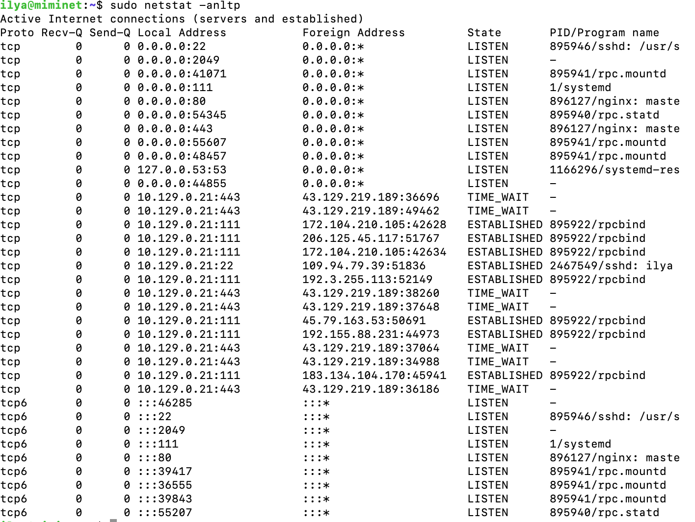

# 4. Транспортный уровень

## Содержание

+ [4.1 Транспортный уровень](#41-транспортный-уровень)
+ [4.2 UDP](#42-udp)
+ [4.3 TCP](#43-tcp)
+ [4.4 Тонкости работы TCP](#44-тонкости-работы-tcp)
+ [4.5 ICMP](#45-icmp)

[Оглавление](README.MD)

## 4.1 Транспортный уровень

Транспортный уровень обеспечивает доставку данных между приложениями на хостах.


Технологии канального уровня обеспечивают доставку данных от одного хоста к другому в рамках сетевого сегмента. Сетевой уровень обеспечивает доставку данных между хостами. И не важно, в одном или в разных сегментах сети находятся эти хосты. А транспортный уровень обеспечивает доставку данных между приложениями.

Сейчас на хостах одновременно работают десятки различных приложений. И вот на хост пришел пакет. Для какого приложения он предназначен? Этот и другие вопросы решает транспортный уровень.

В стеке TCP/IP на транспортном уровне работают два протокола TCP и UDP. Они оба выполняют одни функции, но по разному.

UDP - протокол без гарантии доставки данных. Если пакет с данными потеряется, то UDP ничего не будет с этим делать. Более того, UDP даже не гарантирует, что пакет будет отправлен с хоста.

TCP - протокол транспортного уровня с гарантией доставки данных. Это означает, что если во время обмена данными между хостами будет утерян один или более пакетов, то TCP обнаружит это и восстановит эти данные. Помимо надежности доставки данных TCP заботится о скорости передачи данных.

### Порты

Перед знакомством с TCP и UDP протоколами необходимо познакомиться с понятием порт. Это базовое понятие для транспортного уровня. Сейчас на ПК и ноутбуках одновременно работает несколько десятков приложений. IP протокол доставил данные на хост, какому приложению их передать?

Для идентификации приложения на хосте используются порты (ports). Порт - это поле размером 2 байта (16 бит). Соответственно, максимальный номер порта 65 535 (2 ^ 16).

Если приложение хочет принимать или отправлять данные по сети, оно обязано открыть порт. Т.е. оно как бы сообщает операционной системе - если придет пакет с данными на такой-то порт, то это ко мне.

Например, по умолчанию веб-сервер (http) открывает порт 80. И все данные, которые приходят на этот порт передаются веб-серверу. А для использования безопасного веб-подключения (https) используется 443 порт.

Порт уникально идентифицирует приложение на хосте. Один порт не может быть открыт разными приложениями. Но, одно приложение может открыть несколько портов. Если к этому добавить, что IP адрес уникально идентифицирует хост в сети Интернет, то получается, что пара IP:порт уникально идентифицируют приложение в глобальной сети Интернет.

Весь диапазон портов делится на две части:

+ Привилегированные порты - от 0 до 1023. Эти порты может открыть только администратор или суперпользователь.
+ Пользовательские порты - от 1024 до 65 535. Эти порты может открыть обычный пользователь.

На привилегированных портах, как правило, работают хорошо известные службы в Интернет, например веб (порт 80), почта (25), DNS (53), безопасный веб (443) и другие.

На сайте IANA можно найти список служб и портов, которые за ними закреплены - [IANA](https://www.iana.org/assignments/service-names-port-numbers/service-names-port-numbers.xhtml)

### Утилита netstat

Посмотреть открытые и активные порты на вашем хосте можно командой `netstat`. Если у вас Windows, то в командной строке (cmd.exe) наберите `netstat -an`. В результате вы должны увидеть вывод наподобие того, как на рисунке 94.


А если у вас ОС Linux, то посмотреть список активных портов можно командой `netstat - anltp`.


Для MacOS команда выглядит как `netstat -anl`. Вывод будет похож на то, как показано на рисунках 94 и 95.

Как видно, вывод команды `netstat` под разные ОС очень похож.

Колонка Proto указывает на протокол транспортного уровня:

+ tcp - означает протокол TCP.
+ udp - протокол UDP
+ tcp6 - означает протокол TCP, который в качестве сетевого уровня использует IPv6

Колонка **Local Address** указывает на локальный IP адрес и порт, которые использует приложение. Если в этом поле IP адрес равен 0.0.0.0, значит, приложение готово принимать данные, которые придут на любой IP адрес для этого хоста. Это полезно, когда на хосте сконфигурировано несколько IP адресов. Чтобы для каждого IP адреса не делать запись, в netstat добавляют одну 0.0.0.0.

**Foreign Address** - удаленный IP адрес и порт, другими словами, IP адрес и порт другого приложения, которое взаимодействует с локальным.

**State** - статус соединения. Только TCP протокол имеет статус соединения. У UDP протокола нет статусов.

**PID (Process ID)** - идентификатор процесса в системе. Если команду netstat выполнить от суперпользователя, то она также покажет PID и имя программы. Как на рисунке 96.



Например в 5-й строке вывода команды netstat можно видеть

```bash
Local Address 0.0.0.0:80
```

а в качестве PID указан nginx. Это веб-сервер NGINX открыл порт 80 и готов обслуживать запросы пользователей.

netstat удобная утилита, которая позволяет вам узнать состояния всех ваших портов, а также ответить на вопрос - какое приложение занимает конкретный порт.

В современных дистрибутивах ОС Linux помимо утилиты netstat можно использовать утилиту ss, например, `ss -tuap`

---
[Содержание](#содержание)

## 4.2 UDP

**UDP (User Datagram Protocol)** - протокол передачи пользовательских датаграмм, описан в [RFC 768](https://www.rfc-editor.org/rfc/rfc768). Это транспортный протокол и, соответственно располагается на транспортном уровне модели ISO/OSI.


UDP обеспечивает передачу данных между приложениями, при этом, он не заботится о надежности доставки данных. Во время передачи UDP пакет может потеряться или  прийти в другом порядке. Более того, UDP пакет может даже не отправиться с хоста, если буфер на отправку будет переполнен.

Может показаться, зачем тогда придумали UDP, раз он такой ненадежный? При всех этих недостатках UDP отлично решает задачи, для которых он был придуман:

+ передача трафика в реальном времени
+ передача данных там, где скорость важней надежности
+ передача группового трафика.

Если вы откроете RFC 768, то увидите, что весь протокол описан на 3-х страницах, а сам UDP заголовок занимает всего 8 байт:

+ порт источника (2 байта)
+ порт назначения (2 байта)
+ размер передаваемых в пакете данных (2 байта)
+ контрольная сумма (2 байта)


### Передача данных в реальном времени

UDP протокол отлично подходит для передачи данных в реальном времени. Например, когда идет видео-конференция или когда вы играете в многопользовательскую онлайн игру.

Представьте, вы играете в многопользовательскую онлайн-игру (CS, Dota2, StarCraft) и используете надежный протокол доставки данных, например, TCP. Если во время передачи данных потеряется пакет с данными о состоянии игры, то TCP попробует его восстановить, т.е. еще раз передать.

Мало того, что во время восстановления потерянного пакета у вас подвиснет игра, так еще и пришедшие данные будут уже неактуальны, ведь состояние сервера к этому моменту станет другим.

В тоже время, если вы будете использовать UDP протокол, то потеря одного пакета приведет только к легкому зависанию игры (или как говорят лаг). А последующие пришедшие пакеты будут содержать актуальное состояние игрового сервера.

Если мы это смоделируем на видеоконференцию, то по мере возникновения потерь и восстановлений пакетов, наблюдаемая видеоконференция будет отдаляться от реальной. Чем больше пакетов будет теряться и восстанавливаться, тем на большее время видеоконференция будет отставать от реальности.

### Скорость важней надежности

UDP протокол оказывается очень полезным, когда скорость передачи важней надежности.

Например, UDP протокол используется службой  DNS. Эта служба занимается сопоставлением доменного имени к IP адресу. Каждый раз, когда вы в браузере вбиваете название сайта, например miminet.ru, ваш хост обращается к DNS серверу, чтобы узнать IP адрес сервера. Эти DNS запросы в качестве транспорта используют UDP протокол. Почему так? Потому что так эффективней! Давайте посчитаем:

1. Например, хост делает 10 DNS запросов и получаете 10 DNS ответов, как итог, в сети будет 20 пакетов (10 запросов + 10 ответов).
2. Предположим, что каждый 10-й запрос теряется. Не получив ответа, DNS повторно пытается отправить запрос. Итого, будет 21 пакет (11 запросов и 10 ответов).
3. Если мы будем использовать TCP, только для одного DNS запроса в сети будет 9 пакетов. А 10 запросов приведет к появлению 90 пакетов (почему у TCP будет так много пакетов мы узнаем чуть позже, когда будем знакомиться с работой TCP, а пока просто поверьте).

Поэтому, в этом случае эффективней использовать UDP.

Другим примером является протокол NTP - это протокол синхронизации времени с сервером времени. NTP так устроен, что требуется подсчитать примерное время доставки пакета от хоста к серверу и в обратную сторону.  В случае потери пакетов с данными лучше это определить самостоятельно, повторно засечь время и сделать повторную попытку. Если в этом случае использовать TCP протокол, то потеря пакета и его восстановление сильно повлияет на расчеты.

### Передача группового трафика

UDP единственный протокол транспортного уровня в стеке TCP/IP, который может использоваться для передач группового трафика.

Например, у вас есть целый компьютерный класс или новый офис с 50 одинаковыми компьютерами. И на все компьютеры вам нужно установить одинаковую ОС и одинаковое ПО. Как правило, такая задача решается следующим путем:

1. На один из 50 компьютеров устанавливается все необходимое ПО
2. Затем, с помощью специальных утилит создается образ жесткого диска. Его размер может быть более десятков гигабайт.
3. В конце, этот образ жесткого диска по сети загружается на остальные компьютеры. Этот процесс обычно называют “разливка образа”.

Так вот, финальный этап как раз и решается через мультикаст. Загружать по несколько десятков гигабайт на 50 компьютеров слишком долго. Проще это сделать через групповую рассылку. И в качестве протокола транспортного уровня используется UDP.


[Подробнее](https://miminet.ru/web_network?guid=4fc0fafb-2a16-4244-a664-3f1e8f788a63)

### Выводы по UDP

Протокол UDP отлично подходит для передачи данных в реальном времени и для доставки данных при групповой рассылке.

---
[Содержание](#содержание)

## 4.3 TCP

TCP полная противоположность UDP протоколу, он гарантирует доставку данных и старается это сделать на оптимальной скорости. Сам TCP протокол впервые был описан в 1981 году в [RFC 793](https://datatracker.ietf.org/doc/html/rfc793). На рисунке 98 представлен TCP заголовок, как видно, он содержит намного больше полей чем UDP.


+ Source и Destination Port - это порт источника и порт получателя, с ними мы уже знакомы. Как и в UDP это поля размерами по 2 байта.
+ Sequence и Acknowledgment Number - это число последовательности и подтверждения. Они используются для определения потерь и восстановления потерянных данных.
+ Флаги (URG, ACK, PSH, RST, SYN, FIN) - указывает на тип передаваемого TCP пакета. Например, флаг ACK говорит о подтверждении операции, а флаг SYN о желании установить виртуальное соединение.
+ Window - по-русски окно, указывает на размер свободного буфера у отправителя. Используется для контроля скорости передачи данных.
+ Checksum - контрольная сумма пакета. Если данные будут повреждены во время передачи, контрольная сумма это выявит и такой пакет будет отброшен.
+ Options - различные опции.

Заголовок TCP без опций занимает 20 байт.

В отличие от UDP и IP, TCP — протокол с состояниями. На рисунке 99 представлена диаграмма состояний и переходов в TCP. Она довольно внушительная, по ходу дела мы разберемся с ней.


### Установка соединения

Любая передача данных в TCP начинается с установки виртуального соединения. TCP заботится о надежной доставке данных и, перед тем как начать передавать данные, он пытается установить соединение с удаленным приложением.

Возможность установить соединение означает, что на другом конце соединения действительно работает приложение и оно готово к обмену данными.

Если соединение установить невозможно, значит на другом конце приложение не готово принимать или отправлять данные, а значит,  нет смысла их отправлять или ожидать приема.

Можно провести параллель, установка соединение - это как звонок по телефону. Если пользователь поднимает трубку, значит можно начинать общение, а если нет, то нет никакого смысла что-то говорить в трубку.

Установка соединения в TCP это 3-х разовое рукопожатие (рисунок 100):

+ инициатор отправляет TCP пакет с флагом SYN
+ принимающая сторона на такой пакет отвечает TCP пакетом с уже двумя установленными флагами: SYN + ACK
+ в ответ на SYN + ACK инициатор отправляет TCP пакет с флагом ACK.


Таким образом, за 3 пакета TCP устанавливает соединение. После успешной установки соединения TCP может начать принимать и передавать данные.

Для примера, давайте сделаем небольшую сеть из двух хостов: клиент и сервер, как показано на рисунке 101.


[Подробнее](https://miminet.ru/web_network?guid=d35bcad2-b2be-4c2a-9902-26d4edd0bb1d)

На сервере мы запустим TCP сервер на порту 5555. А на клиенте мы запустим передачу данных с использованием протокола TCP на IP адрес сервера и на порт 5555. Передадим 1000 байт данных.

Запустим эмуляцию и посмотрим за пакетами в сети. После ARP запроса и ответа мы видим, как хост 1 отправляет на сервер SYN пакет, в ответ приходит SYN+ACK, и завершается установка соединения TCP пакетом с флагом ACK.

После установки соединения происходит передача данных и завершение соединения. Эту часть мы разберем чуть позже.

А теперь давайте посмотрим, как поведет себя TCP, если на сервере никто не будет ожидать подключения на порт 5555.

Опять, сделаем небольшую сеть, как на рисунке 102, она очень похожа на сеть из предыдущего примера. Только на этот раз на сервере не будем запускать TCP сервер на порту 5555. Т.е. теперь на сервере нет приложения, которое готово обмениваться данными на порту 5555.


[Подробнее](https://miminet.ru/web_network?guid=b768b8a6-322e-4520-8a7a-1da02b4cd008)

Запустим эмуляцию и посмотрим, как будет работать протокол TCP в этом случае.

В начале, как обычно, ARP-запрос и ARP-ответ, а после мы видим, как хост 1 отправляет SYN пакет, а в ответ приходит TCP пакет с флагом RST.

Если на хосте нет приложения, которое готово обмениваться данными, то в ответ на SYN пакет TCP отправляет пакет с флагом RST (Reset, от английского сброс). Как изображено на рисунке 103.


Такой способ позволяет программисту очень быстро понять, что удаленная сторона не готова обмениваться данными и обработать эту ситуацию.

И напоследок, рассмотрим еще одну ситуацию, когда удаленная сторона не отвечает на SYN пакет. Такое может произойти либо если сервер выключен или на нем настроен фаервол - программа, которая умеет блокировать пакеты с определенным IP адресом и портом.


[Подробнее](https://miminet.ru/web_network?guid=c16763e6-1ce8-4d50-b3b8-4261ddc9940b)

Опять, сделаем сеть состоящую из двух хостов. На сервере будем блокировать порт 5555. А на хосте как обычно, выполним команду отправки данных на сервер на порт 5555.

Блокировка порта 5555 на сервере приведет к тому, что все TCP и UDP пакеты, у которых в поле порт назначения прописан порт 5555 будут выброшены. Т.е. протоколы TCP и UDP ничего не узнают про этот пакет и не смогут на него отреагировать.

Запустим эмуляцию и посмотрим, как TCP пытается установить соединение в этом случае.

Если на SYN пакет не следует никакой реакции, т.е. нет SYN+ACK или SYN+RST, то TCP считает, что пакет потерялся и нужно попробовать еще раз, т.е. отправить еще один SYN пакет. При этом пауза между отправками увеличивается в два раза. Первый повторный SYN пакет отправляется через 1 секунду, вторая попытка через 2 секунды, затем через 4 и так далее. Как показано на рисунке 105.


Последняя попытка установить соединение зависит от настроек ОС. В современных системах TCP ограничивается 4-мя попытками.

Именно по этой причине, можно часто видеть как сетевое приложение зависает при попытке подключиться к удаленному хосту. Оно пытается установить соединение, а в ответ не получает ни SYN+ACK, ни RST пакета.

### Передача данных

TCP - это протокол потоковой передачи данных, т.е. он передает поток байт, а не готовые датаграммы. Это означает, что TCP сам будет решать, сколько данных разместить в одном передаваемом пакете. Если в TCP пакете находятся данные, то на это будет указывать флаг PSH (Push).

Передача данных в TCP происходит с подтверждением, т.е. после каждого переданного пакета с данными TCP ожидает подтверждения о том, что данные были успешно приняты удаленной стороной. Для надежной передачи данных TCP используется два поля:

+ Sequence Number -  номер  последовательности
+ Acknowledgment Number - номер подтверждения

Оба эти поля находятся в заголовке TCP протокола, как показано на рисунке 106.


Эти поля занимают по 4 байта (32 бита) каждый. Лучше всего представить эти поля, как указатели на буфер. Напомню, что буфер это временная память, которую выделяют программы для хранения временных данных.

### Номер последовательности (Sequence Number)

Что, если во время передачи данных ваши пакеты каким-то образом перепутались и пришли к получателю в перепутанном порядке? В этом случае, получатель перепутает последовательность данных и расположит полученные данные в неправильном порядке.


Решить такую проблему можно нумерацией пакетов. Но такой подход приведет к появлению другой проблемы. Если мы будем использовать нумерацию пакетов, чтобы защититься от проблемы перепутанных пакетов, то все пакеты должны будут быть одинакового размера. К примеру, мы первым получим пакет №3 (красный на рисунке 107), на сколько байт мы должны отступить от начала буфера, чтобы разместить данные?

Для решения проблемы с перепутанными пакетами используется номер последовательности (Sequence number). Номер последовательности (Sequence number) - указывает на позицию начала передаваемых данных в буфере отправителя. Предположим, TCP отправил 2800 байт данных в 3-х пакетах. Размер передаваемых байт в пакетах 1000 байт,  800 байт и 1000 байт соответственно.

При отправке первого пакета с данными номер последовательности будет 0
У второго пакета с данными это поле будет установлено в 1000.
А при отправке третьего пакета номер последовательности будет установлен в 1800. Как это показано на рисунке 108.


Таким образом, принимающая сторона всегда сможет правильно разместить пришедшие данные, даже, если пакеты перепутались. Например, принимающий хост получил эти TCP пакеты в следующем порядке: 3, 1, 2.


У пакета №3 номер последовательности будет 1800, это означает, что TCP на принимающей стороне разместит эти данные со смещением в 1800 байт.

После этого приходит пакет №1, его номер последовательности 0 и TCP разместит эти данные в начале буфера. Последним придет пакет №2, у которого номер последовательности равен 1000. Значит, эти данные будут размещены со смещением в 1000 байт. Этот процесс изображен на рисунке 109.

Таким образом, номер последовательности в TCP позволяет размещать данные в буфере принимающей стороны в правильном порядке, даже если сами пакеты придут в перемешанном порядке.

Возникает естественный вопрос, а что делать, если пришедшие данные наложились друг на друга? Или, что если хост получит два TCP пакета, у которых будет одинаковый номер смещения, но разные данные? RFC никак не описывает этот момент. Поэтому, разные реализации TCP протокола ведут себя по разному. В каких-то ОС оставляются более старые данные, а какие-то перезаписывают более новыми.

### Номер подтверждения (Acknowledgment Number)

Протокол TCP должен обеспечивать надежную доставку данных. И это касается не только данных, которые перемешались во время передачи, но и которые потерялись.

Для начала, давайте разберемся, как же работает это поле с номером  подтверждения (Acknowledgment Number). Каждый раз, когда TCP протокол отправляет пакет с данными (устанавливается флаг PSH), он ожидает от удаленной стороны подтверждения (флаг ACK) о том, что данные были успешно доставлены. А номер подтверждения в таком пакете будет указывать на позицию следующую за последним полученным байтом. При этом, учитываются только непрерывно полученные байты.

Если хост принял TCP пакет с данными, у которого номер последовательности 0 и размер данных будет равен 1000 байт, то номер подтверждения будет равен 1000. 1000-й байт с позиции 0 будет располагаться на позиции 999. Следующая позиция после 999 будет 1000.


Еще раз воспользуемся нашим примером. Пусть TCP отправил 2800 байт данных в 3-х пакетах. Количество передаваемых байт в пакетах 1000 байт, 800 байт и 1000 байт соответственно.

+ При отправке первого пакета с данными номер последовательности будет 0
+ У второго пакета с данными это поле будет установлено в 1000.
+ А при отправке третьего пакета номер последовательности будет установлен в 1800.

Обмен TCP пакетами между хостами в таком случае будет как на рисунке 111.


+ Клиент отправляет на сервер TCP пакет с данными (устанавливает флаг Push):
  + номер последовательности равен 0
  + размер передаваемых данных равен 1000 байт.
+ Сервер, получив TCP пакет с данными, размещает их в своем буфере на прием и отправляет TCP пакет с подтверждением (флаг ACK), где номер подтверждения (поле Ack, не путать с флагом ACK) равен 1000.
+ Клиент отправляет на сервер TCP пакет с данными:
  + номер последовательности равен 1000
  + размер передаваемых данных равен 800
+ Сервер, получив такой пакет, отправляет пакет с подтверждением, где номер подтверждения будет равен 1800.
+ И так далее.

### Обнаружение потерь и восстановление данных

Что если во время передачи данных с использованием протокола TCP произошла потеря пакета? Давайте рассмотрим эту ситуацию на нашем примере. Пусть TCP отправил 2800 байт данных в 3-х пакетах. Количество передаваемых байт в пакетах 1000 байт, 800 байт и 1000 байт соответственно.

Предположим, что второй пакет потерялся во время передачи. В схеме работы TCP, потерей пакета считается отсутствие подтверждения на передаваемый пакет. Т.е. когда отправитель не получил пакет с флагом ACK в ответ на переданные данные (смотри рисунок 112).


Если TCP не получает подтверждения на отправленные данные, то считается, что пакет потерялся и TCP снова отправляет пакет с потерявшимися данными. Таймаут ожидания подтверждения зависит от ОС и ее настроек.

Обратите внимание, в примере на рисунке 112 мы точно не знаем что произошло. Может быть потерялся пакет с данными, а может быть данные дошли до сервера, но потерялся пакет с подтверждением. Оба эти случая считаются одним - отправитель не получил подтверждения за отведенное время (таймаут) и повторно отправляет данные.

Итого, номера последовательности и подтверждения используются  для надежной передачи данных и обнаружения потерь. Номер последовательности (Sequence Number) -  позволяет принимающей стороне правильно размещать полученные данные в буфере. А номер подтверждения (Acknowledgment Number) помогает отправителю понять, успешно ли дошли данные до получателя или имеется потеря.

### Начальное значение номера последовательности

Если посмотреть на номер последовательности сразу после установки соединения, то можно заметить, что оно не равно 0. Его начальное значение, обычно, случайное. Т.е. во время установки соединение обе стороны устанавливают номер последовательности в случайное значение и это значение считается 0. Это сделано для более безопасного соединения и предотвращению атаки TCP-hijacking.

### Скорость передачи данных

Передавать данные по одному пакету и ожидать на него подтверждения надежно, но очень медленно. Давайте посчитаем.

1. Расстояние между Владивостоком и Калининградом примерно 7500 км., а туда и обратно будет уже 15 000 км.
2. Для простоты, предположим, что сигнал от хоста во Владивостоке до сервера в Калининграде будет идти со скоростью света (~ 300 000 км/сек). А обработка пакетов будет занимать 0 времени.
3. Тогда получится, что за одну секунду сигнал успеет сбегать туда и обратно 20 раз. Т.е., за 1 секунду мы сможем отправить 20 пакетов и получить 20 подтверждений.
4. Максимальный размер одного пакета 1500 байт - 20 байт IP заголовок - 20 байт TCP заголовок. Остается, 1460 байт данных. 1460 * 20 = 29 200 байт данных. Т.е. скорость передачи данных будет около 28 Кбайт/сек (29 200 / 1024).

Добро пожаловать во времена модемов! А если серьезно, то скачивать данные на такой скорости не хочется. А ведь сервер может располагаться и дальше, чем Калининград.

Для ускорения передачи данных в TCP необходимо передавать по несколько пакетов с данными, до того, как придет подтверждение. Как это показано на рисунке 113.


---
[Содержание](#содержание)

## 4.4 Тонкости работы TCP

---
[Содержание](#содержание)

## 4.5 ICMP

---
[Содержание](#содержание)
