# Операционные системы UNIX/Linux (Базовый) D01_Linux

## Содержание

+ [Требования к работе](#требования-к-работе)
+ [Part 1. Установка ОС](#part-1-установка-ос)
+ [Part 2. Создание пользователя](#part-2-создание-пользователя)
+ [Part 3. Настройка сети ОС](#part-3-настройка-сети-ос)
+ [Part 4. Обновление ОС](#part-4-обновление-ос)
+ [Part 5. Использование команды `sudo`](#part-5-использование-команды-sudo)
+ [Part 6. Установка и настройка службы времени](#part-6-установка-и-настройка-службы-времени)
+ [Part 7. Установка и использование текстовых редакторов](#part-7-установка-и-использование-текстовых-редакторов)
+ [Part 8. Установка и базовая настройка сервиса `SSHD`](#part-8-установка-и-базовая-настройка-сервиса-sshd)
+ [Part 9. Установка и использование утилит `top`, `htop`](#part-9-установка-и-использование-утилит-top-htop)
+ [Part 10. Использование утилиты `fdisk`](#part-10-использование-утилиты-fdisk)
+ [Part 11. Использование утилиты `df`](#part-11-использование-утилиты-df)
+ [Part 12. Использование утилиты `du`](#part-12-использование-утилиты-du)
+ [Part 13. Установка и использование утилиты `ncdu`](#part-13-установка-и-использование-утилиты-ncdu)
+ [Part 14. Работа с системными журналами](#part-14-работа-с-системными-журналами)
+ [Part 15. Использование планировщика заданий `CRON`](#part-15-использование-планировщика-заданий-cron)

## Требования к работе

В качестве результата работы ты должен предоставить отчет по выполненным задачам. В каждой части задания указано, что необходимо поместить в отчёт после её выполнения. Это могут быть скриншоты, какие-то данные и т. д.

+ В репозиторий, в папку src, должен быть загружен отчёт с расширением .md;
+ В отчёте должны быть выделены все части задания, как заголовки 2-го уровня;
+ В рамках одной части задания всё, что помещается в отчёт, должно быть оформлено в виде списка;
+ Каждый скриншот в отчёте должен быть кратко подписан (что показано на скриншоте);
+ Все скриншоты обрезаны так, чтобы была видна только нужная часть экрана.

---
[Содержание](#содержание)

## Part 1. Установка ОС

**Задание:**

### Установи **Ubuntu 20.04 Server LTS** без графического интерфейса. (Используем программу для виртуализации — VirtualBox)

Для установки [VirtualBox](https://www.virtualbox.org/) идем по [ссылке](https://www.virtualbox.org/wiki/Downloads), в моём случае берем версию [Windows hosts](https://download.virtualbox.org/virtualbox/7.0.20/VirtualBox-7.0.20-163906-Win.exe).

На текущий момент это версия VirtualBox 7.0.20

+ Графический интерфейс должен отсутствовать. 
  + Скачиваем с [сайта](https://releases.ubuntu.com/20.04.6/) серверную версию ОС
  + Средствами VirtualBox монтируем образ диска как IDE носитель
  + Запускаем виртуальную машину, немножко терпения, магии, перезапуск и вот мы в какой-то системе
  + Логинимся настроенным пользователем и готовы выполнить первое задание:
+ Узнай версию Ubuntu, выполнив команду  
`cat /etc/issue`
+ Вставь скриншот с выводом команды. 
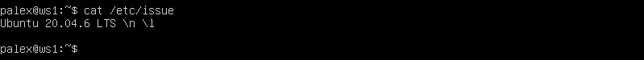

---
[Содержание](#содержание)

## Part 2. Создание пользователя

**Задание:**

### Создай пользователя, отличного от созданного при установке. Пользователь должен быть добавлен в группу `adm`

+ Вставь скриншот вызова команды для создания пользователя.
  + Для создания нового пользователя воспользуемся командой  `sudo adduser user1`
  + Ответим на запросы скрипта 
  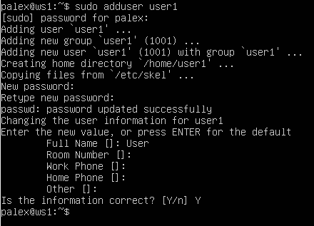<
  + Но созданный нами пользователь не состоит в группе `amd` 
  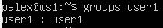 
  + Добавим пользователя `user1` в группу `adm` командой  `sudo usermod -a -G adm user1`, а командой  `groups user1` просмотрим группы, в которых состоит `user1` 
    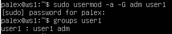

+ Новый пользователь должен быть в выводе команды  `cat /etc/passwd`, Вставь скриншот с выводом команды.
  + Просмотрим файл `passwd` 
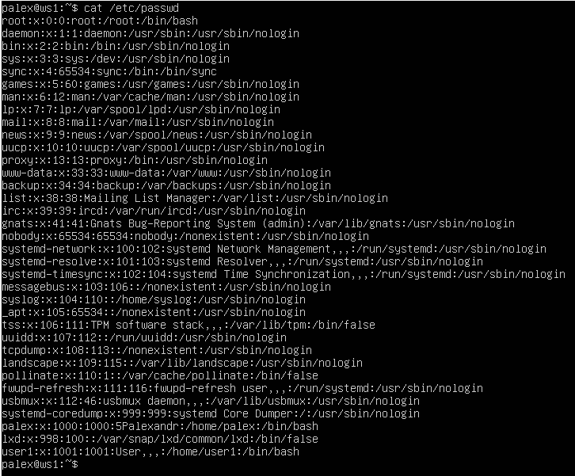

  + Для того, чтобы просмотреть только пользователя `user1` используем команду  `cat /etc/passwd | grep user1` 
    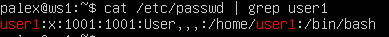

---
[Содержание](#содержание)

## Part 3. Настройка сети ОС

**Задание:**

### Задай название машины вида user-1

+ Сначала узнаем текущее имя машины при помощи команды   `hostname` 
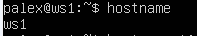
+ Больше сведений о машине даст команда   `hostnamectl status`  
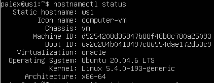
+ Изменим имя хоста командой   `hostnamectl set-hostname user-1`  система просит аутентификацию, введем пароль
+ Просмотрим сведения о хосте   `hostnamectl status`  
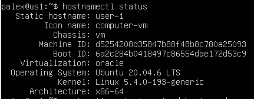
+ Закрепим сделанные изменения `reboot`-ом 🙂 

### Установи временную зону, соответствующую твоему текущему местоположению

+ В `systemd` есть своя утилита для настройки даты и часового пояса. Чтобы узнать текущее состояние выполним   `timedatectl status`  
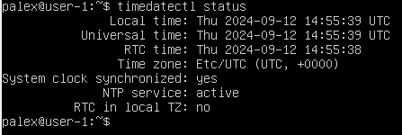
+ Для просмотра всех доступных временных зон выполним такую команду   `timedatectl list-timezones` 
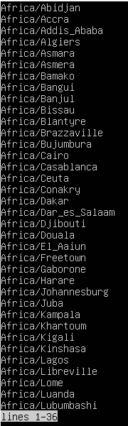
+ Так получается многовато данных, применим   `grep`  
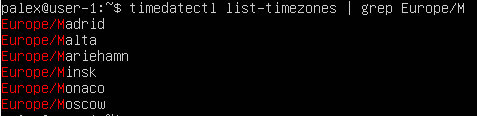
+ Теперь мы знаем имя нужной тайм-зоны и установим её командой   `sudo timedatectl set-timezone Europe/Moscow` 
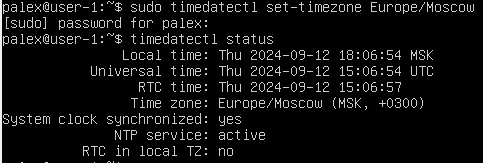 
Здесь нужен супер-пользователь так как мы вносим изменения в системные настройки. 
Командой `timedatectl status` - увидим внесенные изменения 😎

### Выведи названия сетевых интерфейсов с помощью консольной команды

+ Для просмотра текущих параметров сети и состояния сетевых интерфейсов в ОС Линукс существует команда   `ifconfig` (в моем случае её пришлось установить в составе пакета `net-tools` )  
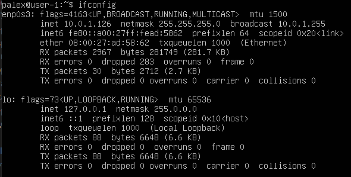

+ **Lo (loopback device)** – виртуальный интерфейс, присутствующий по умолчанию в любом Linux. Он используется для отладки сетевых программ и запуска серверных приложений на локальной машине. С этим интерфейсом всегда связан адрес `127.0.0.1`. У него есть dns-имя – `localhost`. 
Интерфейс `lo` является виртуальным сетевым интерфейсом, который называется возвратной петлей, поскольку он «закольцован» сам на себя. Результат таков,
что при подключении к адресу `127.0.0.1` происходит подключение к компьютеру,
которым вы пользуетесь в данный момент. Когда исходящие данные для локального хоста доходят до сетевого интерфейса `lo` в ядре, ядро просто заново упаковывает их как входящие данные и отправляет обратно через интерфейс `lo`. 
Интерфейс возвратной петли `lo` часто является единственным местом, где можно увидеть статическую сетевую конфигурацию в сценариях загрузки системы.

### Используя консольную команду, получи ip адрес устройства, на котором ты работаешь, от DHCP-сервера

+ Кроме команды мы можем использовать команду  `ip a`  
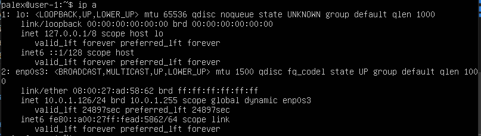
+ или команду  `hostname -I` 
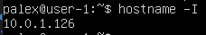

### Определи и выведи на экран внешний ip-адрес шлюза (ip) и внутренний IP-адрес шлюза, он же ip-адрес по умолчанию (gw)

+ Используем команду  `ip r`  
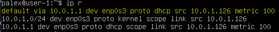
+ маршрут по умолчанию, он же шлюз, имеет адрес `10.0.1.1`
+ второй маршрут описывает взаимодействие с нашей 'серой' сетью, наш адрес `10.0.1.126` является шлюзом в нашу локальную сеть - то есть прямо с нашего компьютера пакеты будут идти к нужным хостам в нашей сети, если ip-адрес соответствует нашей сети.

### Задай статичные (заданные вручную, а не полученные от DHCP-сервера) настройки ip, gw, dns (используй публичный DNS-серверы, например 1.1.1.1 или 8.8.8.8)

+ Начиная с релиза Ubuntu 17.10, для управления конфигурацией сети используется утилита Netplan. Раньше для этих целей применялся скрипт `ifupdown`, конфигурационные файлы которого находились в папке `/etc/network/interfaces`
+ Все конфигурационные файлы Netplan находятся в папке `/etc/netplan/`. Во время запуска службы, она преобразовывает свою конфигурацию в конфигурацию той службы, которая будет управлять сетью и помещает её в каталог `/run/`
+ Выполним команду  `ls /etc/netplan` 
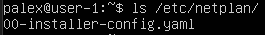
+ Выполним команду  `sudo cat /etc/netplan/00-installer-config.uaml` 

+ С помощью `nano` внесем изменения в этот файл 

### Перезагрузи виртуальную машину. Убедись, что статичные сетевые настройки (ip, gw, dns) соответствуют заданным в предыдущем пункте

+ Перезагрузим виртуальную машину и просмотрим маршруты 
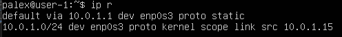

### Успешно пропингуй удаленные хосты 1.1.1.1 и ya.ru и вставь в отчёт скрин с выводом команды. В выводе команды должна быть фраза «0% packet loss»

+ Применим команду `ping` 
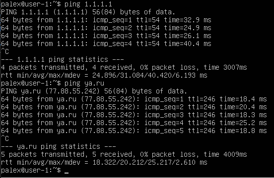

### Дай расшифровку DHCP

+ [Википедия](https://ru.wikipedia.org/wiki/DHCP) дает такое определение: 
**DHCP** (англ. `Dynamic Host Configuration Protocol` — протокол динамической настройки узла) — сетевой протокол, позволяющий сетевым устройствам автоматически получать IP-адрес и другие параметры, необходимые для работы в сети `TCP/IP`. 
Данный протокол работает по модели «клиент-сервер». Для автоматической конфигурации компьютер-клиент на этапе конфигурации сетевого устройства обращается к так называемому серверу **DHCP** и получает от него нужные параметры. Администратор сервера может задать диапазон адресов, распределяемых сервером среди компьютеров. Это позволяет избежать ручной настройки компьютеров сети и уменьшает количество ошибок. Протокол **DHCP** используется в большинстве сетей `TCP/IP`. 
Протокол DHCP предоставляет три способа распределения IP-адресов:
+ *Ручное распределение.* При этом способе сетевой администратор сопоставляет аппаратному адресу (для Ethernet-сетей это MAC-адрес) каждого клиентского компьютера определённый IP-адрес. Фактически данный способ распределения адресов отличается от ручной настройки каждого компьютера лишь тем, что сведения об адресах хранятся централизованно (на сервере DHCP), и потому их проще изменять при необходимости.
+ *Автоматическое распределение.* При данном способе каждому компьютеру на постоянное использование выделяется произвольный свободный IP-адрес из определённого администратором диапазона.
+ *Динамическое распределение.* Этот способ аналогичен автоматическому распределению за исключением того, что адрес выдаётся компьютеру не на постоянное пользование, а на определённый срок. Это называется арендой адреса. По истечении срока аренды IP-адрес вновь считается свободным, и клиент обязан запросить новый (он, впрочем, может оказаться тем же самым). Кроме того, клиент сам может отказаться от полученного адреса. 
Протокол **DHCP** является клиент-серверным, то есть в его работе участвуют клиент **DHCP** и сервер **DHCP**. Передача данных производится при помощи протокола `UDP`. По умолчанию запросы от клиента делаются к серверу на порт 67, сервер в свою очередь отвечает клиенту на порт 68, выдавая адрес IP и другую необходимую информацию, такую, как сетевую маску, маршрутизатор и серверы DNS.

---
[Содержание](#содержание)

## Part 4. Обновление ОС

**Задание:**

### Обнови системные пакеты до последней на момент выполнения задания версии

+ Запустим обновление репозиториев пакетов   `sudo apt update`  

+ Запустим обновление установленных пакетов:  `sudo apt upgrade` 
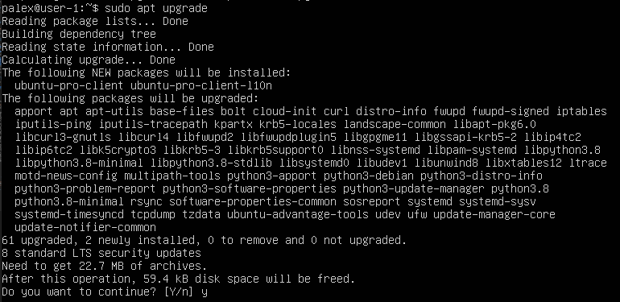

### После обновления системных пакетов, вставь в отчёт скриншот с сообщением о том, что обновления отсутствуют

+ Повторно запустим   `sudo apt update`  
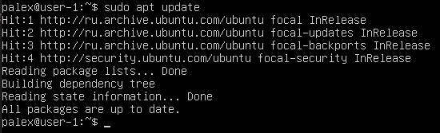
+ Повторно запустим   `sudo apt upgrade`  
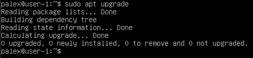

---
[Содержание](#содержание)

## Part 5. Использование команды `sudo`

**Задание:**

### Разреши пользователю, созданному в [Part 2](#part-2-создание-пользователя), выполнять команду `sudo`

+ Командой  `groups user1` просмотрим группы, в которых состоит `user1` 
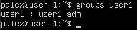
+ Добавим пользователя `user1` в группу `adm` командой  `sudo usermod -a -G sudo user1`, а командой  `groups user1` просмотрим группы, в которых состоит `user1` 
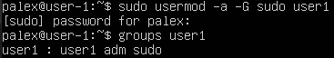

### Поменяй hostname ОС от имени пользователя, созданного в пункте [Part 2](#part-2-создание-пользователя) (используя `sudo`), вставь скрин с изменённым hostname в отчёт

+ Сменим текущего пользователя командой  `su user1`, а командой   `whoami` - проверим 
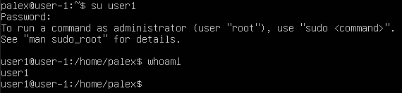
+ Изменим имя хоста командой   `sudo hostname ws1`  система просит аутентификацию, введем пароль пользователя `user1` 
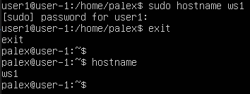

### В отчёте объясни *истинное* назначение команды sudo (про то, что это слово — «волшебное», писать не стоит)

`sudo` в Ubuntu — это утилита, предоставляющая привилегии `root` для выполнения административных операций в соответствии со своими настройками. Она позволяет легко контролировать доступ к важным приложениям в системе.

Основные функции sudo в Ubuntu:

+ *Предоставление временного доступа к правам root.* Это становится основой для выполнения критических команд, требующих высших полномочий.
+ *Установка или обновление программного обеспечения.* Например, чтобы установить новое приложение, достаточно ввести в командный интерфейс: `sudo apt-get install package_name`.
+ *Контроль доступа.* Системные администраторы могут ограничивать права для различных пользователей, устанавливая, к каким операциям они могут прибегать через *sudo*.
+ *Аудит и протоколирование команд*, запущенных с административными правами. Логи позволяют отслеживать, какая команда была выполнена, когда и кем, что важно для поддержания контроля и расследования возможных нарушений.

По умолчанию, при установке Ubuntu первому пользователю (тому, который создаётся во время установки) предоставляются полные права на использование `sudo`.

---
[Содержание](#содержание)

## Part 6. Установка и настройка службы времени

**Задание:**

### Настрой службу автоматической синхронизации времени, выведи время часового пояса, в котором ты сейчас находишься. (вывод следующей команды должен содержать `NTPSynchronized=yes`: \  `timedatectl show`), Вставь скрины с корректным временем и выводом команды в отчёт

+ По умолчанию в ubuntu настроена система автоматической синхронизации времени, проверим, а не запущена ли у вас уже синхронизация времени с помощью timesyncd. Проверяем:   `timedatectl timesync-status` 
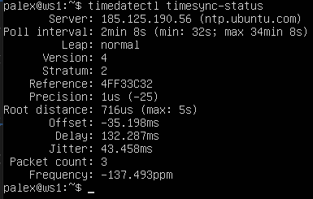
+ Так и есть. В большинстве современных дистрибутивов, где установлена `systemd`, уже запущена `timesyncd`. Параметры этой службы находятся в конфигурационном файле `/etc/systemd/timesyncd.conf`, где можно посмотреть, какой сервер используется для синхронизации времени и в случае необходимости, заменить. В Ubuntu это `ntp.ubuntu.com`.  
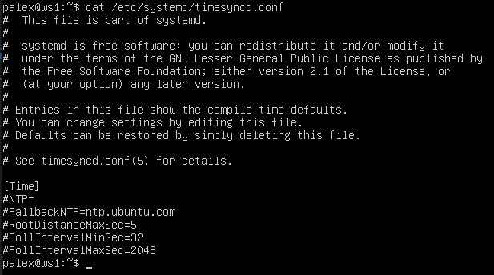

---
[Содержание](#содержание)

## Part 7. Установка и использование текстовых редакторов

**Задание:**

### Установи текстовые редакторы **VIM** (+ любые два по желанию **NANO**, **MCEDIT**, **JOE** и т. д.)

+ указанные в задании текстовые редакторы в моей системе установлены и обновлены, проверим это 
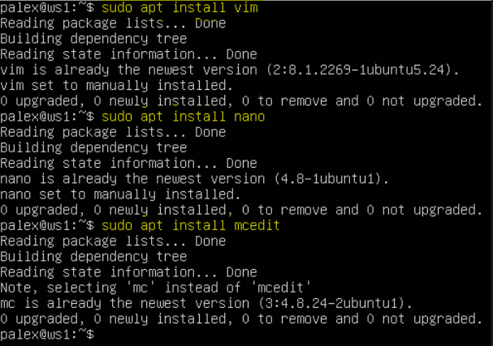

### Используя каждый из трех выбранных редакторов, создай файл *test_X.txt*, где X — название редактора, в котором создан файл

+ Напиши в нём свой никнейм, закрой файл с сохранением изменений.  
+ В отчёт вставь скриншоты:
  + Из каждого редактора с содержимым файла перед закрытием.
+ В отчёте укажи, что сделал для выхода с сохранением изменений.

**Vim:** создадим, заполним и выйдем с сохранением изменений  `vim test_vim.txt`  введем имя пользователя и выйдем с сохранением   `:wq` 
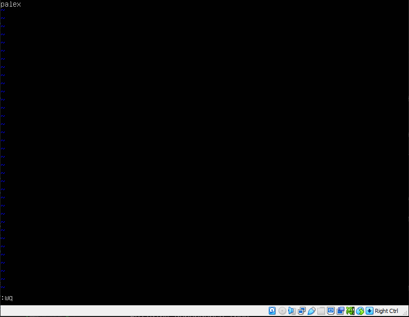

**Nano:** создадим, заполним и выйдем с сохранением изменений  `nano test_nano.txt`  введем имя пользователя сохраним `ctrl+o` и выйдем `ctrl+x` 
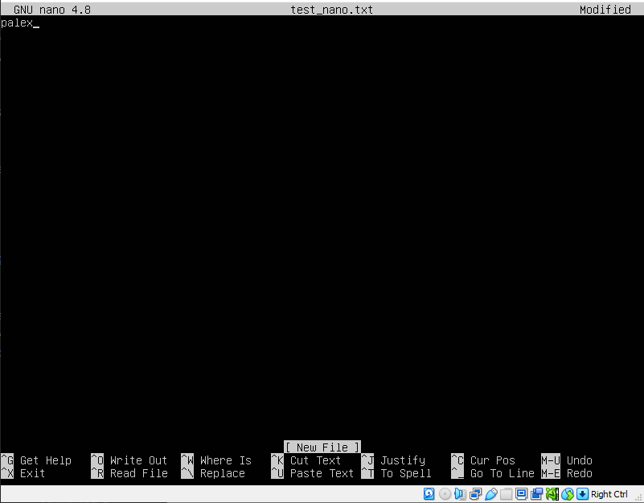

**Mcedit:** создадим, заполним и выйдем с сохранением изменений  `mcedit test_mcedit.txt`  введем имя пользователя сохраним `F2` и выйдем `F10` 
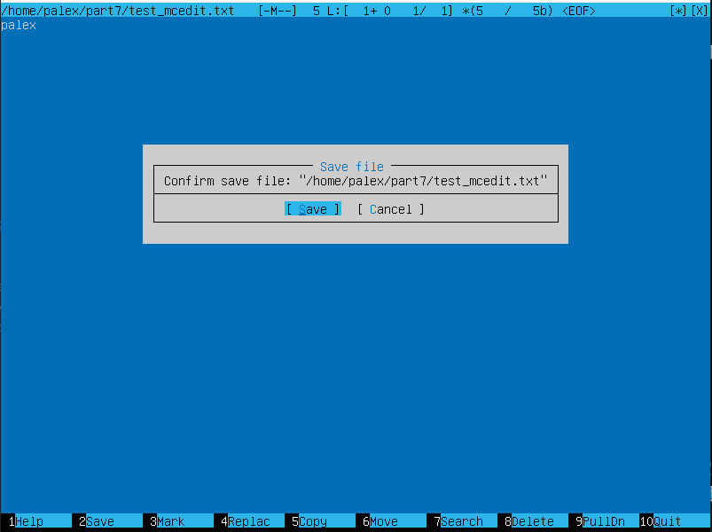

### Используя каждый из трех выбранных редакторов, открой файл на редактирование, отредактируй файл, заменив никнейм на строку «21 School 21», закрой файл без сохранения изменений

+ В отчёт вставь скриншоты:
  + Из каждого редактора с содержимым файла после редактирования.
+ В отчёте укажи, что сделал для выхода без сохранения изменений.

**Vim:** откроем для редактирования созданный нами файл, внесем изменения и выйдем без сохранения изменений  `vim test_vim.txt`  `:w!` 
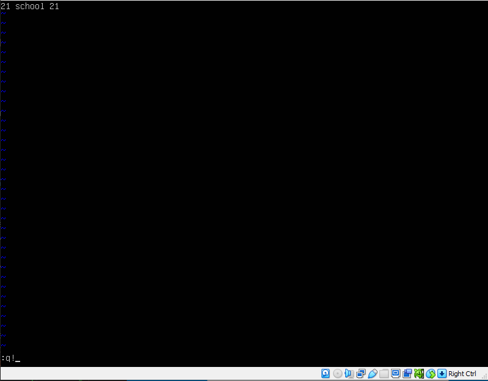

**Nano:** откроем для редактирования созданный нами файл, внесем изменения и выйдем без сохранения изменений  `nano test_nano.txt`  `ctrl+x`  нажмем `N` чтобы не сохранять изменения 
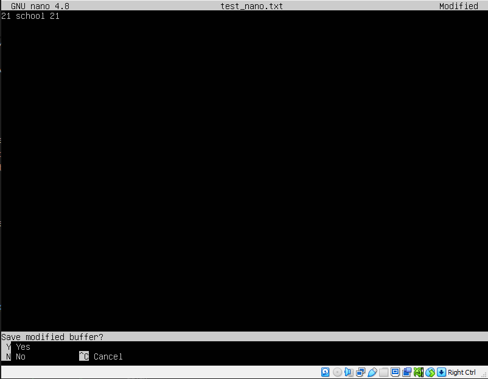

**Mcedit:** откроем для редактирования созданный нами файл, внесем изменения и выйдем без сохранения изменений  `mcedit test_mcedit.txt`  `F10`  выберем `No` 
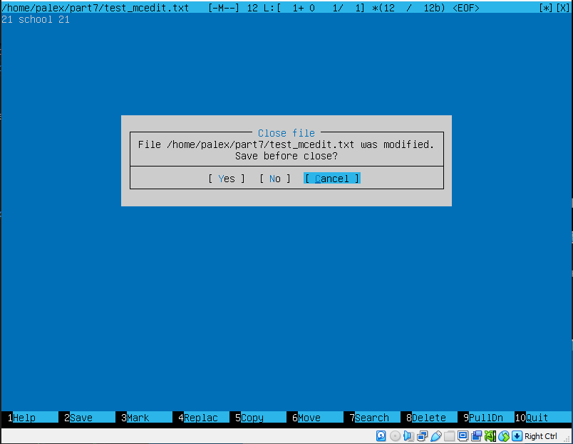

### Используя каждый из трех выбранных редакторов, отредактируй файл ещё раз (по аналогии с предыдущим пунктом), а затем освой функции поиска по содержимому файла (слово) и замены слова на любое другое

+ В отчёт вставь скриншоты:
  + Из каждого редактора с результатами поиска слова.
  + Из каждого редактора с командами, введёнными для замены слова на другое.

**Vim:**

+ Режим редактирования: `I`
+ Выйти из режима редактирования: `esc`
+ Выход с охранением: `:wq`
+ Выход без сохранения: `:q`
+ Поиск и замена:
  + `/` - Начать поиск.
  + `?` - Начать поиск назад.
  + `n` - Найти следующее вхождение.
  + `N` - Найти предыдущее вхождение.
  + `:%s/старый/новый/g` - Заменить "старый" на "новый" во всём файле.
  + `:%s/старый/новый/gc` - Заменить с подтверждением для каждой замены.

*Поиск*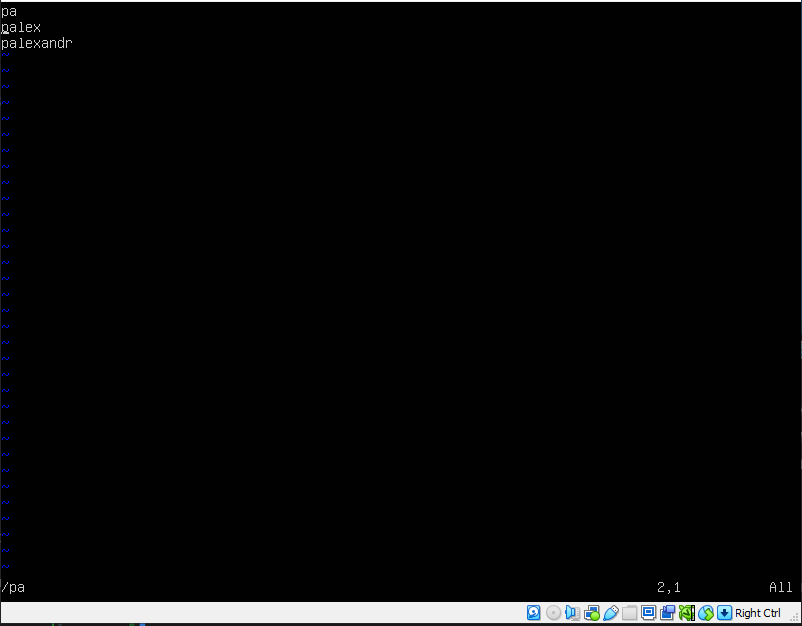
*Замена*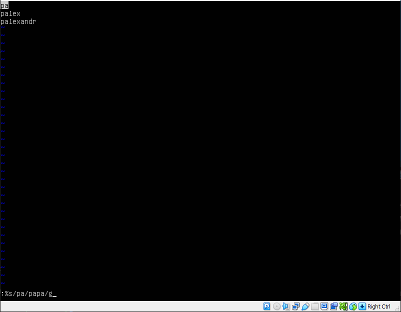
*Результат*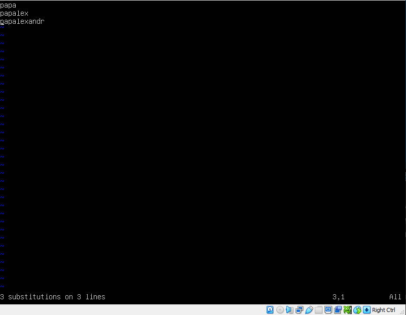

**Nano:**

+ Выход с сохранением: `Ctrl + o`, `Ctrl + x`
+ Выход без сохранения: `Ctrl + x`, затем `n`
+ Поиск и замена:
  + `Ctrl+Q` Начать обратный поиск
  + `Ctrl+W` Начать поиск вперед
  + `Alt+Q` Найти следующее вхождение назад
  + `Alt+W` Найти следующее вхождение вперед
  + `Alt+R` Начать сеанс замены

*Поиск*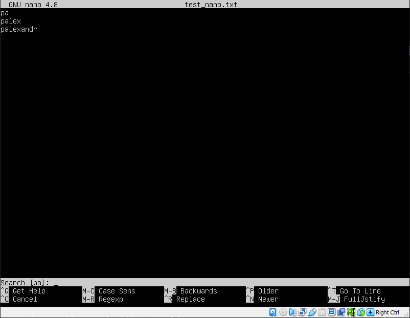
*Замена (старое)*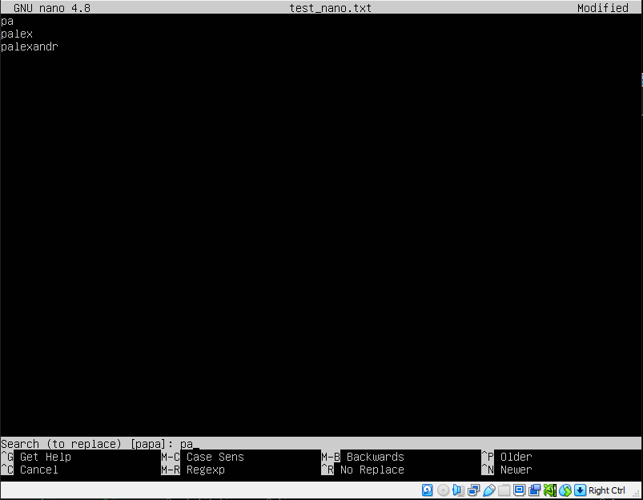
*Замена (новое)*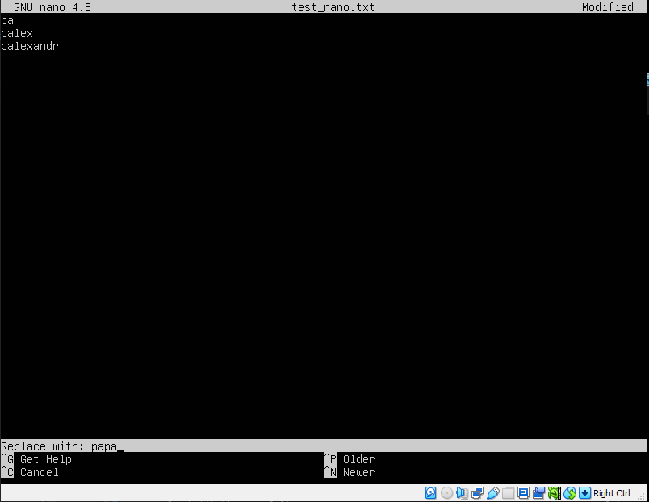
*Замена (запрос)*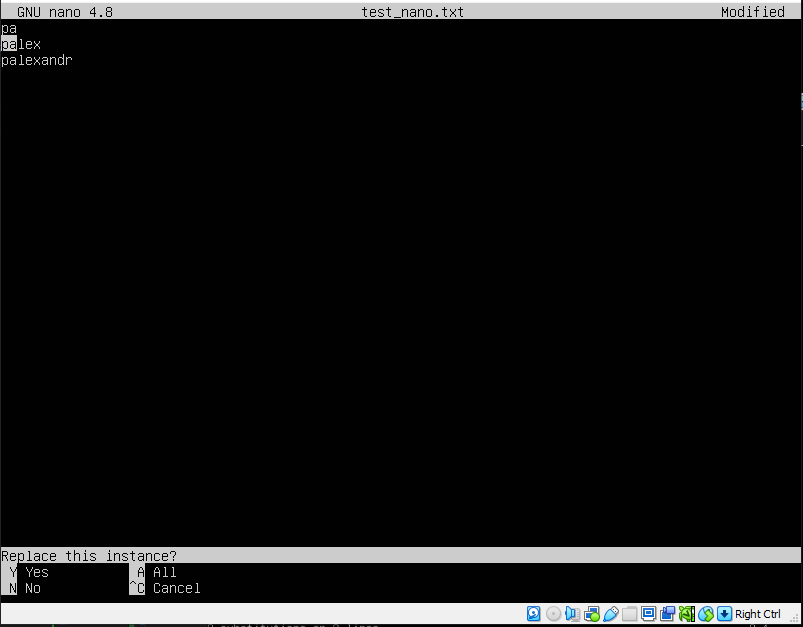
*Результат*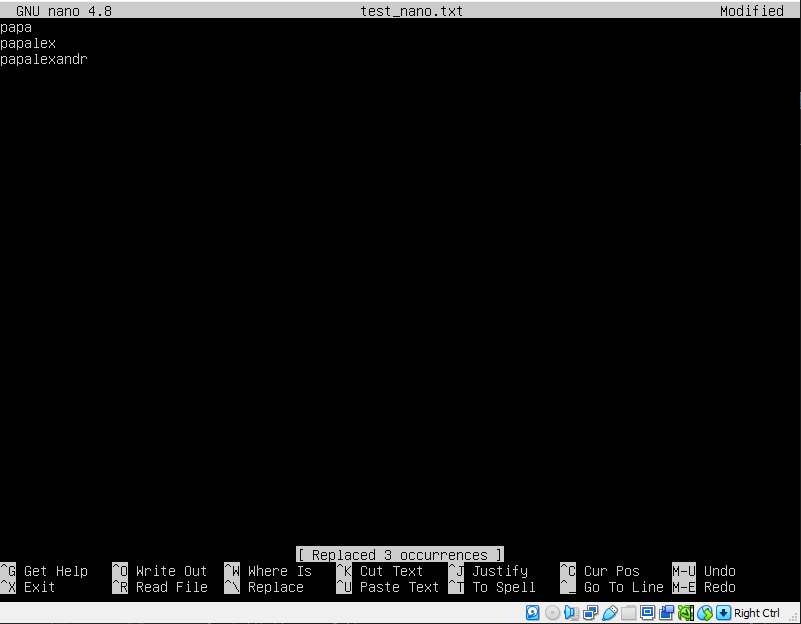

**Mcedit:**

+ Выход с охранением: `F2 (yes)` + `F10`
+ Выход без сохранения: `F10(no)`
+ Поиск: `F7` + `<текст который ищем>` + `<ок>`
+ Замена: `F4` + `<что хотим изменить>` + `<на что хотим заменить>` + `replace`

---
[Содержание](#содержание)

## Part 8. Установка и базовая настройка сервиса `SSHD`

**Задание:**

### Установи службу SSHd

+ Обновим системный репозиторий  
`sudo apt update`
+ Установим openssh-server  `sudo apt install openssh-server`
+ Убедимся, что ssh-server запущен   `sudo systemctl start ssh`

### Добавь автостарт службы при загрузке системы

+ Добавим службу ssh в автозагрузку  `sudo systemctl enable ssh`
+ Командой  `sudo systemctl status ssh`  мы проверим, что служба ssh сейчас запущена и слушаем 22 порт.

### Перенастрой службу SSHd на порт 2022

+ Используем  `sudo mcedit /etc/ssh/sshd_config`
+ Изменим настройки ssh на 2022 порт
+ Проверим полученный результат  `sudo systemctl status ssh`
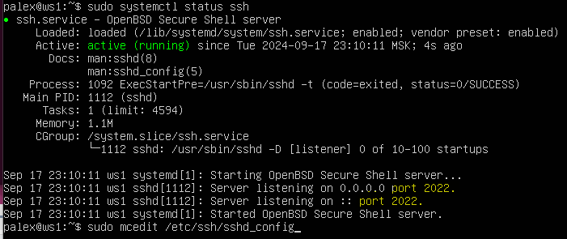

### Используя команду ps, покажи наличие процесса sshd. Для этого к команде нужно подобрать ключи

(В отчёте объясни значение команды и каждого ключа в ней.)

+ Запустим  `ps -A | grep sshd` 
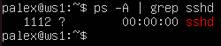

+ `ps` (показывает запущенные процессы, выполняемые пользователем в окне терминала);
  + `ps -e` или `ps -A` (Чтобы просмотреть все запущенные процессы);
  + `ps -d` (Чтобы показать все процессы, кроме лидеров сессии);
  + `ps -d -N` (можно инвертировать вывод с помощью переключателя `-N`. Например, если хочу вывести только лидеров сеансов) `ps T` (увидеть только процессы, связанные с этим терминалом);
  + `ps r` (просмотреть все работающие (running) процессы);
  + `ps -p 'pid'` (если вы знаете идентификатор процесса PID, вы можете просто использовать следующую команду, для вывода процесса с этим 'pid');
  + `ps -p 'pid1' 'pid2' ps U 'userlist'` (найти все процессы, выполняемые конкретным пользователем);
  + `ps -ef` (получить полный список);

### Перезагрузи систему

(Вывод команды `netstat -tan` должен содержать  \
`tcp 0 0 0.0.0.0:2022 0.0.0.0:* LISTEN`  \
(если команды netstat нет, то ее нужно установить).)

+ Скрин с выводом команды вставь в отчёт.
+ В отчёте объясни значение ключей -tan, значение каждого столбца вывода, значение 0.0.0.0.
+ Запустим команду  `netstat -tan`
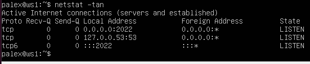

+ **netstat:**
  + `-t (--tcp)` отображает соединения только по tcp
  + `-a (--all)` вывод всех активных подключений TCP
  + `-n (--numeric)` вывод активных подключений TCP с отображением адресов и номеров портов в числовом формате
+ **Proto:** Название протокола (протокол TCP или протокол UDP);
+ **Recv-Q:** очередь получения сети
+ **Send-Q:** Сетевая очередь отправки
+ **Local Address** адрес локального компьютера и используемый номер порта
+ **Foreign Address** адрес и номер удаленного компьютера к которому подключен сокет
+ **State** состояние сокета
+ `0.0.0.0` означает IP-адрес на локальной машине

---
[Содержание](#содержание)

## Part 9. Установка и использование утилит `top`, `htop`

**Задание:**

### Установи и запусти утилиты top и htop

#### По выводу команды top определи и напиши в отчёте

+ uptime,
+ количество авторизованных пользователей,
+ среднюю загрузку системы,
+ общее количество процессов,
+ загрузку cpu,
+ загрузку памяти,
+ pid процесса занимающего больше всего памяти,
+ pid процесса, занимающего больше всего процессорного времени.

Почти все данные из задания можно увидеть просто выполнив команду `top`

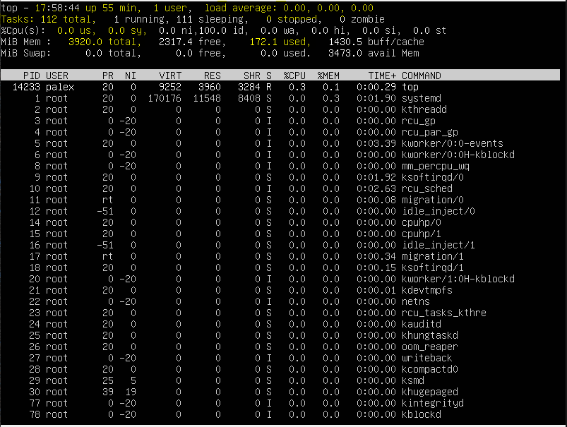

Для двух последних вопросов отсортируем процессы при помощи `>` или `<`

#### В отчёт вставь скрин с выводом команды htop

+ отсортированному по PID, PERCENT_CPU, PERCENT_MEM, TIME; 
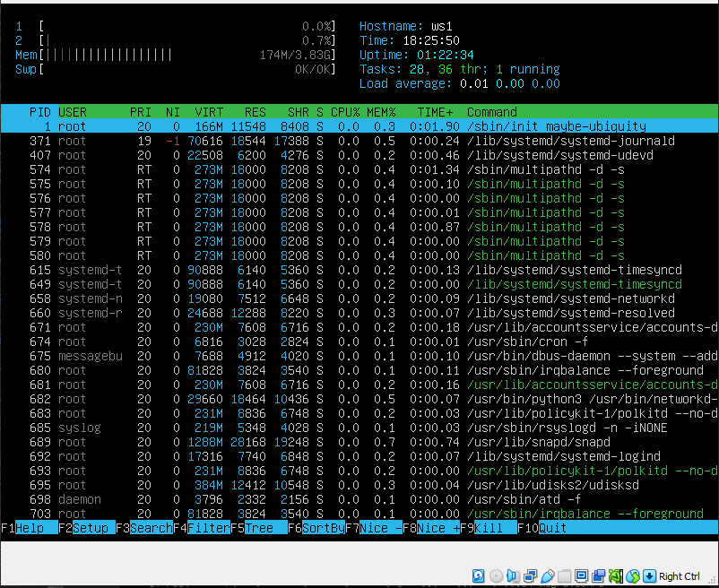
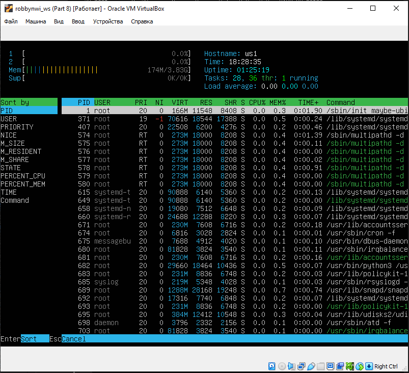


+ отфильтрованному для процесса `sshd`; 

+ с процессом syslog, найденным, используя поиск; 

+ с добавленным выводом `hostname`, `clock` и `uptime`.  
Настроить вид можно через `F2` 


---
[Содержание](#содержание)

## Part 10. Использование утилиты `fdisk`

**Задание:**

### Запусти команду fdisk -l

+ В отчёте напиши название жесткого диска, его размер и количество секторов, а также размер swap.

+ `swap` просмотрим командой `free -m` 


---
[Содержание](#содержание)

## Part 11. Использование утилиты `df`

**Задание:**

### Запусти команду df

+ В отчёте напиши для корневого раздела (/):
  + размер раздела,
  + размер занятого пространства,
  + размер свободного пространства,
  + процент использования.
+ Определи и напиши в отчёт единицу измерения в выводе.  


### Запусти команду df -Th

+ В отчёте напиши для корневого раздела (/):
  + размер раздела,
  + размер занятого пространства,
  + размер свободного пространства,
  + процент использования.
+ Определи и напиши в отчёт тип файловой системы для раздела.


---
[Содержание](#содержание)

## Part 12. Использование утилиты `du`

**Задание:**

### Запусти команду du


### Выведи размер папок /home, /var, /var/log (в байтах, в человекочитаемом виде)


### Выведи размер всего содержимого в /var/log (не общее, а каждого вложенного элемента, используя *)

(В отчёт вставь скрины с выводом всех использованных команд.)

+ Используем команду `sudo du -sh /var/log/* > part11/result .txt`, так как есть возможность, что не весь вывод поместиться в экран, то мы направим вывод в файл.
+ Просмотрим результат


---
[Содержание](#содержание)

## Part 13. Установка и использование утилиты `ncdu`

**Задание:**

### Установи утилиту ncdu


### Выведи размер папок /home, /var, /var/log


---
[Содержание](#содержание)

## Part 14. Работа с системными журналами

**Задание:**

### Открой для просмотра

#### 1. /var/log/dmesg


#### 2. /var/log/syslog


#### 3. /var/log/auth.log


+ Напиши в отчёте время последней успешной авторизации, имя пользователя и метод входа в систему.


+ Перезапусти службу SSHd: команда  `systemctl restart sshd`

+ Вставь в отчёт скрин с сообщением о рестарте службы (искать в логах).


---
[Содержание](#содержание)

## Part 15. Использование планировщика заданий `CRON`

**Задание:**

### Используя планировщик заданий, запусти команду uptime через каждые 2 минуты


+ Найди в системных журналах строчки (минимум две в заданном временном диапазоне) о выполнении.


+ Выведи на экран список текущих заданий для CRON.


+ Вставь в отчёт скрины со строчками о выполнении и списком текущих задач.


+ Удали все задания из планировщика заданий, вставь скрин со списком текущих заданий для CRON.


Всем бобра! 🖐️😋

---
[Содержание](#содержание)
