# DO2 LinuxNetwork

Настройка сетей в Linux на виртуальных машинах.

## Содержание

1. [Инструмент `ipcalc`](#part-1-инструмент-ipcalc)
    + [Сети и маски](#11-сети-и-маски)
    + [`localhost`](#12-localhost)
    + [Диапазоны и сегменты сетей](#13-диапазоны-и-сегменты-сетей)
2. [Статическая маршрутизация между двумя машинами](#part-2-статическая-маршрутизация-между-двумя-машинами)
    + [Добавление статического маршрута вручную](#21-добавление-статического-маршрута-вручную)
    + [Добавление статического маршрута с сохранением](#22-добавление-статического-маршрута-с-сохранением)
3. [Утилита iperf3](#part-3-утилита-iperf3)
    + [Скорость соединения](#31-скорость-соединения)
    + [Утилита `iperf3`](#32-утилита-iperf3)
4. [Сетевой экран](#part-4-сетевой-экран)
    + [Утилита `iptables`](#41-утилита-iptables)
    + [Утилита `nmap`](#42-утилитаnmap)
5. [Статическая маршрутизация сети](#part-5-статическая-маршрутизация-сети)
    + [Настройка адресов машин](#51-настройка-адресов-машин)
    + [Включение переадресации IP-адресов](#52-включение-переадресации-ip-адресов)
    + [Установка маршрута по-умолчанию](#53-установка-маршрута-по-умолчанию)
    + [Добавление статических маршрутов](#54-добавление-статических-маршрутов)
    + [Построение списка маршрутизаторов](#55-построение-списка-маршрутизаторов)
    + [Использование протокола ICMP при маршрутизации](#56-использование-протокола-icmp-при-маршрутизации)
6. [Динамическая настройка IP с помощью DHCP](#part-6-динамическая-настройка-ip-с-помощью-dhcp)
    + [Настройка службы DHCP на r2](#61-настройка-службы-dhcp-на-r2)
    + [Указать MAC-адреса](#62-указать-mac-адреса)
    + [Обновление ip адреса с помощью команды `sudo dhclient`](#63-обновление-ip-адреса-с-помощью-команды-sudo-dhclient)
7. [NAT](#part-7-nat)
    + [Делаем сервер Apache2 общедоступным](#71-делаем-сервер-apache2-общедоступным)
    + [Создаем фаервол на r2](#72-создаем-фаервол-на-r2-как-в-части-4)
8. [Дополнительно. Знакомство с SSH Tunnels](#part-8-дополнительно-знакомство-с-ssh-tunnels)

## Part 1. Инструмент `ipcalc`

**ipcalc** — это утилита, которая может выполнять простые манипуляции с адресами IPv4.

Если вы просто наберете `ipcalc` без каких-либо параметров ввода, это даст хороший вывод «справки» с некоторыми примерами, которые очень полезны для начала работы.

Инструмент `ipcalc` можно применять для следующих задач:

+ проверить IP-адрес;
+ показать рассчитанный широковещательный адрес;
+ отображение имени хоста, определенного через DNS;
+ отображение сетевого адреса или префикса.

Для установки утилиты `ipcalc` следует ввести следующую команду:

```sh
sudo apt install ipcalc
```

Использование: `ipcalc [options] ADDRESS [ [/]] [NETMASK]`.

**Опции:**

+ `-n` (**--nocolor**) - подавить вывод цветов;
+ `-b` (**--nobinary**) - подавить поразрядный вывод;
+ `-c` (**--class**) - показать маску сети по адресу;
+ `-h` (**--html**) - показать результаты в HTML;
+ `-v` (**--version**) - показать версию программы;
+ `-s` (**--split n1 n2 n3**) - разделить сети по размеру n1, n2, n3;
+ `-r` (**--range**) - исключить диапазон адресов;
+ `--help` - помощь.

**Особенности `ipcalc`:**

+ `ipcalc` также выдает двоичные эквиваленты для каждого адреса, что помогает лучше визуализировать адреса;
+ пробел в двоичном представлении разделяет сетевую и хостовую часть адреса;
+ нельзя указывать в качестве ввода двоичную форму адреса.

### IP-классификация

Существуют классификации IP-адресов как «частные» и «публичные».

Следующие диапазоны адресов зарезервированы для частных (также известных как LAN) сетей:

+ *10.0.0.0* — *10.255.255.255* (*10.0.0.0/8*);
+ *172.16.0.0* — *172.31.255.255* (*172.16.0.0/12*);
+ *192.168.0.0* — *192.168.255.255* (*192.168.0.0/16*);
+ *127.0.0.0* — *127.255.255.255* (зарезервировано для петлевых интерфейсов (не используется для связи между узлами сети), так называемый localhost).

### Порты

Стандарт определяет для каждого из протоколов **TCP** и **UDP** возможность одновременного выделения до 65536 уникальных портов на хосте, которые обозначаются номерами от 0 до 65535.

Весь ассортимент портов разбит на 3 группы:

+ от 0 до 1023 называются привилегированными или зарезервированными (используются для системы и некоторых популярных программ);
+ порты с 1024 по 49151 называются зарегистрированными портами;
+ порты с 49151 по 65535 называются динамическими портами.

**Работа с виртуальной машиной ws1.**

### 1.1. Сети и маски

**Определить и записать в отчёт:**

**Адрес сети `192.167.38.54/13`**

`ipcalc` предоставляет простой метод для вычисления IP-информации хоста. Различные опции определяют, какую информацию `ipcalc` должен вывести на стандартный выход. Могут быть заданы несколько опций. Обрабатываемый IP-адрес всегда должен быть указан. Для большинства операций также требуется сетевая маска или префикс CIDR.

Воспользовавшись командой `ipcalc`, можно определить адрес сети в поле Address

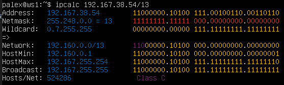

> Сетевой адрес — идентификатор устройства, работающего в компьютерной сети.
>
> Маска подсети — битовая маска для определения по IP-адресу адреса подсети и адреса узла этой подсети.<br>
>В отличие от IP-адреса маска подсети не является частью IP-пакета.<br>
>Благодаря маске можно узнать, какая часть IP-адреса узла сети относится к адресу сети, а какая — к адресу самого узла в этой сети.
>
> Префиксная запись. Краткий формат записи маски подсети, в котором указывается только количество единичных битов в маске после косой черты.
>

**Перевод маски `255.255.255.0` в префиксную и двоичную запись**

+ Префиксная запись маски `255.255.255.0` в поле `Network: /24`
+ Двоичная запись маски `255.255.255.0` в поле `Netmask: 11111111.11111111.11111111.00000000`

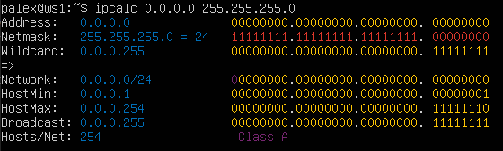

**Перевод маски `/15` в обычную и двоичную,**

+ `/15` в обычной записи в поле Netmask: `255.254.0.0`
+ `/15` в двоичной записи также в поле Netmask: `1111111.11111110.00000000.00000000`

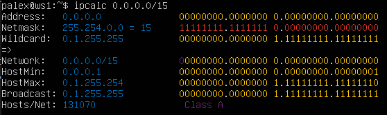

**Перевод маски `11111111.11111111.11111111.11110000` в обычную и префиксную**

> Команда `ipcalc` не принимает маски в двоичной записи, поэтому переведем исходную маcку `11111111.11111111.11111111.11110000` в обычную запись и получим `255.255.255.240`

+ В обычной форме: `255.255.255.240`
+ В префиксной форме: `/28`

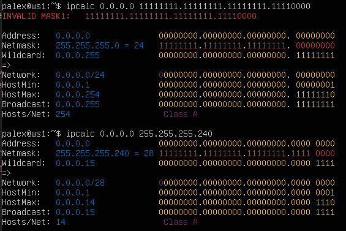

**Минимальный и максимальный хост в сети: `12.167.38.4` при масках:**

+ `/8`,
  + Минимальный хост сети: `12.0.0.1`
  + Максимальный хост сети: `12.255.255.254`<br>
  
    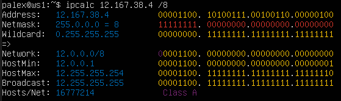
+ `11111111.11111111.00000000.00000000`,
  + Минимальный хост сети: `12.167.0.1`
  + Максимальный хост сети: `12.167.255.254`<br>

    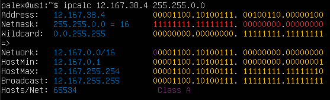

+ `255.255.254.0`
  + Минимальный хост сети: `12.167.38.1`
  + Максимальный хост сети: `12.167.39.254`<br>

    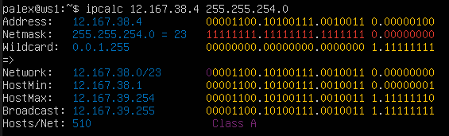

+ `/4`
  + Минимальный хост сети: `0.0.0.1`
  + Максимальный хост сети: `15.255.255.254`<br>

    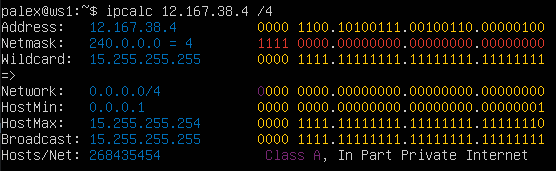

---
[Содержание](#содержание)

### 1.2. localhost

**Определить и записать в отчёт, можно ли обратиться к приложению, работающему на localhost, со следующими IP:**

+ `194.34.23.100` - **нет**,
+ `127.0.0.2` - **да**,
+ `127.1.0.1` - **да**,
+ `128.0.0.1` - **нет**.

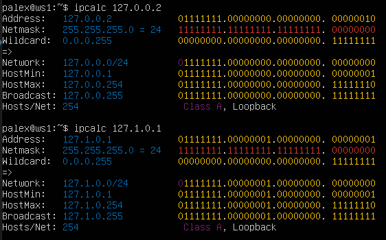

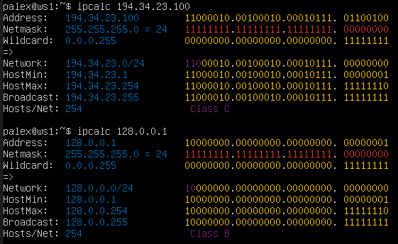

---
[Содержание](#содержание)

### 1.3. Диапазоны и сегменты сетей

**Какие из перечисленных IP можно использовать в качестве публичного, а какие только в качестве частных:**

> Все IP-адреса протокола IPv4 делятся на публичные/глобальные/внешние (их называют "белые") — они используются в сети Интернет, и частные/локальные/внутренние (их называют "серые") — используются в локальной сети.
>
> К частным "серым" адресам относятся IP-адреса из следующих подсетей:
>
>+ От 10.0.0.0 до 10.255.255.255 с маской 255.0.0.0 или /8
>+ От 172.16.0.0 до 172.31.255.255 с маской 255.240.0.0 или /12
>+ От 192.168.0.0 до 192.168.255.255 с маской 255.255.0.0 или /16
>+ От 100.64.0.0 до 100.127.255.255 с маской подсети 255.192.0.0 или /10
>
> Это зарезервированные IP-адреса. Такие адреса предназначены для применения в закрытых локальных сетях, распределение таких адресов никем не контролируется.

*Публичный IP адрес* - называется IP адрес, который используется для выхода в Интернет.<br>
*Частный IP адрес* - адреса, используемые в локальных сетях (не может быть напрямую подключен к Интернету).

**Частные:**

+ `10.0.0.45`,
+ `10.10.10.10`,

    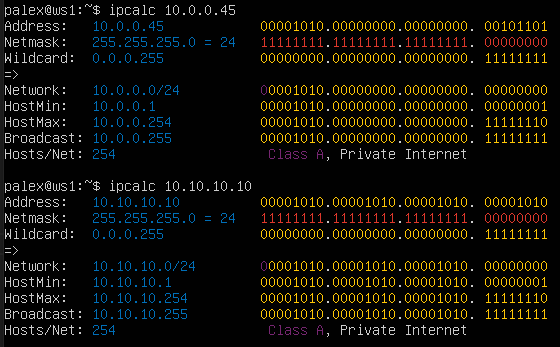

+ `172.20.250.4`,
+ `172.16.255.255`,
+ `192.168.4.2`,

    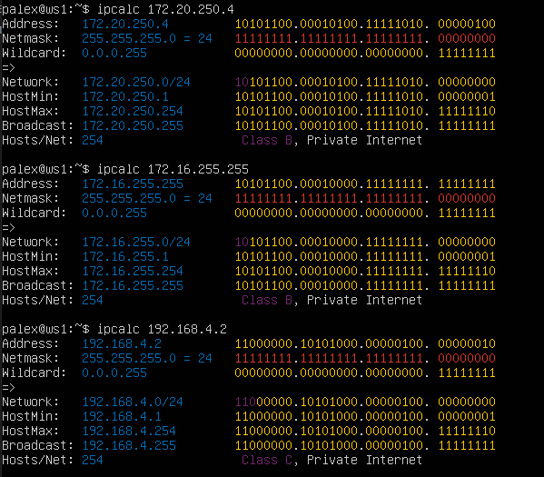

**Публичные:**

+ `134.43.0.2`,
+ `172.0.2.1`,

    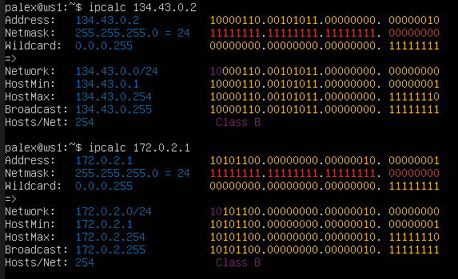

+ `192.172.0.1`,
+ `172.68.0.2`,
+ `192.169.168.1`.

    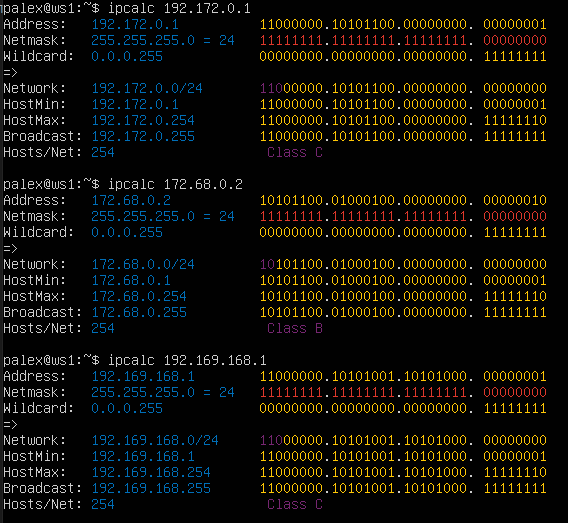

**Какие из перечисленных IP-адресов шлюза возможны у сети `10.10.0.0/18`:**

> Диапазон возможных IP-адресов: 10.0.0.1 - 10.10.63.254

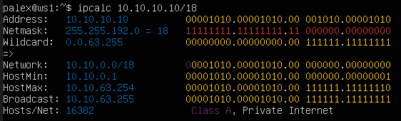

**Возможные адреса:**

+ 10.0.0.1,
+ 10.10.0.2

**Невозможные адреса:**

+ 10.10.10.10,
+ 10.10.100.1,
+ 10.10.1.255

---
[Содержание](#содержание)

## Part 2. Статическая маршрутизация между двумя машинами

**Поднимем две виртуальные машины (далее -- ws1 и ws2).**


**С помощью команды `ip a` посмотрим существующие сетевые интерфейсы:**

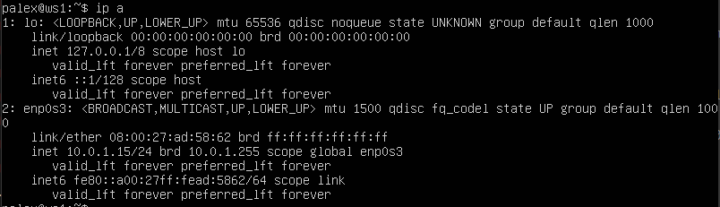

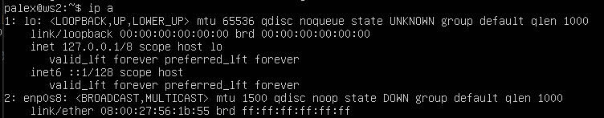

**При помощи `mceditor` изменим содержимое файлов настройки сети**

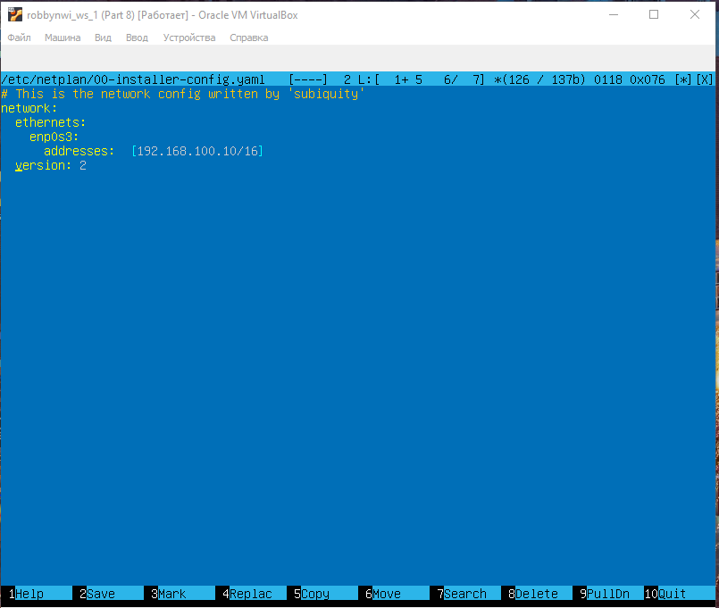

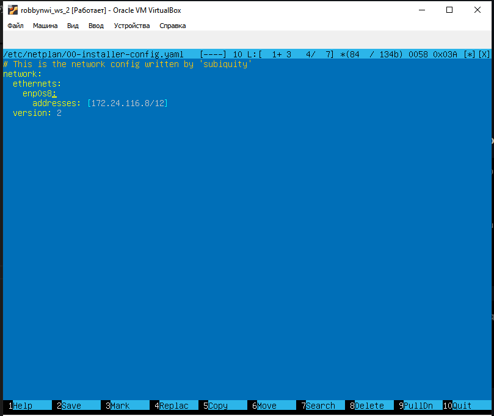

**Выполним команду `netplan apply` для перезапуска сервиса сети**

**Сетевые интерфейсы после выполнения команды:**

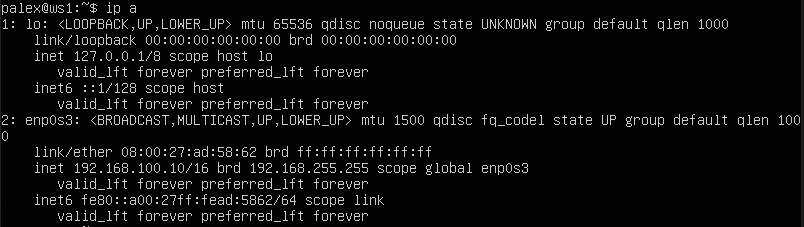

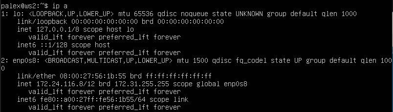

---
[Содержание](#содержание)

### 2.1. Добавление статического маршрута вручную

Прочесть про добавление, удаление маршрутов и т.д., можно в этой [статье](https://sysadminmosaic.ru/ip_command/ip_command "Команда ip").

Добавим статический маршрут от одной машины до другой и обратно при помощи команды вида `ip r add`

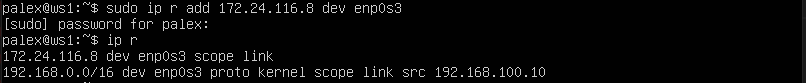

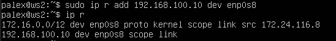

**Пропингуем соединение между машинами:**

> Ping — утилита для проверки целостности и качества соединений в сетях на основе TCP/IP.

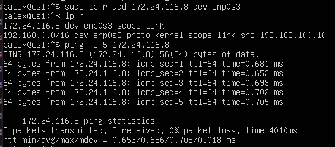

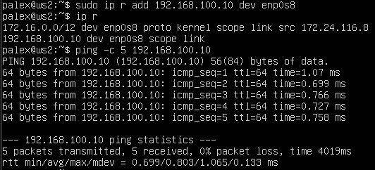

---
[Содержание](#содержание)

### 2.2. Добавление статического маршрута с сохранением

Перезапустим машины с помощью `reboot` и после перезапуска статические маршруты будут удалены.

Добавим статические маршруты от одной машины до другой с помощью файла `etc/netplan/00-installer-config.yaml`

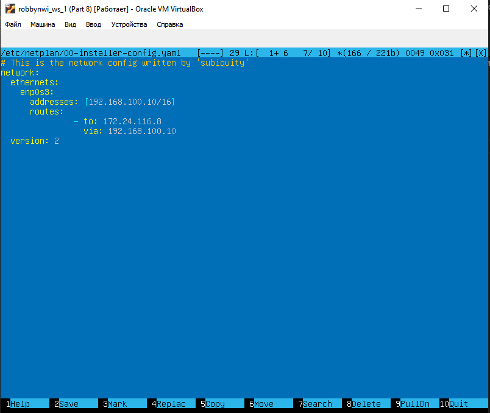

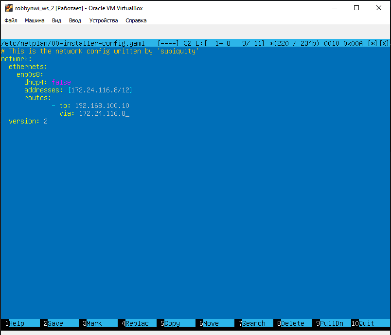

**Проверим, что изменения в файле сохранены, и применим новую конфигурацию с помощью `sudo netplan apply`**

**C помощью `ip r` убедимся, что маршруты добавлены**

**Пропингуем соединение между машинами:**

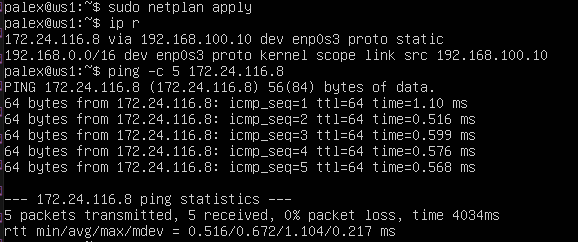

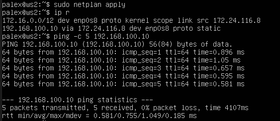

---
[Содержание](#содержание)

## Part 3. Утилита iperf3

### 3.1. Скорость соединения

Про скорости передачи данных можно прочесть в этой [статье](https://inet-yar.ru/articles/kakoj-skorosti-interneta-dostatochno).

Базовой единицей скорости передачи информации является бит в секунду (бит/с).<br>
Разница между байтами в секунду (Б/с) и битами в секунду (бит/c) такая же, как разница между байтами (Б) и битами (бит): 1 Б/с = 8 бит/с.<br>
Точно так же разница между килобайтами в секунду (КБ/с) и Б/с такая же, как разница между килобайтами и байтами: 1 КБ/с = 1024 Б/с. И так далее.

**Перевести и записать в отчёт: 8 Mbps в MB/s, 100 MB/s в Kbps, 1 Gbps в Mbps.**

| Исходное | Перевод | Пояснение |
| --- | --- | --- |
| 8 Mbps | 1 MB/s | 1 MB = 8 Mb |
| 100 MB/s | 800000 Kbps | 1 MB = 8 * 10^3 Kb |
| 1 Gbps | 1000 Mbps | 1 Gb = 10^3 Mb |

---
[Содержание](#содержание)

### 3.2. Утилита `iperf3`

Как пользоваться утилитой `iperf3` можно прочитать в этой [статье](https://losst.ru/kak-polzovatsya-iperf "Как пользоваться iperf").

**iperf3** — кроссплатформенная консольная клиент-серверная программа — генератор TCP и UDP трафика для тестирования пропускной способности в IP-сетях (поддерживает IPv4 и IPv6).<br>
С ее помощью довольно просто измерить максимальную пропускную способность сети между сервером и клиентом и провести нагрузочное тестирование канала связи.<br>
Поскольку утилита имеет как серверную часть так и клиентскую, надо рассматривать обе отдельно.<br>
Чтобы протестировать пропускную способность сети, вам нужно сначала подключиться к удаленной машине, которую вы будете использовать в качестве сервера. Для запуска сервера (по умолчанию он будет прослушивать порт 5201) используется синтаксис:

```sh
iperf3 -s [опции]
```

```sh
iperf3 -s -f K
```

```sh
iperf3 -s -D > iperf3log
```

+ `-f`- формат в котором выводить информацию (k - кбит, m - мегабит, g - гигабит или K - килобайт, M - мегабайт, G - гигабайт);
+ `-D`- запустить сервер в качестве демона и записывать сообщения сервера в файл журнала.

Затем на локальном компьютере, который рассматривается как клиент, нужно запустить `iperf3` в клиентском режиме, используя флаг `-c`, и указать хост, на котором работает сервер (используя либо его IP-адрес, либо домен, либо имя хоста).

```sh
iperf3 -c [адрес_сервера] [опции]
```

```sh
iperf3 -c 192.168.10.1 -f K
```

**Измерим скорость соединения между ws1 и ws2 с помощью утилиты `iperf3`**

Установка утилиты `iperf3` осуществляется с помощью команды

```sh
sudo apt install iperf3
```

Для установки и выхода в интернет может потребоваться обновление системы, которое можно сделать с помощью команды.

```sh
sudo apt update & upgrade
```

Запускаем утилиту на `ws1` в режиме сервер с флагом `-s`. Она будет ожидать пока не запустится этаже утилита на `ws2` в режиме клиента.

```sh
iperf3 -s
```

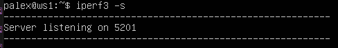<br>*Запускаем серверную часть*

Следом запускаем на `ws2` утилиту в режиме клиент с флагом `-c` и указываем IP-адрес `ws1`.

```sh
iperf3 -c 192.168.100.10
```

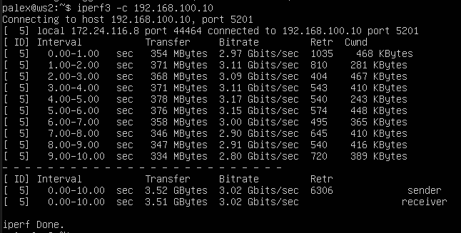<br>*Подключаемся к серверу и получаем данные о скорости соединения*

---
[Содержание](#содержание)

## Part 4. Сетевой экран

[Сетевой или межсетевой экран](https://animatika.ru/info/gloss/firewall.html "Что такое сетевой экран?") – это комплекс программных или аппаратных средств, которые позволяют осуществлять фильтрацию и контроль проходящих через него пакетов в соответствии с заданными заранее параметрами.<br>
**Основная задача межсетевого экрана** – это защита компьютерных сетей или конкретных узлов от доступа злоумышленников. Межсетевые экраны часто называют фильтрами, что связанно с их основной задачей – фильтровать пакеты, которые не подходят под критерии, определенные в конфигурации.

---
[Содержание](#содержание)

### 4.1. Утилита `iptables`

Прочитать подробнее можно тут:

+ [Настройка iptables для чайников](https://losst.ru/nastrojka-iptables-dlya-chajnikov "НАСТРОЙКА IPTABLES ДЛЯ ЧАЙНИКОВ"),<br>
+ [Настройка iptables в Linux](https://selectel.ru/blog/setup-iptables-linux/ "Настройка iptables в Linux").

**iptables** — это утилита брандмауэра командной строки, которая использует цепочки политик для разрешения или блокировки трафика.<br>
Когда соединение пытается установиться в системе, `iptables` ищет правило в своем списке, чтобы сопоставить его. Если утилита не находит нужного правила, она прибегает к действию по умолчанию.

Подсистема `iptables` и `Netfilter` уже достаточно давно встроена в ядро Linux. Все сетевые пакеты, которые проходят через компьютер, отправляются компьютером или предназначены компьютеру, ядро направляет через фильтр `iptables`. Там эти пакеты поддаются проверкам и затем для каждой проверки, если она пройдена выполняется указанное в ней действие. Например, пакет передается дальше ядру для отправки целевой программе, или отбрасывается.

Основные действия, которые позволяет выполнить `iptables`:

+ `-A` - добавить правило в цепочку;
+ `-С` - проверить все правила;
+ `-D` - удалить правило;
+ `-I` - вставить правило с нужным номером;
+ `-L` - вывести все правила в текущей цепочке;
+ `-S` - вывести все правила;
+ `-F` - очистить все правила;
+ `-N` - создать цепочку;
+ `-X` - удалить цепочку;
+ `-P` - установить действие по умолчанию.

Дополнительные опции для правил:

+ `-p` - указать протокол, один из tcp, udp, udplite, icmp, icmpv6,esp, ah, sctp, mh;
+ `-s` - указать ip адрес устройства-отправителя пакета;
+ `-d` - указать ip адрес получателя;
+ `-i` - входной сетевой интерфейс;
+ `-o` - исходящий сетевой интерфейс;
+ `-j` - выбрать действие, если правило подошло.

**Переходим в кореневой каталог:**

```sh
cd
```

Создаем файл `/etc/firewall.sh`, имитирующий фаервол, на `ws1` и `ws2` с помощью команды

```sh
sudo touch /etc/firewall.sh
```

**Добавляем в файл следующие правила согласно задания:**

```sh
sudo mcedit /etc/firewall.sh
```

1. на `ws1` применить стратегию когда в начале пишется запрещающее правило, а в конце пишется разрешающее правило (это касается пунктов 4 и 5).

2. на `ws2` применить стратегию когда в начале пишется разрешающее правило, а в конце пишется запрещающее правило (это касается пунктов 4 и 5).

3. открыть на машинах доступ для порта 22 (ssh) и порта 80 (http).

4. запретить `echo reply` (машина не должна "пинговаться”, т.е. должна быть блокировка на `OUTPUT`).

5. разрешить `echo reply` (машина должна "пинговаться").

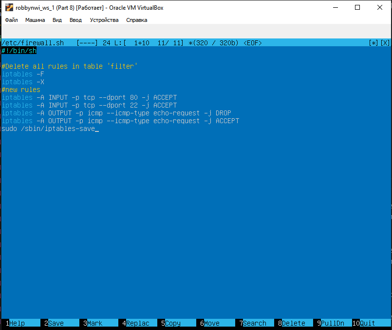

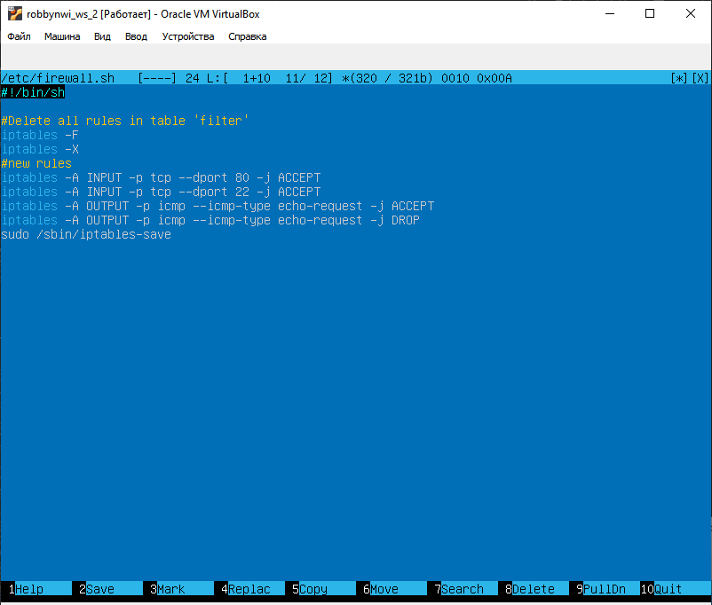

> Здесь:
>
> + A - добавить новое правило в цепочку
> + p - протокол tcp
> + ACCEPT - разрешить прохождение пакета дальше по цепочке правил;
> + DROP - удалить пакет;
> + REJECT - отклонить пакет, отправителю будет отправлено сообщение, что пакет был отклонен;

**Запустим файлы на обеих машинах командами:**

```sh
sudo chmod +x /etc/firewall.sh

sudo bash /etc/firewall.sh
```

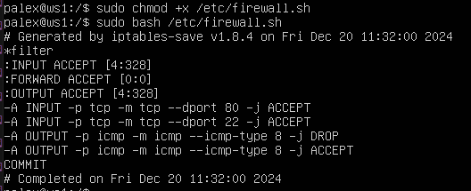

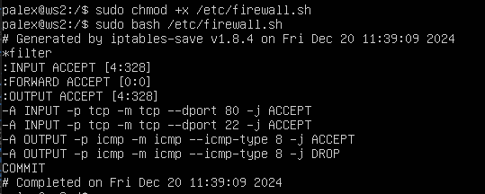

Разница между стратегиями, применёнными в первом и втором файлах, заключается в следующем: в утилите `iptables` правила выполняются сверху вниз.<br>
На первой машине первым указано запрещающее правило на выход, поэтому она не сможет пропинговать другую машину. У второй машины, наоборот - первым указано разрешающее правило, значит она сможет пропинговать другую машину.


---
[Содержание](#содержание)

### 4.2. Утилита **nmap**

Статья про [nmap](https://losst.ru/kak-polzovatsya-nmap-dlya-skanirovaniya-seti "КАК ПОЛЬЗОВАТЬСЯ NMAP ДЛЯ СКАНИРОВАНИЯ СЕТИ").<br>
Руководство по [nmap](https://nmap.org/man/ru/index.html "Справочное руководство Nmap (Man Page)").

**nmap** - это очень популярный сканер сети, для исследования сети и аудита безопасности. Он имеет открытый исходный код, который может использоваться как в Windows, так и в Linux.

Эта программа помогает системным администраторам очень быстро понять какие компьютеры подключены к сети, узнать их имена, а также посмотреть какое программное обеспечение на них установлено, какая операционная система и какие типы фильтров применяются.

Этот инструмент обычно используется хакерами и энтузиастами кибер безопасности, а также сетевыми и системными администраторами.
Он используется для следующих целей:

+ информация о сети в режиме реального времени;
+ подробная информация обо всех IP-адресах, активированных в вашей сети;
+ количество открытых портов в сети;
+ предоставить список живых хостов;
+ сканирование портов, ОС и хостов;
+ посмотреть типы применяемых фильтров.

Например, с помощью скриптов можно автоматически обнаруживать новые уязвимости безопасности в сети.

Чаще всего `nmap` используется для сканирования системы по имени хоста или IP-адресу.

Одной из особенностей `nmap` является то, что эта утилита может определить, включен ли хост, даже если его нельзя пропинговать.

**Поиск машины, которая не "пингуется":**

Запустим на обеих машинах:

```sh
ping ip-address
```

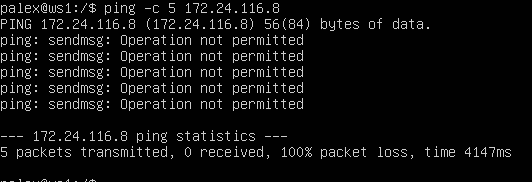

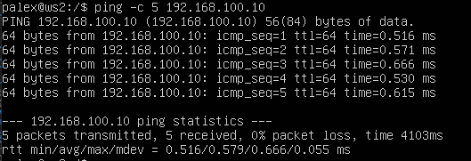

В файле `firewall.sh` для первой машины первым было указано запрещающее правило, поэтому она не пингуется. Для проверки того чтобы показать, что хост машины запущен воспользуемся утилитой `nmap`.

Установим утилиту `nmap` с помощью следующей команды.

```sh
sudo apt install nmap
```

Запускаем утилиту `nmap` командой (для проверки ищем в выводе `nmap` наличие строки ***Host is up***)

```sh
sudo nmap IP-address
```

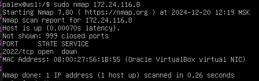

Для [сохранения образов машины](https://comphome.ru/virtualbox-virtualnaja-mashina/kak-sohranit-sostojanie-virtualnoj-mashiny-virtualbox.html "Как сохранить состояние VM в VirtualBox") в настройках машины выбираем *Опции - Снимки*.

Выбираем *Сделать* и добавляем снимки.

Задаём снимку имя и описываем его.

---
[Содержание](#содержание)

## Part 5. Статическая маршрутизация сети

Создадим сеть, по следующей схеме


**Поднимаем пять виртуальных машин (3 рабочие станции (ws11, ws21, ws22) и 2 роутера (r1, r2)).**


**Задаём следующие настройки виртуальным машинам:**

Для машины `r1` в *Настроить - Сеть* выставляем:

+ *Адаптер_1* оставляем как есть (*Тип подключения: NAT*);
+ включаем *Адаптер_2*, выставляем *Тип подключения: Внутренняя сеть* и устанавливаем имя `int_net_1`;
+ включаем *Адаптер_3*, выставляем *Тип подключения: Внутренняя сеть* и устанавливаем имя `int_net_2`.
В итоге настройки для `Router r1` должны выглядеть так

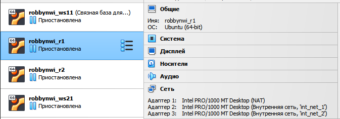

Запускаем `r1` и меняем имя хоста на соотвтетствующее:

```sh
sudo hostnamectl set-hostname r1
```

Перезагружаем машину `r1`.

Для машины `r2`:

+ *Адаптер_1* оставляем как есть (*Тип подключения: NAT*);
+ Включаем *Адаптер_2*, выставляем *Тип подключения: Внутренняя сеть* и устанавливаем имя `int_net_2`;
+ Включаем *Адаптер_3*, выставляем *Тип подключения: Внутренняя сеть* и устанавливаем имя `int_net_3`.

В итоге настройки для `Router r2` должны выглядеть так

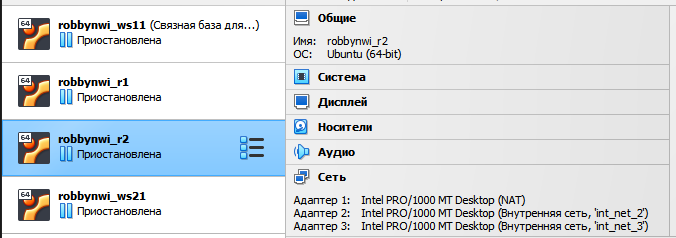

Запускаем `r2` и меняем имя хоста на соотвтетствующее:

```sh
sudo hostnamectl set-hostname r2
```

Перезагружаем машину `r2`.

Для машины `ws11` в *Настроить - Сеть*:

+ *Адаптер_1* оставляем как есть (*Тип подключения: NAT*);
+ включаем *Адаптер_2*, выставляем *Тип подключения: Внутренняя сеть* и устанавливаем имя `int_net_1`.

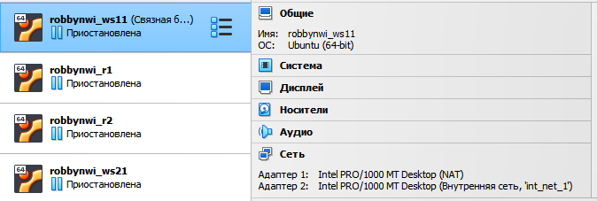

Для машин `PC-ws21` и `PC-ws22`:

+ *Адаптер_1* оставляем как есть (*Тип подключения: NAT*);
+ включаем *Адаптер_2*, выставляем *Тип подключения: Внутренняя сеть* и устанавливаем имя `int_net_3`.

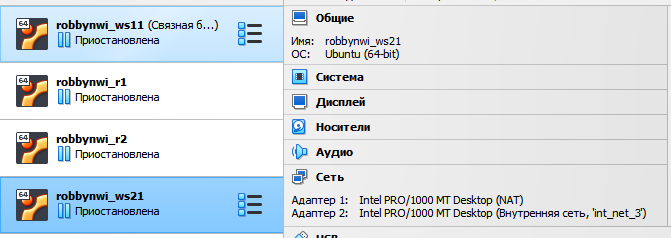

Запускаем все `ws` и меняем на них имя хоста на соотвтетствующее:

+ для машины `ws11`

```sh
sudo hostnamectl set-hostname ws11
```

+ для машины `ws21`

```sh
sudo hostnamectl set-hostname ws21
```

+ для машины `ws22`

```sh
sudo hostnamectl set-hostname ws22
```

Перезагружаем машины `ws11`, `ws21` и `ws22`.

---
[Содержание](#содержание)

### 5.1. Настройка адресов машин

Настроим конфигурации машин в `etc/netplan/00-installer-config.yaml` согласно сети на рисунке.

Проверяем какие интерфейсы есть на машине `r1`. И подобным образом можно проверить все остальные машины.

```sh
ip a
```

С помощью утилиты `netplan` в файле `etc/netplan/00-installer-config.yaml` прописываем настройки для машин, согласно схемы сети.

Используем следующую команду на всех машинах для редактирования адресов.

```sh
sudo mcedit /etc/netplan/00-installer-config.yaml
```

Светлым выделены добавленные части настроек:

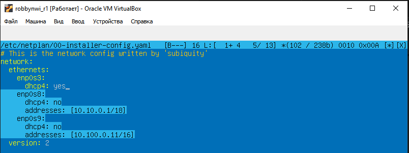
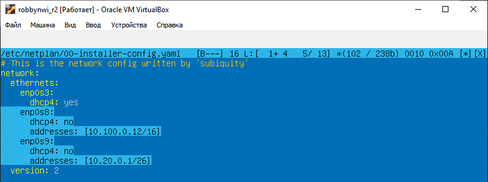
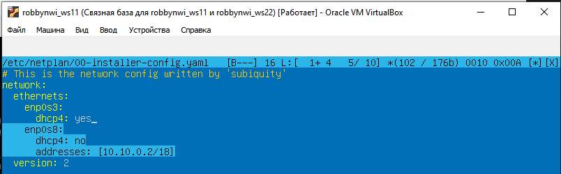
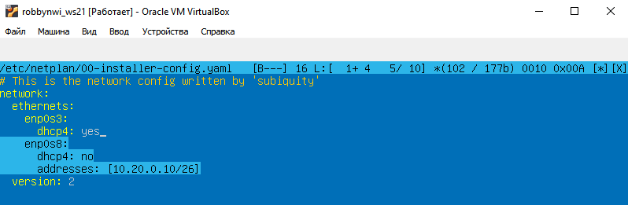
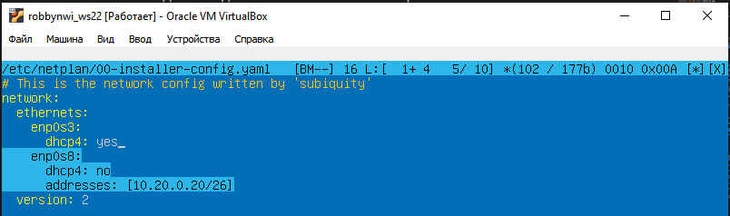

**Перезапустим сервис сети и проверить адрес машин:**

Перезапускаем сервисы сети.

```sh
sudo netplan apply
```

Проверим, что адрес машины задан верно.

```sh
ip -4 a
```

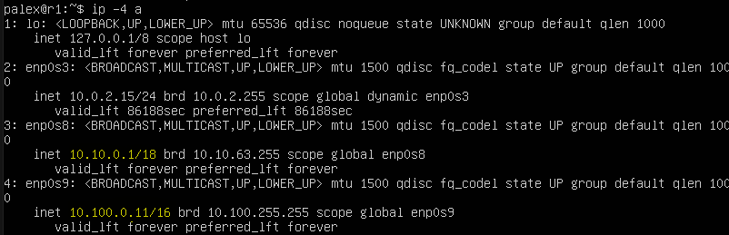
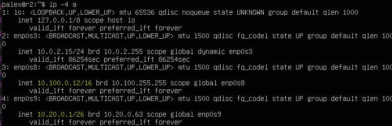
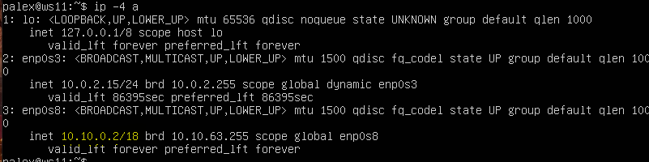


**Пропингуем `ws22` с `ws21` с помощью команды:**

```sh
ping -c 3 10.20.0.20
```


**и в обратную сторону:**


**Аналогично пингуем `r1` с `ws11`:**

```sh
ping -c 5 10.10.0.2
```


**и в обратную сторону:**


---
[Содержание](#содержание)

### 5.2. Включение переадресации IP-адресов

**Для включения переадресации IP, выполняем команду на роутерах:**

```sh
sudo sysctl -w net.ipv4.ip_forward=1
```

Однако при таком подходе переадресация не будет работать после перезагрузки системы.


**Откроем файл `/etc/sysctl.conf`**

```sh
sudo mcedit /etc/sysctl.conf
```

Раскомментируем строку `net.ipv4.ip_forward = 1` и сохраним изменения. Теперь IP-переадресация включена на постоянной основе.


---
[Содержание](#содержание)

### 5.3. Установка маршрута по-умолчанию

Настраиваем маршрут по-умолчанию (шлюз) для рабочих станций. Для этого добавляем `gateway4: ip роутера` в файле конфигураций `etc/netplan/00-installer-config.yaml`

```sh
sudo mcedit /etc/netplan/00-installer-config.yaml
```


После изменения настроек применяем команду для вступления в силу изменений

```sh
sudo netplan apply
```

Вызовем `ip r`, чтобы показать, что  маршрут добавился в таблицу маршрутизации


Добавим в `r1` шлюз до `r2`


Пропингуем с `ws11` роутер `r2`, пинг не пройдёт, т.к. роутер "не знает" куда вернуть ответ, при этом передача пакетов с машины осуществляется.

Чтобы посмотреть какие девайсы можно прослушать

```sh
tcpdump -D
```

Запускаем на `r2` утилиту `tcpdump`, она позволяет прослушать порты и вывести на экран информацию с каких IP адресов приходят пакеты. В данном случае слушаем интерфейс `enp0s8`

```sh
tcpdump -tn -i enp0s8
```

Сначала на экране `r2` будет пусто, идёт ожидание входящих пакетов

Запускаем `ping` на `ws11`

```sh
ping -c 5 10.100.0.12
```


На экране `r2` появится:


---
[Содержание](#содержание)

### 5.4. Добавление статических маршрутов

Добавим в роутеры `r1` и `r2` статические маршруты в файле конфигураций.

Отредактируем файлы конфигураций сети путем изменения содержания файла `etc/netplan/00-installer-config.yaml` для каждого роутера.

```sh
sudo mcedit /etc/netplan/00-installer-config.yaml
```

Для вступления изменений в силу воспользуемся командой

```sh
sudo netplan apply
```


С помощью `ip r` проверяем настройки на роутерах

+ 10.20.0.0/26 через 10.100.0.12 устройство enp0s9


+ 10.10.0.0/18 через 10.100.0.11 устройство enp0s8


Запустить команды на `ws11`

```sh
ip r list 10.10.0.0/18

ip r list 0.0.0.0/0
```


Для адреса `10.10.0.0/18` был выбран маршрут, отличный от `0.0.0.0/0` (он попадает под маршрут по-умолчанию), т.к. машина `ws11` соединена с сетью `10.10.0.0/18` по своему IP-адресу `10.10.0.2`, для других адресов используется маршрут по умолчанию, который указан в файле `10.10.0.1`.

---
[Содержание](#содержание)

### 5.5. Построение списка маршрутизаторов

Для установки утилиты на `ws11` используем команду:

```sh
sudo apt install traceroute
```

Запустим на `r1` команду дампа:

```sh
tcpdump -tnv -i enp0s8 `
```

+ -n - не конвертировать адреса в имена;
+ -t - не выводить время при выводе каждой строкчи дампа;
+ -v - при синтаксическом анализе и выводить более подробную информацию.

Например, печатаются время создания, общая длина и параметры IP-пакета. Также включает дополнительные проверки целостности пакетов, такие как проверка контрольной суммы заголовка IP и ICMP.


При помощи утилиты `traceroute` построим список маршрутизаторов на пути от `ws11` до `ws21`.


>Каждый пакет проходит на своем пути определенное количество узлов, пока достигнет своей цели. Причем, каждый пакет имеет свое время жизни. Это количество узлов, которые может пройти пакет перед тем, как он будет уничтожен. Этот параметр записывается в заголовке TTL, каждый маршрутизатор, через который будет проходить пакет уменьшает его на единицу. При TTL=0 пакет уничтожается, а отправителю отсылается сообщение Time Exceeded.
>
>Команда `traceroute` linux использует UDP пакеты. Она отправляет пакет с TTL=1 и смотрит адрес ответившего узла, дальше TTL=2, TTL=3 и так пока не достигнет цели. Каждый раз отправляется по три пакета и для каждого из них измеряется время прохождения. Пакет отправляется на случайный порт, который, скорее всего, не занят. Когда утилита `traceroute` получает сообщение от целевого узла о том, что порт недоступен трассировка считается завершенной.

**Принцип построения пути при помощи `traceroute`:**

Для определения промежуточных маршрутизаторов `traceroute` отправляет серию пакетов данных целевому узлу, при этом каждый раз увеличивая на 1 значение поля TTL («время жизни»). Это поле обычно указывает максимальное количество маршрутизаторов, которое может быть пройдено пакетом. Первый пакет отправляется с TTL, равным 1, и поэтому первый же маршрутизатор возвращает обратно сообщение ICMP, указывающее на невозможность доставки данных. `Traceroute` фиксирует адрес маршрутизатора, а также время между отправкой пакета и получением ответа (эти сведения выводятся на монитор компьютера). Затем `traceroute` повторяет отправку пакета, но уже с **TTL**, равным 2, что позволяет первому маршрутизатору пропустить пакет дальше.

Процесс повторяется до тех пор, пока при определённом значении TTL пакет не достигнет целевого узла. При получении ответа от этого узла процесс трассировки считается завершённым.

---
[Содержание](#содержание)

### 5.6. Использование протокола ICMP при маршрутизации

Запустим на `r1` перехват сетевого трафика, проходящего через `enp0s8` с помощью команды

```sh
sudo tcpdump -n -i enp0s8 icmp
```


Пропингуем с `ws11` несуществующий IP (например, 10.30.0.111) с помощью команды:

```sh
ping -c 1 10.30.0.111
```


Сохраняем дампы образов виртуальных машин

---
[Содержание](#содержание)

## Part 6. Динамическая настройка IP с помощью DHCP

Прочитать про настройку **DHCP** можно:

+ [Настройка DHCP сервера на Linux](https://logi.cc/kaketo-nastrojka-dhcp-servera-na-linux/#.YxLMhtZBzhY "Настройка DHCP сервера на Linux"),
+ [Установка и настройка isc-dhcp-server в Ubuntu](https://ixnfo.com/ustanovka-i-nastroyka-isc-dhcp-server-v-ubuntu.html "Установка и настройка isc-dhcp-server в Ubuntu")(vpn),
+ [Установка и настройка DHCP сервера в Ubuntu](https://sysadmin-note.ru/article/ustanovka-i-nastrojka-dhcp-servera-v-ubuntu/ "Установка и настройка DHCP сервера в Ubuntu"),
+ [Протокол динамического выделения адресов (DHCP)](https://help.ubuntu.ru/wiki/руководство_по_ubuntu_server/сеть/dhcp "Протокол динамического выделения адресов (DHCP)").

---
[Содержание](#содержание)

### 6.1 Настройка службы DHCP на r2

Если утилита `isc-dhcp-server` ещё не установлена, то файла `/etc/dhcp/dhcpd.conf` ещё не существует в нужном виде. Соотвтетственно для работы с протоколом **DHCP** сначала надо установить эту утилиту

```sh
sudo apt-get install isc-dhcp-server
```

Теперь для `r2` можем настроить в файле `/etc/dhcp/dhcpd.conf` конфигурацию службы  **DHCP**

**Указываем адрес маршрутизатора по-умолчанию, DNS-сервер и адрес внутренней сети.**

Открываем файл `/etc/dhcp/dhcpd.conf` для редактирования

```sh
sudo mcedit /etc/dhcp/dhcpd.conf
```

**Вносим изменения:**


**В файле `/etc/resolv.conf` (содержит адреса серверов имен, к которым имеет доступ данная система) прописываем `nameserver 8.8.8.8`**

```sh
sudo mcedit /etc/resolv.conf
```


Перезагрузим службу **DHCP**

```sh
systemctl restart isc-dhcp-server
```


Можно проверить статус службы

```sh
sudo systemctl status isc-dhcp-server
```


Изменим настройки машин `ws21` и `ws22` в файле конфигурации, чтобы сделать протокол **DHCP** активным. На каждой машине введём

```sh
sudo mcedit /etc/netplan/00-installer-config.yaml
```


**Применим изменения:**

```sh
sudo netplan apply
```

**Перезагружаем виртуальную машину `ws21` и `ws21`:**

```sh
sudo systemctl reboot
```

**Проверяем присвоенный устройствам адрес:**


Проверим соединение машины **ws22** с **ws21**:


---
[Содержание](#содержание)

### 6.2 Указать MAC-адреса

Чтобы указать MAC-адрес у ws11, в файл `etc/netplan/00-installer-config.yaml` надо добавить строки: `macaddress: 10:10:10:10:10:BA`, `dhcp4: true`

```sh
sudo nano /etc/netplan/00-installer-config.yaml

sudo netplan apply
```


[Выключаем](https://losst.ru/vyklyuchenie-linux-iz-komandnoj-stroki "Выключение LINUX из командной строки") машину `ws11`

```sh
sudo shutdown -h now
```

Заходим в менеджер виртуальных машин VirtualBox и там настраиваем `ws11` MAC-адрес


Для `r1` настроим аналогично `r2`, но выдачу адресов сделаем с жесткой привязкой к MAC-адресу (`ws11`).

```sh
sudo apt-get install isc-dhcp-server

sudo mcedit /etc/dhcp/dhcpd.conf
```


```sh
sudo mcedit /etc/resolv.conf
```


```sh
systemctl restart isc-dhcp-server
```


```sh
sudo systemctl status isc-dhcp-server
```


Проводим аналогичные тесты - смотрим какой адрес назначен машине `ws11`

```sh
ip a
```


Пропингуем соединение

```sh
ping -c 3 10.10.0.2
```


---
[Содержание](#содержание)

### 6.3 Обновление ip адреса с помощью команды `sudo dhclient`

Проверяем IP до обновления


Запросим с `ws21` обновление ip адреса с помощью команды

```sh
sudo dhclient -v
```

+ `-v` - будет выведена дополнительная информация.


```sh
ip a
```


Выполним команду для удаления старого IP адреса

```sh
sudo dhclient -r
```

+ `-r` - явно освобождает текущую аренду ip адреса.


Чтобы обновить или освободить IP-адрес для конкретного интерфейса, например, eth0, необходимо ввести:

```sh
sudo dhclient -r enp0s8

sudo dhclient enp00s8
```

Проверим IP адреса

```sh
ip a
```


> В части 6 были использованы следующие опции **DHCP** протокола:
>
>+ option routers `ip-address [, ip-address...];` - адреса шлюзов для клиентской сети. Маршрутизаторы должны быть перечислены в порядке предпочтительности.
>+ `option domain-name-servers ip-address [, ip-address...];` - Список DNS серверов  доступных клиенту. Сервера должны быть перечислены в порядке предпочтительности.

Сохраняем дампы образов виртуальных машин.

---
[Содержание](#содержание)

## Part 7. NAT

Прочитать о сервере `apache2` можно [тут](https://losst.pro/ustanovka-i-nastrojka-servera-apache "Установка и настройка сервера Apache")

Для работы с сервером `apache2`, установим его на машины `r1`, `r2` и `ws22`. Возможно `apache2` не будет устанавливаться, тогда возможно поможет обновление системы (см. ниже).

```sh
sudo apt install apache2
```

Обновление системы

```sh
sudo apt update
sudo apt upgrade -y
```

+ `-y` - при запросе сразу согласиться с установкой.

---
[Содержание](#содержание)

### 7.1 Делаем сервер Apache2 общедоступным

В файле `/etc/apache2/ports.conf` на `ws22` и `r1` меняем строку `Listen 80` на `Listen 0.0.0.0:80`.

```sh
sudo mcedit /etc/apache2/ports.conf
```


Запустить веб-сервер **Apache** командой на `ws22` и `r1`

```sh
service apache2 start
```


---
[Содержание](#содержание)

### 7.2 Создаем фаервол на r2 [(как в части 4)](#41-утилита-iptables)

**Следующие правила:**

1. Удаление правил в таблице filter - `iptables -F`
2. Удаление правил в таблице "NAT" - `iptables -F -t nat`
3. Отбрасывать все маршрутизируемые пакеты - `iptables --policy FORWARD DROP`


Запустим файлы на обеих машинах командами

```sh
sudo chmod +x /etc/firewall.sh

sudo bash /etc/firewall.sh
```


При запуске файла `firewall.sh` с этими правилами, `ws22` не должна "пинговаться" с `r1`.

Проверяем соединение между `r1` и `ws22`

```sh
ping -c 5 10.20.0.20
```


Проверяем соединение между `ws22` и `r1`

```sh
ping -c 5 10.100.0.11 `
```


+ **Разрешаем маршрутизацию всех пакетов протокола ICMP, для этого прописываем правило для протокола *icmp* и цепочки *FORWARD***

```sh
sudo mcedit /etc/firewall.sh
```


Теперь при запуске файла `firewall.sh` с этими правилами, `ws22` должна "пинговаться" с `r1`

Проверяем соединение между `r1` и `ws22`

```sh
ping -c 3 10.20.0.20
```


Проверяем соединение между `ws22` и `r1`

```sh
ping -c 3 10.100.0.11
```


Добавляем в файл ещё два правила:

1. Включаем **SNAT**, а именно маскирование всех локальных ip из локальной сети, находящейся за `r2` (по обозначениям из Части 5 - сеть 10.20.0.0).
2. Включаем **DNAT** на 8080 порт машины `r2` и добавим к веб-серверу Apache, запущенному на `ws22`, доступ извне сети.

```sh
sudo nano /etc/apache2/ports.conf
```


> Значения использованных опций:
>
>+ `t` - указывает на используемую таблицу;
>+ `p` - указывает протокол, такие как tcp, udp, udplite и другие, поддерживаемые системой, ознакомиться со списком можно в файле `/etc/protocols`;
>+ `m` - подключает указанный модуль;
>+ `s` - указывает адрес источника пакета, в качестве значения можно указать как один IP-адрес, так и диапазон;
>+ `i` - задает входящий сетевой интерфейс;
>+ `o` - указывает исходящий сетевой интерфейс;
>+ `--dport` - порт получателя пакета;
>+ `DNAT` — подменяет адрес получателя в заголовке IP-пакета, основное применение — предоставление доступа к сервисам снаружи, находящимся внутри сети;
>+ `SNAT` — служит для преобразования сетевых адресов, применимо, когда за сервером находятся машины, которым необходимо предоставить доступ в Интернет, при этом от провайдера имеется статический IP-адрес.

#### SNAT и DNAT

**NAT** — это аббревиатура для преобразования сетевых адресов.
[NAT](https://habr.com/ru/post/583172/ "NAT (Network Address Translation) для новичков") возникает при изменении одного из IP-адресов в заголовке IP-пакета, т. е. IP-адреса источника (source-addr) или IP-адреса назначения (dest-addr).


ПАРАМЕТР| **SNАТ**| **DNAT**
---------|----------|-----------
Аббревиатура |источник **NAT**|назначение **NAT**
Терминология|**SNAT** изменяет частный IP-адрес исходного хоста на общедоступный IP-адрес. Он также может изменить исходный порт в заголовках TCP/UDP. **SNAT** обычно используется внутренними пользователями для доступа в Интернет. |Назначение **NAT** изменяет адрес назначения в IP-заголовке пакета. Он также может изменить порт назначения в заголовках TCP/UDP. **DNAT** используется, когда нам нужно перенаправить входящие пакеты с общедоступным адресом/портом на частный IP-адрес/порт внутри внутренней сети.
Пример использования |Клиент внутри локальной сети и за брандмауэром хотел просматривать Интернет|Веб-сайт, размещенный в центре обработки данных за брандмауэром, и должен быть доступен для пользователей через Интернет
Изменение адреса|**SNAT** изменяет адрес источника пакетов, проходящих через устройство **NAT**|**DNAT** изменяет адрес назначения пакетов, проходящих через маршрутизатор.
Порядок работы|**SNAT** выполняется после принятия решения о маршрутизации.|**DNAT** выполняется до принятия решения о маршрутизации.
Коммуникационный поток|Когда внутренняя защищённая сеть инициирует связь с внешним миром, происходит **SNAT**|Когда внешняя незащищенная сеть инициирует связь с внутренней защищенной сетью, происходит **DNAT**.
Один/несколько хостов|**SNAT** позволяет использовать несколько хостов во «внутренней» сети для доступа к любому хосту во «внешней» сети|**DNAT** позволяет любому хосту во «внешней» сети получить доступ к одному хосту во «внутренней» сети

Запускаем файл также, как в Части 4 (перед тестированием отключим сетевой интерфейс **NAT** (его наличие можно проверить командой `ip a`) в VirtualBox, если он включен)


Проверяем соединение по TCP для SNAT, для этого с `ws22` подключаемся к серверу Apache на `r1` командой `telnet [адрес] [порт]`

```sh
telnet 10.100.0.11 80
```


Проверить подмену IP-адреса можно с помощью команды `tcpdump` - пингуем с машины `ws22` роутер `r1`, в выводе `tcpdump` будет отображаться с какого адреса идет запрос - IP-адрес `r2`


Проверяем соединение по TCP для DNAT, для этого с `r1` подключаемся к серверу Apache на `ws22` (обращаться по адресу `r2` и порту 8080)

```sh
telnet 10.100.0.12 8080
```


При этой проверке следует отключить на `ws22` автоматическую выдачу ip `enp0s3`

Сохраняем дампы образов виртуальных машин

---
[Содержание](#содержание)

## Part 8. Дополнительно. Знакомство с SSH Tunnels

Прочитать о основных возможностях SSH Tunnels можно здесь:

+ [Магия SSH](https://habr.com/ru/post/331348/ "Магия SSH").
+ [SSH-туннели: практические примеры использования и важные функции](https://selectel.ru/blog/ssh-tunnels/ "SSH-туннели: практические примеры использования и важные функции"),
+ [Практические советы, примеры и туннели SSH](https://habr.com/ru/post/435546/ "Практические советы, примеры и туннели SSH"),
+ [Памятка пользователям ssh](https://habr.com/ru/post/122445/ "Памятка пользователям ssh").

Скорее всего на нужных машинах `apache2` не стоит и его нужно установить. Однако перед установкой желательно обновить систему

```sh
sudo apt update

sudo apt upgrade -y
```

+ `-y` - при запросе сразу согласиться с установкой.

Устанавливаем `apache2`

```sh
sudo apt install apache2
```

Запускаем веб-сервер `Apache` на `ws22` только на `localhost` (то есть в файле `/etc/apache2/ports.conf` изменить строку `Listen 80` на `Listen localhost:80`)

```sh
sudo mcedit /etc/apache2/ports.conf
```


**Воспользуемся `Local TCP forwarding` с  `ws21` до `ws22`, чтобы получить доступ к веб-серверу на `ws22` с `ws21`**

Переадресация локального порта позволяет перенаправить порт на локальном компьютере (клиент ssh) на порт на удаленном компьютере (сервер ssh), который затем перенаправляется на порт на компьютере назначения.

В этом типе переадресации клиент SSH прослушивает заданный порт и туннелирует любое подключение к этому порту к указанному порту на удаленном сервере SSH, который затем подключается к порту на целевом компьютере. Конечным компьютером может быть удаленный SSH-сервер или любой другой компьютер.

Пробрасывать порт от сервера будем по следующему алгоритму:

1. На машине `ws22`: создадим соединение с машины `ws22`, на которой установлен сервер `ssh`, с машиной `ws21`.
2. На машине `ws22`: с помощью команды `ssh -L` прокинем "прямое" соединение с машины `ws21` на машину `ws22`.

Для контроля процессов соединей на запущенной машине с сервером `apache2`, проверим процессы с именем `sshd`

```sh
ps aux | grep sshd
```

Здесь все процессы `sshd` которые запущены до момента создания ssh-туннеля на машине `ws22`


Создаём соединение. Запускаем на машине `ws22`

```sh
ssh 10.20.0.10
```


Оставаясь на машине `ws22`, устанавливаем соединение с сервером `ws22`от машины `ws21`

```sh
ssh -L 8080:127.0.0.1:80 10.20.0.20
```


Проверяем процессы на машине `ws22` после создания соединения

```sh
ps aux | grep sshd
```


На машине `ws21` запускаем утилиту `telnet`

```sh
telnet 127.0.0.1 8080
```


Проверяем запущенные процессы на машине `ws21` и "убиваем" процесс отвечающий за соединение с сервером

```sh
ps aux | grep sshd
```


Когда процесс, на машине `ws21` , отвечающий за соединение, будет "убит", появится сообщение на машине `ws22`


**Воспользуемся `Remote TCP forwarding` c `ws11` до `ws22`, чтобы получить доступ к веб-серверу на `ws22` с `ws11`.**

Переадресация удаленного порта противоположна переадресации локального порта. Это позволяет перенаправить порт на удалённом компьютере (сервер ssh) на порт на локальном компьютере (клиент ssh), который затем перенаправляется на порт на компьютере назначения.

В этом типе переадресации сервер SSH прослушивает заданный порт и туннелирует любое соединение с этим портом на указанный порт локального клиента SSH, который затем подключается к порту на целевом компьютере. Машина назначения может быть локальной или любой другой машиной. Удаленное перенаправление портов в основном используется для предоставления доступа к внутренней службе кому-то извне.

Из-за того что на роутере `r2` настроен firewall, подключиться к серверу Apache на машине `ws22` с помощью команды `ssh -L`, с машины `ws11`, не получится (роутер `r2` не пропустит команду). В этом случае необходимо воспользоваться командой `ssh -R`.<br>
Выполнить её необходимо на машине `ws22`. Это выполняется за несколько шагов:

1. На машине `ws11`: переход с машины `ws11` на роутер `r2` с помощью `ssh` (роутер не позволит сразу перейти на машину `ws22`);
2. На машине `ws11`: переход с роутера `r2` на машину `ws22` с помощью `ssh`;
3. На машине `ws11`: проброс туннеля с машины `ws22` на машину `ws11` с помощью `ssh -R`;

Описание команды:

```sh
ssh -R [удаленный_адрес:]удаленный_порт:локальный_адрес:локальный_порт [пользователь@]сервер
```

Пробрасываем маршрут. Запускаем с машины `ws11` команду.

```sh
ssh 10.100.0.12 -p 2022
```

Благодаря этой команде находясь на машине `ws11` можно увидить следующую картину, в которой изменится хост текущей машины на `r2`


Далее находясь физически на той же машине `ws11` с именем хоста `r2`, вводим следующую команду

```sh
ssh 10.20.0.20
```

```shНаходясь на машине `ws11`, получим следующий результат `r2` -
ws22`


В предыдущей части на роутере `r2` был настроен на `fireWall`, который не пропускает проходящие пакеты из другой сети. Поэтому сначала необходимо пробросить тунель от `ws22` к `ws11`. Для этого запускаем на машине `ws11` команду

```sh
ssh -R 10.10.0.2:8080:127.0.0.1:80 10.10.0.2 -p 2022
```


Для проверки, сработало ли подключение, переходим во второй терминал (для этого находясь в терминале машины `ws11` нажимаем `option + fn + F2` (MacOS)  или `Alt + F2` (Win) ) и выполяем команду (`telnet 127.0.0.1 [локальный порт]`). В момент выполнения данной команды необходимо нажать любую клавишу

```sh
telnet 127.0.0.1 8080
```


Сохраняем дампы образов виртуальных машин


Всем бобра! 🖐️😋

---
[Содержание](#содержание)
